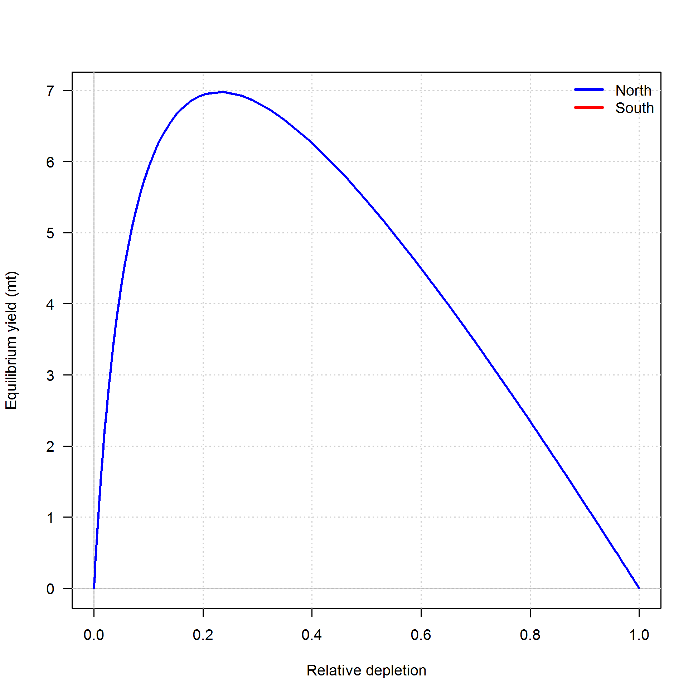
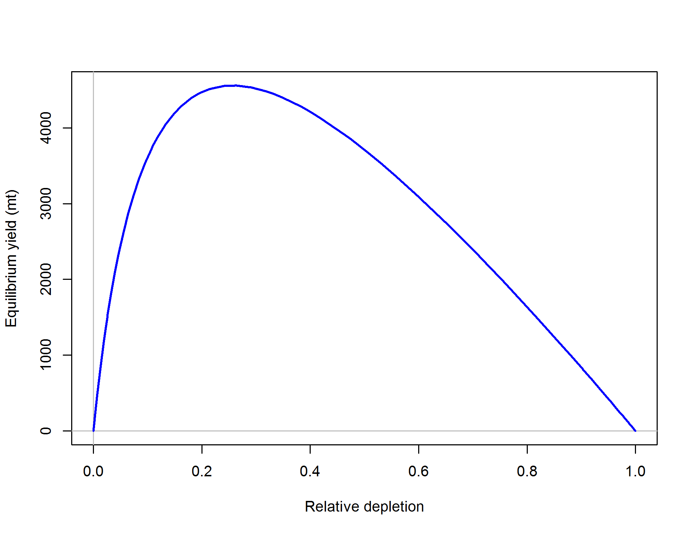

#Executive Summary{-}

##Stock{-}
This assessment reports the status of the `r spp` (\emph{`r spp.sci`}) resource in U.S. waters off the coast of the California, Oregon, and Washington using data through `r LastYR`.  

The Pacific Fishery Management Council (PFMC) manages the U.S. fishery as two stocks separated at Cape Mendocino, California (40$^\circ$ 10'N). The northern stock has long been assessed on its own; the southern stock is managed as part of the "Minor Shelf Rockfish" complex.  This assessment analyzed each stock independently, with the southern stock extending southward to the U.S./Mexico border and the northern stock extending northward to the U.S./Canada border (Figure \ref{fig:assess_region_map_Exec_Sum}).


The Southern model was not sufficiently robust for management purposes, primarily due to lack of data.  Therefore although the data and sensitivities investigated for the model are reported in this document, the results of any of those sensitivities should be interpreted with the recognition that the model is not considered suitable for management.  We therefore report estimates and projections only for the Northern model.


The most recent fully integrated assessment [@Wallace2005], following the pattern of prior assessments, included only the Northern stock which it divided into three assessment areas with divisions at Cape Elizabeth (47$^\circ$ 20'N) and Cape Falcon (45$^\circ$ 46'N).  The northern stock was assessed most recently using a data-moderate assessment method in 2013 [@Cope2013]. The southern stock was also analyzed using the data-moderate method but that model was never reviewed or put forward for management. The contribution of the southern stock to the overfishing limit (OFL) for the Southern Shelf Complex was determined using Depletion-Based Stock Reduction Analysis [@Dick2011]. 

Since the 2005 assessment, reconstruction of historical catch by Washington and Oregon makes any border but the state line (roughly 46$^\circ$ N) incompatible with the data from those states.  Additionally, an unknown amount of the groundfish catch landed in northern Oregon is believed to have been caught in Washington waters.  This is not an issue that can be resolved at present, and we have elected to address the stock in two areas consistent with the management border at Cape Mendocino.  This is consistent, as well, with a recent genetic analysis [@Hess2011] that found distinct stocks north and south of Cape Mendocino but did not find stock differences within the northern area. 


\FloatBarrier

##Catches{-}
Catches from the Northern stock (Figure \ref{fig:r4ss_catch_N}) were divided into four categories: commercial catch, bycatch in the at-sea hake fishery, recreational catch in Oregon and California (north of 40$^\circ$ 10'N), and recreational catch in Washington. The first three of these fleets were entered in metric tons, but the recreational catch from Washington was entered in the model as numbers of fish with the average weight calculated internally in the model from the weight-length relationship and the estimated selectivity for this fleet (which is informed by the length-compositions). Catches have been increasing over the past 10 years (Table \ref{tab:Exec_catch_N}) but remain well below the peak catch due to management measures, included lower catch limits and closed areas.

Catches from the Southern stock (Figure \ref{fig:r4ss_catch_S}) were divided into two categories: commercial and recreational catch, both of which were entered as metric tons. Catches over the past 10 years have remained far below the peak levels, with the majority of recent catch coming from the Recreational fishery (Table \ref{tab:Exec_catch_S})

<!-- ***********BEGIN EXECUTIVE SUMMARY CATCH FIGURES AND TABLES*********** -->
<!-- ***********Edit the Plot_catch tables and captions******************** -->
<!-- ***********This depends on how many plots you need******************** -->
<!-- ***********Also included is the r4SS plot - keep or remove************ -->
<!-- ***********CATCH FIGURES********************************************** -->

\FloatBarrier


\FloatBarrier

<!-- ***********CATCH TABLE NORTH****************************************** -->
```{r, results='asis'}
    #CSV: './txt_files/Exec_catch_summary_N.csv'
    # Catch table section in R_exec_summary_fig_tables.R
    # Print the table
    print(Exec_catch.table_N, include.rownames = FALSE, caption.placement = 'top')
```
<!-- ***********END EXECUTIVE SUMMARY CATCH FIGURES AND TABLES************* -->

<!-- ***********CATCH TABLE SOUTH****************************************** -->
```{r, results='asis'}
    #CSV: './txt_files/Exec_catch_summary_S.csv'
    # Catch table section in R_exec_summary_fig_tables.R
    # Print the table
    print(Exec_catch.table_S, include.rownames = FALSE, caption.placement = 'top')
```
<!-- ***********END EXECUTIVE SUMMARY CATCH FIGURES AND TABLES************* -->


\FloatBarrier


\newpage

##Data and Assessment{-}
`r spp` north of Cape Mendocino (40$^\circ$ 10'N) was most recently assessed as part of a 2013 data-moderate stock assessment [@Cope2013] that did not include any length or age data. The northern stock was previously assessed in 2000 [@Tagart2000] with that assessment updated in 2003 and 2005 [@Lai2003, @Wallace2005]. The stock south of 40$^\circ$ 10'N has never been fully assessed due to the lack of data for this area.

Northern model landings are from one recreational and two commercial fisheries: the commercial trawl fishery and the bycatch of Yellowtail Rockfish in the Hake fishery.  The Triennial Trawl Survey and the NWFSC Shelf-Slope Survey provide fishery-independent information.  A research study and the West Coast Groundfish Observing Program provide data on discards.  Length and age samples are available from 1972 to the present (308,133 and 16,781 samples, respectively).

Southern model landings are treated as one recreational and one commercial fishery. Two recreational surveys have been conducted onboard private fishing vessels, and a Hook and Line Survey conducted by the NWFSC provides fishery-independent survey data, although this survey is conducted mainly outside the range of the stock, and has only been sampling since 2004.  No discard data are available for the Southern model.  Biological sampling since 1980 provides 179,308 length samples, however age sampling was sparse (6,352 samples) and mainly covers the period 1980-1999.

Lack of data for the Southern model contributed heavily to its failure to meet standards for use in management.

This assessment uses Stock Synthesis version 3.30.  The Northern model begins in `r Dat_start_mod1`, as does the Southern model. In both cases those starting years were chosen based on the first year of the available catch data and the start of the estimated recruitment deviations was at a later point, so both models were assumed to start at an unfished equilibrium.  Steepness was fixed in both models at 0.718.  Natural mortality was estmated in the Northern model for females with a male offset, and those estimated values from the Northern model were used as fixed values in the Southern model. Growth parameters, selectivities, equilibrium recruitment and recruitment deviations were estimated in both models.

##Stock Biomass{-}
The spawning output for the Northern model was estimated to have fallen below 40\% of unfished equilibrium in the early 1980s, to a minimum of `r MinDepl_mod1`% in `r MinDeplYr_mod1` but has rebounded since to `r Depl_mod1` in 2017 (~95% asymptotic interval: $\pm$ `r Depl_mod1_CI`) (Figures \ref{fig:Spawnbio_all} and \ref{fig:RelDeplete_all}, Table \ref{tab:SpawningDeplete_mod1}).


No southern model is being put forward for management, however the models that were considered in the review do not indicate concern that the stock is below its target level


\FloatBarrier


<!--BEGIN  EXECUTIVE SUMMARY SPAWNING BIOMASS AND DEPLETE TABLES AND FIGURES-->
```{r, results='asis'}
    # Print spawning biomass table(s)

    n_models = 1

    print(Spawn_Deplete_mod1.table, include.rownames = FALSE, caption.placement = 'top')
    if(n_models >= 2) {print(Spawn_Deplete_mod2.table, include.rownames = FALSE, caption.placement = 'top')}
    if(n_models == 3) {print(Spawn_Deplete_mod3.table, include.rownames = FALSE, caption.placement = 'top')}

    # Select which file to use for the recuitment figure, depending on if you have one model or multiple models
    if(n_models == 1) {
      spawn.file  = ifelse(fecund=='numbers',
                           'r4ss/plots_mod1/ts7_Spawning_output_with_95_asymptotic_intervals_intervals.png',
                           'r4ss/plots_mod1/ts7_Spawning_biomass_(mt)_with_95_asymptotic_intervals_intervals.png')
      Bratio.file = 'r4ss/plots_mod1/ts9_Spawning_depletion_with_95_asymptotic_intervals_intervals.png' 
     } else {
      spawn.file  = 'r4ss/plots_compare/base_compare2_spawnbio_uncertainty.png'
      Bratio.file = 'r4ss/plots_compare/base_compare4_Bratio_uncertainty.png'
    }  
```

\FloatBarrier


<!-- ***********END  EXECUTIVE SUMMARY SPAWNING BIOMASS AND**************** -->


<!-- ***********DEPLETION TABLES AND FIGURES******************************* -->

\FloatBarrier


##Recruitment{-}

The Northern model recruitments have ranged from roughly 21 million to 72 million since 2008, although with large uncertainty.  Recruitments have shown remarkable consistency since 2013.  

<!-- Southern model recruitments have ranged from 21 million to 103 million.  In 2008 and 2010 it estimates especially large recruitments and extra large recruitment deviations. -->


<!-- ***********BEGIN EXECUTIVE SUMMARY RECRUITMENT TABLES AND FIGURES***** -->
```{r, results='asis'}
   # Print recruitment tables; will print up to 3 depending on the number of models, you can delete the code
   # for models you don't need as well

   n_models = 1

   print(Recruit_mod1.table, include.rownames = FALSE, caption.placement = 'top')
   
   if(n_models >= 2) {
     print(Recruit_mod2.table, include.rownames = FALSE, caption.placement = 'top')
   }
   
   if(n_models == 3) {
     print(Recruit_mod3.table, include.rownames = FALSE, caption.placement = 'top')
   }

   # select which file to use for the recuitment figure, depending on if you have one model or multiple models
   if(n_models==1) {
     recruit.file  = 'r4ss/plots_mod1/ts11_Age-0_recruits_(1000s)_with_95_asymptotic_intervals.png'
    } else {
     recruit.file  = 'r4ss/plots_compare/base_compare8_recruits_uncertainty.png'}
```

\FloatBarrier


<!-- ***********END EXECUTIVE SUMMARY RECRUITMENT TABLEs AND FIGURES******* -->

 \FloatBarrier


##Exploitation status{-}
The Northern stock is estimated to have experienced overfishing throughout the 1980s and 1990s relative to the current SPR-based harvest limits (Figure \ref{fig:SPR_all}). However, in recent years, the fishing intensity has been well within the management limits and exploitation rates (catch divided by age 4+ biomass) are estimated to have been less than 2\% per year (Table \ref{tab:SPR_Exploit_mod1}).

A summary of `r spp` exploitation histories for the Northern model is provided as Figure \ref{fig:Phase_all}.


\FloatBarrier

<!-- ***********BEGIN EXECUTIVE SUMMARY EXPLOITATION AND******************* -->
<!-- ***********SPRratio TABLE AND FIGURES********************************* -->
```{r, results='asis'}
   # Print exploitation and SPRratio tables depending on how many models there are

   n_models = 1

   if(n_models >= 1) {
     print(SPRratio_Exploit_mod1.table, include.rownames = FALSE, caption.placement = 'top')
   }
    
   if(n_models >= 2) {
     print(SPRratio_Exploit_mod2.table, include.rownames = FALSE, caption.placement = 'top')
   }
   
   if(n_models == 3) {
     print(SPRratio_Exploit_mod3.table, include.rownames = FALSE, caption.placement = 'top')
   }

   # select the files for the SPR and phase plots depending on the number of models
   if(n_models == 1) {
     SPR.file   = 'r4ss/plots_mod1/SPR3_ratiointerval.png'
     Phase.file = 'r4ss/plots_mod1/SPR4_phase.png' 
    } else {
     SPR.file   = 'r4ss/plots_compare/base_compare6_SPRratio_uncertainty.png'
     Phase.file = 'r4ss/plots_compare/base_compare13_phase_plot.png'}  
```

\FloatBarrier


<!-- ************END EXECUTIVE SUMMARY EXPLOITATION************************ -->
<!-- ************AND SPRratio TABLE AND FIGURES**************************** -->

\FloatBarrier


##Ecosystem Considerations{-}
Rockfish in general are sensitive to the strength and timing of the upwelling cycle in the Eastern Pacific, which affects where pelagic juveniles settle, and impacts the availability of the zooplankton which the young require.

Yellowtail Rockfish feed mainly on pelagic animals, but are opportunistic, occasionally eating benthic animals as well. Large juveniles and adults eat fish (small Pacific whiting, Pacific herring, smelt, anchovies, lanternfishes, and others), along with squid, krill, and other planktonic organisms.  They are prey for Chinook Salmon, Lingcod, Cormorants, Pigeon Guillemots and Rhinoceros Auklets. [@Love2011]


##Reference Points{-}
Yellowtail Rockfish are managed relative to biomass reference points at $B_{40\%}$ (the $B_{MSY}$ proxy) and $B_{25\%}$ (the minimum stock-size threshold). Harvest rates are managed relative to an $F_{MSY}$ proxy $SPR = 50\%$ which corresponds to a Relative Fishing Intensity, $(1 - {SPR})/(1 - {SPR}_{50\%})$, of 100\%. This assessment estimates the Northern stock to be above the $B_{40\%}$ threshold with Relative Fishing Intensity below 100\% (${SPR} > 50\%$ which means the Spawning Potential is greater than 50\% of the unfished Spawning Potential).

The estimated relative depletion level for the Northern model in 2017 is 
`r Depl_mod1` (~95% asymptotic interval: $\pm$ `r Depl_mod1_CI`, corresponding 
to an unfished spawning output of `r paste(round(Spawn_mod1,1), fecund_unit,sep=' ')` 
(~95% asymptotic interval: `r paste(Spawn_mod1_CI, fecund_unit, sep=' ')`) of 
spawning output in the model (Table \ref{tab:Ref_pts_mod1}).  Unfished 
age `r min_age` biomass was estimated to be `r Ref_pts_mod1[2,2]` mt. The target spawning output based on the biomass target ($SB_{40\%}$) is `r paste(Ref_pts_mod1[7,2], fecund_unit,sep=' ')`, which gives  a catch of `r Ref_pts_mod1[10,2]` mt. Equilibrium yield at the proxy $F_{MSY}$ harvest rate corresponding to $SPR_{50\%}$ is `r Ref_pts_mod1[15,2]` mt.

The estimated equilibrium yield curve for the Northern model is shown in Figure \ref{fig:Yield_all}.

\FloatBarrier

<!-- ***********BEGIN EXECUTIVE SUMMARY REFERENCE POINT TABLES************* -->
```{r, results='asis'}

   n_models = 1

   # Print reference point tables
   if(n_models >= 1) {
     print(Ref_pts_mod1.table, include.rownames = FALSE, caption.placement = 'top',
           sanitize.text.function = function(x){x})
   }

   if(n_models >= 2) {
     print(Ref_pts_mod2.table, include.rownames = FALSE, caption.placement = 'top',
           sanitize.text.function = function(x){x})
   }

```
<!-- ***********END EXECUTIVE SUMMARY REFERENCE POINT TABLES*************** --> 

\FloatBarrier


##Management Performance{-}

Total catch (including landings and discards) from the Northern stock has remained well below the management limits in recent years (Table \ref{tab:mnmgt_perform_exec.N}) and harvest specifications for 2017 and 2018 are set at values similar to the previous years.

<!-- ***********BEGIN EXECUTIVE SUMMARY MANAGEMENT PERFORMANCE TABLES******* --> 
```{r, results='asis'}
    print(mngmnt.table.N, include.rownames = FALSE, caption.placement = 'top', 
          sanitize.text.function = function(x){x}, scalebox = .9)
```

```{r, results='asis'}
    #print(mngmnt.table.S, include.rownames = FALSE, caption.placement = 'top', 
    #      sanitize.text.function = function(x){x}, scalebox = .9)
```

<!-- ***********END EXECUTIVE SUMMARY MANAGEMENT PERFORMANCE TABLES********* -->


\FloatBarrier


##Unresolved Problems And Major Uncertainties{-}

At the STAR meeting the Northern model underwent a major change in that two fishery-dependent indices that had been included in the pre-STAR model were withdrawn.  Representatives of the Groundfish Advisory Panel and Washington Department of Fish and Wildlife identified mistaken assumptions about the datasets used in developing these indices.  In the case of the commercial logbook index, this had to do with underestimating the impact of changes in the reporting of species and market categories which was occuring differently among the three reporting states.  The Hake bycatch index was developed with inaccurate information about the Hake fleet of the time, which was much more heterogeneous than had been believed.  These indices were removed because the biases introduced could not be addressed within the time-frame of the review; however they were influential in the model, and both merit further investigation.

In the past, the Northern stock has been modeled as three stocks assumed to have a latitudinal cline in growth.  This was not addressed in the present model, in part because the Hess study [@Hess2011] suggests there is no genetic basis for such a cline, and because of objections raised by Washington and Oregon representatives over boundary assumptions made previously.  Future research should examine the assumption that growth is invariant along the coast, and evaluate whether the Northern model is sensitive to alternate assumptions.

Another structural decision in the Northern model was in treating female natural mortality as age-independent.  This conflicts with prior assessments of Yellowtail Rockfish and with recent assesments of other rockfish stocks.  Sex ratios in the data change definitively with age, and old females are conspicuous in their absence.  Some assessments have addressed this by increasing female mortality after a certain age.  One problem with this approach is in defining the age at which such a change occurs. Another is that this assumes that the disappearance of older females is not due to their movement to habitat unavailable to the fishery.  In any case, this was not investigated during the present assessment, and may have provided further insight had it been.

The Southern model unquestionably had insufficient data to support an age-structured model.  The ages were sparse and the period since 1999 was barely represented at all.  The only fishery-independent survey (the Hook and Line Survey) is conducted mostly outside of the range of the species, and there is no discard data available for the Southern model.  Attempting this separate assessment of the Southern stock is useful in defining what constitutes sufficient data, but also in that discussions engendered by the lack of data has identified an otolith collection at the SWFSC that could be investigated, as well as otoliths collected in the Hook and Line Survey that have not been aged.

A final problem common to all stocks caught in the midwater is the lack of a targeting survey.  The STAR panel report accompanying this document suggests several avenues to approach this problem.  Because depleted midwater stocks have impeded fishing for many species, the lack of such a survey is an ongoing financial burden on industry that deserves further attention.


##Decision Tables{-}

Potential OFL projections for the Northern model are shown in Table \ref{tab:OFL_projection}.

A decision table for the Northern model is provided in Table \ref{tab:Decision_table_mod1}. The initial catch streams chosen during the STAR panel with input from the GMT and GAP representatives are as follows.

* Base catch stream. Annual catches for each fleet are calculated within Stock Synthesis by applying the default SPR-based control rule with a 0.956 adjustment from OFL to ACL associated with a P-star of 0.45 and the default 0.36 Sigma for Category-1 stocks
* Historic target opportunity catch stream example. This is based on a calculation by the GMT of the based on an average attainment during a period when there was a mid-water fishery targing Yellowtail. It results in an total annual catch of approximately 4000 mt.
* Recent 5-year average. It results in an total annual catch of approximately 2000 mt.

These are shown in the table in order of increasing average catch.

Allocation of catch among fleets for the years 2019 and beyond was based on an average ratio among fleets over the last 5 years as follows: Commercial, 89.6%; At-sea Hake Bycatch, 6.6%; Recreational Oregon and California, 1.2%; and Recreational Washington, 2.6%. For the years 2017 and 2018, the fleet-specific catches were based on the following calculations.

* Recreational catch of 620 mt in 2017 and 597 mt in 2018 based on the set-asides in the harvest specifications.  These were divided among the two recreational fleets based based on the recent 5-year average split among them estimated as 35\% to the Oregon and Northern California and 65\% to Washington.
* At-sea Hake bycatch of 300 mt based on current set-aside.
* Commercial catch of 5276 and 5105 mt in 2017 and 2018 based on the difference between the ACLs for these two years (6196 and 6002 mt, respectively) and the values for the recreational and At-sea Hake fisheries noted above.

In all these calculations, the catch of the Washington Recreational fleet relative to the other fleets is based on the estimated catch in biomass, but the forecast catches for this fleet are input in numbers of fish to match the inputs of the historic catch in the model. The conversion of biomass to numbers in the forecast is based on an average weight of 1.056 kg calculated from the period since 2003 after the estimated change in selectivity of both recreational fleets. Minor discrepencies between this average and the average weight estimated within the model within the forecast period are the source of the small difference between the catch values shown in the decision table and the 2000 and 4000 mt values for two of the catch streams as well as the difference between the 5979 mt catch for 2018 in these forecasts and the 6002 ACL for that year.

No decision table was developed for the Southern model because this model is not recommended for use in management. 


<!-- ***********BEGIN EXECUTIVE SUMMARY OFL AND DECISION TABLES************ -->
```{r, results='asis'}   
    # Print OFL table 
      print(OFL.table, include.rownames = FALSE, caption.placement = 'top')

   # Decision tables currently read in as txt files and will need to be changed
   # Decision table text set up for alternate states of natural mortality, but 
   # the text can be changed in the Decision Table section of the R file, 
   # R_exec_summary_figs_tables.R
   # Edit text file(s): ./txt_files/DecisionTable_mod1 ,  
   # ./txt_files/DecisionTable_mod1 , and
   # ./txt_files/DecisionTable_mod3
    # print Model 1 decision table
    print(decision_mod1.table, add.to.row = addtorow, include.rownames = FALSE, 
          caption.placement = 'top', 
          hline.after = c(-1, 0, 2, 12, 22, nrow(decision_mod1.table)), 
          scalebox = .85)
```
<!-- ***********END EXECUTIVE SUMMARY OFL AND DECISION TABLES************** -->


<!-- ***********BEGIN EXECUTIVE SUMMARY RESULTS SUMMARY TABLE --> 
```{r, results='asis'}
   # Print the results summary table, will have to edit the R code and input file 
   # depending on the stock structure
   # Edit file: ./txt_files/Exec_basemodel_summary.csv and the Summary Results 
   # section in R code R_exec_summary_figs_tables.R
n_models = 1
if(n_models == 1){   
 print(base_summary.table, 
       include.rownames = FALSE, 
       caption.placement = 'top',
       floating.environment = 'sidewaystable', 
       sanitize.text.function = function(x){x}, 
       scalebox = .6, 
       align = TRUE, 
       hline.after = c(-1, 0, 4, 5, 7, 9, 11, nrow(base_summary.table)))
}

if(n_models == 2){
 print(base_summary.table, 
       include.rownames = FALSE, 
       caption.placement = 'top',
       floating.environment = 'sidewaystable', 
       sanitize.text.function = function(x){x}, 
       scalebox = .6, 
       align = TRUE, 
       hline.after = c(-1, 0, 4, 13, nrow(base_summary.table)))
}

if(n_models == 3){
  print(base_summary.table, 
        include.rownames = FALSE, 
        caption.placement = 'top',
        floating.environment = 'sidewaystable', 
        sanitize.text.function = function(x){x}, 
        scalebox = .6, 
        align = TRUE, 
        hline.after = c(-1, 0, 4, 13, 22, nrow(base_summary.table)))
}
```

<!-- ***********Yield curve table****************************************** -->
```{r, results='asis'}
   # Select the file to use for the yield curve depending on the number of models
   n_models = 1
   if(n_models == 1) {
     yield.file  = 'r4ss/plots_mod1/yield1_yield_curve.png'
    } else {
     yield.file  = 'r4ss/plots_compare/yield_comparison_n_models.png'
   }
```
<!-- ***********Edit caption based on fixed params************************* -->

<!--  -->



<!-- ***********END EXECUTIVE SUMMARY RESULTS SUMMARY TABLE AND YIELD CURVE -->

\FloatBarrier

\newpage

##Research And Data Needs{-}

The following research will be valuable for future `r spp` assessments:

\begin{enumerate}

\item A problem common to assessments of all stocks caught in the midwater is the lack of a targeting survey.  Because limits on the take of depleted midwater stocks have impeded fishing for many species, the lack of such a survey is an ongoing financial burden on industry.

\item Research to determine whether old females of a variety of rockfish species  actually have a mortality rate different than that of younger females.  Assessments variously treat the discrepancies seen in sex ratios of older fish as either mortality-related or due unavailability to the fishery (e.g., ontogenetic movement offshore, or to rockier habitats).  As these assumptions impact model outcomes very differently, resolving this issue would greatly improve confidence in the assessments.


\item A hindrance to analysis of the commercial fishery is the inability to distinguish between midwater and trawl gear, particularly in data from the 1980s-1990s.  Reliable recording of gear type will ensure that this does not continue to be problematic for future assessments.

\item We recommend that the next assessment of the Northern stock be an update to this assessment, unless fishing patterns change dramatically, or new sources of data are discovered.

\item For the next full assessment, we suggest the following:

\begin{itemize}
\item A commercial index in the North.  This is by far the largest segment of the fishery, and the introduction of the trawl rationalization program should mean that an index can be developed for the current fishery when the next full assessment is performed.

\item Further investigation into an index for the commercial logbook dataset from earlier periods.

\item Further analysis of growth patterns along the Northern coast.  The previous full assessment subdivided the Northern stock based on research showing differential growth along the coast, and although data for the assessment is no longer available along the INPFC areas used in that analysis, there may be some evidence of growth variability that would be useful to include in a future assessment.

\end{itemize}

\item The Southern stock cannot be evaluated with a full statistical catch-at-age model unless more data are made available. In particular, we feel that the following are minimally required:

\begin{itemize}
\item A longer timeseries of the juvenile rockfish CPUE in the south, which will of course only be available after several years have elapsed.

\item A timeseries of recent ages for the Southern model.  The commercial age timeseries currently stops in 2002. Otoliths have been collected for all years in the Hook \& Line survey, however only samples from 2004 have been aged.  There may also be a collection otoliths associated with research at the SWFSC, and these should be investigated as well.

\end{itemize}

\end{enumerate}

\FloatBarrier

