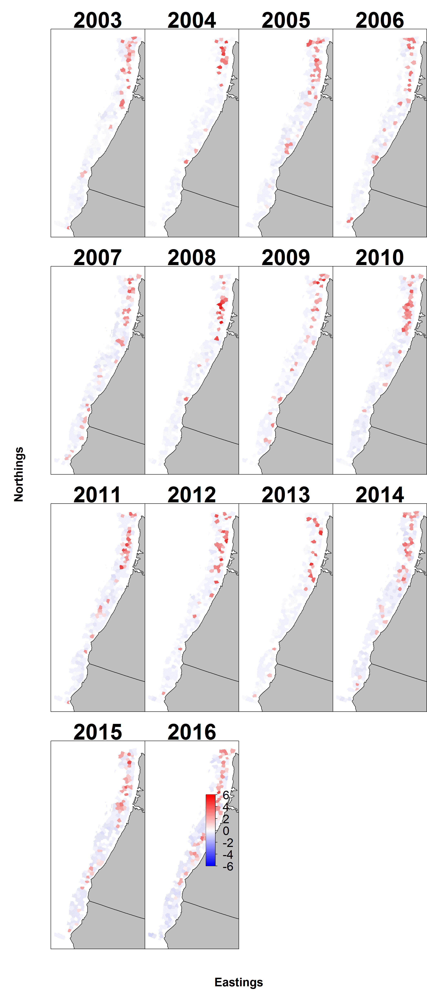
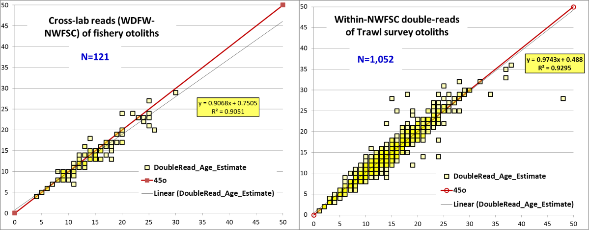
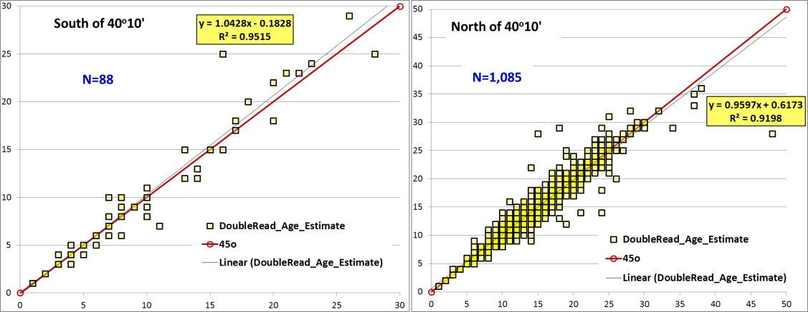
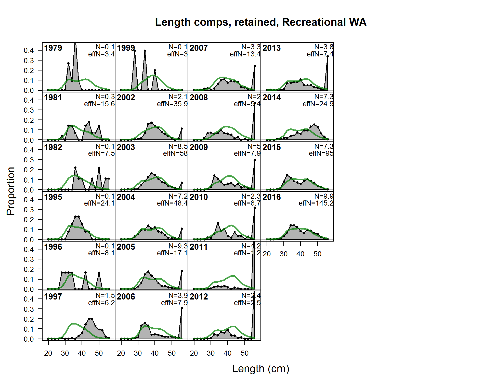
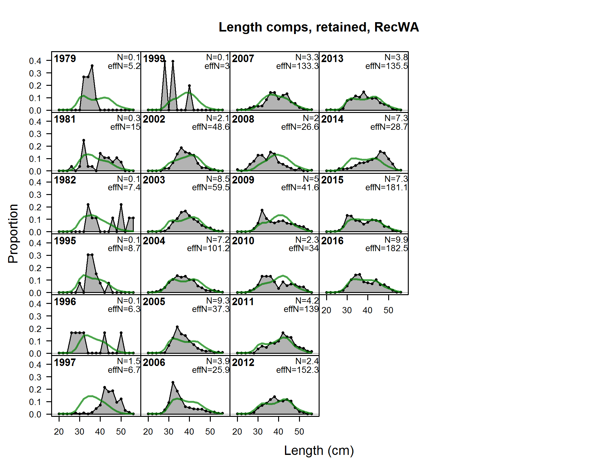
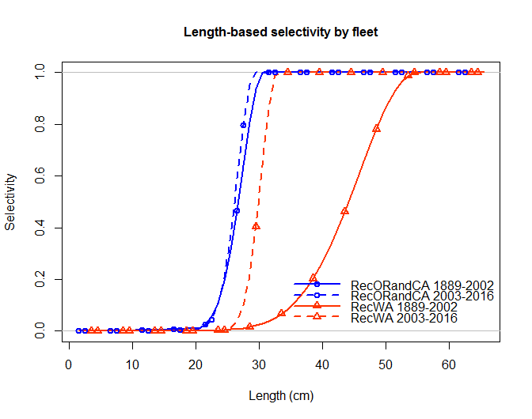
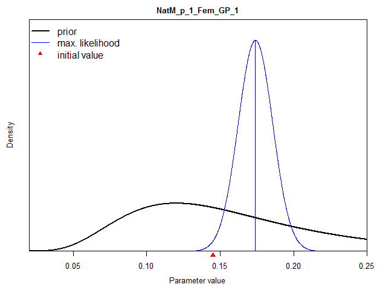
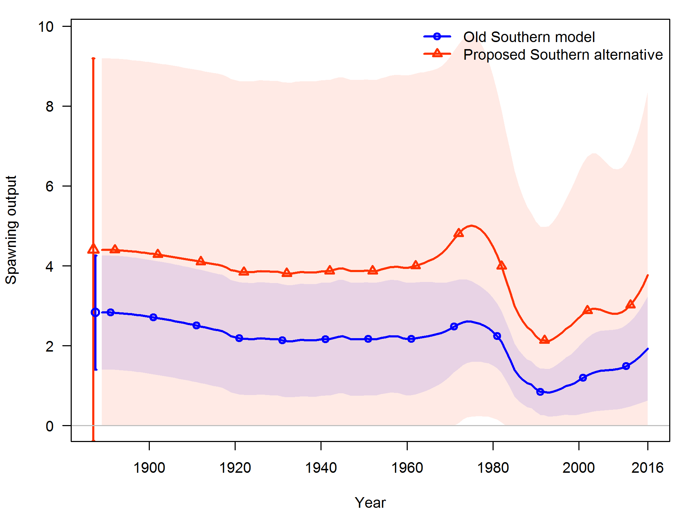

\FloatBarrier

#Appendix D.  Responses to requests of the STAR Panel{-}
\label{sec:AppendixD}

##Round 1 of Requests (Monday, July 10th)

**Request 1**
For the northern model, compare the geospatial GLMMs for the NWFSC Combo survey conducted in VAST to the delta-GLMM version of the VAST with the geo-spatial switches turned off and to the designed-based estimates.  Include a table with the number of hauls, positives, and number of fish and/or length observations in the north and the south.

\emph{Rationale}: This is strongly encouraged in the SSC’s Accepted Practices guide.  The data were too sparse to model a survey index independently in the southern region.

\emph{Response}: The STAT provided a figure comparing the requested alternative indices.  Figure \ref{fig:Geo_Comparisons} shows the trends and variance for the four indices. Pearson residuals for the non-spatial model are shown in Figure \ref{fig:Pearson_Resids}. Tables providing the number of hauls and positive hauls by area.  Tables providing the numbers of length samples are provided in the main body of this document.


 



**Request 2**
For each model, provide the numbers of fish north and south of 40°10’ N lat. that were used for the ageing error matrix and show the results of the cross-reads.

\emph{Rationale}: To see if there is greater uncertainty and/or bias from samples collected in only one area.

\emph{Response}: There were an insufficient number of otoliths from each area for a comparison of cross-lab reads.  Cross-reads between WDFW and NWFSC within-lab comparison for the northern area alone showed a minor deviation from the one to one line for the 121 samples compared (Figure \ref{fig:AgeReads}).  

There were 1085 otoliths from the northern area and only 88 fish from south (collected in the NWFSC Trawl survey) that were double read by the NWFSC in within-lab comparisons.  

There were few deviations from the one to one line for within-lab double reads by the NWFSC in either area (Figure \ref{fig:AgeReads}).  The R-square values were 0.9198 and 0.9515 for northern or southern areas, respectively showing no discernable difference in the accuracy of reads between areas for the within-lab reads.  
 





**Request 3**
Model the southern onboard recreational CPFV survey data for separate time periods pre- and post-1999 using a delta-GLMM modeling approach.  Present the results of the delta-GLMM approach including the factors, CVs, and other diagnostics.  Show the results of the Southern model with the new indices compared to the old indices as a sensitivity analysis.

\emph{Rationale}: The indices were inappropriately input as averages rather than modeled results.  The blocking after 1999 is supported by the CVs and the change in the sampling programs. 

\emph{Response}:  Melissa Monk of the SWFSC provided two indices using the delta-GLMM method both with and without spatial information.  

The early and late onboard surveys differ in that the early period (when only Central California was sampled) has asymptotic selectivity, while the later survey, which include the whole state, has domed shaped selectivity. 

These indices were ultimately included in the final Southern model. 

**Request 4**
If time allows, run the Southern model without the 1982 recreational catch spike (assume the average of 1981 and 1983).

\emph{Rationale}: To understand the influence of this catch, which is suspiciously large.

\emph{Response}: Changing 1982 recreational catch to the average of the 1981 and 1983 catch had little impact on model results.  There was a 1.3% reduction in total removals from reducing this value.

**Request 5**
For the Northern model, provide a table of the species that occur in each state's trawl logbook program.  Confirm the model is using nominal retained catch from the original logbook data.

\emph{Rationale}: There may be different logbook reporting requirements by state that might influence construction of CPUE indices using these data.  

\emph{Response}: A table detailing the data that were used for the original analysis was provided to the panel.  Discussions during day one were the impetus for a new analysis using 22 market categories that occurred in the dataset along the west coast.  The nomina-only categories that were included in the analysis were those that occurred at least 50 times in each of the three areas (WA, OR and NCA). 

Ultimately, the logbook index was withdrawn from the model due to the differences in the way the states speciated market categories during the late 1980s-1990s, which cannot be resolved within the time alloted for the panel.

**Request 6**
Recalculate the trawl logbook CPUE index to catch/tow hour rather than catch/tow. 

\emph{Rationale}: This is the appropriate metric for this index.

\emph{Response}: An index based on the covariate species and using lbs per tow-hour as the response variable was provided. Estimates of uncertainty could not be produced for this index due to time and computational constraints. Figure \ref{fig:Logbook_CPUE} shows a comparison of the previous index (orange, with uncertainty) and the new index (blue, without).

 


Information that came to light about the commercial data collection both in the trawl fishery and in the directed hake fishery during the course of the STAR panel eroded confidence in this index as well as confidence in the hake bycatch index. These indices were ultimately omitted from the Northern base model.

**Request 7**
Check the Washington composition data to determine the correct units in the length data.  Double-check the number of ages from the WA recreational fishery.

\emph{Rationale}: There was a suspicious spike in the time series that may have been due to the wrong units of measurement (cm vs. mm) in the length data.  There is also suspicion the age comps used in the model are not consistent with WA records.

\emph{Response}:  Two issues were identified with respect to the Washington data.  One was that the data were provided with varying units (some lengths in cm, others in mm). 

The second issue concerned sample sizes for the age comps, for which there was a copy-and-paste error comitted in Excel, so that the column of sample-sizes was offset by one year in the data.  

Both lengths and ages for the WA recreational fishery were re-processed. Old (above) and new (below) length compositions are shown in Figure \ref{fig:Fig5_A}. Data reprocessing removed the spikes at large sizes that were shown in the length composition. 

These reworked data were used in the Northern base model.

\FloatBarrier





\FloatBarrier

**Request 8**
Put a time block on the recreational selectivity pattern in the Northern model from 2003 onward.

\emph{Rationale}: Implementation of depth restrictions forced fleets into shallower water affecting the size of fish caught.  This was evidenced by a poor residual pattern.

\emph{Response}:  The model-estimated selectivity curves changed very little for the Oregon and Northern California recreational fisheries, however there was a noticeable change for Washington when the time block was added. The selectivity estimates are compared in Figure \ref{fig:Sel_Curves}.
 


The corrections to the length and age compositions for Washington data preceeded this change to selectivities.  The selectivities were then allowed to be dome shaped, which resulted in better fits. Both the dome-shaped curve and the time block were incorporated into the base case model.

**Request 9**
If time allows, estimate the added variance parameter for all indices in each model.

\emph{Rationale}: This is standard practice.

\emph{Response}: Figure \ref{fig:Index_fits} shows the fits to the Northern model indices when additional variances for all indices are estimated.


!Fits to index data for the Northern Yellowtail model when added variance parameters are estimated.\label{fig:Index_fits}](STAR_Response.figs/IndexFits.Fig7.png)

This aspect of the analyses was not explored further but the additional variance was maintained in the model.

##Round 2 of requests (Wednesday, July 12th)

**Request 10**
Re-tune the new base Northern model with the changes agreed on the 1st set of requests (i.e., corrected WA comp. data, extra variance added to indices, time block in 2003 for recreational catch, and allow dome-shaped selectivity for recreational catch in the recent time block).

\emph{Rationale}: These changes corrected errors in the input data and improved model fits, and will be included in the new base model.

\emph{Response}: The newly-tuned northern model was plotted with and without fishery CPUE indices, in comparison with the pre-STAR meeting model (Figure \ref{fig:Ch-Ch-Changes}).


The natural mortality estimated in northern models has increased due to the changed implemented. The posterior shown in Figure \ref{fig:NatM} is much narrower than the prior, supporting a much smaller range of plausible values for M. The M values associated with this series of models are shown in Table \ref{tab:M_table}. 

<!-- ***********M table************************* -->
```{r, results = 'asis'}
    M_table = data.frame(col1=c("M (females)","M (males)"),
                         col2=c(0.145, 0.138),
                         col3=c(0.159, 0.138),
                         col4=c(0.174, 0.150))
    colnames(M_table) = c('Quantity',	
                          'pre-STAR model',
                          'adjusted, tuned model',
                          'without cpue indices')	

   # create table   
   M_table.table = xtable(M_table, 
                                  caption = c('Pre-STAR, intermediate, and Post-STAR model estimates of natural mortality for northern yellowtail.'),
                                 label = 'tab:M_table',
                                 digits = 3)    

    # Print M table
      print(M_table.table, 
            include.rownames=FALSE, 
            caption.placement='top',
            sanitize.text.function = function(x){x})
```
<!-- ---------------------------------------------------------------------- -->
 


**Request 11**
Use the preliminary new M estimate from the revised Northern model in the Southern model as revised after the first round of requests.  Compare the existing Southern base and the new potential base using the new M estimate.  Explore other M assumptions in the Southern model as deemed appropriate and as time allows.

\emph{Rationale}: The changes to the northern base model will likely affect the estimate of M and consequently would change the assumed M in the southern model.

\emph{Response}: The pre-STAR value for M of 0.14 was replaced by the value of 0.175 based on the value estimated in the proposed Northern base model.  Results are shown in Figure \ref{fig:Spawn_till_you_die}.
 



**Request 12**
As time allows, provide the basis for and documentation of the use of the geospatial GLMMs for the Hake CPUE index in the Northern pre-STAR model that was conducted in VAST. 

\emph{Rationale}: This is needed to understand the basis for how this index is constructed and why there was no sensitivity to the non-spatial analysis.  

\emph{Response}: Upon greater discussion and evaluation, the STAT no longer felt this index should be included in the base model.  The Panel did not request further work on this but noted that future assessments would benefit from further exploration of this index to ascertain its appropriateness and best type of analyses to apply.

**Request 13**
Jitter the new Northern base model. 

\emph{Rationale}: Final check for a global minimum 

\emph{Response}: The result of 100 jitter runs was shown to the panel and indicated that a global minimum had been attained.

**Request 14**
Decision table explorations for the Northern model:

•	Provide projections assuming a range of M values that the STAT considers to be an appropriate approximation of uncertainty for a decision table.

•	Provide projections assuming a range of R0 values based on the base model uncertainty estimates for R0, including the 87.5 and 12.5 percentiles and other explorations as appropriate, as a possible axis of uncertainty for a decision table.

•	Provide any additional projections that the STAT determines may be more appropriate for developing the axis of uncertainty for a decision table. 

\emph{Rationale}: To explore possible axis of uncertainty

\emph{Response}: Likelihood profiles over R0 and M indicated a lower range of spawning output associated with the 12.5% and 87.5% cutoff (change in likelihood of 0.662) than the uncertainty in spawning output estimated for the base model. 

Therefore, we used the 12.5% and 87.5% quantiles of a normal distribution representing 2017 spawning output, for which the base model had an MLE value of 11.28 (trillion eggs) with a standard deviation of 1.823. 

This resulted in target 2017 spawning output values for the low and high states of nature of 9.17 and 13.38 (trillion eggs). R0 and M profiles using a fine step size (0.01 units of R0 or M) were used to find the best matching values of these two parameters for the low and high cases.

**A further request** was made during presentation of the results.  It appeared that depletion could be very similar across the different scenarios.  The  range of depleteion covered was from 57% to about 82% of pre-exploited spawning output, but that was clearly smaller than the uncertainty envelope characterizing the base case results.  

Therefore, we extended the range of values of M used to represent uncertainty by using the prior for M as the shape of the distribution but shifting the distribution so the mean was that estimated in the Northern base model, 0.174. The values that corresponded to the 12.5 and 87.5 percentiles of this distribution were 0.122 and 0.249.

**Request 14**
Provide projections based on the base model uncertainty estimates for M, including the 87.5 and 12.5 percentiles of the prior distribution centered around the base model estimate of M (low M = 0.122, base M = 0.174, high M = 0.249) as a possible axis of uncertainty for a decision table.  

For catch stream alternatives, assume full attainment of 2017 and 2018 ACLs; i.e., 6,196 mt and 6,002 mt, respectively.  Attribute fleet allocations based on the 2017 and 2018 sector allocations for 2017 and 2018; fleet allocations as per the assessment thereafter, such that the 2019-2028 catch streams are based on:

•	Default HCR: ACL = ABC (P* = 0.45)
•	Constant catch of 4,000 mt (which was the approximate catch level when midwater targeting was occurring in  the past; this is in line with the GMT’s 2017-18 spex analysis)
•	Constant catch of 2,000 mt (a marginal increase in recent-year average catch)

\emph{Rationale}: To explore a possible axis of uncertainty for the decision table.

\emph{Response}:  The requested table is the decision table reported in the Executive Summary. 

