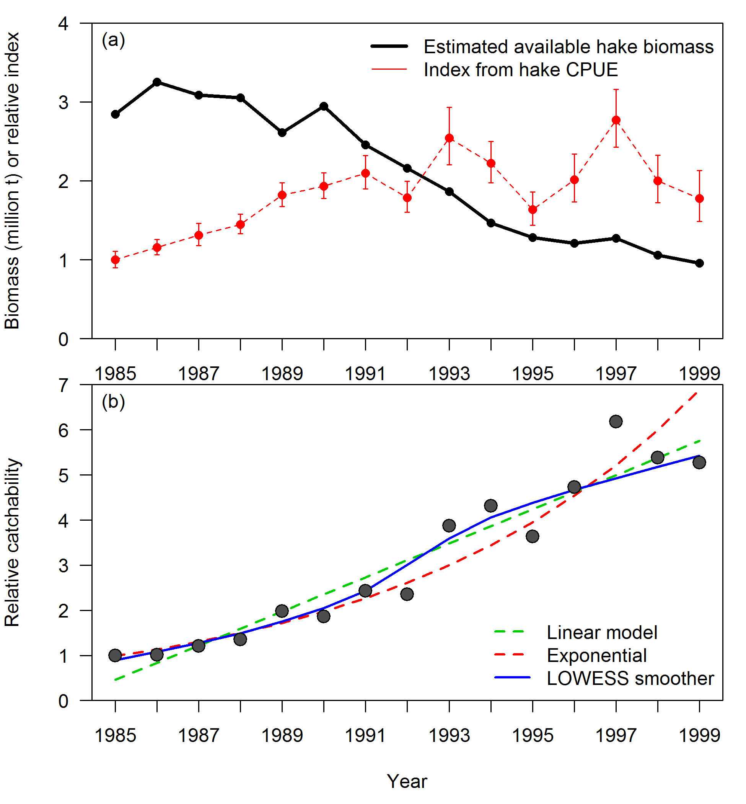
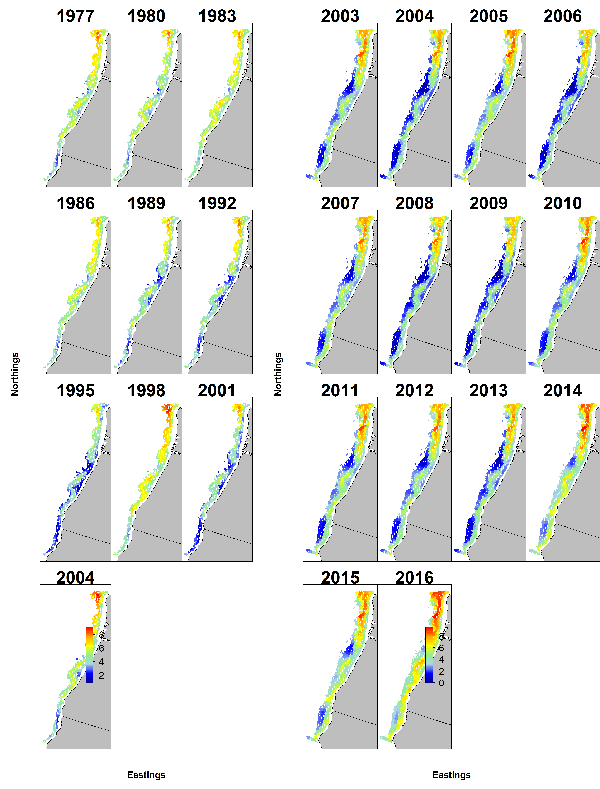
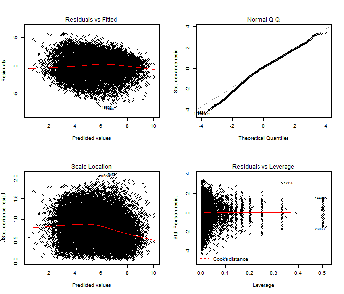
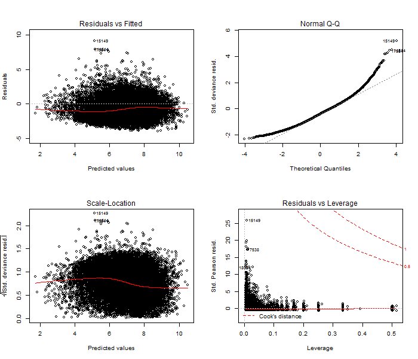
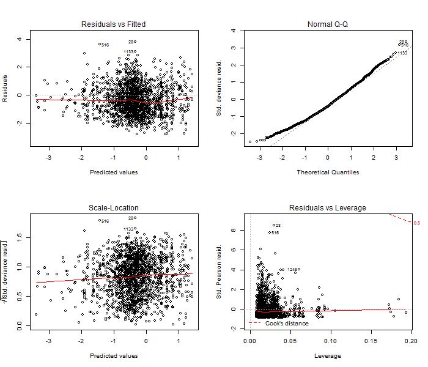

#Figures


<!-- ********************************************************************** --> 
<!-- *************************Data FIGURES********************************* --> 
<!-- ********************************************************************** -->


<!-- ********************************************************************** -->
<!-- ********* SHARED Maturity and Fecundity FIGURES*********************** --> 
<!-- ********************************************************************** -->

\newpage

##Life history (maturity, fecundity, and growth) for both models


<!-- ********************************************************************** -->
<!-- ************** SHARED Weight-Length FIGURES*************************** --> 
<!-- ********************************************************************** -->


<!-- ********************************************************************** -->
<!-- *************** SHARED Growth FIGURES*************************** --> 
<!-- ********************************************************************** -->


\FloatBarrier 

<!-- ********************************************************************** -->
<!-- ****************** NORTHERN MODEL DATA AND FITS*********************** --> 
<!-- ********************************************************************** -->

\newpage

##Data and model fits for the `r mod1_label`


\FloatBarrier

 stacked.png)

.png)

\FloatBarrier

\newpage 

<!-- ************** NORTHERN SELECTIVITY  **************************************** -->

###Selectivity, retention, and discards for `r mod1_label`


\FloatBarrier

\newpage


\FloatBarrier

\newpage

<!-- *********** NORTHERN INDICES  **************************************** -->

###At-Sea Hake Bycatch Index








\FloatBarrier

\newpage





\FloatBarrier

\newpage




\FloatBarrier

###Fits to indices of abundance for `r mod1_label`


\FloatBarrier

\newpage


<!-- ************** NORTHERN LENGTHS  **************************************** -->

###Length compositions for `r mod1_label`


\FloatBarrier

\newpage

```{r, results='asis'}
    # Plot all of the comp plots
    for(i in which(LenComp_mod1$include)) { 
      # find matches to multi-page plots
      page_test = sapply(multi_page_fig, grepl, LenComp_mod1$label[i])
      # if the plot is page2+ of a series, add the extra caption
      if(TRUE %in% page_test) {
        cat('\n', sep='')
     
        cat('\\begin{center} \n
            Figure continued from previous page \n
            \\end{center}',sep='')
      } else {
        cat('\n![', LenComp_mod1$caption[i], ' \\label{fig:mod1_', i, '_', LenComp_mod1$label[i], '}](', LenComp_mod1$filepath[i], ')\n', sep='')
      }
    }
```


<!-- ************** NORTHERN AGES ************************************** -->

###Fits to age compositions for `r mod1_label`

```{r, results='asis'}
    # Plot all of the comp plots
    for(i in which(AgeComp_mod1$include)) { 
      # find matches to multi-page plots
      page_test = sapply(multi_page_fig, grepl, AgeComp_mod1$label[i])
      # if the plot is page2+ of a series, add the extra caption
      if(TRUE %in% page_test) {
        cat('\n', sep='')
     
        cat('\\begin{center} \n
            Figure continued from previous page \n
            \\end{center}',sep='')
      } else {
        cat('\n![', AgeComp_mod1$caption[i], ' \\label{fig:mod1_', i, '_', AgeComp_mod1$label[i], '}](', AgeComp_mod1$filepath[i], ')\n', sep='')
      }
    }
```

\FloatBarrier

\newpage


\FloatBarrier

\newpage

<!-- ************* NORTHERN CONDITIONALS ************************************** -->

###Fits to conditional-age-at-length compositions for `r mod1_label`

```{r, results='asis'}
    # Plot all of the comp plots
    for(i in which(AALComp_mod1$include)) { 
      # find matches to multi-page plots
      page_test = sapply(multi_page_fig, grepl, AALComp_mod1$label[i])
      # if the plot is page2+ of a series, add the extra caption
      if(TRUE %in% page_test) {
        cat('\n', sep='')
     
        cat('\\begin{center} \n
            Figure continued from previous page \n
            \\end{center}',sep='')
      } else {
        cat('\n![', AALComp_mod1$caption[i], ' \\label{fig:mod1_', i, '_', AALComp_mod1$label[i], '}](', AALComp_mod1$filepath[i], ')\n', sep='')
      }
    }
```

\FloatBarrier

\newpage


<!-- ********************************************************************** -->
<!-- ******************* NORTHERN MODEL RESULTS *************************** --> 
<!-- ********************************************************************** -->

##Model results for `r mod1_label`

### Base model results for `r mod1_label`

<!-- ******************* NORTHERN Time-Series Figures ********************* -->


  
\FloatBarrier

.png)

\FloatBarrier


  
\FloatBarrier

_with_95_asymptotic_intervals.png)

\FloatBarrier
  

  
\FloatBarrier


\FloatBarrier

<!-- ***********History of modeling approaches FIGURES******************* --> 


\FloatBarrier

\newpage

<!-- ***********NORTHERN MODEL Uncertainty and Sensitivity FIGURES**************** --> 

### Sensitivity analyses for `r mod1_label`


### Likelihood profiles for `r mod1_label`


\FloatBarrier


\FloatBarrier


\FloatBarrier


\FloatBarrier

### Retrospective analysis for `r mod1_label`


\FloatBarrier

\newpage

### Forecasts for `r mod1_label`


\FloatBarrier

\newpage

<!-- ********************************************************************** -->
<!-- ****************** SOUTHERN MODEL DATA AND FITS ********************** --> 
<!-- ********************************************************************** -->

##Data and model fits for `r mod2_label`


\FloatBarrier

\newpage


\FloatBarrier

\newpage 


<!-- ************* SOUTHERN SELECTIVITY  **************************************** -->

###Selectivity, retention, and discards for `r mod2_label`


\FloatBarrier 

\newpage


\FloatBarrier 

\newpage

<!-- ************** SOUTHERN INDICES  **************************************** -->

###Fits to indices of abundance for `r mod2_label`


\FloatBarrier 

\newpage

<!-- ************* SOUTHERN LENGTHS  **************************************** -->

###Length compositions for `r mod2_label`


```{r, results='asis'}
    # Plot all of the comp plots
    for(i in which(LenComp_mod2$include)) { 
      # find matches to multi-page plots
      page_test = sapply(multi_page_fig, grepl, LenComp_mod2$label[i])
      # if the plot is page2+ of a series, add the extra caption
      if(TRUE %in% page_test) {
        cat('\n', sep='')
     
        cat('\\begin{center} \n
            Figure continued from previous page \n
            \\end{center}',sep='')
      } else {
        cat('\n![', LenComp_mod2$caption[i], ' \\label{fig:mod2_', i, '_', LenComp_mod2$label[i], '}](', LenComp_mod2$filepath[i], ')\n', sep='')
      }
    }
```

\FloatBarrier

\newpage


\FloatBarrier

\newpage

<!-- *************** SOUTHERN AGES ************************************** -->

###Age compositions for `r mod2_label`


\FloatBarrier

\newpage

```{r, results='asis'}
    # Plot all of the comp plots
    for(i in which(AgeComp_mod2$include)) { 
      # find matches to multi-page plots
      page_test = sapply(multi_page_fig, grepl, AgeComp_mod2$label[i])
      # if the plot is page2+ of a series, add the extra caption
      if(TRUE %in% page_test) {
        cat('\n', sep='')
     
        cat('\\begin{center} \n
            Figure continued from previous page \n
            \\end{center}',sep='')
      } else {
        cat('\n![', AgeComp_mod2$caption[i], ' \\label{fig:mod2_', i, '_', AgeComp_mod2$label[i], '}](', AgeComp_mod2$filepath[i], ')\n', sep='')
      }
    }
```


\FloatBarrier

\newpage


<!-- ************* SOUTHERN CONDITIONALS ************************************** -->

###Fits to conditional-age-at-length compositions for `r mod2_label`

```{r, results='asis'}
    # Plot all of the comp plots
    for(i in which(AALComp_mod2$include)) { 
      # find matches to multi-page plots
      page_test = sapply(multi_page_fig, grepl, AALComp_mod2$label[i])
      # if the plot is page2+ of a series, add the extra caption
      if(TRUE %in% page_test) {
        cat('\n', sep='')
     
        cat('\\begin{center} \n
            Figure continued from previous page \n
            \\end{center}',sep='')
      } else {
        cat('\n![', AALComp_mod2$caption[i], ' \\label{fig:mod2_', i, '_', AALComp_mod2$label[i], '}](', AALComp_mod2$filepath[i], ')\n', sep='')
      }
    }
```

\FloatBarrier

\newpage


<!-- ********************************************************************** -->
<!-- ******************* SOUTHERN MODEL RESULTS *************************** --> 
<!-- ********************************************************************** -->

##Model results for `r mod2_label`

### Base model results for `r mod2_label`

<!-- ******************* SOUTHERN Time-Series Figures ********************* -->


  
\FloatBarrier

.png)

\FloatBarrier


  
\FloatBarrier

_with_95_asymptotic_intervals.png)

\FloatBarrier
  

  
\FloatBarrier


\FloatBarrier

\newpage

<!-- ***********SOUTHERN MODEL Uncertainty and Sensitivity FIGURES**************** --> 

### Sensitivity analyses for `r mod2_label`

<!-- BIO SENSITIVITIES -->


<!-- CPUE SENSITIVITIES -->


<!-- OTHER SENSITIVITIES -->


\FloatBarrier

### Likelihood profiles for `r mod2_label`


\FloatBarrier


\FloatBarrier


\FloatBarrier


\FloatBarrier

### Retrospective analysis for `r mod2_label`


\FloatBarrier

### Forecasts for `r mod2_label`


<!-- ********************************************************************** -->
<!-- ****************STAR PANEL Recommendations FIGURES******************** --> 
<!-- ********************************************************************** -->


<!-- ********************************************************************** -->
<!-- *********************REFERENCE POINTS FIGURES************************* --> 
<!-- ********************************************************************** -->

<!-- ***********MODEL 1 REFERENCE POINTS FIGURES*************************** --> 


\FloatBarrier
<!-- ***********MODEL 2 REFERENCE POINTS FIGURES  -- IF NEEDED ************ --> 


<!-- ***********MODEL 3 REFERENCE POINTS FIGURES  -- IF NEEDED ************ --> 


