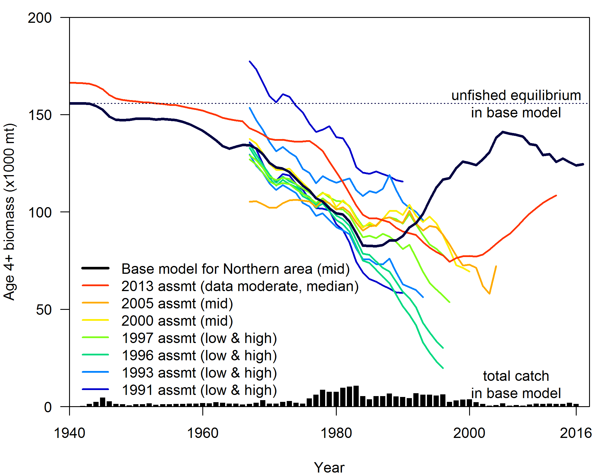

\setlength{\parskip}{5mm plus1mm minus1mm}
\pagebreak

\pagenumbering{arabic}
<!--\setcounter{page}{1}-->
\renewcommand{\thefigure}{\alph{figure}}
\renewcommand{\thetable}{\alph{table}}


#Executive Summary{-}

##Stock{-}
This assessment reports the status of the Yellowtail Rockfish (\emph{Sebastes flavidus}) resource in U.S. waters off the coast of the California, Oregon, and Washington using data through 2016.  

The Pacific Fishery Management Council (PFMC) manages the U.S. fishery as two stocks separated at Cape Mendocino, California (40$^\circ$ 10'N). The northern stock has long been assessed on its own; the southern stock is managed as part of the "Minor Shelf Rockfish" complex.  This assessment analyzes each stock independently, with the southern stock extending southward to the U.S./Mexico border and the northern stock extending northward to the U.S./Canada border (Figure \ref{fig:assess_region_map_Exec_Sum}).


The most recent fully integrated assessment [@Wallace2005], following the pattern of prior assessments, included only the Northern stock which it divided into three assessment areas with divisions at Cape Elizabeth (47$^\circ$ 20'N) and Cape Falcon (45$^\circ$ 46'N).  A data-moderate assessment conducted in 2013 [@Cope2013] was the first to analyze the southern stock, determining its contribution to the overfishing limit (OFL) for the Southern Shelf Complex. 

Since the 2005 assessment, reconstruction of historical catch by Washington and Oregon makes any border but the state line (roughly 46$^\circ$ N) incompatible with the data from those states.  Additionally, much of the groundfish catch landed in northern Oregon is caught in Washington waters.  

This assessment addresses the stock in two areas consistent with the management border at Cape Mendocino.  This is consistent, as well, with a recent genetic analysis [@Hess2011] that found distinct stocks north and south of Cape Mendocino but did not find stock differences within the northern area. 

\FloatBarrier

##Catches{-}
Catches from the Northern stock (Figure \ref{fig:r4ss_catch_N}) were divided into four categories: commercial catch, bycatch in the at-sea hake fishery, recreational catch in Oregon and California (north of 40$^\circ$ 10'N), and recreational catch in Washington. The first three of these fleets were entered in metric tons, but the recreational catch from Washington was entered in the model as numbers of fish with the average weight calculated internally in the model from the weight-length relationship and the estimated selectivity for this fleet (which is informed by the length-compositions). Catches have been increasing over the past 10 years (Table \ref{tab:Exec_catch_N}) but remain well below the peak catch due to management measures, included lower catch limits and closed areas.

Catches from the Southern stock (Figure \ref{fig:r4ss_catch_S}) were divided into two categories: commercial and recreational catch, both of which were entered as metric tons. Catches over the past 10 years have remained far below the peak levels, with the majority of recent catch coming from the Recreational fishery (Table \ref{tab:Exec_catch_S})

<!-- ***********BEGIN EXECUTIVE SUMMARY CATCH FIGURES AND TABLES*********** -->
<!-- ***********Edit the Plot_catch tables and captions******************** -->
<!-- ***********This depends on how many plots you need******************** -->
<!-- ***********Also included is the r4SS plot - keep or remove************ -->
<!-- ***********CATCH FIGURES********************************************** -->

\FloatBarrier


\FloatBarrier

<!-- ***********CATCH TABLE NORTH****************************************** -->
\begin{table}[ht]
\centering
\caption{Recent Yellowtail Rockfish catch by 
                                             fleet for the Northern model (north of 40$^\circ$ 10'N).} 
\label{tab:Exec_catch_N}
\begin{tabular}{l>{\centering}p{1.0in}>{\centering}p{1.0in}>{\centering}p{1.0in}>{\centering}p{1.0in}}
  \hline
Year & Commercial (mt) & At-sea hake bycatch (mt) & Recreational OR+CA (mt) & Recreational WA (1000s) \\ 
  \hline
2006 & 358 & 109 & 23 & 14 \\ 
  2007 & 276 & 79 & 18 & 15 \\ 
  2008 & 276 & 175 & 24 & 18 \\ 
  2009 & 539 & 176 & 17 & 28 \\ 
  2010 & 754 & 150 & 12 & 38 \\ 
  2011 & 1181 & 101 & 18 & 43 \\ 
  2012 & 1509 & 43 & 20 & 19 \\ 
  2013 & 1117 & 269 & 20 & 24 \\ 
  2014 & 1366 & 42 & 16 & 33 \\ 
  2015 & 1841 & 86 & 29 & 56 \\ 
  2016 & 1308 & 62 & 14 & 60 \\ 
   \hline
\end{tabular}
\end{table}
<!-- ***********END EXECUTIVE SUMMARY CATCH FIGURES AND TABLES************* -->

<!-- ***********CATCH TABLE SOUTH****************************************** -->
\begin{table}[ht]
\centering
\caption{Recent Yellowtail Rockfish catch by 
                                            fleet for the Southern model (south of 40$^\circ$ 10'N).} 
\label{tab:Exec_catch_S}
\begin{tabular}{l>{\centering}p{1.5in}>{\centering}p{1.5in}}
  \hline
Year & Recreational (mt) & Commercial (mt) \\ 
  \hline
2006 & 19 & 5 \\ 
  2007 & 60 & 4 \\ 
  2008 & 20 & 2 \\ 
  2009 & 48 & 1 \\ 
  2010 & 24 & 1 \\ 
  2011 & 45 & 1 \\ 
  2012 & 53 & 1 \\ 
  2013 & 56 & 4 \\ 
  2014 & 60 & 5 \\ 
  2015 & 96 & 4 \\ 
  2016 & 32 & 2 \\ 
   \hline
\end{tabular}
\end{table}
<!-- ***********END EXECUTIVE SUMMARY CATCH FIGURES AND TABLES************* -->


\FloatBarrier


\newpage

##Data and Assessment{-}
Yellowtail Rockfish north of Cape Mendocino (40$^\circ$ 10'N) was most recently assessed as part of a 2013 data-moderate stock assessment [@Cope2013] that did not include any length or age data. The northern stock was previously assessed in 2000 [@Tagart2000] with that assessment updated in 2003 and 2005 [@Lai2003, @Wallace2005]. The stock south of 40$^\circ$ 10'N has never been assessed due to a percieved lack of data in this area.

This assessment uses Stock Synthesis version 3.3.  The Northern model begins in 1889. The Southern model begins in 1889. In both cases those starting years were chosen based on the first year of the available catch data and the start of the estimated recruitment deviations was at a later point, so both models were assumed to start at an unfished equilibrium.
 
##Stock Biomass{-}
The spawning output for the Northern model was estimated to have fallen below 40\% of unfished equilibrium in the early 1980s, to a minimum of 24.3% in 1995 but has rebounded since to 53.8% in 2017 (~95% asymptotic interval: $\pm$ 42.2%-65.3%) (Figures \ref{fig:Spawnbio_all} and \ref{fig:RelDeplete_all}, Table \ref{tab:SpawningDeplete_mod1}).

The spawning output for the Southern model is estimated to have experienced less impact from fishing and never fallen below the 40\% reference point. The estimated minimum was 29% in 1993 and the estimated relative spawning output in 2017 is 73.8% (~95% asymptotic interval: $\pm$ 59.5%-88.2%).

\FloatBarrier


<!--BEGIN  EXECUTIVE SUMMARY SPAWNING BIOMASS AND DEPLETE TABLES AND FIGURES-->
\begin{table}[ht]
\centering
\caption{Recent trend in beginning of the 
                                      year spawning output and depletion for
                                      the Northern model for Yellowtail Rockfish.} 
\label{tab:SpawningDeplete_mod1}
\begin{tabular}{l>{\centering}p{1.3in}>{\centering}p{1.2in}>{\centering}p{1in}>{\centering}p{1.2in}}
  \hline
Year & Spawning Output (trillion eggs) & \~{} 95\% confidence interval & Estimated depletion & \~{} 95\% confidence interval \\ 
  \hline
2008 & 7.563 & (5.51-9.62) & 0.516 & (0.384-0.648) \\ 
  2009 & 7.960 & (5.84-10.08) & 0.543 & (0.41-0.677) \\ 
  2010 & 8.226 & (6.05-10.4) & 0.562 & (0.428-0.695) \\ 
  2011 & 8.326 & (6.12-10.53) & 0.568 & (0.436-0.701) \\ 
  2012 & 8.360 & (6.14-10.58) & 0.571 & (0.441-0.7) \\ 
  2013 & 8.277 & (6.06-10.49) & 0.565 & (0.44-0.691) \\ 
  2014 & 8.170 & (5.96-10.38) & 0.558 & (0.436-0.679) \\ 
  2015 & 8.067 & (5.86-10.27) & 0.551 & (0.432-0.669) \\ 
  2016 & 7.907 & (5.69-10.12) & 0.540 & (0.423-0.656) \\ 
  2017 & 7.879 & (5.64-10.12) & 0.538 & (0.422-0.653) \\ 
   \hline
\end{tabular}
\end{table}
\begin{table}[ht]
\centering
\caption{Recent trend in 
                                             beginning of the year spawning output
                                             and depletion for the Southern model for Yellowtail Rockfish.} 
\label{tab:SpawningDeplete_mod2}
\begin{tabular}{l>{\centering}p{1.3in}>{\centering}p{1.2in}>{\centering}p{1in}>{\centering}p{1.2in}}
  \hline
Year & Spawning Output (trillion eggs) & \~{} 95\% confidence interval & Estimated depletion & \~{} 95\% confidence interval \\ 
  \hline
2008 & 1.397 & (0.4-2.4) & 0.494 & (0.371-0.616) \\ 
  2009 & 1.416 & (0.41-2.42) & 0.500 & (0.381-0.619) \\ 
  2010 & 1.444 & (0.43-2.46) & 0.510 & (0.393-0.626) \\ 
  2011 & 1.488 & (0.45-2.52) & 0.526 & (0.411-0.64) \\ 
  2012 & 1.547 & (0.48-2.61) & 0.546 & (0.432-0.661) \\ 
  2013 & 1.621 & (0.51-2.73) & 0.572 & (0.456-0.689) \\ 
  2014 & 1.707 & (0.55-2.87) & 0.603 & (0.483-0.723) \\ 
  2015 & 1.809 & (0.59-3.03) & 0.639 & (0.514-0.764) \\ 
  2016 & 1.933 & (0.63-3.24) & 0.683 & (0.55-0.816) \\ 
  2017 & 2.090 & (0.69-3.49) & 0.738 & (0.595-0.882) \\ 
   \hline
\end{tabular}
\end{table}

\FloatBarrier


<!-- ***********END  EXECUTIVE SUMMARY SPAWNING BIOMASS AND**************** -->


<!-- ***********DEPLETION TABLES AND FIGURES******************************* -->

\FloatBarrier


##Recruitment{-}
Recruitment is estimated to be at a similar scale for both models (Figure \ref{fig:Recruits_all}) except for the final years in which the Southern model is estimated to have had very large recruitments in 2008 and 2010 (Tables \ref{tab:Recruit_mod1} and \ref{tab:Recruit_mod2}). The Southern model has higher mortality but slower growth than the Northern model, leading to a larger level of recruitment relative to the spawning output in the South.


<!-- ***********BEGIN EXECUTIVE SUMMARY RECRUITMENT TABLES AND FIGURES***** -->
\begin{table}[ht]
\centering
\caption{Recent recruitment for the Northern model.} 
\label{tab:Recruit_mod1}
\begin{tabular}{>{\centering}p{.8in}>{\centering}p{1.6in}>{\centering}p{1.3in}}
  \hline
Year & Estimated Recruitment (millions) & \~{} 95\% confidence interval \\ 
  \hline
2008 & 36.75 & (22.25 - 60.69) \\ 
  2009 & 11.59 & (5.61 - 23.92) \\ 
  2010 & 26.53 & (13.97 - 50.38) \\ 
  2011 & 19.90 & (8.7 - 45.53) \\ 
  2012 & 20.07 & (7.56 - 53.3) \\ 
  2013 & 28.13 & (9.61 - 82.34) \\ 
  2014 & 26.17 & (8.95 - 76.53) \\ 
  2015 & 26.56 & (9.32 - 75.71) \\ 
  2016 & 26.37 & (9.26 - 75.07) \\ 
  2017 & 26.36 & (9.26 - 75.02) \\ 
   \hline
\end{tabular}
\end{table}
\begin{table}[ht]
\centering
\caption{Recent recruitment for the Southern model.} 
\label{tab:Recruit_mod2}
\begin{tabular}{>{\centering}p{.8in}>{\centering}p{1.6in}>{\centering}p{1.3in}}
  \hline
Year & Estimated Recruitment (millions) & \~{} 95\% confidence interval \\ 
  \hline
2008 & 26.06 & (11.35 - 59.83) \\ 
  2009 & 30.79 & (12.11 - 78.3) \\ 
  2010 & 28.21 & (10.58 - 75.2) \\ 
  2011 & 21.41 & (7.43 - 61.66) \\ 
  2012 & 11.50 & (3.89 - 34.02) \\ 
  2013 & 22.13 & (10.2 - 48.02) \\ 
  2014 & 15.76 & (7.07 - 35.16) \\ 
  2015 & 14.20 & (5.99 - 33.69) \\ 
  2016 & 7.09 & (2.17 - 23.16) \\ 
  2017 & 10.14 & (2.27 - 45.37) \\ 
   \hline
\end{tabular}
\end{table}

\FloatBarrier


<!-- ***********END EXECUTIVE SUMMARY RECRUITMENT TABLEs AND FIGURES******* -->

 \FloatBarrier


##Exploitation status{-}
The Northern model is estimated to have experienced overfishing throughout the 1980s and 1990s relative to the current SPR-based harvest limits (Figure \ref{fig:SPR_all}). The Southern stock is managed as part of a stock complex under catch limits applied at the complex level. However, the fishing intensity is estimated to have remained below 100% for all years. In recent years, the fishing intensity has been well within the management limits for both areas with particularly low estimates for the Southern model (Tables \ref{tab:SPR_Exploit_mod1} and \ref{tab:SPR_Exploit_mod2}).

A summary of Yellowtail Rockfish exploitation histories for base model is provided as Figure \ref{fig:Phase_all}.


\FloatBarrier

<!-- ***********BEGIN EXECUTIVE SUMMARY EXPLOITATION AND******************* -->
<!-- ***********SPRratio TABLE AND FIGURES********************************* -->
\begin{table}[ht]
\centering
\caption{Recent trend in spawning potential 
                                        ratio and exploitation for Yellowtail Rockfish in the Northern model.  Fishing intensity is (1-SPR) 
                                        divided by 50\% (the SPR target) and exploitation 
                                        is F divided by F\textsubscript{SPR}.} 
\label{tab:SPR_Exploit_mod1}
\begin{tabular}{l>{\centering}p{1in}>{\centering}p{1.2in}>{\centering}p{1in}>{\centering}p{1.2in}}
  \hline
Year & Fishing intensity & \~{} 95\% confidence interval & Exploitation rate & \~{} 95\% confidence interval \\ 
  \hline
2007 & 0.32 & (0.11-0.52) & 0.01 & (0-0.02) \\ 
  2008 & 0.20 & (0.14-0.27) & 0.01 & (0-0.01) \\ 
  2009 & 0.37 & (0.23-0.51) & 0.01 & (0.01-0.02) \\ 
  2010 & 0.50 & (0.25-0.74) & 0.02 & (0.01-0.03) \\ 
  2011 & 0.44 & (0.31-0.56) & 0.02 & (0.01-0.02) \\ 
  2012 & 0.50 & (0.37-0.63) & 0.02 & (0.01-0.03) \\ 
  2013 & 0.47 & (0.34-0.6) & 0.02 & (0.01-0.02) \\ 
  2014 & 0.48 & (0.35-0.6) & 0.02 & (0.01-0.02) \\ 
  2015 & 0.62 & (0.46-0.77) & 0.03 & (0.02-0.03) \\ 
  2016 & 0.48 & (0.35-0.61) & 0.02 & (0.01-0.02) \\ 
   \hline
\end{tabular}
\end{table}
\begin{table}[ht]
\centering
\caption{Recent trend in spawning potential 
                                        ratio and exploitation for Yellowtail Rockfish in the Southern model. Fishing intensity is (1-SPR) 
                                        divided by 50\% (the SPR target) and exploitation 
                                        is F divided by F\textsubscript{SPR}.} 
\label{tab:SPR_Exploit_mod2}
\begin{tabular}{l>{\centering}p{1in}>{\centering}p{1.2in}>{\centering}p{1in}>{\centering}p{1.2in}}
  \hline
Year & Fishing intensity & \~{} 95\% confidence interval & Exploitation rate & \~{} 95\% confidence interval \\ 
  \hline
2007 & 0.09 & (0.03-0.15) & 0.00 & (0-0.01) \\ 
  2008 & 0.03 & (0.01-0.05) & 0.00 & (0-0) \\ 
  2009 & 0.06 & (0.02-0.11) & 0.00 & (0-0) \\ 
  2010 & 0.03 & (0.01-0.05) & 0.00 & (0-0) \\ 
  2011 & 0.05 & (0.02-0.08) & 0.00 & (0-0) \\ 
  2012 & 0.05 & (0.02-0.09) & 0.00 & (0-0) \\ 
  2013 & 0.06 & (0.02-0.09) & 0.00 & (0-0) \\ 
  2014 & 0.06 & (0.02-0.09) & 0.00 & (0-0) \\ 
  2015 & 0.08 & (0.03-0.13) & 0.00 & (0-0) \\ 
  2016 & 0.03 & (0.01-0.04) & 0.00 & (0-0) \\ 
   \hline
\end{tabular}
\end{table}

\FloatBarrier


<!-- ************END EXECUTIVE SUMMARY EXPLOITATION************************ -->
<!-- ************AND SPRratio TABLE AND FIGURES**************************** -->

\FloatBarrier


##Ecosystem Considerations{-}
Rockfish in general are sensitive to the strength and timing of the upwelling cycle in the Eastern Pacific, which affects where pelagic juveniles settle, and impacts the availability of the zooplankton which the young require.

Yellowtail Rockfish feed mainly on pelagic animals, but are opportunistic, occasionally eating benthic animals as well. Large juveniles and adults eat fish (small Pacific whiting, Pacific herring, smelt, anchovies, lanternfishes, and others), along with squid, krill, and other planktonic organisms.  They are prey for Chinook Salmon, Lingcod, Cormorants, Pigeon Guillemots and Rhinoceros Auklets. [@Love2011]


##Reference Points{-}
Yellowtail Rockfish are managed relative to biomass reference points at $B_{40\%}$ (the $B_{MSY}$ proxy) and $B_{25\%}$ (the minimum stock-size threshold). Harvest rates are managed relative to an $F_{MSY}$ proxy $SPR = 50\%$ which corresponds to a Relative Fishing Intensity, $(1 - {SPR})/(1 - {SPR}_{50\%})$, of 100\%. This assessment estimates both the Northern and Southern stocks to be above the $B_{40\%}$ threshold with Relative Fishing Intensity below 100\% (${SPR} > 50\%$ which means the Spawning Potential is greater than 50\% of the unfished Spawning Potential).

The estimated relative depletion level for the Northern model in 2017 is 
53.8% (~95% asymptotic interval: $\pm$ 42.2%-65.3%, corresponding 
to an unfished spawning output of 7.9 trillion eggs 
(~95% asymptotic interval: 5.64-10.12 trillion eggs) of 
spawning output in the base model (Table \ref{tab:Ref_pts_mod1}).  Unfished 
age 4+ biomass was estimated to be 131.1 mt in the 
base case model. The target spawning output based on the biomass target 
($SB_{40\%}$) is 5.9 trillion eggs, which gives 
a catch of 4034.7 mt. Equilibrium yield at the proxy $F_{MSY}$ 
harvest rate corresponding to $SPR_{50\%}$ is 3806.9 mt.

The estimated relative depletion level for the Southern model in 2017 is 
73.8% (~95% asymptotic interval: $\pm$ 
59.5%-88.2%), corresponding to an unfished spawning output of 
2.1 trillion eggs (~95% asymptotic interval: 
) of 
spawning output in the base model (Table \ref{tab:Ref_pts_mod2}). Unfished 
age 4+ biomass was estimated to be 41.6 
mt in the base case model. The target spawning output based on the biomass target 
($SB_{40\%}$) is 1.1 trillion eggs, 
which gives a catch of 1046.9 mt. Equilibrium yield at the proxy $F_{MSY}$ 
harvest rate corresponding to $SPR_{50\%}$ is 990.2 mt.

Estimated equilibrium yield curves for both models are shown in Figure \ref{fig:Yield_all}.

\FloatBarrier

<!-- ***********BEGIN EXECUTIVE SUMMARY REFERENCE POINT TABLES************* -->
\begin{table}[ht]
\centering
\caption{Summary of reference 
                                      points and management quantities for the 
                                      base case Northern model.} 
\label{tab:Ref_pts_mod1}
\begin{tabular}{>{\raggedright}p{4.1in}>{\centering}p{.65in}>{\centering}p{1.4in}}
  \hline
\textbf{Quantity} & \textbf{Estimate} & \textbf{\~95\%  Confidence Interval} \\ 
  \hline
Unfished spawning output (trillion eggs) & 14.6 & (12.3-17) \\ 
  Unfished age 4+ biomass (1000 mt) & 131.1 & (112.3-150) \\ 
  Unfished recruitment (R0, millions) & 28.5 & (19.4-37.7) \\ 
  Spawning output(2016 trillion eggs) & 7.9 & (5.7-10.1) \\ 
  Relative Spawning Output (depletion)2016) & 0.5398 & (0.4234-0.6563) \\ 
  \textbf{$\text{Reference points based on } \mathbf{SB_{40\%}}$} &  &  \\ 
  Proxy spawning output ($B_{40\%}$) & 5.9 & (4.9-6.8) \\ 
  SPR resulting in $B_{40\%}$ ($SPR_{B40\%}$) & 0.4589 & (0.4589-0.4589) \\ 
  Exploitation rate resulting in $B_{40\%}$ & 0.0543 & (0.0519-0.0567) \\ 
  Yield with $SPR_{B40\%}$ at $B_{40\%}$ (mt) & 4034.7 & (3349-4720.4) \\ 
  \textbf{\textit{Reference points based on SPR proxy for MSY}} &  &  \\ 
  Spawning output & 6.5 & (5.5-7.6) \\ 
  $SPR_{proxy}$ & 0.5 &  \\ 
  Exploitation rate corresponding to $SPR_{proxy}$ & 0.0481 & (0.046-0.0503) \\ 
  Yield with $SPR_{proxy}$ at $SB_{SPR}$ (mt) & 3806.9 & (3163.6-4450.2) \\ 
  \textbf{\textit{Reference points based on estimated MSY values}} &  &  \\ 
  Spawning output at $MSY$ ($SB_{MSY}$) & 3.4 & (2.9-4) \\ 
  $SPR_{MSY}$ & 0.3103 & (0.3052-0.3154) \\ 
  Exploitation rate at $MSY$ & 0.0829 & (0.0788-0.087) \\ 
  $MSY$ (mt)  & 4496.8 & (3712-5281.6) \\ 
   \hline
\end{tabular}
\end{table}
\begin{table}[ht]
\centering
\caption{Summary of reference points 
                                      and management quantities for the base case Southern model.} 
\label{tab:Ref_pts_mod2}
\begin{tabular}{>{\raggedright}p{4.1in}>{\centering}p{.65in}>{\centering}p{1.4in}}
  \hline
\textbf{Quantity} & \textbf{Estimate} & \textbf{\~95\%  Confidence Interval} \\ 
  \hline
Unfished spawning output (trillion eggs) & 2.8 & (1.4-4.3) \\ 
  Unfished age 4+ biomass (1000 mt) & 41.6 & (20.6-62.7) \\ 
  Unfished recruitment (R0, millions) & 10.4 & (5.1-15.7) \\ 
  Spawning output(2016 trillion eggs) & 1.9 & (0.6-3.2) \\ 
  Relative Spawning Output (depletion)2016) & 0.6828 & (0.5496-0.8159) \\ 
  \textbf{$\text{Reference points based on } \mathbf{SB_{40\%}}$} &  &  \\ 
  Proxy spawning output ($B_{40\%}$) & 1.1 & (0.6-1.7) \\ 
  SPR resulting in $B_{40\%}$ ($SPR_{B40\%}$) & 0.4589 & (0.4589-0.4589) \\ 
  Exploitation rate resulting in $B_{40\%}$ & 0.0514 & (0.0498-0.053) \\ 
  Yield with $SPR_{B40\%}$ at $B_{40\%}$ (mt) & 1046.9 & (517-1576.8) \\ 
  \textbf{\textit{Reference points based on SPR proxy for MSY}} &  &  \\ 
  Spawning output & 1.3 & (0.6-1.9) \\ 
  $SPR_{proxy}$ & 0.5 &  \\ 
  Exploitation rate corresponding to $SPR_{proxy}$ & 0.0452 & (0.0438-0.0467) \\ 
  Yield with $SPR_{proxy}$ at $SB_{SPR}$ (mt) & 990.2 & (489.3-1491.2) \\ 
  \textbf{\textit{Reference points based on estimated MSY values}} &  &  \\ 
  Spawning output at $MSY$ ($SB_{MSY}$) & 0.6866 & (0.3421-1.0312) \\ 
  $SPR_{MSY}$ & 0.3169 & (0.3134-0.3204) \\ 
  Exploitation rate at $MSY$ & 0.0797 & (0.0774-0.082) \\ 
  $MSY$ (mt)  & 1154.4 & (569-1739.8) \\ 
   \hline
\end{tabular}
\end{table}
<!-- ***********END EXECUTIVE SUMMARY REFERENCE POINT TABLES*************** --> 

\FloatBarrier


##Management Performance{-}

Total catch (including landings and discards) from the Northern stock has remained well below the management limits in recent years (Table \ref{tab:mnmgt_perform_exec.N}) and harvest specifications for 2017 and 2018 are set at values similar to the previous years.

The southern stock has been managed in the Southern Shelf Rockfish complex so is not managed under a single-species catch limit. Nevertheless, the contribution of the Yellowtail stock to the reference points for the complex are shown in Table \ref{tab:mnmgt_perform_exec.S}, indicating that recent catches have been well below the OFL contributions in spite of these limits not being used in managing fisheries catches.


<!-- ***********BEGIN EXECUTIVE SUMMARY MANAGEMENT PERFORMANCE TABLES******* --> 
\begin{table}[ht]
\centering
\caption{Northern model recent total catch
                              relative to the management guidelines. 
                              Estimated total catch includes estimated discarded
                              biomass. Note: the OFL was termed the ABC prior to
                              implementation of FMP Amendment 23 in 2011.
                              The ABC was redefined to reflect the uncertainty
                              in estimating the OFL under Amendment 23.
                              Likewise, the ACL was termed the OY prior to 2011.} 
\label{tab:mnmgt_perform_exec.N}
\scalebox{0.9}{
\begin{tabular}{>{\raggedleft}p{1in}>{\centering}p{1in}>{\centering}p{1in}>{\centering}p{1in}>{\centering}p{1in}}
  \hline
Year & OFL (mt; ABC prior to 2011) & ABC (mt) & ACL (mt; OY prior to 2011) & Estimated total catch (mt) \\ 
  \hline
\textbf{2007} & 4585 & - & 4585 & 849 \\ 
  \textbf{2008} & 4510 & - & 4510 & 521 \\ 
  \textbf{2009} & 4562 & - & 4562 & 1096 \\ 
  \textbf{2010} & 4562 & - & 4562 & 1597 \\ 
  \textbf{2011} & 4566 & 4364 & 4364 & 1352 \\ 
  \textbf{2012} & 4573 & 4371 & 4371 & 1595 \\ 
  \textbf{2013} & 4579 & 4378 & 4378 & 1434 \\ 
  \textbf{2014} & 4584 & 4382 & 4382 & 1462 \\ 
  \textbf{2015} & 7218 & 6590 & 6590 & 2020 \\ 
  \textbf{2016} & 6949 & 6344 & 6344 & 1452 \\ 
  \textbf{2017} & 6786 & 6196 & 6196 & - \\ 
  \textbf{2018} & 6574 & 6002 & 6002 & - \\ 
   \hline
\end{tabular}
}
\end{table}

\begin{table}[ht]
\centering
\caption{Southern model recent total catch relative to harvest specifications. The southern stock of yellowtail rockfish has been managed in the Southern Shelf Rockfish complex during this period.  The values in this table represent the yellowtail harvest specification contributions to the complex and, as such, are not the reference limits used in managing fisheries catches. There were no harvest specifications for this stock prior to 2011.} 
\label{tab:mnmgt_perform_exec.S}
\scalebox{0.9}{
\begin{tabular}{>{\raggedleft}p{1in}>{\centering}p{1in}>{\centering}p{1in}>{\centering}p{1in}>{\centering}p{1in}}
  \hline
Year & OFL (mt; ABC prior to 2011) & ABC (mt) & ACL (mt; OY prior to 2011) & Estimated total catch (mt) \\ 
  \hline
\textbf{2011} & 1248.90 & 1042.20 & 1042.20 & 45.9 \\ 
  \textbf{2012} & 1248.90 & 1042.20 & 1042.20 & 53.7 \\ 
  \textbf{2013} & 1064.40 & 887.70 & 887.70 & 59.9 \\ 
  \textbf{2014} & 1064.40 & 887.70 & 887.70 & 65.4 \\ 
  \textbf{2015} & 1064.40 & 887.70 & 887.70 & 99.3 \\ 
  \textbf{2016} & 1064.40 & 887.70 & 887.70 & 33.6 \\ 
  \textbf{2017} & 1064.40 & 887.70 & 887.70 & - \\ 
  \textbf{2018} & 1064.40 & 887.70 & 887.70 & - \\ 
   \hline
\end{tabular}
}
\end{table}

<!-- ***********END EXECUTIVE SUMMARY MANAGEMENT PERFORMANCE TABLES********* -->


\FloatBarrier


##Unresolved Problems And Major Uncertainties{-}

TBD after STAR panel


##Decision Tables{-}

Potential OFL projections for each model are shown in Table \ref{tab:OFL_projection}.

Decision tables \ref{tab:Decision_table_mod1} and \ref{tab:Decision_table_mod2} will be completed during the STAR panel after determination of the axis of uncertainty and catch streams to include.


<!-- ***********BEGIN EXECUTIVE SUMMARY OFL AND DECISION TABLES************ -->
\begin{table}[ht]
\centering
\caption{Projections of potential OFL (mt) for each model, using the base model forecast.} 
\label{tab:OFL_projection}
\begin{tabular}{lrr}
  \hline
Year & Northern Model & Southern Model \\ 
  \hline
2017 & 4160.19 & 1949.59 \\ 
  2018 & 4013.38 & 1944.89 \\ 
  2019 & 3898.21 & 1912.33 \\ 
  2020 & 3814.61 & 1859.01 \\ 
  2021 & 3763.60 & 1795.72 \\ 
  2022 & 3742.80 & 1729.81 \\ 
  2023 & 3745.69 & 1664.70 \\ 
  2024 & 3763.78 & 1602.15 \\ 
  2025 & 3789.13 & 1543.25 \\ 
  2026 & 3815.79 & 1488.70 \\ 
  2027 & 3840.01 & 1438.88 \\ 
  2028 & 3859.90 & 1393.85 \\ 
   \hline
\end{tabular}
\end{table}
\begin{table}[ht]
\centering
\caption{Summary of 10-year 
                                             projections beginning in 2018 
                                             for alternate states of nature based on 
                                             an axis of uncertainty for the Northern model.  Columns range over low, mid, and high
                                             states of nature, and rows range over different 
                                             assumptions of catch levels. An entry of "--" 
                                             indicates that the stock is driven to very low 
                                             abundance under the particular scenario.} 
\label{tab:Decision_table_mod1}
\scalebox{0.85}{
\begin{tabular}{l|cc|>{\centering}p{.7in}c|>{\centering}p{.7in}c|>{\centering}p{.7in}c}
   \multicolumn{3}{c}{} &  \multicolumn{2}{c}{} 
                          &  \multicolumn{2}{c}{\textbf{States of nature}} 
                          &   \multicolumn{2}{c}{} \\
  \multicolumn{3}{c}{}  &  \multicolumn{2}{c}{Low M 0.05} 
                          &  \multicolumn{2}{c}{Base M 0.07} 
                          &   \multicolumn{2}{c}{High M 0.09} \\
 \hline
 & Year & Catch & Spawning Output & Depletion & Spawning Output & Depletion & Spawning Output & Depletion \\ 
  \hline
 & 2019 & - & - & - & - & - & - & - \\ 
   & 2020 & - & - & - & - & - & - & - \\ 
   & 2021 & - & - & - & - & - & - & - \\ 
  40-10 Rule,  & 2022 & - & - & - & - & - & - & - \\ 
  Low M & 2023 & - & - & - & - & - & - & - \\ 
   & 2024 & - & - & - & - & - & - & - \\ 
   & 2025 & - & - & - & - & - & - & - \\ 
   & 2026 & - & - & - & - & - & - & - \\ 
   & 2027 & - & - & - & - & - & - & - \\ 
   & 2028 & - & - & - & - & - & - & - \\ 
   \hline
 & 2019 & - & - & - & - & - & - & - \\ 
   & 2020 & - & - & - & - & - & - & - \\ 
   & 2021 & - & - & - & - & - & - & - \\ 
  40-10 Rule & 2022 & - & - & - & - & - & - & - \\ 
   & 2023 & - & - & - & - & - & - & - \\ 
   & 2024 & - & - & - & - & - & - & - \\ 
   & 2025 & - & - & - & - & - & - & - \\ 
   & 2026 & - & - & - & - & - & - & - \\ 
   & 2027 & - & - & - & - & - & - & - \\ 
   & 2028 & - & - & - & - & - & - & - \\ 
   \hline
 & 2019 & - & - & - & - & - & - & - \\ 
   & 2020 & - & - & - & - & - & - & - \\ 
   & 2021 & - & - & - & - & - & - & - \\ 
  40-10 Rule, & 2022 & - & - & - & - & - & - & - \\ 
  High M & 2023 & - & - & - & - & - & - & - \\ 
   & 2024 & - & - & - & - & - & - & - \\ 
   & 2025 & - & - & - & - & - & - & - \\ 
   & 2026 & - & - & - & - & - & - & - \\ 
   & 2027 & - & - & - & - & - & - & - \\ 
   & 2028 & - & - & - & - & - & - & - \\ 
   \hline
 & 2019 & - & - & - & - & - & - & - \\ 
   & 2020 & - & - & - & - & - & - & - \\ 
   & 2021 & - & - & - & - & - & - & - \\ 
  Average & 2022 & - & - & - & - & - & - & - \\ 
  Catch & 2023 & - & - & - & - & - & - & - \\ 
   & 2024 & - & - & - & - & - & - & - \\ 
   & 2025 & - & - & - & - & - & - & - \\ 
   & 2026 & - & - & - & - & - & - & - \\ 
   & 2027 & - & - & - & - & - & - & - \\ 
   & 2028 & - & - & - & - & - & - & - \\ 
   \hline
\end{tabular}
}
\end{table}
\begin{table}[ht]
\centering
\caption{Summary of 10-year projections 
                                                  beginning in 2018 for 
                                                  alternate states of nature based 
                                                  on an axis of uncertainty for the Southern model.  Columns range over low, 
                                                  mid, and high states of nature, and rows 
                                                  range over different assumptions of catch 
                                                  levels. An entry of "--" indicates that the 
                                                  stock is driven to very low abundance under the
                                                  particular scenario.} 
\label{tab:Decision_table_mod2}
\scalebox{0.85}{
\begin{tabular}{l|cc|>{\centering}p{.7in}c|>{\centering}p{.7in}c|>{\centering}p{.7in}c}
   \multicolumn{3}{c}{} &  \multicolumn{2}{c}{} 
                          &  \multicolumn{2}{c}{\textbf{States of nature}} 
                          &   \multicolumn{2}{c}{} \\
  \multicolumn{3}{c}{}  &  \multicolumn{2}{c}{Low M 0.05} 
                          &  \multicolumn{2}{c}{Base M 0.07} 
                          &   \multicolumn{2}{c}{High M 0.09} \\
 \hline
 & Year & Catch & Spawning Output & Depletion & Spawning Output & Depletion & Spawning Output & Depletion \\ 
  \hline
 & 2019 & - & - & - & - & - & - & - \\ 
   & 2020 & - & - & - & - & - & - & - \\ 
   & 2021 & - & - & - & - & - & - & - \\ 
  40-10 Rule,  & 2022 & - & - & - & - & - & - & - \\ 
  Low M & 2023 & - & - & - & - & - & - & - \\ 
   & 2024 & - & - & - & - & - & - & - \\ 
   & 2025 & - & - & - & - & - & - & - \\ 
   & 2026 & - & - & - & - & - & - & - \\ 
   & 2027 & - & - & - & - & - & - & - \\ 
   & 2028 & - & - & - & - & - & - & - \\ 
   \hline
 & 2019 & - & - & - & - & - & - & - \\ 
   & 2020 & - & - & - & - & - & - & - \\ 
   & 2021 & - & - & - & - & - & - & - \\ 
  40-10 Rule & 2022 & - & - & - & - & - & - & - \\ 
   & 2023 & - & - & - & - & - & - & - \\ 
   & 2024 & - & - & - & - & - & - & - \\ 
   & 2025 & - & - & - & - & - & - & - \\ 
   & 2026 & - & - & - & - & - & - & - \\ 
   & 2027 & - & - & - & - & - & - & - \\ 
   & 2028 & - & - & - & - & - & - & - \\ 
   \hline
 & 2019 & - & - & - & - & - & - & - \\ 
   & 2020 & - & - & - & - & - & - & - \\ 
   & 2021 & - & - & - & - & - & - & - \\ 
  40-10 Rule, & 2022 & - & - & - & - & - & - & - \\ 
  High M & 2023 & - & - & - & - & - & - & - \\ 
   & 2024 & - & - & - & - & - & - & - \\ 
   & 2025 & - & - & - & - & - & - & - \\ 
   & 2026 & - & - & - & - & - & - & - \\ 
   & 2027 & - & - & - & - & - & - & - \\ 
   & 2028 & - & - & - & - & - & - & - \\ 
   \hline
 & 2019 & - & - & - & - & - & - & - \\ 
   & 2020 & - & - & - & - & - & - & - \\ 
   & 2021 & - & - & - & - & - & - & - \\ 
  Average & 2022 & - & - & - & - & - & - & - \\ 
  Catch & 2023 & - & - & - & - & - & - & - \\ 
   & 2024 & - & - & - & - & - & - & - \\ 
   & 2025 & - & - & - & - & - & - & - \\ 
   & 2026 & - & - & - & - & - & - & - \\ 
   & 2027 & - & - & - & - & - & - & - \\ 
   & 2028 & - & - & - & - & - & - & - \\ 
   \hline
\end{tabular}
}
\end{table}
<!-- ***********END EXECUTIVE SUMMARY OFL AND DECISION TABLES************** -->


<!-- ***********BEGIN EXECUTIVE SUMMARY RESULTS SUMMARY TABLE --> 
\begin{sidewaystable}[ht]
\centering
\caption{Yellowtail Rockfish base case results summary.} 
\label{tab:base_summary}
\scalebox{0.6}{
\begin{tabular}{rr>{\centering}p{1.1in}>{\centering}p{1.1in}>{\centering}p{1.1in}>{\centering}p{1.1in}>{\centering}p{1.1in}>{\centering}p{1.1in}>{\centering}p{1.1in}>{\centering}p{1.1in}>{\centering}p{1.1in}>{\centering}p{1.1in}}
  \hline
Model Region & Quantity & 2008 & 2009 & 2010 & 2011 & 2012 & 2013 & 2014 & 2015 & 2016 & 2017 \\ 
  \hline
 & Landings (mt) &  &  &  &  &  &  &  &  &  &  \\ 
   & Total Est. Catch (mt) &  &  &  &  &  &  &  &  &  &  \\ 
   & OFL (mt) &  &  &  &  &  &  &  &  &  &  \\ 
   & ACL (mt) &  &  &  &  &  &  &  &  &  &  \\ 
   \hline
Northern Model & (1-$SPR$)(1-$SPR_{50\%}$) & 0.20 & 0.37 & 0.50 & 0.44 & 0.50 & 0.47 & 0.48 & 0.62 & 0.48 &  \\ 
  Base Case & Exploitation rate & 0.01 & 0.01 & 0.02 & 0.02 & 0.02 & 0.02 & 0.02 & 0.03 & 0.02 &  \\ 
   & Age 4+ biomass (mt) & 79.55 & 80.10 & 79.16 & 79.81 & 77.92 & 79.48 & 78.30 & 78.93 & 78.99 & 78.52 \\ 
   & Spawning Output & 7.6 & 8.0 & 8.2 & 8.3 & 8.4 & 8.3 & 8.2 & 8.1 & 7.9 & 7.9 \\ 
   & ~95\% CI & (5.51-9.62) & (5.84-10.08) & (6.05-10.4) & (6.12-10.53) & (6.14-10.58) & (6.06-10.49) & (5.96-10.38) & (5.86-10.27) & (5.69-10.12) & (5.64-10.12) \\ 
   & Depletion & 0.5 & 0.5 & 0.6 & 0.6 & 0.6 & 0.6 & 0.6 & 0.6 & 0.5 & 0.5 \\ 
   & ~95\% CI & (0.384-0.648) & (0.41-0.677) & (0.428-0.695) & (0.436-0.701) & (0.441-0.7) & (0.44-0.691) & (0.436-0.679) & (0.432-0.669) & (0.423-0.656) & (0.422-0.653) \\ 
   & Recruits & 36.75 & 11.59 & 26.53 & 19.90 & 20.07 & 28.13 & 26.17 & 26.56 & 26.37 & 26.36 \\ 
   & ~95\% CI & (22.25 - 60.69) & (5.61 - 23.92) & (13.97 - 50.38) & (8.7 - 45.53) & (7.56 - 53.3) & (9.61 - 82.34) & (8.95 - 76.53) & (9.32 - 75.71) & (9.26 - 75.07) & (9.26 - 75.02) \\ 
   \hline
Southern Model & (1-$SPR$)(1-$SPR_{50\%}$) & 0.03 & 0.06 & 0.03 & 0.05 & 0.05 & 0.06 & 0.06 & 0.08 & 0.03 &  \\ 
  Base Case & Exploitation rate &  0 &  0 &  0 &  0 &  0 &  0 &  0 &  0 &  0 &  \\ 
   & Age 4+ biomass (mt) & 21.48 & 24.37 & 24.61 & 24.69 & 25.05 & 28.83 & 33.76 & 38.45 & 41.95 & 43.41 \\ 
   & Spawning Output & 1 & 1 & 1 & 1 & 2 & 2 & 2 & 2 & 2 & 2 \\ 
   & ~95\% CI & (0.4-2.4) & (0.41-2.42) & (0.43-2.46) & (0.45-2.52) & (0.48-2.61) & (0.51-2.73) & (0.55-2.87) & (0.59-3.03) & (0.63-3.24) & (0.69-3.49) \\ 
   & Depletion & 0.49 & 0.50 & 0.51 & 0.53 & 0.55 & 0.57 & 0.60 & 0.64 & 0.68 & 0.74 \\ 
   & ~95\% CI & (0.371-0.616) & (0.381-0.619) & (0.393-0.626) & (0.411-0.64) & (0.432-0.661) & (0.456-0.689) & (0.483-0.723) & (0.514-0.764) & (0.55-0.816) & (0.595-0.882) \\ 
   & Recruits & 26.06 & 30.79 & 28.21 & 21.41 & 11.50 & 22.13 & 15.76 & 14.20 &  7.09 & 10.14 \\ 
   & ~95\% CI & (11.35 - 59.83) & (12.11 - 78.3) & (10.58 - 75.2) & (7.43 - 61.66) & (3.89 - 34.02) & (10.2 - 48.02) & (7.07 - 35.16) & (5.99 - 33.69) & (2.17 - 23.16) & (2.27 - 45.37) \\ 
   \hline
\end{tabular}
}
\end{sidewaystable}

<!-- ***********Yield curve table****************************************** -->

<!-- ***********Edit caption based on fixed params************************* -->


<!-- ***********END EXECUTIVE SUMMARY RESULTS SUMMARY TABLE AND YIELD CURVE -->

\FloatBarrier

\newpage

##Research And Data Needs{-}
The following research will be valuable for future Yellowtail Rockfish assessments:

\begin{enumerate}

\item A longer timeseries of the juvenile rockfish CPUE in the south.

\item A commercial index in the North.  This is by far the largest segment of the fishery, and the introduction of the trawl rationalization program should mean that an index can be developed for the current fishery when the next assessment is performed.

\item More recent ages for the Southern model.  The commercial age timeseries currently stops in 2002. Otoliths have been collected for all years in the Hook \& Line survey but only samples from 2004 have been aged.


\end{enumerate}

\FloatBarrier


<!--************RESET FIGURE & TABLE NUMBERS FOR THE DOCUMENT'S MAIN BODY** -->

\newpage
\renewcommand{\thefigure}{\arabic{figure}}
\renewcommand{\thetable}{\arabic{table}}
\setcounter{figure}{0}
\setcounter{table}{0}


<!-- How to comment out any section while debugging doc -->
<!--  -->
<!--  ```{r child='SS_file_appendices.rmd'}
``` --> 


<!-- ***********INTRODUCTION SECTION*************************************** -->

#Introduction

##Basic Information
Yellowtail Rockfish, *Sebastes flavidus*, occur off the West Coast of the United States from Baja California to the Aleutian Islands.  Yellowtail is a major commercial species, captured mostly in trawls from Central California to British Columbia [@Love2011].  Because it is an aggregating, midwater species it is usually caught in the commercial midwater trawl fishery. In California there is a large recreational fishery as well. The center of Yellowtail Rockfish abundance is from southern Oregon through British Columbia [@Fraidenburg1980].  

Once thought to comprise a single stock, a recent genetic study indicates that there are in fact two sub-species, with a genetic cline at Cape Mendocino, California, roughly  $40^\circ 10^\prime$ North Latitude [@Hess2011].  The species has never had a full length and age integrated assessment south of Cape Mendocino, mainly due to a lack of fishery-independent data; this assessment represents the first attempt to do so.

Yellowtail Rockfish are colloquially known as "greenies", although *flavidus* is Latin for "yellow" [@Love2011].  We have summarized Yellowtail Rockfish life history, fisheries, assessment and management here, but in-depth, extensive background information on Yellowtail and other managed species is available at [@PFMC2016].  

A map showing the scope of the assessment and depicting boundaries for fisheries or data collection strata is provided in Figure \ref{fig:assess_region_map}.

##Life History
Rockfish are in general long-lived and slow-growing, however Yellowtail Rockfish have a high growth rate relative to other rockfish species, reaching a maximum size of about 55 cm in approximately 15 years [@Tagart1991].  Yellowtail can live at least 64 years [@Love2011], however no fish that old occur in data available for this assessment (For the Northern model, the 95th percentile of age is 35 years for females and 45 years for males and for the Southern model, 30 and 40 years respectively for females and males).  Yellowtail Rockfish are among those that are fertilized internally and release live young.  Spawning aggregations occur in the fall, and parturition in the winter and spring (January-May) [@Eldridge1991].  Young-of-the-year recruit to nearshore waters from April through August, migrating to deeper water in the fall.  Preferred habitat is the midwater over reefs and boulder fields.  

Yellowtail Rockfish are extremely motile, and make rapid and frequent ascents and descents of 40 meters; they also exhibit strong homing tendencies [@Love2011].  They are able to quickly release gas from their swim bladders, perhaps making them less susceptible to barotrauma than similar species [@Eldridge1991].  

Rockfish Conservation Areas (RCAs) have been closed to fishing since 2002.  Following that closure, Yellowtail Rockfish are among the many species that have been seen to increase in both abundance and in average size in Central California  [@Marks2015].

Literature values for von Bertallanfy parameters are $L_\infty = 52.2, k = 0.17, t_0 = -0.75$ for females, $L_\infty = 47.6, k=0.19, t_0 = -1.69$ for males.  Length-Weight parameters are $W = 0.0287L^{2.822}$ for females, $W = 0.0359L^{2.745}$ for males [@Love2011].  See Section \ref{bio-params} for a discussion of the new analysis of the weight-length relationship.  Fecundity is represented in the models as:  $1.1185^{-11}W^{4.59}$.  This is a rescaling of the values provided in [@Dick2017].


##Ecosystem Considerations{-}
Rockfish in general are sensitive to the strength and timing of the upwelling cycle in the Eastern Pacific, which affects where pelagic juveniles settle, and impacts the availability of the zooplankton which the young require.

Yellowtail Rockfish feed mainly on pelagic animals, but are opportunistic, occasionally eating benthic animals as well. Large juveniles and adults eat fish (small Pacific whiting, Pacific herring, smelt, anchovies, lanternfishes, and others), along with squid, krill, and other planktonic organisms.  They are prey for Chinook Salmon, Lingcod, Cormorants, Pigeon Guillemots and Rhinoceros Auklets. [@Love2011]


##Fishery and Management History
There has been a recreational fishery in California for Yellowtail Rockfish since at least 1916, the earliest year for which we have data.  In Washington the Recreational data go back to 1889, however in Washington and Oregon the commercial trawl fishery is many times larger than the recreation fishery.  In California that has not been the case in recent time; the recreational fishery has been larger than the commercial fishery since the 1970s.

The rockfish fishery off the U.S. Pacific coast first developed off California in the late 19th century as a hook-and-line fishery [@Love2002].  The rockfish trawl fishery was established in the early 1940s, when the United States became involved in World War II and wartime shortage of red meat created an increased demand for other sources of protein [@Alverson1964; @Harry1961].

Until late 2002, Yellowtail Rockfish were harvested as part of a directed mid-water trawl fishery, with fairly high landings in the 1980s and 1990s.  Yellowtail commonly co-occur with canary, widow rockfish and several other rockfishes [@Tagart1988]; [@Rogers1992]. Association with these and other rockfish species has substantially altered fishing opportunity for Yellowtail Rockfish since canary rockfish stocks were declared overfished by National Marine Fisheries service in 2000. In order to achieve the necessary reduction in the canary rockfish catch, stringent management measures were adopted, limiting harvest of Yellowtail Rockfish as well as other co-occurring species.

Beginning in 2000, shelf rockfish species could no longer be retained by vessels using bottom trawl footropes with a diameter greater than 8 inches. The use of small footrope gear increases the risk of gear loss in rocky areas. This restriction was intended to provide an incentive for fishers to avoid high-relief, rocky habitat, thus reducing the exposure of many depleted species to trawling. This was reinforced through reductions in landing limits for most shelf rockfish species.

Since September 2002, Rockfish Conservation Areas (RCAs, areas known to be critical habitat) have been closed to fishing.  Alongside these closures, limits on landings have been put in place that were designed so as to accommodate incidental bycatch only.  These eliminated directed mid-water fishing opportunities for Yellowtail Rockfish in non-tribal trawl fisheries. A somewhat greater opportunity to target Yellowtail Rockfish in the trawl fishery has been available since 2011 under the trawl rationalization program, however quotas for widow and canary rockfish continue to constrain targeting of Yellowtail Rockfish.  With the recent improved status of constraining stocks, the industry is developing strategies to better attain allocations of Yellowtail and widow rockfish. 

Yellowtail Rockfish are currently managed with stock-specific harvest specifications north of $40^\circ 10^\prime$ N. latitude, and as part of the Southern Shelf Rockfish complex south of $40^\circ 10^\prime$ N. latitude. The Over Fishing Limit (OFL) contribution of Yellowtail Rockfish to the Southern Shelf Rockfish complex is based on a data-poor analysis [@Dick2010].

Total catch (including landings and discards) in  both areas has remained well below the management limits and harvest specifications in recent years (Tables \ref{tab:mnmgt_perform.N} and \ref{tab:mnmgt_perform.S})

##Assessment History
Early studies of Yellowtail stocks on the U.S. West Coast north of  $40^\circ 10^\prime$ N. latitude (Cape Mendocino, northern California) began in the 1980s with observational surveys.  Statistical assessments of Yellowtail Rockfish  were conducted in 1982 [@Tagart1982], 1988 [@Tagart1988], 1996 [@Tagart1997], and 1997 [@Tagart1997] to determine harvest specifications for the stock. These early assessments employed a variety of statistical methods, for example, the 1997 assessment used cohort analysis and dynamic pool modeling.  Figure \ref{fig:assessment_history}shows the timeseries of age 4+ biomass for Yellowtail Rockfish across past assessments.

The Yellowtail assessment in 2000 [@Tagart2000] was the first that estimated stock status, with an estimated depletion of 60.5 percent at the start of 2000. Lai et al. [@Lai2003] updated the 2000 assessment and estimated that stock depletion was 46 percent at the start of 2003. A second assessment update was prepared in 2005 [@Wallace2005] with an estimated depletion of 55 percent at the start of 2005.  The 2000 assessment and updates were age-structured assessments conducted using AD Model Builder as the software platform for nonlinear optimization [@Fournier2012].

A data-moderate assessment of Yellowtail Rockfish south of $40^\circ 10^\prime$ N. latitude was conducted in 2013 [@Cope2013]. This assessment estimated depletion at the start of 2013 at 67 percent, and estimated the spawning biomass at 50,043 mt. This was a large biomass increase relative to previous estimates and may be attributed to the low removals over the previous decade.

The data-poor assessment method, Depletion-Based Stock Reduction Analysis [@Dick2011] was applied to the Southern stock in 2011 [@Dick2010]. This method doesn't estimate biomass but provided the estimate of the OFL contribution for the southern stock to the complex in which it is managed.

##Fisheries off Canada, Alaska, and/or Mexico
Yellowtail Rockfish are target species in Canada with catches between 4000-6000 mt since the late 1980s. It has the second largest single-species Total Allowable Catch (TAC) among rockfish species under quota management for the Canadian Pacific Coast. In Canada it is caught in similar amounts by bottom and midwater trawl gear. A 2015 Stock Assessment conducted by the Fisheries and Oceans Canada found the stock to be at 50\% of unfished spawning biomass, in the "healthy" range [@DFO2015].

The Alaska Fisheries Science Center assesses Yellowtail Rockfish as one of 25 species in the "Other Rockfish" complex in the Gulf of Alaska.  The 2015 full assessment of this complex found no evidence of overfishing, which is confirmed in the 2016 SAFE document[@AFSC2016].

Limited catches of Yellowtail are reported as far south as Baja California[@Love2011].

\newpage


<!-- ** Turn off numbering for inline tables ** -->

\captionsetup[table]{labelformat=empty,justification=raggedright,font=bf, singlelinecheck=false}

#Data

Data used in the Northern and Southern Yellowtail Rockfish assessments are summarized in Figures \ref{fig:data_plot.N} and \ref{fig:data_plot.S}.

Data sources for the two models are largely distinct.  Northern fisheries and surveys had very sparse data (if any) for the south and vice-versa.  Among the 12 data sources referenced below, only 2 data sources are common to both models.  These are the MRFSS/RecFIN recreational dockside survey, which focuses on California and Oregon, and the CalCOM California commercial dataset, which contributed data from the northern-most California counties (Eureka and Del Norte) to the Northern model.  The CalCOM data account for less than five percent of the commercial landings in the Northern model, and less than 1% of the biological samples. 

Commercial landings are not differentiated in either model.  For the Northern model, this is due to the very small portion (1.15 %) of the landings that are attributed to non-trawl gear.  For the Southern model, this is due to the paucity of data.

A description of each model's data sources follows.

<!-- ************FISHERY-DEPENDENT DATA************************************ -->


##Northern Model Data
\vspace{.5cm}

<!-- ***********Indices of abundance summary table************************* -->
\begin{table}[ht]
\centering
\caption{Summary of the data sources in the Northern model.} 
\label{tab:Data_sources}
\begin{tabular}{lcccccr}
  \hline
Source & Landings & Lengths & Ages & Indices & Discard & Type \\ 
  \hline
PacFIN & Y & Y & Y & Y &  & Commercial \\ 
  WCGOP &  & Y &  &  & Y & Commercial Discards \\ 
  Hake Bycatch & Y & Y & Y & Y &  & Commercial \\ 
  CalCOM & Y & Y & Y &  &  & Commercial \\ 
  WaSport & Y & Y & Y &  &  & Recreational \\ 
  MRFSS & Y & Y &  &  &  & Recreational \\ 
  RecFIN & Y & Y &  &  &  & Recreational \\ 
  Triennial &  & Y & Y & Y &  & Survey \\ 
  NWFSCcombo &  & Y & Y & Y &  & Survey \\ 
  Pikitch &  & Y &  &  & Y & Commercial Study \\ 
  ODFW & Y &  &  &  &  & Historical data \\ 
  WDFW & Y &  &  &  &  & Historical data \\ 
   \hline
\end{tabular}
\end{table}
<!-- ---------------------------------------------------------------------- -->

###Commercial Fishery Landings

**Washington and Oregon Landings**
The bulk of the commercial landings for Washington and Oregon came from the from the Pacific Fisheries Information Network (**PacFIN**) database.

**Washington Catch Information**   
The Washington Department of Fisheries and Wildlife (**WDFW**) provided historical Yellowtail catch for 1889–1980.  Landings for 1981-2016 came from the PacFIN database.  WDFW also provided catches for the period 1981 – 2016 to include the re-distribution of the unspeciated "URCK" landings in PacFIN; this information is currently not available from PacFIN.  

**Oregon Catch Information**   
The Oregon Department of Fisheries and Wildlife (**ODFW**) provided historical Yellowtail catch from 1892-1985.  ODFW also provided estimates of Yellowtail Rockfish in the in the un-speciated PacFIN "URCK" and "POP1" catch categories for recent years, and those estimates were combined with PacFIN landings for 1986-2016.

**Northern California Catch**   
The California Commercial Fishery Database (**CalCOM**) provided landings for the Northern model for the two counties north of  $40^\circ 10^\prime$ (Eureka and Del Norte) for 1969-2016.

**Hake Bycatch**   
The Alaska Fisheries Science Center (**AFSC**) provided data for Yellowtail bycatch in the hake fishery from 1976-2016.

###Sport Fishery Removals

**Washington Sport Catch**   
WDFW provided recreational catches for 1967 and 1975-2016.

**Oregon Sport Catch**   
ODFW provided recreational catch data for 1979-2016.

**MRFSS and RecFIN**
Data from Northern California came from the Marine Recreational Fisheries Statistical Survey (**MRFSS**) and from the Recreational Fisheries Information Network (**RecFIN**).  These are dockside surveys focused on California and Oregon.  MRFSS was conducted from 1980-1989 and 1993-2003, RecFIN from 2004 to the present.

###Estimated Discards

**Commercial Discards**   
The West Coast Groundfish Observing Program (**WCGOP**) is an onboard observer program that has extensively surveyed fishing practices since 2002, with nearly 100% observer coverage in the trawl sector in recent years.  WCGOP provided discard ratios for Yellowtail Rockfish from 2002 to 2015.

**Pikitch Study**  
The Pikitch study was conducted between 1985 and 1987 [@Pikitch1988].  The northern and southern boundaries of the study were $48^\circ 42^\prime$ N latitude and $42^\circ 60^\prime$ N. latitude respectively, which is primarily within the Columbia INPFC area [@Pikitch1988 ; @Rogers1992].  

Participation in the study was voluntary and included vessels using bottom, midwater, and shrimp trawl gears. Observers of normal fishing operations on commercial vessels collected the data, estimated the total weight of the catch by tow and recorded the weight of species retained and discarded in the sample.  
 
Pikitch study discards were aggregated due to small sample size and included in the data as representing a single year mid-way through the study.

###Abundance Indices \label{abundance-indices}

**Commercial Logbook CPUE**   
The commercial logbook (fish-ticket) data in PacFIN was used to generate an index for the Northern model for the years 1987-1998, a period in which management of the fishery was stable, i.e., regulations weren't changing fishery practices.  

The data were first filtered using a modified Stephens-MacCall approach [@Stephens2004].  This approach uses the species composition (presence-absence) of the catch in a binomial generalized linear model (glm) to evaluate the per-haul probability of encountering a particular species; in this case, Yellowtail Rockfish.  The intent of the analysis is to eliminate all hauls with a very low probability of encountering Yellowtail Rockfish. 

For this analysis, the species effects were combined with fishery variables in a mixed-effects glm (a glmm). The species were modeled as binomial, and random effects were added for haul duration, depth, port, state agency, and month, and the interaction of year and vessel.  This approach reduced the number of hauls to be evaluated by 61%.

The hauls identified with a reasonable probability of encountering Yellowtail were then modeled in a delta-lognormal glm [@Stefansson1996] to produce an annual index of abundance, which was bootstrapped 500 times to evaluate uncertainty.  See Figures \ref{fig:Logbook_lognormal} and \ref{fig:Logbook_gamma} for Q-Q plots demonstrating that the lognormal glm fit the data better than the gamma.

**MRFSS Index**
MRFSS data was used to generate an index of abundance for 1980-2003.  The MRFSS data were aggregated as "trips" by staff at the SWFSC, and the Stephens-MacCall approach was used to filter the data to the set of fishing trips likely to have encountered yellowtail.  This was followed by application of a delta-lognormal glm using variables month and AREA_X (indicating offshore/onshore fishing) to generate the index, which was then jackknifed to produce estimates of uncertainty.  Q-Q plots for the MRFSS index are \ref{fig:MRFSSlognormal} and \ref{fig:MRFSSgamma}.

**Hake Bycatch Index**

The Hake bycatch data provided by the Alaska Fisheries Science Center (AFSC) was used to generate an index of abundance for 1985-1999.

Data on haul-by-haul catch of Yellowtail Rockfish and Pacific Hake for the period 1976-2016 were obtained from the At-Sea Hake Observer Program along associated information including the location of each tow and the duration. Previous Yellowtail assessments used an index of abundance for the years 1978-1999. The most recent assessment (Wallace and Lai, 2005) stated that the index was not updated to include years beyond 1999 “because subsequent changes in fishery regulations and behavior have altered the statistical properties of these abundance indices”.  The ending year of 1999 was retained for this analysis. However, the years up to 1984 have relatively few tows with adequate information for CPUE analysis, and fishing effort off the coast of Washington where Yellowtail are most commonly encountered (Figure \ref{fig:ASHOP_X1}). Therefore, for this new analysis, 1985 was chosen as the starting year.

The hake fishery was evolving during the chosen 15 year period (1985-1999), which included a transition from foreign to domestic fleets fishing for Pacific Hake (Figure \ref{fig:ASHOP_X2}). The index from the at-sea hake fishery used in previous assessments standardized for changes in catchability by using a ratio estimator relating Yellowtail catch to hake catch and then scaling by an estimate of fishing effort for hake (Equation 1 in Wallace and Lai, 2005). However, that approach does not take into account differences in the spatial distribution of the at-sea hake fishery relative to the distributions of hake and yellowtail.
 
For this new analysis, changes in catchability were estimated by comparing an index based on a geostatistical analysis of the hake CPUE from VAST [@Thorson2017] to the estimated available hake biomass from the most recent stock assessment (Berger et al. 2017). The relative catchability was then used to adjust an independent geostatistical index of Yellowtail CPUE (Figure \ref{fig:ASHOP_X3}). In order to capture the general trend in catchability, reducing the variability among years, linear, exponential, and locally smoothed (LOWESS) models were fit to the time series of individual estimates of hake index to available biomass (lower panel in Figure \ref{fig:ASHOP_X3}). Of these, the LOWESS model best captured the pattern of fastest change in the middle of the time series. The average rate of increase in the resulting estimated catchability time series is 13% per year.
 
VAST was then used to conduct a geostatistical standardization of the CPUE of Yellowtail caught as bycatch in the at-sea hake fishery. The resulting Yellowtail index after adjustment by the estimated changes in catchability is qualitatively more similar to the index used in previous assessments (Figure \ref{fig:ASHOP_X4}) than the index resulting from assuming constant catchability.

<!-- ************FISHERY-INDEPENDENT DATA*********************************** -->

###Fishery-Independent Data

**Northwest Fisheries Science Center West Coast Groundfish Bottom Trawl Survey**

This survey, referred to here as the **NWFSCcombo Survey** (based on it being the combining both the shelf and slope unlike preceding survey programs), has been conducted annually starting in 2003. It uses a random-grid design covering the coastal waters from a depth of 55 m to 1,280 m from late-May to early-October [@Bradburn2011]. Four chartered industry vessels are used each year (with the exception of 2013 when the U.S. federal government shutdown curtailed the survey). 

The data from the NWFSCcombo survey was analyzed using a spatio-temporal delta-model [@Thorson2015], implemented as an R package VAST [@Thorson2017] and publicly available online (https://github.com/James-Thorson/VAST).  Spatial and spatio-temporal variation is specifically included in both encounter probability and positive catch rates, a logit-link for encounter probability, and a log-link for positive catch rates.  Vessel-year effects were included for each unique combination of vessel and year in the database.

The patterns of estimated density for each year showed consistently higher biomass in the Northern part of the Northern area (Figure \ref{fig:VAST_Dens}). Both lognormal and gamma distributions were explored for the positive tows and produced similar results with the lognormal model showing slightly better patterns in Q-Q plot (Figure \ref{fig:VAST_QQ}). The index shows variability with an overall gradual increase from 2003 to 2013 with high estimates near the end of the time series in 2014 and 2016 (Figure \ref{fig:VAST_compare_NWFSCcombo}). A design-based index extrapolated from swept area densities without any geostatistical standardization shows a more dramatic increase from 2015 to 2016 (Figure \ref{fig:VAST_compare_NWFSCcombo})

Length and age compositions were also developed from this survey.

**Alaska Fisheries Science Center (AFSC) Triennial shelf survey**    

The **Triennial Survey** was conducted by the AFSC every third year between 1977 and 2001, (and was conducted in 2004 by the NWFSC using the same protocols). The 1977 survey had incomplete coverage and is not believe to be comparable to the later years. The survey design used equally-spaced transects from which searches for tows in a specific depth range were initiated. The depth range and latitudinal range was not consistent across years, but all years in the period 1980-2004 included the area from 40$^\circ$ 10'N north to the Canadian border and a depth range that included 55-366 meters, which spans the range where the vast majority of Yellowtail encountered in all trawl surveys. Therefore the index was based on this depth range.

An index of abundance was estimated based on the VAST delta-GLMM model as described for the NWFSCcombo Index above. In this case as well, Q-Q plots indicated slightly better performance of the lognormal over gamma models for positive tows (Figure \ref{fig:VAST_QQ}). The index shows a gradual decline from 1980 to 1992 followed by high variability in the final 4 points spanning 1995-2004. The distribution of estimated densities was more variable that in the NWFSCcombo survey, but the relatively higher densities in the northern part of the coast were similar (Figure \ref{fig:VAST_Dens}).

<!--************BIOLOGICAL DATA*********************************************-->
###Biological Samples

**Length And Age Compositions**   
Length composition data were compiled from PacFIN for Oregon and Washington for the Northern model and combined
with raw (unexpanded) length data from CalCOM for the two California counties north of 40$^\circ$ 10'N (Eureka and Del Norte counties).


Length compositions were provided from the following sources:

\vspace{.5cm}

<!-- ***********Indices of abundance summary table************************* -->
\begin{table}[ht]
\centering
\caption{Summary of the time series of lengths used in the stock assessment.} 
\label{tab:Length_sources}
\begin{tabular}{llrrl}
  \hline
Source & Type & Lengths & Tows & Years \\ 
  \hline
PacFIN & commercial & 186161 & 3830 & 1968-2016 \\ 
  CalCOM & commercial & 2340 &  & 1978-2015 \\ 
  MRFSS & recreational & 4125 &  & 1980-2003 \\ 
  RecFIN & recreational & 432 &  & 2004-2016 \\ 
  WASport & recreactional & 11099 &  & 1975-2015 \\ 
  Triennial & survey & 16262 & 465 & 1977-2004 \\ 
  NWFSCcombo & survey & 940 & 564 & 2004-2016 \\ 
   \hline
\end{tabular}
\end{table}
<!-- ---------------------------------------------------------------------- -->

The expanded table detailing the length data is Table \ref{tab:Northern_length}.  The names in this table are truncated so that the data can be compared side-by-side, but should be obvious: "C.Trawl" is the Commercial Trawl fishery.

Age structure data were available from the following sources:
\vspace{.5cm}

<!-- ***********Indices of abundance summary table************************* -->
\begin{table}[ht]
\centering
\caption{Summary of the
                                              time series of age data used in the stock
                                              assessment.} 
\label{tab:Age_sources}
\begin{tabular}{llrrl}
  \hline
Source & Type & Ages & Tows & Years \\ 
  \hline
PacFIN & commercial & 138854 &  & 1972-2016 \\ 
  CalCOM & commercial & 3546 &  & 1980-2002 \\ 
  WASport & recreational & 4027 &  & 1997-2016 \\ 
  Triennial & survey & 6553 & 278 & 1997-2004 \\ 
  NWFSCcombo & survey & 2990 & 544 & 2003-2016 \\ 
   \hline
\end{tabular}
\end{table}
<!-- ---------------------------------------------------------------------- -->

The expanded table detailing the ages can be found in Table \ref{tab:Northern_age}

<!-- ************FISHERY-DEPENDENT DATA************************************ -->
\FloatBarrier
\newpage
\clearpage
\FloatBarrier

##Southern Model Data

\vspace{.5cm}

<!-- ***********Data sources summary table************************* -->
\begin{table}[ht]
\centering
\caption{Summary of the data source in the Southern model.} 
\label{tab:Data_sources}
\begin{tabular}{lcccccr}
  \hline
Source & Landings & Lengths & Ages & Indices & Discard & Type \\ 
  \hline
CalCOM & Y & Y & Y &  &  & Commercial \\ 
  MRFSS & Y & Y &  &  &  & Recreational \\ 
  RecFIN & Y & Y &  &  &  & Recreational \\ 
  HookandLine &  & Y & Y & Y &  & Survey \\ 
  Onboard &  & Y & Y & Y &  & Survey \\ 
  SmallResearch &  & Y & Y & Y &  & Study \\ 
   \hline
\end{tabular}
\end{table}
<!-- ---------------------------------------------------------------------- -->

###Commercial Fishery Landings

**California Commercial Landings**   
The California Commercial Fishery Database (**CalCOM**) provided landings in California south of 40$^\circ$ 10'N for 1969-2016. Because this fishery is known to have begun in the 1880s, we added catch as a linear ramp from 1889 (the earliest catch in the Northern model) to the 2016 value.

**Historical Data**
A reconstruction of the historical commercial fishery south of Cape Mendocino was provided by the Southwest Fisheries Science Center (**SWFSC**) for 1916-1968.


###Sport Fishery Removals

**MRFSS Estimates and RecFIN**  
The California Department of Fish and Wildlife (**CDFW**) provided estimated Yellowtail removals for the Marine Recreational Fisheries Statistical Survey (**MRFSS**) from 1980-1989, 1993-2003.  The Recreational FIsheries Information Network, (**RecFIN**) provided landings for 2004-2016.

**Historical Data**
A reconstruction of the historical recreational fishery south of Cape Mendocino was provided by the Southwest Fisheries Science Center (**SWFSC**) for 1928-1980.

**Small Research Study**
A small number of fish were collected from the recreational fishery by the SWFSC and are included in the data for 1978-1984.

###Estimated Discards

No discard data were available for the Southern model.

###Abundance Indices

**MRFSS Index**  
An index of abundance was developed from trip-aggregated MRFSS data for the years 1980-1989, 1992-2003.

**California Onboard Survey**  
An Onboard recreational survey conducted by <TOADS> provided data for an index of abundance provided by the SWFSC for 1987-2016.

**Research Study Index**
An index of abundance for the small juvenile fish research study was provided by the SWFSC for 2001-2016.


<!-- ************FISHERY-INDPENDENT DATA*********************************** -->

###Fishery-Independent Data

**Hook and Line Survey**  
The NWFSC Hook and Line survey provided data for an index in the Southern California Bight from 2004-2016.


<!--************BIOLOGICAL DATA*********************************************-->
###Biological Samples
Length composition samples were available for the Southern model from 5 sources, and ages from 3.


Length compositions were provided from the following sources:

\vspace{.5cm}

<!-- ***********Length summary table************************* -->
\begin{table}[ht]
\centering
\caption{Summary of the time series of lengths used in the stock assessment.} 
\label{tab:Length_sources_South}
\begin{tabular}{llrrl}
  \hline
Source & Type & Lengths & Tows & Years \\ 
  \hline
CalCOM & commercial & 16160 & 1543 & 1978-2015 \\ 
  MRFSS & recreational & 39425 &  & 1980-2003 \\ 
  RecFIN & recreational & 49136 &  & 2004-2016 \\ 
  Onboard & recreational & 76740 &  & 1987-2016 \\ 
  Small Study & recreational & 909 &  & 1978-1984 \\ 
  Hook and Line & survey & 1339 & 174 & 2004-2016 \\ 
   \hline
\end{tabular}
\end{table}
<!-- ---------------------------------------------------------------------- -->

The expanded table with detailed lengths is Table \ref{tab:Southern_length}

Age structure data were available from the following sources:


\vspace{.5cm}

<!-- ***********Indices of abundance summary table************************* -->
\begin{table}[ht]
\centering
\caption{Summary of the
                                              time series of age data used in the stock
                                              assessment.} 
\label{tab:Age_sources_South}
\begin{tabular}{llrl}
  \hline
Source & Type & Ages & Years \\ 
  \hline
CalCOM & commercial & 7875 & 1980-2004 \\ 
  Small Study & recreational & 400 & 1978-1984 \\ 
  Hook and Line & survey & 248 & 2004 \\ 
   \hline
\end{tabular}
\end{table}
<!-- ---------------------------------------------------------------------- -->

The expanded table with detailed age information is Table \ref{tab:Southern_Age}

\clearpage

## Biological Parameters Common to Both Models \label{bio-params}

\vspace{.5cm}
**Aging Precision And Bias**

Age error matrices were developed for double-reads at the PFMC aging lab in Newport, OR and for double reads within the WDFW aging lab.  The Newport lab has done all of the Survey aging for the NWFSC, along with some commercial ages and  the 400 fish from the Small Study.  WDFW provided the bulk of recreational and commercial ages.  Between-lab differences in aging were minute, as were within-lab differences.  This result is supported by the primary age reader's assessment:  Yellowtail Rockfish are extremely easy to age (B. Kamikawa, pers. comm.).

\vspace{.5cm}
**Weight-Length**

The weight-length relationship is based on the standard power function: $W = \alpha(L^\beta)$ where $W$ is individual weight (kg), $L$ is length (cm), and $\alpha$ and $\beta$ are coefficients used as constants.

To estimate this relationship, 12,778 samples with both weight and length measurements from the fishery independent surveys were analyzed. These included 6,354 samples from the NWFSC Combo survey, 5,085 from the Triennial survey, and 1,339 from the Hook and Line survey. All Hook and Line survey samples were from the Southern area, along with 910 samples from the other two surveys (Figure \ref{fig:weight-length}). 

A single weight-length relationship was chosen for females and males in both areas after examining various factors that may influence this relationships, including sex, area, year, and season. None of these factors had a strong influence in the overall results. Season was one of the bigger factors, with fish sampled later in the year showing a small increase in weight at a given length (2-6% depending on the other factors considered). However, season was confounded with area because most of the samples from the Southern area were collected from the Hook and Line survey which takes place later in the year (mid-September to mid-November) and the resolution of other data in the model do not support modeling the stock at a scale finer than a annual time step.

Males and females did not show strong differences in either area, and the estimated differences were in opposite directions for the two areas, suggesting that this might be a spurious relationship or confounded with differences timing of the sampling relative to spawning.

The estimated coefficients resulting from this analysis were $\alpha = 1.1843e-05$ and $\beta = 3.0672$.

\vspace{.5cm}
**Maturity And Fecundity**

Maturity was estimated from histological analysis of 141 samples collected in 2016. These include 96 from the NWFSC Combo survey, 25 from mid-water catches in the NWFSC acoustic/trawl survey, 13 from the Hook and Line survey, and 7 from Oregon Department of Fish and Wildlife. The sample sizes were not adequate to estimate differences in maturity by area. Length at 50\% maturity was estimated at 42.49cm (Figure \ref{fig:maturity}) which was consistent with the range 37-45cm cited in the previous assessment [@Wallace2005].


\vspace{.5cm}
**Natural Mortality** \label{nat-mort}

Hamel [-@Hamel2015] developed a method for combining meta-analytic approaches to relating the natural mortality rate M to other life-history parameters such as longevity, size, growth rate and reproductive effort, to provide a prior on M. In that same issue of ICESJMS, Then et al. [-@Then2015], provided an updated data set of estimates of M and related life history parameters across a large number of fish species, from which to develop an M estimator for fish species in general.
They concluded by recommending M estimates be based on maximum age alone, based on an updated Hoenig non-linear least squares estimator $M=4.899A_{max }^{-.916}$. 

The approach of basing M priors on maximum age alone was one that was already being used for west coast rockfish assessments. However, in fitting the alternative model forms relating M to Amax, Then et al. did not consistently apply their transformation. In particular, in real space, one would expect substantial heteroscedasticity in both the observation and process error associated with the observed relationship of M to Amax. Therefore, it would be reasonable to fit all models under a log transformation. This was not done.

Re-evaluating the data used in Then et al. [-@Then2015] by fitting the one-parameter Amax model under a log-log transformation (such that the slope is forced to be -1 in the transformed space (as in @Hamel2015), the point estimate for M is $M=5.4/Amax$

This is also the median of the prior. The prior is defined as a lognormal with mean $ln(5.4/Amax)$ and SE = 0.4384343. 

Natural mortality priors for these models were based on examination of the 99\% quantile of the observed ages from early in the time-series, before the full impact of fishing would have taken place. For the Northern model, these quantiles were approximately 35 years for females and 45 years for males, resulting in median M values of 0.15 and 0.12 for females and males. For the Southern model, the 99\% quantile of the early age observations were approximately 30 and 40 years for females and males, resulting in median M prior values of 0.18 and 0.135, respectively. In both models, M for males was represented as an offset from females.

###Environmental Or Ecosystem Data Included In The Assessment

No environmental or ecosystem data were included in either model.


\newpage

<!-- ************ASSESSMENT SECTION**************************************** -->
#Assessment

<!-- ***********HISTORY AND CURRENT ASSESSMENT***************************** -->
##History Of Modeling Approaches Used For This Stock

Yellowtail Rockfish was previously modeled as an age-structured, 3-area stock north of  $40^\circ 10^\prime$  in 1999 [@Tagart2000] using a model written in ADMB [@Fournier2012]; an update of this assessment was last conducted in 2004 [@Wallace2005].  That assessment divided the stock into 3 INPFC areas based on the suggestion that there might be biological differences in the stock, however recent genetic studies don't support that [@Hess2011].  The INPFC area boundaries are not coincident with state boundaries; this is a concern in that recent reconstructions of historical catch are state-by-state along the West Coast.  Because we cannot produce data that conform to the areas previously assessed, we have made no effort to reproduce the previous model.

A data-moderate approach was used to evaluate stock status in 2013 [@Cope2013].  The data-moderate model used only indices of abundance and made simplifying assumptions about selectivity and growth since no length or age data were included in the model.  This approach is also  incompatible with the current model, and we have made no attempt to reproduce it, either. The same data-moderate was initially applied to the Southern model as well but due to a shortage of time during the review process, that model was never reviewed or put forward for management.

A data-poor assessment method, Depletion-Based Stock Reduction Analysis [@Dick2011] was applied to the Southern stock in 2011 [@Dick2010]. This method doesn't estimate biomass but provided the estimate of the OFL contribution for the southern stock to the complex in which it is managed.

###Previous Assessment Recommendations

The STAR Panel report for the 2005 Yellowtail Rockfish update assessment (for the area North of $40^\circ 10^\prime$ included three recommendations for future assessments:

1. \emph{Figure out the root cause of the low average weight at age in South Vancouver in 2002 and 2003. The actual cause of this problem is unclear, but may involve instability in fitting von Bertalanffy parameters, sampling, ageing, or penalties in the model.} The Northern model is no longer divided into sub-stocks and no longer uses empirical weights because weight at age is modeled using an internally estimated growth curve. The length compositions for 2002 and 2003 do not show anomolously small fish.

2. \emph{The major hindrance to Yellowtail stock assessments is lack of a credible abundance index. A major effort should be made to develop a credible abundance index for Yellowtail Rockfish. This may need to involve new survey technology.} The abundance indices used in both the Northern and Southern models in this assessment are all newly analyzed using updated statistical approaches, but there is no fishery independent survey that samples fish in the mid-water. In 2005, the NWFSC shelf-slope bottom trawl survey had only been in place for 2 years whereas it now represents a 14-year timeseries for the Northern stock. However, there remains the challenge of using bottom trawl gear to sample a rockfish often associated with mid-water or untrawable bottom habitat.

3. \emph{Considering that the last full assessment of Yellowtail was conducted in 2000, and the stock assessment model software currently in use is no longer being updated or maintained, a full assessment of Yellowtail should be considered in the next assessment cycle.} This is a full assessment conducting using the actively maintained Stock Synthesis software.


<!-- ************************MODEL DESCRIPTION***************************** -->

##Model Description


###Transition To The Current Stock Assessment
These are the main changes from the previous model, and our rationale for them:

1. Transition to Stock Synthesis. \emph{Rationale}: The Pacific Fishery Management Council's preferred modeling platform for stock assessments is Stock Synthesis [@Methot2015], developed since the last full assessment of Yellowtail Rockfish.

2. Addition of Southern model. \emph{Rationale}: Hess, et al. determined that the West Coast Yellowtail stocks show a genetic cline occurring near Cape Mendocino, which is roughly  $40^\circ 10^\prime$ north latitude [@Hess2011].  This divides the stock into two genetically distinct substocks which we model independently.

2. Availability of recent data. \emph{Rationale}: Ten years of data collection have occurred since the last update assessment, and the data necessary for an assessment of the southern stock is now available.

3. Historical catch reconstructions. \emph{Rationale}:  Reconstruction of catch timeseries in California, Washington and Oregon clarify stock history as far back as 1889.


###Definition of Fleets and Areas

The Northern model comprises the area between Cape Mendocino, California, and the Canadian border.  The Southern model runs from Cape Mendocino to the Mexican border (Figure \ref{fig:assess_region_map}).

**Northern Model** 

\emph{Commercial}: The commercial fleet consists primarily of bottom and midwater trawl.  No attempt was made to analyze the fishery separately by gear, particularly since it seems that in the fishery in the 1980s and 1990s, "bottom trawl" gear was used in the midwater as well as on the bottom, and "midwater gear" was sometimes dragged across soft bottom (Craig Goode, ODFW Port Sampler, pers. comm).

The data associated with the commercial fleet includes age- and length-composition data from PacFIN and CalCOM, historical catch timeseries from CDFW, ODFW and WDFW. Observations of discards from the Pikitch research study provide lengths and discard rates; discard lengths and rates calculated from WCGOP data.  Sex was available for the comps in the retained catch, which is by-sex in the model, but was not available for the discards, so they are undifferentiated by sex.

The PacFIN logbook (fish ticket) index developed for the commercial fishery is in fish/tow.  Further information about how the data for the index was worked up is in the Abundance Indices section (\ref{abundance-indices}) above.

\emph{At-Sea Hake Fishery}: Yellowtail Rockfish are frequently caught in mid-water trawls associated with the At-Sea Hake Fishery (consisting of the Catcher-Processor and Mothership sectors). This fishery requires separate analysis than the shore-based commercial fishery because the at-sea catches are processed at sea (typically into fish meal). The catches are recorded and biological sampling takes place but the data are housed in a different database.  The At-Sea Hake fishery provides catches, length compositions by sex, and an index of abundance.

\emph{Recreational}: The recreational fleet includes data from sport fisheries off Oregon, and northern California (Eureka and Del Norte counties), from MRFSS and RecFIN.  The index of abundance for the recreational fleet is in fish per angler-hour.  Length data for this fleet are undifferentiated by sex.

\emph{Washington-Sport}:  The Washington data (WA_Sport) provides catches, lengths and ages, and was treated as a separate fleet for two reasons:  first, the length composition of the Washington catches were different from those in the recreational landings in Oregon and northern California (MRFSS/RecFIN data).  There are very large fish in this dataset, and fewer small ones.  Second, the WA_Sport landings are not available by weight, so they are entered in the model as numbers, andStock Synthesis internally converts them to weight using the combination of estimated selectivity for this fleet (informed by the length compositions), estimated growth, and the weight-length relationship.  Sex was available for the biological data, however many lengthed fish were not sexed, so the lengths for this fleet are undifferentiated by sex, although the ages are.

\emph{Research}:
The Alaska Fisheries Science Center's Triennial Trawl survey, provides age- and length-compositions, and an index of abundance.  This survey was conducted every third year from 1977-2004. 

The Northwest Fisheries Science Center's NWFSCcombo survey provides age- and length-compositions, as well as an index of abundance.  

\emph{Conditional Age-at-Length}:  Only the NWFSCcombo ages were used as conditional age-at-length in the model.  All other aged fleets (Commercial, Washington\_Sport, and Triennial) are present in the model as marginal ages due to the amount of noise in the age data for those fleets.

\emph{Indices}:  The NWFSCcombo and Triennial surveys provide indices based on biomass per area-towed.  The logbook survey for the commercial fleet is in units of biomass per tow and the At-Sea Hake Bycatch index is in units of relative biomass per hour.

**Southern Model**

\emph{Commercial}: The commercial fleet consists primarily of hook and line and trawl gear.  Hook and line gear account for 78% of the landings by weight in the recent period (1978-2016).  Commercial data were sexed, although there are many unsexed lengths.  To preserve the large numbers of lengths, the length data are entered in the model as undifferentiated, however the ages are sexed and provide the sole conditional age-at-length timeseries in the Southern Model.

\emph{Recreational}: The recreational fleet includes data from sport fishery off the California coast south of Cape Mendocino.  The recreational lengths are unsexed.  The index is in fish per angler-hour.  Further information about how the index was worked up is included below.

\emph{California Onbord Recreational Survey}: Research derived-data include observations from the California Onboard recreational survey.  The length-compositions from this survey are undifferentiated by sex.  The index is in fish per angler-hour.

\emph{NWFSC Hook-and-Line Survey}:  The data from this survey are used in the model as an index of fish per angler-hour, a single year of marginal age data by sex, and sexed length compositions.

\emph{Small Fish Study}: Length comps and a single year of ages reflect a small study of juvenile fish conducted by the SWFSC.

\emph{Juvenile Pelagic Survey}:  The SWFSC conducts an annual larval fish survey, and this provides an index of abundance for the Southern Model.

###Modeling Software
The STAT team used Stock Synthesis [@Methot2015], which is the Pacific Fishery Management Council's preferred modeling platform for assessments. Version 3.30.03.05 (dated May 11, 2017) was primarily used, but tests with newer versions 3.30.03.07 and 3.30.04.02 produced identical results.

###Data Weighting
Commercial and survey length composition and marginal age composition data are weighted according to the method of Ian Stewart (pers.comm):

   Sample Size = 0.138 * Nfish + Ntows if Nfish/Ntows < 44, and Ntows * 7.06 otherwise.

Age-at-Length samples are unwieghted; that is, each fish is assumed to represent an independent sample.

Recreational trips (the analogue of tows in the commercial fishery) are difficult to define in most cases.  Since much of the recreational data are from the dockside interview MRFSS program, which didn't anticipate the need to delineate samples as belonging to particular trips, we chose to use all recreational data "as-is", with the initial weights entered as number of fish.

Weighting among fleets used the Francis method [@Francis2011] which is based on the model fit to the mean length or age relative to the expected variability for a given (adjusted) input sample size. The one exception was the age data from the Southern model's Hook and Line survey, where only a single year of ages were available and the Francis method cannot be used. For this single age-composition, the sample size was tuned using the McAllister-Ianelli harmonic mean method [@McAllister1997]. As a sensitivity analysis, the McAllister-Ianelli method was applied to all fleets in each model (described below).


###Priors \label{priors}
Log-normal priors for natural mortality were developed based on the method of Hamel [-@Hamel2015] as discussed under "Natural Mortality" in Section \ref{nat-mort} with point estimates for M of 0.15 and 0.12 for females and males for the Northern model and 0.18 and 0.135 for females and males in the Southern model. In the Northern model, both female mortality (with the prior) and male mortality as an offset (without a prior) were estimated. For the southern model, M was fixed at the median prior values for the two sexes.

The prior for steepness ($h$) assumes a beta distribution with parameters based on an update of the Thorson-Dorn rockfish prior (Thorson et al. [-Thorson2017b], commonly used in past West Coast rockfish assessments) which was reviewed and endorsed by the Scientific and Statistical Committee in 2017. The prior is a beta distribution with $\mu$=0.718 and $\sigma$=0.158.


###General Model Specifications
Fecundity is represented in the models as:  $1.1185^{-11}W^{4.59}$.  This is a rescaling of the values provided in [@Dick2017].

Model data, control, starter, and forecast files can be found at ftp://ftp.pcouncil.org/pub/GF_STAR2_2017_Ytail_Yeye/.


###Estimated And Fixed Parameters
The Northern model has a total of 123 estimated parameters in the following categories:

* equilibrium recruitment ($log(R_0)$) and 85 recruitment deviations,
* 2 natural mortality parameters,
* 8 growth parameters,
* 1 index extra standard deviation parameter,
* 13 selectivity parameters and 13 retention parameters.

The Southern model has a total of 101 estimated parameters in the following categories:

* equilibrium recruitment($log(R_0)$) and 72 recruitment deviations,
* 8 growth parameters,
* 1 index extra standard deviation parameter, and
* 15 selectivity parameters.

The estimated parameters are described in greater detail below and a full list of all estimated and fixed parameters is provided in Table \ref{tab:Model1_params} (Northern model) and Table \ref{tab:Model2_params} (Southern model).

**Growth**
5 parameters for female growth are estimated in each model: 3 von Bertalanffy parameters and 2 parameters for CV as a function of length at age  related to variability in length at age for small and large fish.

Three parameters are estimated for male growth in each model as offset from female growth.  The size for small fish and CV for small fish were assumed equal to females.

**Natural Mortality**
Natural mortality is estimated in the Northern model with an offset for males from females.  Natural Mortality is fixed in the Southern model at the values provided by the Hamel [-@Hamel2015] analysis described above.

**Selectivity**
Selectivity for all fleets was initially estimated as a 4-parameter double normal, which allows selectivity to be dome shaped, with parameters controlling the position of the peak selectivity, the width of the peak, and the ascending and descending slopes. 

For all fleets where the estimated patterns were asymptotic, we fixed the parameters related to the dome, leaving only the position of the peak and the ascending slope as estimated parameters. For a few fleets, the position of the peak hit the upper bound, and was fixed at 55cm.

**Retention**
Retention for commercial fishery in Northern model is a logistic function of size, with three parameters estimated: length at 50% retention, the slope of the curve, and the asymptotic retention fraction. The asymptote was allowed to be time-varying, with one value applied for the early years through 2001.  From 2002 through 2011 we applied annual time-blocks for theses years when the WCGOP program observed high discards.  The final block runs from 2012 forward, reflecting the current period in which the implementation of the IFQ program has led to low discard rates.

**Other Estimated Parameters**
Log(R0) is the equilibrium recruitment, which is estimated in each model.  

Recruitment deviations for the Northern model are estimated from 1932 to 2016.  For the Southern model recruitment deviations are estimated from 1945 to 2016. Both models also included estimated recruitment devations for the forecast years, although these have no impact on the model estimates for the current year.

A parameter for extra standard deviation was added to the index based on bycatch in the at-sea hake fishery,  because this index was not well fit by any of the models considered.

\clearpage

##Model Selection and Evaluation

###Key Assumptions and Structural Choices
Selectivity in both models is asymptotic, with the exception of the OR-CA MRFSS recreational fleet in the Northern model, and the Onboard recreational fleet in the Southern model.

For the Northern model, several options for developing a CPUE series for the recreational fishery were considered but rejected as sparse and noisy.  Similarly, the Washington\_Sport fishery data was evaluated a a possible source for an index, but the data was not available in a form useful for a recreational index, i.e., there was no data that provided for a trip-level analysis of catch and effort, as was used for the MRFSS index in the Southern model [@Stephens2004].

###Alternate Models Considered
Time-blocked selectivity and retention were investigated in the Northern model, as were domed selectivities.

We also explored time-blocks on selectivity in the Southern model, and domed selectivity for the MRFSS/RecFIN data.  For early versions of the model, we allowed the model to estimate natural mortality.  There is very little discard of Yellowtail in the Onboard Survey, however it is the only information on discards in the south, so we attempted to include it in the model.

These approaches resulted in models that didn't converge, and so they were rejected.

###Convergence
Convergence testing through use of dispersed starting values often requires extreme values to explore new areas of the multivariate likelihood surface. Stock Synthesis provides a jitter option that generates random starting values from a normal distribution logistically transformed into each parameter's range [@Methot2015]. We used this function to find parameter values for convergence in the Southern model. 

The Southern jitter analysis post-tuning was run 100 times, and resulted in 43 models that returned to the base case.  No model resulted in a lower likelihood than the base model.

The Northern jitter analysis was run 100 times, and resulted in 88 models that returned to the base case.  No model resulted in a lower likelihood than the base model.

\clearpage

##Response To The Current STAR Panel Requests
\begin{description}[style=unboxed]

\item[Request No. 1: Add after STAR panel.] \hfill \\

    \textbf{Rationale:} Add after STAR panel.  

    \textbf{STAT Response:} Add after STAR panel.

\item[Request No. 2: Add after STAR panel.] \hfill \\

    \textbf{Rationale:} Add after STAR panel.

    \textbf{STAT Response:} Add after STAR panel.

\item[Request No. 3: Add after STAR panel.] \hfill \\

    \textbf{Rationale:} Add after STAR panel.
  
    \textbf{STAT Response:} Add after STAR panel.

\item[Request No. 4: Example of a request that may have a list:] \hfill \\
\begin{itemize}
\item \textbf{Item No. 1}
\item \textbf{Item No. 2}
\item \textbf{Item No. 3, etc.}
\end{itemize}

    \textbf{Rationale:} Add after STAR panel.

    \textbf{STAT Response:} Continue requests as needed.


\end{description}

\clearpage

<!-- *********************MODEL 1 RESULTS********************************** -->

## Life History Results for both models

Maturity at length and mean weight at length are both estimated externally as described in Section \ref{bio-params} above (and shown in Figures \ref{fig:maturity} and \ref{fig:weight-length}).

The growth at the beginning of the year estimated by the models for the Northern and Southern stocks is shown in Figure \ref{fig:growth}.  Females grow faster in each case, but the Northern stock grows faster and attains larger maximum size.

## Northern Model Base Case Results

The data used in the Northern model by fishery is shown in Figure \ref{fig:data_plot.N}.  Estimated catches are shown in Figure \ref{fig:r4ss_total_catch_N}; estimated discards are in Figure \ref{fig:r4ss_discard_N}.  These show the large catches in the 1980s and 90s are being predicted by the model.  The large discards in latter years match the data well for those years.

The timeseries of estimated spawning output in trillions of eggs is shown in Figure \ref{fig:ssb.N}.  The model is estimating two periods of decline, one beginning in the forties and a steeper decline in the 1970s and 1980s, followed by an increase since 2000 to pre-1980 levels. There is a decrease in the final years of the timeseries coincident with increased uncertainty.


Figure \ref{fig:total_bio.N} shows the total biomass following a similar pattern; the ending value is 83086 metric tonnes.

The relative spawning output (Figure \ref{fig:depl.N}) went below the 40\% target in the early 1980s, and may have been below the minimum stock size limit of 25% in the late 1990s, but has rebounded since to 54% (see Table \ref{tab:Timeseries_mod1}).

Figures \ref{fig:recruits1.N} and \ref{fig:recdevs1.N} address recruitments estimated the the model.  The first of these shows the age-0 recruits, and the second the recruitment deviations. There are no strong patterns in recruitment and the variability of the recruitment deviations was tuned to be 0.546 (based on the method of Methot & Taylor @Methot2011) which is slightly lower than what has been assumed or estimated for other rockfish in the California Current.  The stock-recruit curve, Figure \ref{fig:stock_recruit_curve.N} shows a shallow relationship between stock size and recruitment.}


### Selectivities, Indices and Discards

Selectivities in the Northern model (Figure \ref{fig:selex.N}) show the difference between the recreational fisheries and the commercial fishery and survey sampling.  All of the fish are fully selected by 50 cm, but the recreational fish are fully selected at 30 cm.

Retention by length (Figure \ref{fig:retention.N}) varies over time between 40\% and 100\%, with no clear pattern of interannual variation, except for the trawl-rationalization era 2011-present.

Discarding in the commercial fleet (Figure \ref{fig:r4ss_discard_fits.N}) is fit only by putting blocks on retention in the Northern model.  Discards were very low except during the 1990s and 2000s, until the trawl-rationalization program implementation.

Fits to the indices for the northern model (Figure \ref{fig:index_fits1}) demonstrate the utility of the NWFSCcombo survey.  Although the model misses the uptick at the end of the timeseries, it is the only recent index and is well-fit by the model.  The other indices are noisier.  Most of the indices are fairly flat, indicating little change in abundance during each time-period.  Although the fit to the Triennial index is poor, the data nicely reflects the changes in management during it's tenure:  the CPUE was falling during the 1980s and 1990s, then rising after stringent restrictions began in 2000.

### Lengths
Bubble plots for the lengths in the fishery (Figure \ref{fig:comp_length_bubble_mod1_page1}) show the constancy of the commercial fleet, and the differences in growth between males and females; the females are larger, the males smaller.  The recreational fleet is represented by two different sampling regimes, and the changeover in the mid-2000s is clear in that panel.  That the WA\_Sport fishery catches larger fish is represented in the large bubbles at the top of the panel.  Had we examined that fishery earlier in the process of putting the model together, we might have settled on a larger maximum size bin, however that fishery remains the smallest portion of the catches.

Commercial length comps are very well fit (Figures \ref{fig:mod1_1_comp_lenfit_flt1mkt2_page1} and \ref{fig:mod1_5_comp_lenfit_data_weighting_TA1.8_Commercial Fishery}).  Commercial discards are noiser and not well fit (Figure \ref{fig:mod1_6_comp_lenfit_flt1mkt1}) although the fit to the mean length (which is lower than for the retained fish), is reasonable (Figure \ref{fig:mod1_5_comp_lenfit_data_weighting_TA1.8_Commercial Fishery}). 

Lengths in the early period of the Hake Bycatch fishery are noisy (doubtless due to small sample sizes).  By 1992, the model is able to fit the data well (Figures \ref{fig:mod1_10_comp_lenfit_flt2mkt0} and \ref{fig:mod1_13_comp_lenfit_data_weighting_TA1.8_At-Sea Hake Fishery}).

The recreation OR+N.CA timeseries of lengths demonstrates the difference between the MRFSS sampling and RecFIN sampling.  The fits in the early period are good, those in the later period are noisy and model uncertainty is high (Figures \ref{fig:mod1_14_comp_lenfit_flt3mkt2} and \ref{fig:mod1_17_comp_lenfit_data_weighting_TA1.8_Recreational OR+CA}).

The WA_Sport length fits might have been improved with a better choice of maximum size bin for the model (Figures \ref{fig:mod1_18_comp_lenfit_flt4mkt2} and \ref{fig:mod1_21_comp_lenfit_data_weighting_TA1.8_Recreational WA}), however the data are noisy throughout the size range represented.

The Triennial lengths Figures \ref{fig:mod1_22_comp_lenfit_flt5mkt2} and \ref{fig:mod1_25_comp_lenfit_data_weighting_TA1.8_Triennial Survey} are fit well in some years and not in others.  The data is not noisy, however the intermittency of data collection may mean that the model is unable to capture interannual variation as well as for an annual timeseries.

NWFSCcombo lengths are not well fit, particularly in 2013, where the data show a large number of small fish that may represent a good recruitment several years earlier Figures \ref{fig:mod1_26_comp_lenfit_flt6mkt2} and  \ref{fig:mod1_29_comp_lenfit_data_weighting_TA1.8_NWFSC Combo Survey}.

Figure \ref{fig:mod1_30_comp_lenfit__aggregated_across_time} shows the relative fits among the data sources, aggregated across time.  The timeseries of presence-absence residuals indicated by filled- and open-bubbles Figure \ref{fig:comp_Pearson_length_mod1_page1} and Figure \ref{fig:comp_Pearson_length_mod1_page2} demonstrates the relative disappointment in model fits; the smaller the bubble, the better the match between the data and the model expectation.

### Ages

The NWFSCcombo survey provided the only source of conditional age-at-length data for the Northern model; ages for other fleets were treated as marginal ages.  

The fits to the marginal commercial Figure \ref{fig:mod1_1_comp_agefit_flt1mkt2_page1} are quite good from about 1979 on, even fitting the tail where the ages beyond 55 are lumped.  The weightings panel Figure \ref{fig:mod1_5_comp_agefit_data_weighting_TA1.8_Commercial Fishery} shows the same thing:  fits are good after about 1979, and the decrease in mean age in the population corresponds with high catches in the 1980s and 1990s, with mean age increasing after 2000 as catches were curtailed.

The Washington Sport ages are noisy, and the fit is poor throughout the timeseries, see Figure  \ref{fig:mod1_6_comp_agefit_flt4mkt2} and Figure \ref{fig:mod1_9_comp_agefit_data_weighting_TA1.8_Recreational WA}.

The Triennial ages are noisy but are fit surprisingly well \ref{fig:mod1_10_comp_agefit_flt5mkt2}; \ref{fig:mod1_13_comp_agefit_data_weighting_TA1.8_Triennial Survey}.  That the model misses the influx of young fish in 1986 may be due to the timing of the survey; three-year surveys may not provide enough data for the model to fit recruitment events. 

Aggregated age comps for the Commercial, Washington Sport and Triennial fleets are shown in Figure  \ref{fig:mod1_14_comp_agefit__aggregated_across_time}, for comparison.  Agreggated fits for the Commercial and Triennial fleets are very satisfying.

The implied marginal age comps for the NWFSCcombo survey (Figure \ref{fig:mod1_16_comp_gstagefit_flt6mkt2}) are the conditional-age-at-length compositions for the survey aggregated over length.  This figure is included for informational purposes only; the marginal "ghost" comps are not included in the likelihood calculations.  It is interesting that the model fits these implied marginal ages less well than the conditional ages at length. This is likely due to a combination of factors: the implied marginal ages are not included in the liklihood, and when anomolous patterns appear, such as the numerous age-5 fish in 2013, as long as their ages are as expected given their lengths, the conditional-age-at-length data will be well fit. The implied marginal ages are also expanded to account for the size of the sampled catch relative to the total catch while the conditional data are not.

Pearson residuals for the marginal age comps, are shown in the bubble plots in Figure \ref{fig:comp_Pearson_age_mod1}.  The filled bubbles represent estimates greater than observations, and the open bubbles observations greater than estimates. The large filled bubbles at age 25 in a few years suggest that we might have chosen a slightly older age as the compilation age.

The residuals for the conditional age-at-length from the NWFSCcombo survey show that growth appears to be reasonably estimated with no strong patterns suggesting consistently older or younger fish than expected in any year (Figure \ref{fig:mod1_1_comp_condAALfit_residsflt6mkt2_page1}). However, the mean age aggregated across length bins shows more variability in the observations than expected by the model (Figure \ref{fig:mod1_3_comp_condAALfit_data_weighting_TA1.8_condAgeNWFSC Combo Survey}).  This may represent young fish recruiting to the fishery, which would happen approximately 5 years after a biological recruitment event.  The conditional age-at-length fits are also shown in Figure \ref{fig:mod1_3_comp_condAALfit_data_weighting_TA1.8_condAgeNWFSC Combo Survey}.  These plots explain the reason this survey was chosen to represent conditional age-at-length; the model was able to fit these data much better than other datasets, and improved fit, lower likelihood values and increased parsimony all contributed to a better model.

### Northern Model Parameters
For the Base model, the parameter estimates are given in Table \ref{tab:Model1_params}.  Status for all of the estimated parameters is good although the parameter for peak selectivity of the Triennial survey is estimated close to the 55 cm upper bound with a value of 54.37.

### Northern Model Uncertainty and Sensitivity Analyses
\begin{description}
\item[M prior Age64] The literature value for maximum age is 64.  We centered the prior for female mortality at 0.0844, the value associated with that age, and estimated M for both females and males (with no prior on the offset for males).
\item[M fixed Age64] We fixed mortality at 0.0844, the value associated with maximum age of 64, for both females and males.
\item[No commercial index] We turned off the index based on commercial fishery logbook CPUE.
\item[No hake bycatch index] We turned off the index based on bycatch in the at-sea hake fishery.
\item[No commercial or hake indices] We turned off the both the commercial CPUE and hake bycatch indices.
\end{description}

In general, the Northern model showed little change under these sensitivity analyses (Figure \ref{fig:sens.N.spawnbio} and Table \ref{tab:Sensitivity_model1}). Applying the natural mortality prior centered at 0.0844 based on the maximum age of 64 reported in the literature instead of the base model prior centered at 0.15 had little impact on the estimated female natural mortality, reducing it from $M=0.1448$ to $M=0.1437$. However, fixing female and male natural mortality at 0.0844 had the largest impact of any of the sensitivity analyses explored for the Northern model. The likelihood profile over female natural (described below) indicated that there was information in the length and age data that strongly supported higher natural mortality than the value based on maximum age of 64. Furthermore, among the collection of over 138,000 ages available from the Commercial fishery, only 7 (0.005\% of the total) were older than 55 (including one listed as 110), suggesting that some of these outliers could have been data entry errors, suggesting that applying a quantile to the distribution of ages to get an approximate maximum age is a more reliable method than taking the maximum of all observations.

### Northern Model Likelihood Profiles
We profiled the change in negative log likelihood for the data sources and model total likelihood for critical parameters in the model:  **$log(R_0)$**, the log of equilibrium recruitment; female natural mortality, **MF**; male natural mortality, **MM**; and steepness, **h**, the parameter that reflects how quickly the stock-recruit relationship allows the stock to rebound from depleted stock size.

The likelihood profile over a range of values (from 9 to 11) $log(R_0)$ are shown in Figure \ref{fig:profile_logR0.N}.  This plot shows the tension between the index data and the other data sources.  The indices are better fit with a smaller value of $log(R_0)$, near 9.6, while all other data sources are better fit at larger values.  The overall likelihood in the model is lowest at the estimated MLE value of 10.3.  The likelihood contribution of the discard fractions is small over this range of $log(R_0)$, while the recruitments, ages and lengths are all best fit at values larger than 10.5.

The likelihood profile over female natural mortality, MF, is over a range from 0.10 to 0.24 (Figure \ref{fig:profile_M.N}).  In this figure, the indices are fit best when MF is 0.1, the ages and lengths are fit nearer 0.18, and the recruitments and total log likelihoods are minimized at 0.15.


Figure \ref{fig:profile_M2.N} shows the likelihood profile for male natural mortality, MM, over a range of negative values that are the offset from female mortality (FM).  Male natural mortality is represented as an offset from that for females based on the equation ${MM} = {MF}*e^{offset}$, such that an offset of 0 results in equal mortality for males and females, and an offset of -0.3 results in a male natural mortality which is about 74% of the female mortality ($exp(-0.3) = 0.7408$). The index data are at odds with the other data sources but would not be expected to be informative about natural mortality and show relatively little changes over the range of values considered. Both the age and length data support male mortality lower than female mortality (an offset less than 0).


The profile over values of steepness, $h$, from 0.5 to 0.9, Figure \ref{fig:profile_h.N}, shows the index data for once in the majority as all data sources except the lengths support 0.9 as minimizing the likelihood, while the lengths support a value closer to 0.5.  The scale of this plot differs from the others showing that the that the choice of h within this range has far less impact on likelihood in the model than choices for the other profiled parameters.  This suggests the stock is not depleted; the choice of steepness would have a much greater impact on a depleted stock. The MLE occurring at the maximum $h$ value also supports the choice to fix the steepness at the mean of the prior $h=0.718$.

### Northern Model Retrospective Analysis
The Northern model shows little influence of removing up to 5 years of data (Figure \ref{fig:retro.N}). Examination of the contributions of each index to the likelihood profile over $log(R_0)$ indicated that the NWFSCcombo survey, which is the only index available within the most recent data, had the least influence on the scale of the model, so shortening this time series wouldn't be expected to have a large contribution on the population estimates.


### Northern Model Reference Points


The estimated relative depletion level for the Northern model in 2017 is 
53.8% (~95% asymptotic interval: $\pm$ 42.2%-65.3%, corresponding 
to an unfished spawning output of 7.9 trillion eggs 
(~95% asymptotic interval: 5.64-10.12 trillion eggs) of 
spawning output in the base model (Table \ref{tab:Ref_pts_mod1}).  Unfished 
age 4+ biomass was estimated to be 131.1 mt in the 
base case model. The target spawning output based on the biomass target 
($SB_{40\%}$) is 5.9 trillion eggs, which gives 
a catch of 4034.7 mt. Equilibrium yield at the proxy $F_{MSY}$ 
harvest rate corresponding to $SPR_{50\%}$ is 3806.9 mt.

\clearpage

<!-- *************************MODEL 2 RESULTS****************************** -->

## Southern Model Base Case Results

Data used in the Southern model is shown in Figure \ref{fig:data_plot.S}. 

One thing to point out is that although the scale of the biomass in the model is somewhat sensitive to various data sources, the depletion is not.  In tuning the model we were suprised to note that depletion always stayed above 80\%.

Estimated catches are shown in Figure \ref{fig:r4ss_catch2_S}.

The estimated spawning biomass in Figure \ref{fig:ssb.S} shows the size of the uncertainty in this model. Total biomass (Figure \ref{fig:total_bio.S}) shows a sharp upward trend in recent years, the decade with only one year of age data from the Hook-and-Line Survey.  Spawning depletion has sinuous curves and was likely never as low as the 40% target, even in the 1980s-1990s (Figure \ref{fig:depl.S}.

Recruitments have been constant, except 2008 and 2010, when the model sees extra large recruitments with extra large recruitment deviations (Figures \ref{fig:recruits1.S} and \ref{fig:recdevs1.S}).  The spawner-recruit curve, Figure \ref{fig:stock_recruit_curve.S} is a line.

### Southern Model Selectivities, Indices and Discards

Selectivity by fleet is shown in Figure \ref{fig:selex.S}.  Selectivities for all but the recreational Onboard fishery are modeled as asymptotic; both recreational fleets (MRFSS/RecFIN and Onboard) are fully selected at 30cm; the remaining fleets show full selectivity at 45-50 cm.

Index fits leave something to be desired.  All are more-or-less flat, with each of the three current-period indices: the Onboard, the Juvenile Survey and the Hook-and-Line survey all missing a downturn at the end of the timeseries.  During model tuning, we tried introducing a time-blocked index for the two periods of the Onboard survey, however it didn't improve the fit to the index significantly, and increased the (negative log) likelihood of the model.

There was little information to inform the Southern Model of discard behavior, except in the Onboard survey, where it was represented by extremely small numbers.  We included these discards in the retained fishery, since attempts to include it as a type-1 "retained plus discards" fishery prevented the model from converging.

### Southern Model Lengths
Lengths in the Southern model were entered as unsexed, except for the Hook-and-Line fishery.  There were sexes for the Commercial lengths, however there were also large numbers of unsexed lengths, and we chose to model the lengths as unsexed, to include as much of the data as possible.  This was true of the Small-Fish study, as well.

Bubble plots of the lengths by year in each fishery are in Figure \ref{fig:comp_length_bubble_mod2}.  The plot for the recreational fishery clearly shows the transition from the MRFSS sampling program to RecFIN in 2003/2004, as well as suggesting the existence of larger fish in the 1980s.  The Commercial fishery data has been sparse in recent years; however the fish taken in the Commercial catch are consistently larger than those in the recreational fishery, no doubt reflecting trawling in deeper waters.  The Onboard survey lengths reflect two eras of sampling, again with larger fish in the earlier period.  The panel for the Hook-and-Line survey shows that the females landed are always larger than the males, in agreement with the model estimates of growth: Figure \ref{fig:growth}.

The fits to the lengths in the Recreational fishery Figure \ref{fig:mod2_1_comp_lenfit_flt1mkt2} show variable fits through the years, with the noisy and sparse data in 2004 heralding the transition between MRFSS sampling and RecFIN.  Overall, the timeseries of mean lengths is fit fairly well (Figure \ref{fig:mod2_4_comp_lenfit_data_weighting_TA1.8_Recreational Fishery}).

The Commercial length comps are fit well through 2005, when data becomes sparse and noisy Figure \ref{fig:mod2_5_comp_lenfit_flt2mkt2}; and Figure \ref{fig:mod2_8_comp_lenfit_data_weighting_TA1.8_Commercial Fishery}.

Fits for the Onboard Survey lengths are good in the early survey, and poor for the later period \ref{fig:mod2_9_comp_lenfit_flt3mkt2}; \ref{fig:mod2_12_comp_lenfit_data_weighting_TA1.8_Recreational Onboard Survey}.  Attempting to apply a time-block to this data resulted in poor convergence.

The Hook-and-Line Survey lengths are noisy (Figure \ref{fig:mod2_13_comp_lenfit_flt4mkt0}), but the fits are acceptable, and follow the trend of the data better than those for the other datasets:  Figure \ref{fig:mod2_16_comp_lenfit_data_weighting_TA1.8_Hook & Line Survey}.

The Small Fish Study lengths are not fit badly (Figures \ref{fig:mod2_17_comp_lenfit_flt5mkt2} and \ref{fig:mod2_20_comp_lenfit_data_weighting_TA1.8_Recreational Study}), and it is perhaps a shame that there are so few years to this timeseries.

The aggregate fits to the length comps for all five datasets is shown in Figure \ref{fig:mod2_21_comp_lenfit__aggregated_across_time}, and Pearson residuals for the lengths in Figure \ref{fig:comp_Pearson_length_mod2}.  Filled bubbles represent under-estimation of the data, open bubbles represent overestimation.


### Southern Model Ages
There are few marginal ages in the model.  Bubble plots for the Southern model ages (Figure \ref{fig:comp_age_bubble_mod2}) show the small sample from the Small Fish Study and the single year of ages from the Hook-and-Line Survey.  The samples are too small to show any inter-annual variation, and are noisy within-year.

Figure \ref{fig:mod2_1_comp_agefit_flt1mkt2} shows the fit to the Recreational Fishery samples, which is poor in all four years.  The mean age in this data is shown in Figure \ref{fig:mod2_4_comp_agefit_data_weighting_TA1.8_Recreational Fishery}, at 10 years.

The Hook-and-Line Survey age fit is shown in Figure \ref{fig:mod2_5_comp_agefit_flt4mkt0}.  The Francis tuning method could not be applied in this case as it depends on the fit to multiple years of data.

The aggregated fits for the marginal ages are shown in Figure \ref{fig:mod2_9_comp_agefit__aggregated_across_time}.

The implied marginal age distribution from the commercial conditional-age-at-length compositions is shown in Figure \ref{fig:mod2_11_comp_gstagefit_flt2mkt2}.  This figure is included for informational purposes only; as it does not contribute to the model likelihood calculations.  The fits here are quite good 1981-1999, however the last three years of data are very sparse and not well fit.

Pearson residuals for the Small Fish Study and the Hook-and-Line Survey are shown in Figure \ref{fig:comp_Pearson_age_mod2}.  Bubble size indicates the amount of disappointment in the fits.  The filled bubbles indicate underestimates by the model; the open bubbles indicate overestimates.

The good news age-data comes from the commercial fleet, as was foreshadowed by the implied marginal ages.  Figure \ref{fig:mod2_4_comp_condAALfit_data_weighting_TA1.8_condAgeCommercial Fishery} shows the interannual fits to the mean age in the commercial age-at-length data.  Except for 1981, 1982 and 1989, the model is able to fit the data reasonably well, detecting the downward trend in the late 1980s and into the mid-1990s.

The annual plots of age-at-length fits (Figure \ref{fig:mod2_5_comp_condAALfit_Andre_plotsflt2mkt2_page1}) show good fits in all years except 2001-2002.

### Southern Model Parameters

For the Southern Base model, the parameter estimates are given in Table \ref{tab:Model2_params}. Status for all of the 161
estimated parameters is good.

### Southern Model Uncertainty and Sensitivity Analyses

The Southern model was investigated in these 15 analyses:
\begin{description}
\item[Drop Biological Datasets]The data from each source in turn was dropped from the model.
\item[Drop Indices]Each index in turn was dropped from the model.
\item[Changes to M]Three sensitivities to M were run:  we let the model estimate M, we fixed M at the northern values, and we fixed M at a value that Hamel[-@Hamel2015] estimated for a maximum age of 64, the value reported in [-@Love2011].
\item The NWFSCcombo data for south of Cape Mendocino is sparse.  Adding it to the model created a monster.
\item[SplitIndices] We split the recreational indices (MRFSS and Onboard) into two separate timeseries, since the model had trouble fitting these indices.
\item[Tuning] We investigated tuning the model according to the method of McAlister and Ianelli[-@Ianelli2009].  
\end{description}

The Southern model is very reactive to many of these sensitivity analyses (Tables \ref{tab:Sensitivity_model2A} and \ref{tab:Sensitivity_model2B}), and not so much to others.  Changes in M in particular results in very different models (Figure \ref{fig:sens_S_M}).  Changing the biological data results in improvements to the likelihood, but implausible results, as shown in \ref{fig:sens_S_bio}.  In Figure \ref{fig:sens_S_indices} we can see that the model is not very sensitive to removal of the indices.  The NWFSCcombo Survey and the Tuning experiment resulted in unstable biomass timeseries (Figure \ref{fig:sens_S_Other}).  Also shown in that figure is the result of splitting the recreational indices results in an improved likelihood (646.952 vs 774.696 in the Base Case).  We tried this while devoping the model but at that point the model wouldn't converge with those time-blocks.  This model may be worthy of further consideration.


### Southern Model Likelihood Profiles
We profiled the change in negative log likelihood for the data sources and model total likelihood for critical parameters fixed in the model:  **$log(R_0)$**, the log of equilibrium recruitment; female natural mortality, **MF**; male natural mortality, **MM**; and steepness, **h** the parameter that reflects how quickly the stock-recruit relationship allows the stock to rebound from depleted stock size.

The likelihood profile for **$log(R_0)$** is shown in Figure \ref{fig:profile_logR0.S}.  The parameter $log(R_0)$ was profiled over values from 8.6-11.0.  The figure shows that best fit to the age data and indices occur when $log(R_0)$ is 11; the length data are minimized around 8.5, and the recruitments around 9.8.  The overall negative-log-likelihood is minimized at 9.3.

The female natural mortality (FM) profile, \ref{fig:profile_M.S} ranges from 0.1 to 0.24.  The age and length data sources are at odds over FM; the ages and recruitments are minimized when FM is the low end of the range, and the lengths and indices when it is highest.  Changes to the recruitment likelihood is minimal over the whole range.  The overall likelihood is minimized near 0.22, higher than the 0.18 fixed in the base model based on the mean of the prior (which is higher still than the estimated value for the Northern model).

Male natural mortality (MM) is profiled over a range from -0.4 to 0.  Male natural mortality is represented as an offset from that for females based on the equation ${MM} = {MF}*e^{offset}$, such that an offset of 0 results in equal mortality for males and females, and an offset of -0.3 results in a male natural mortality which is about 74% of the female mortality ($exp(-0.3) = 0.7408$).  All roads lead to Rome in this figure (Figure \ref{fig:profile_M2.S}); since all data sources and the overall likelihood are minimized at zero.  Likelihoods for recruitments and indices are flat over the range of MM; the other data sources show changes of about 20 (lengths) and 80 (ages) likelihood values. However, given the larger amount of data available to the Northern model supporting lower mortality for males than females (Figure \ref{fig:profile_M2.N}), the choice to fix the male mortality at a lower value than females (the mean of the prior, based on quantiles of the observed ages), seems reasonable.

The steepness profile (Figure \ref{fig:profile_h.S}is the most colorful, as the lines bounce around and change direction, however the likelihood scale is from 0 to 0.7, meaning that none of the values in this range (0.5 - 0.9) would have much impact on likelihood in the model.  This supports the conclusion that the stock is abundant.  For a depleted stock, steepness would have a very large impact on the likelihood. The lack of information on steepness supports the choice to fix the value at the mean of the prior: $h=0.718$.

### Southern Model Retrospective Analysis
The Southern model shows a retrospective pattern in which removing one year of data at a time leads to highest estimates of spawning output (Figure \ref{fig:retro.S}). The changes associated with up to 3 years of data removed was relatively small, but removing 4 or 5 years of data had a larger impact on spawning output, with equilibrium value increasing from 5.2 trillion eggs to 6.8 trillion eggs. 

### Southern Model Reference Points

The estimated relative depletion level for the Southern model in 2017 is 
73.8% (~95% asymptotic interval: $\pm$ 
59.5%-88.2%), corresponding to an unfished spawning output of 
2.1 trillion eggs (~95% asymptotic interval: 
) of 
spawning output in the base model (Table \ref{tab:Ref_pts_mod2}). Unfished 
age 4+ biomass was estimated to be 41.6 
mt in the base case model. The target spawning output based on the biomass target 
($SB_{40\%}$) is 1.1 trillion eggs, 
which gives a catch of 1046.9 mt. Equilibrium yield at the proxy $F_{MSY}$ 
harvest rate corresponding to $SPR_{50\%}$ is 990.2 mt.


<!-- **************HARVEST PROJECTIONS AND DECISION TABLE****************** -->
#Harvest Projections and Decision Tables
Potential OFL projections for each model are shown in Table \ref{tab:Forecast_mod1} for the Northern model and Table \ref{tab:Forecast_mod2} for the Southern model.

These values can be compared to recent regulations shown in Tables \ref{tab:mnmgt_perform.N} and \ref{tab:mnmgt_perform.S}.

Decision tables will be completed during the STAR panel after determination of the axis of uncertainty and catch streams to include.


<!-- **************************REGIONAL MANAGEMENT************************* -->
#Regional Management Considerations

Management of the Yellowtail Rockfish northern stock has always been delineated by the 40$^\circ$ 10' line and the Canadian border.  That the stock's genetic cline was found at Cape Mendocino is a happy accident that reinforces 40$^\circ$ 10' as the appropriate management line.

This assessment was not designed to test that choice.  Given that the data for commercial and recreational fisheries is collected by the individual states (WA, OR, CA), it might have been interesting to investigate a management line at the California/Oregon border, had the STAT team the time and managers the interest in investigating a change.


<!-- ****************************RESEARCH NEEDS**************************** -->
#Research Needs
We recommend that the following research will be valuable for future Yellowtail Rockfish assessments:

\begin{enumerate}

\item A longer timeseries of the juvenile rockfish CPUE in the south.

\item A commercial index in the north.  This is by far the largest segment of the fishery, and the introduction of the trawl rationalization program should mean that an index can be developed for the current fishery when the next assessment is performed.

\item More recent ages for the Southern model.  The commercial age timeseries currently stops in 2002. Otoliths have been collected for all years in the Hook \& Line survey but only samples from 2004 have been aged.

\end{enumerate}


<!-- ***************************ACKNOWLEDGEMENTS*************************** -->
#Acknowledgments

The authors thank the following individuals for their contributions to this assessment:

Washington Department of Fish and Wildlife staff:  Theresa Tsou and Phillip Weyland

Oregon Department of Fish and Wildlife staff:  Alison Whitman and Troy Buell

California Department of Fish and Wildlife staff:  John Budrick

Southwest Fisheries Science Center staff:  Melissa Monk, E.J. Dick, and Don Pearson

Northwest Fisheries Science Center staff:  Jim Hastie, Stacey Miller, Chantel Wetzel, Beth Horness, Melissa Head, John Wallace, Vanessa Tuttle, James Thorson and Owen Hamel

RecFIN staff:  Rob Ames

John DeVore, Pacific Fisheries Management Council staff

John Field, STAR panel Chair, SWFSC

CIE Reviewers:  Panagiota Apostolaki and Kevin Stokes

John Budrick, CDFW

Jessi Doerpinghaus, WDFW and Pacific Fishery Management Council / Groundfish Management Team

Dan Waldeck, Pacific Fishery Management Council / Groundfish Advisory Panel


\newpage


\renewcommand{\thefigure}{\arabic{figure}}
\renewcommand{\thetable}{\arabic{table}}
\setcounter{figure}{0}
\setcounter{table}{0}
\newpage

\captionsetup[table]{labelformat=simple,format=plain,labelsep=period}
<!-- ====================================================================== -->
<!-- ****************************            ****************************** --> 
<!-- ****************************BEGIN TABLES****************************** --> 
<!-- ****************************             ***************************** --> 
<!-- ======================================================================--> 

#Tables

## Northern Model Tables

<!-- ********************************************************************** --> 
<!-- *********************Commercial landings TABLES*********************** --> 
<!-- ********************************************************************** --> 


\begin{longtable}{rrrrrrrrr}
\caption{Catch timeseries for the Northern model. Commercial discards are estimated within the model based on estimated selectivity and retention functions. Numbers for the Recreational catch in Washington are converted to weight in the model based on the weight-length relationships combined with estimated growth and selectivity for this fleet.} \\ 
  \hline
\multicolumn{1}{p{0.6in}}{\centering Year} & \multicolumn{1}{p{0.6in}}{\centering Comm (retain, mt)} & \multicolumn{1}{p{0.6in}}{\centering Comm (discard, mt)} & \multicolumn{1}{p{0.6in}}{\centering Comm (total, mt)} & \multicolumn{1}{p{0.6in}}{\centering Hake Bycatch (mt)} & \multicolumn{1}{p{0.6in}}{\centering Rec CA and OR (mt)} & \multicolumn{1}{p{0.6in}}{\centering Rec WA (1000s)} & \multicolumn{1}{p{0.6in}}{\centering Rec WA (mt)} & \multicolumn{1}{p{0.6in}}{\centering Total (mt)} \\ 
  \hline 
\endhead 
\hline 
\multicolumn{3}{l}{\footnotesize Continued on next page} 
\endfoot 
\endlastfoot 
 \hline
1889 & 0.1 & 0.0 & 0.1 & 0.0 & 0.0 & 0 & 0.0 & 0.1 \\ 
  1890 & 0.1 & 0.0 & 0.1 & 0.0 & 0.0 & 0 & 0.0 & 0.1 \\ 
  1891 & 0.2 & 0.0 & 0.3 & 0.0 & 0.0 & 0 & 0.0 & 0.3 \\ 
  1892 & 2.4 & 0.1 & 2.5 & 0.0 & 0.0 & 0 & 0.0 & 2.5 \\ 
  1893 & 2.1 & 0.1 & 2.2 & 0.0 & 0.0 & 0 & 0.0 & 2.2 \\ 
  1894 & 2.1 & 0.1 & 2.2 & 0.0 & 0.0 & 0 & 0.0 & 2.2 \\ 
  1895 & 0.6 & 0.0 & 0.6 & 0.0 & 0.0 & 0 & 0.0 & 0.6 \\ 
  1896 & 0.1 & 0.0 & 0.1 & 0.0 & 0.0 & 0 & 0.0 & 0.1 \\ 
  1897 & 0.1 & 0.0 & 0.1 & 0.0 & 0.0 & 0 & 0.0 & 0.1 \\ 
  1898 & 0.1 & 0.0 & 0.1 & 0.0 & 0.0 & 0 & 0.0 & 0.1 \\ 
  1899 & 0.1 & 0.0 & 0.1 & 0.0 & 0.0 & 0 & 0.0 & 0.1 \\ 
  1900 & 0.2 & 0.0 & 0.2 & 0.0 & 0.0 & 0 & 0.0 & 0.2 \\ 
  1901 & 0.2 & 0.0 & 0.2 & 0.0 & 0.0 & 0 & 0.0 & 0.2 \\ 
  1902 & 0.3 & 0.0 & 0.3 & 0.0 & 0.0 & 0 & 0.0 & 0.3 \\ 
  1903 & 0.3 & 0.0 & 0.3 & 0.0 & 0.0 & 0 & 0.0 & 0.3 \\ 
  1904 & 0.7 & 0.0 & 0.7 & 0.0 & 0.0 & 0 & 0.0 & 0.7 \\ 
  1905 & 0.4 & 0.0 & 0.5 & 0.0 & 0.0 & 0 & 0.0 & 0.5 \\ 
  1906 & 0.5 & 0.0 & 0.5 & 0.0 & 0.0 & 0 & 0.0 & 0.5 \\ 
  1907 & 0.5 & 0.0 & 0.6 & 0.0 & 0.0 & 0 & 0.0 & 0.6 \\ 
  1908 & 0.7 & 0.0 & 0.8 & 0.0 & 0.0 & 0 & 0.0 & 0.8 \\ 
  1909 & 0.6 & 0.0 & 0.7 & 0.0 & 0.0 & 0 & 0.0 & 0.7 \\ 
  1910 & 0.7 & 0.0 & 0.7 & 0.0 & 0.0 & 0 & 0.0 & 0.7 \\ 
  1911 & 0.7 & 0.0 & 0.8 & 0.0 & 0.0 & 0 & 0.0 & 0.8 \\ 
  1912 & 0.8 & 0.0 & 0.8 & 0.0 & 0.0 & 0 & 0.0 & 0.8 \\ 
  1913 & 0.8 & 0.0 & 0.9 & 0.0 & 0.0 & 0 & 0.0 & 0.9 \\ 
  1914 & 0.9 & 0.0 & 0.9 & 0.0 & 0.0 & 0 & 0.0 & 0.9 \\ 
  1915 & 1.0 & 0.0 & 1.1 & 0.0 & 0.0 & 0 & 0.0 & 1.1 \\ 
  1916 & 3.5 & 0.2 & 3.7 & 0.0 & 0.0 & 0 & 0.0 & 3.7 \\ 
  1917 & 5.9 & 0.3 & 6.2 & 0.0 & 0.0 & 0 & 0.0 & 6.2 \\ 
  1918 & 15.0 & 0.7 & 15.7 & 0.0 & 0.0 & 0 & 0.0 & 15.7 \\ 
  1919 & 4.7 & 0.2 & 4.9 & 0.0 & 0.0 & 0 & 0.0 & 4.9 \\ 
  1920 & 5.5 & 0.3 & 5.7 & 0.0 & 0.0 & 0 & 0.0 & 5.7 \\ 
  1921 & 7.2 & 0.3 & 7.5 & 0.0 & 0.0 & 0 & 0.0 & 7.5 \\ 
  1922 & 5.6 & 0.3 & 5.8 & 0.0 & 0.0 & 0 & 0.0 & 5.8 \\ 
  1923 & 3.1 & 0.1 & 3.3 & 0.0 & 0.0 & 0 & 0.0 & 3.3 \\ 
  1924 & 6.0 & 0.3 & 6.3 & 0.0 & 0.0 & 0 & 0.0 & 6.3 \\ 
  1925 & 14.2 & 0.7 & 14.8 & 0.0 & 0.0 & 0 & 0.0 & 14.8 \\ 
  1926 & 15.0 & 0.7 & 15.7 & 0.0 & 0.0 & 0 & 0.0 & 15.7 \\ 
  1927 & 25.8 & 1.2 & 27.0 & 0.0 & 0.0 & 0 & 0.0 & 27.0 \\ 
  1928 & 23.6 & 1.1 & 24.7 & 0.0 & 0.1 & 0 & 0.0 & 24.8 \\ 
  1929 & 31.3 & 1.5 & 32.7 & 0.0 & 0.3 & 0 & 0.0 & 33.0 \\ 
  1930 & 44.5 & 2.1 & 46.6 & 0.0 & 0.3 & 0 & 0.0 & 46.9 \\ 
  1931 & 51.8 & 2.4 & 54.2 & 0.0 & 0.4 & 0 & 0.0 & 54.6 \\ 
  1932 & 34.4 & 1.6 & 36.0 & 0.0 & 0.5 & 0 & 0.0 & 36.5 \\ 
  1933 & 31.8 & 1.5 & 33.3 & 0.0 & 0.6 & 0 & 0.0 & 33.9 \\ 
  1934 & 30.6 & 1.4 & 32.0 & 0.0 & 0.7 & 0 & 0.0 & 32.7 \\ 
  1935 & 49.2 & 2.3 & 51.5 & 0.0 & 0.8 & 0 & 0.0 & 52.3 \\ 
  1936 & 49.3 & 2.3 & 51.6 & 0.0 & 0.9 & 0 & 0.0 & 52.5 \\ 
  1937 & 54.5 & 2.5 & 57.1 & 0.0 & 1.1 & 0 & 0.0 & 58.2 \\ 
  1938 & 66.1 & 3.1 & 69.2 & 0.0 & 1.0 & 0 & 0.0 & 70.2 \\ 
  1939 & 76.3 & 3.6 & 79.8 & 0.0 & 0.9 & 0 & 0.0 & 80.7 \\ 
  1940 & 149.4 & 7.0 & 156.4 & 0.0 & 1.3 & 0 & 0.0 & 157.7 \\ 
  1941 & 200.4 & 9.3 & 209.7 & 0.0 & 1.2 & 0 & 0.0 & 210.9 \\ 
  1942 & 323.9 & 15.1 & 339.0 & 0.0 & 0.6 & 0 & 0.0 & 339.6 \\ 
  1943 & 1338.8 & 62.4 & 1401.2 & 0.0 & 0.6 & 0 & 0.0 & 1401.8 \\ 
  1944 & 2374.3 & 110.7 & 2485.0 & 0.0 & 0.5 & 0 & 0.0 & 2485.5 \\ 
  1945 & 4438.2 & 207.0 & 4645.1 & 0.0 & 0.7 & 0 & 0.0 & 4645.8 \\ 
  1946 & 2666.8 & 124.4 & 2791.2 & 0.0 & 1.2 & 0 & 0.0 & 2792.4 \\ 
  1947 & 1351.2 & 63.0 & 1414.2 & 0.0 & 0.9 & 0 & 0.0 & 1415.1 \\ 
  1948 & 1222.4 & 57.0 & 1279.4 & 0.0 & 1.8 & 0 & 0.0 & 1281.2 \\ 
  1949 & 611.3 & 28.5 & 639.8 & 0.0 & 2.4 & 0 & 0.0 & 642.2 \\ 
  1950 & 1191.6 & 55.6 & 1247.2 & 0.0 & 2.9 & 0 & 0.0 & 1250.1 \\ 
  1951 & 1242.7 & 58.0 & 1300.6 & 0.0 & 3.3 & 0 & 0.0 & 1303.9 \\ 
  1952 & 1593.9 & 74.3 & 1668.3 & 0.0 & 2.9 & 0 & 0.0 & 1671.2 \\ 
  1953 & 883.6 & 41.2 & 924.8 & 0.0 & 2.5 & 0 & 0.0 & 927.3 \\ 
  1954 & 1151.7 & 53.7 & 1205.4 & 0.0 & 3.1 & 0 & 0.0 & 1208.5 \\ 
  1955 & 1152.7 & 53.8 & 1206.4 & 0.0 & 3.7 & 0 & 0.0 & 1210.1 \\ 
  1956 & 1339.5 & 62.5 & 1402.0 & 0.0 & 4.2 & 0 & 0.0 & 1406.2 \\ 
  1957 & 1372.9 & 64.0 & 1436.9 & 0.0 & 3.6 & 0 & 0.0 & 1440.5 \\ 
  1958 & 1424.6 & 66.4 & 1491.0 & 0.0 & 6.1 & 0 & 0.0 & 1497.1 \\ 
  1959 & 1470.1 & 68.6 & 1538.7 & 0.0 & 5.6 & 0 & 0.0 & 1544.3 \\ 
  1960 & 1785.5 & 83.3 & 1868.8 & 0.0 & 4.1 & 0 & 0.0 & 1872.9 \\ 
  1961 & 1678.2 & 78.3 & 1756.5 & 0.0 & 3.1 & 0 & 0.0 & 1759.6 \\ 
  1962 & 2248.7 & 104.9 & 2353.5 & 0.0 & 3.6 & 0 & 0.0 & 2357.1 \\ 
  1963 & 1844.9 & 86.0 & 1931.0 & 0.0 & 2.5 & 0 & 0.0 & 1933.5 \\ 
  1964 & 1532.2 & 71.5 & 1603.7 & 0.0 & 1.9 & 0 & 0.0 & 1605.6 \\ 
  1965 & 1430.0 & 66.7 & 1496.7 & 0.0 & 3.2 & 0 & 0.0 & 1499.9 \\ 
  1966 & 1099.0 & 51.3 & 1150.3 & 0.0 & 3.5 & 0 & 0.0 & 1153.8 \\ 
  1967 & 1348.3 & 62.9 & 1411.2 & 0.0 & 3.5 & 42 & 41.7 & 1456.4 \\ 
  1968 & 1925.6 & 89.8 & 2015.4 & 0.0 & 3.9 & 0 & 0.0 & 2019.3 \\ 
  1969 & 3214.3 & 149.9 & 3364.2 & 0.0 & 4.8 & 0 & 0.0 & 3369.0 \\ 
  1970 & 1461.7 & 68.2 & 1529.8 & 0.0 & 5.5 & 0 & 0.0 & 1535.3 \\ 
  1971 & 1527.2 & 71.2 & 1598.4 & 0.0 & 4.3 & 0 & 0.0 & 1602.7 \\ 
  1972 & 2293.8 & 107.0 & 2400.8 & 0.0 & 5.8 & 0 & 0.0 & 2406.6 \\ 
  1973 & 2737.7 & 127.7 & 2865.4 & 0.0 & 7.4 & 0 & 0.0 & 2872.8 \\ 
  1974 & 1964.1 & 91.6 & 2055.7 & 0.0 & 8.0 & 0 & 0.0 & 2063.7 \\ 
  1975 & 1402.0 & 65.4 & 1467.4 & 0.0 & 8.0 & 13 & 13.5 & 1488.9 \\ 
  1976 & 3921.9 & 182.9 & 4104.8 & 29.5 & 9.4 & 18 & 18.3 & 4162.0 \\ 
  1977 & 5913.9 & 275.8 & 6189.7 & 7.4 & 8.3 & 9 & 9.2 & 6214.6 \\ 
  1978 & 8248.3 & 384.9 & 8633.2 & 75.5 & 7.5 & 15 & 14.6 & 8730.8 \\ 
  1979 & 7270.4 & 339.4 & 7609.9 & 82.0 & 25.2 & 4 & 4.2 & 7721.3 \\ 
  1980 & 7022.5 & 328.0 & 7350.5 & 255.3 & 24.0 & 3 & 3.0 & 7632.8 \\ 
  1981 & 9045.7 & 422.6 & 9468.3 & 152.6 & 69.1 & 4 & 3.9 & 9693.9 \\ 
  1982 & 9283.5 & 433.7 & 9717.2 & 551.2 & 69.5 & 2 & 1.9 & 10339.8 \\ 
  1983 & 9714.9 & 453.8 & 10168.6 & 548.3 & 123.3 & 3 & 2.8 & 10843.0 \\ 
  1984 & 4896.4 & 228.7 & 5125.1 & 312.0 & 37.4 & 3 & 2.9 & 5477.4 \\ 
  1985 & 3231.2 & 150.9 & 3382.1 & 174.2 & 190.5 & 5 & 4.9 & 3751.7 \\ 
  1986 & 4599.8 & 214.7 & 4814.5 & 560.1 & 29.1 & 9 & 9.0 & 5412.7 \\ 
  1987 & 4623.2 & 215.9 & 4839.1 & 541.4 & 23.9 & 16 & 16.1 & 5420.5 \\ 
  1988 & 6062.3 & 283.2 & 6345.5 & 423.4 & 17.8 & 16 & 15.9 & 6802.6 \\ 
  1989 & 4764.7 & 222.6 & 4987.4 & 184.6 & 41.7 & 15 & 15.4 & 5229.1 \\ 
  1990 & 4367.4 & 204.1 & 4571.5 & 295.1 & 37.7 & 13 & 13.3 & 4917.6 \\ 
  1991 & 3690.0 & 172.4 & 3862.4 & 478.1 & 52.4 & 28 & 28.4 & 4421.3 \\ 
  1992 & 5669.3 & 264.9 & 5934.2 & 694.8 & 200.8 & 30 & 30.3 & 6860.1 \\ 
  1993 & 5366.2 & 250.9 & 5617.1 & 273.4 & 177.9 & 40 & 39.6 & 6108.0 \\ 
  1994 & 5239.4 & 245.0 & 5484.5 & 560.4 & 80.7 & 17 & 16.7 & 6142.3 \\ 
  1995 & 4713.2 & 220.4 & 4933.6 & 646.8 & 65.2 & 14 & 13.6 & 5659.2 \\ 
  1996 & 5209.5 & 243.6 & 5453.0 & 746.2 & 60.2 & 18 & 18.0 & 6277.4 \\ 
  1997 & 1836.3 & 85.8 & 1922.1 & 396.3 & 76.6 & 18 & 18.4 & 2413.4 \\ 
  1998 & 2490.2 & 116.3 & 2606.4 & 438.1 & 70.6 & 29 & 28.9 & 3144.0 \\ 
  1999 & 2241.0 & 104.6 & 2345.6 & 1198.6 & 45.4 & 11 & 10.9 & 3600.5 \\ 
  2000 & 2905.6 & 135.6 & 3041.2 & 635.3 & 27.4 & 13 & 13.2 & 3717.1 \\ 
  2001 & 1898.9 & 88.6 & 1987.5 & 213.4 & 26.1 & 9 & 9.4 & 2236.4 \\ 
  2002 & 1024.7 & 110.6 & 1135.3 & 189.9 & 27.3 & 4 & 4.3 & 1356.8 \\ 
  2003 & 413.7 & 10.2 & 423.9 & 36.6 & 20.1 & 12 & 11.7 & 492.3 \\ 
  2004 & 568.3 & 183.8 & 752.1 & 47.6 & 18.8 & 23 & 23.0 & 841.5 \\ 
  2005 & 752.1 & 838.6 & 1590.7 & 112.2 & 26.9 & 21 & 20.6 & 1750.4 \\ 
  2006 & 357.6 & 61.6 & 419.1 & 108.7 & 23.4 & 15 & 14.6 & 565.8 \\ 
  2007 & 276.4 & 459.6 & 736.0 & 78.7 & 17.8 & 16 & 16.2 & 848.7 \\ 
  2008 & 276.0 & 25.9 & 301.9 & 175.0 & 23.9 & 20 & 20.1 & 520.9 \\ 
  2009 & 538.7 & 332.4 & 871.1 & 176.2 & 16.9 & 32 & 32.1 & 1096.3 \\ 
  2010 & 753.6 & 637.8 & 1391.5 & 150.1 & 11.6 & 44 & 44.4 & 1597.6 \\ 
  2011 & 1181.3 & 0.9 & 1182.2 & 101.2 & 18.4 & 50 & 50.1 & 1351.9 \\ 
  2012 & 1508.6 & 1.1 & 1509.7 & 43.0 & 20.1 & 22 & 22.0 & 1594.8 \\ 
  2013 & 1117.1 & 0.8 & 1118.0 & 269.0 & 20.2 & 27 & 27.2 & 1434.4 \\ 
  2014 & 1366.5 & 1.0 & 1367.5 & 42.0 & 15.8 & 37 & 37.0 & 1462.3 \\ 
  2015 & 1840.8 & 1.4 & 1842.2 & 86.4 & 29.1 & 63 & 62.6 & 2020.3 \\ 
  2016 & 1308.4 & 1.0 & 1309.4 & 62.3 & 14.0 & 67 & 66.7 & 1452.4 \\ 
   \hline
\hline
\label{tab:Northern_catch}
\end{longtable}

<!-- ********************************************************************** --> 
<!-- *********************Management Performance Table NORTH*************** --> 
<!-- ********************************************************************** --> 

\begin{table}[ht]
\centering
\caption{Northern model recent total catch
                              relative to the management guidelines. 
                              Estimated total catch includes estimated discarded
                              biomass. Note: the OFL was termed the ABC prior to
                              implementation of FMP Amendment 23 in 2011.
                              The ABC was redefined to reflect the uncertainty
                              in estimating the OFL under Amendment 23.
                              Likewise, the ACL was termed the OY prior to 2011.} 
\label{tab:mnmgt_perform.N}
\scalebox{0.9}{
\begin{tabular}{>{\raggedleft}p{1in}>{\centering}p{1in}>{\centering}p{1in}>{\centering}p{1in}>{\centering}p{1in}}
  \hline
Year & OFL (mt; ABC prior to 2011) & ABC (mt) & ACL (mt; OY prior to 2011) & Estimated total catch (mt) \\ 
  \hline
\textbf{2007} & 4585 & - & 4585 & 849 \\ 
  \textbf{2008} & 4510 & - & 4510 & 521 \\ 
  \textbf{2009} & 4562 & - & 4562 & 1096 \\ 
  \textbf{2010} & 4562 & - & 4562 & 1597 \\ 
  \textbf{2011} & 4566 & 4364 & 4364 & 1352 \\ 
  \textbf{2012} & 4573 & 4371 & 4371 & 1595 \\ 
  \textbf{2013} & 4579 & 4378 & 4378 & 1434 \\ 
  \textbf{2014} & 4584 & 4382 & 4382 & 1462 \\ 
  \textbf{2015} & 7218 & 6590 & 6590 & 2020 \\ 
  \textbf{2016} & 6949 & 6344 & 6344 & 1452 \\ 
  \textbf{2017} & 6786 & 6196 & 6196 & - \\ 
  \textbf{2018} & 6574 & 6002 & 6002 & - \\ 
   \hline
\end{tabular}
}
\end{table}

\newpage

<!-- ********************************************************************** --> 
<!-- *******************Commercial Discards TABLES************************* --> 
<!-- ********************************************************************** --> 


\begin{table}[ht]
\centering
\caption{Timeseries of observed discard fractions and the estimated CV for the commercial fleet in the Northern model.} 
\label{tab:Northern_discard}
\begin{tabular}{rrr}
  \hline
Year & Discard fraction & CV \\ 
  \hline
 1981 & 0.0349 & 2.9300 \\ 
   1982 & 0.0327 & 3.0200 \\ 
   1983 & 0.0325 & 3.0100 \\ 
   1984 & 0.0354 & 3.1300 \\ 
   1985 & 0.0319 & 3.2200 \\ 
   1986 & 0.0333 & 3.0800 \\ 
   1987 & 0.0361 & 2.9700 \\ 
   1988 & 0.0363 & 2.8600 \\ 
   1989 & 0.0358 & 3.1000 \\ 
   1990 & 0.0376 & 2.9600 \\ 
   1991 & 0.0399 & 2.9300 \\ 
   2002 & 0.0981 & 0.4090 \\ 
   2003 & 0.0241 & 0.7330 \\ 
   2004 & 0.2469 & 0.3920 \\ 
   2005 & 0.5334 & 0.1890 \\ 
   2006 & 0.1473 & 0.2210 \\ 
   2007 & 0.6366 & 0.2360 \\ 
   2008 & 0.0907 & 0.6650 \\ 
   2009 & 0.3906 & 0.3030 \\ 
   2010 & 0.4872 & 0.3630 \\ 
   2011 & 0.0010 & 0.0010 \\ 
   2012 & 0.0010 & 0.0010 \\ 
   2013 & 0.0010 & 0.0010 \\ 
   2014 & 0.0010 & 0.0010 \\ 
   2015 & 0.0002 & 1.7000 \\ 
   \hline
\end{tabular}
\end{table}
\newpage


<!--  Northern Lengths -->

\begin{longtable}{rrrrrrrrrrr}
\caption{Length timeseries for the Northern model.} \\ 
  \hline
Year & C.Trawl & Tows & Bycatch & Tows & Tri & Tows & NWFSC & Tows & WA.Rec & OR-CA.Rec \\ 
  \hline 
\endhead 
\hline 
\multicolumn{3}{l}{\footnotesize Continued on next page} 
\endfoot 
\endlastfoot 
 \hline
1972 &  994 &   14 &  &  &  &  &  &  &  &  \\ 
  1973 &  341 &    5 &  &  &  &  &  &  &  &  \\ 
  1974 &  384 &    4 &  &  &  &  &  &  &  &  \\ 
  1975 &  405 &    4 &  &  &  &  &  &  &  &  \\ 
  1976 & 1771 &   19 &  120 &   14 &  &  &  &  &  &  \\ 
  1977 & 1620 &   17 &    0 &    0 & 1919 &   21 &  &  &  &  \\ 
  1978 &  972 &   11 &  276 &   14 &  &  &  &  &  &  \\ 
  1979 & 2548 &   26 &    5 &    2 &  &  &  &  &   59 &  \\ 
  1980 & 4520 &   46 & 3104 &   88 & 1171 &   24 &  &  &  247 &  384 \\ 
  1981 & 4729 &   48 &    0 &    0 &  &  &  &  &  201 &  160 \\ 
  1982 & 5010 &   51 &  177 &    9 &  &  &  &  &   92 &  105 \\ 
  1983 & 2644 &   28 &    0 &    0 & 3506 &   58 &  &  &   46 &   93 \\ 
  1984 & 4383 &   45 &    0 &    0 &  &  &  &  &    1 &  376 \\ 
  1985 & 5685 &   57 &   43 &    3 &  &  &  &  &    3 &  254 \\ 
  1986 & 4365 &   45 &    0 &    0 & 3076 &   42 &  &  &  364 &  164 \\ 
  1987 & 4083 &   79 &    0 &    0 &  &  &  &  &  343 &  129 \\ 
  1988 & 3315 &   67 &    0 &    0 &  &  &  &  &  279 &  138 \\ 
  1989 & 3696 &   75 &   13 &    4 & 1774 &   57 &  &  &  296 &  161 \\ 
  1990 & 3663 &   74 &    0 &    0 &  &  &  &  &  239 &  \\ 
  1991 & 3132 &   76 &    0 &    0 &  &  &  &  &  310 &  \\ 
  1992 & 4170 &  104 & 3651 &  201 & 2355 &   72 &  &  &  527 &  \\ 
  1993 & 3779 &   89 & 2435 &  176 &  &  &  &  &  550 &  404 \\ 
  1994 & 4384 &  104 & 5020 &  374 &  &  &  &  &  678 &  639 \\ 
  1995 & 4203 &  100 & 2568 &  179 & 1090 &   67 &  &  & 1074 &  567 \\ 
  1996 & 3836 &   89 & 4127 &  297 &  &  &  &  &  952 &  307 \\ 
  1997 & 5506 &  139 & 5199 &  388 &  &  &  &  &  648 &  304 \\ 
  1998 & 5009 &  123 & 2898 &  417 & 4287 &  130 &  &  &  520 &  611 \\ 
  1999 & 5561 &  138 & 5530 &  557 &  &  &  &  &  572 &  372 \\ 
  2000 & 5107 &  130 & 3835 &  443 &  &  &  &  &  671 &  247 \\ 
  2001 & 4743 &  126 & 1571 &  322 & 1159 &   58 &  &  &  721 &   97 \\ 
  2002 & 3154 &   76 &  832 &  148 &  &  &  &  & 1313 &  186 \\ 
  2003 & 2204 &   58 & 2133 &  327 &  &  &  167 &    3 & 2298 &   31 \\ 
  2004 & 3029 &   73 & 2858 &  481 & 1668 &   54 &   92 &    2 & 1996 &    1 \\ 
  2005 & 2001 &   56 & 5093 &  536 &  &  &  209 &    5 & 2498 &    3 \\ 
  2006 & 1954 &   52 & 5799 &  533 &  &  &  117 &    5 & 1544 &    7 \\ 
  2007 & 1869 &   62 & 5551 &  717 &  &  &  189 &    4 & 1420 &    3 \\ 
  2008 & 1650 &   62 & 4731 &  620 &  &  &  209 &    3 &  789 &   11 \\ 
  2009 & 1578 &   67 & 3570 &  404 &  &  &  144 &    5 & 1342 &   11 \\ 
  2010 & 1960 &   70 & 5708 &  645 &  &  &  250 &    4 & 1043 &    7 \\ 
  2011 & 1816 &   87 & 4807 &  620 &  &  &  279 &    4 & 1463 &   16 \\ 
  2012 & 2584 &  105 & 1482 &  234 &  &  &  215 &    5 & 1282 &  125 \\ 
  2013 & 1846 &  113 & 1840 &  204 &  &  &  117 &    4 & 1010 &  114 \\ 
  2014 & 2534 &  177 & 1314 &  137 &  &  &  373 &    6 & 1724 &   57 \\ 
  2015 & 3050 &  159 & 1646 &  129 &  &  &  336 &    5 & 1448 &   53 \\ 
  2016 & 2836 &  139 & 4213 &  481 &  &  &  293 &    5 & 2006 &   24 \\ 
   \hline
\hline
\label{tab:Northern_length}
\end{longtable}

\newpage


<!--  Northern ages -->

\begin{longtable}{rrrrrrrr}
\caption{Age timeseries for the Northern model.} \\ 
  \hline
Year & Trawl & Tows & Triennial & Tows & NWFSCcombo & Tows & Rec WA \\ 
  \hline 
\endhead 
\hline 
\multicolumn{3}{l}{\footnotesize Continued on next page} 
\endfoot 
\endlastfoot 
 \hline
1972 &  994 &   14 &  &  &  &  &  \\ 
  1973 &  341 &    5 &  &  &  &  &  \\ 
  1974 &  384 &    4 &  &  &  &  &  \\ 
  1975 &  405 &    4 &  &  &  &  &  \\ 
  1976 & 1771 &   19 &  &  &  &  &  \\ 
  1977 & 1620 &   17 & 1426 &   17 &  &  &  \\ 
  1978 &  972 &   11 &  &  &  &  &  \\ 
  1979 & 2548 &   26 &  &  &  &  &   32 \\ 
  1980 & 4520 &   46 &  755 &   14 &  &  &  228 \\ 
  1981 & 4729 &   48 &  &  &  &  &   14 \\ 
  1982 & 5010 &   51 &  &  &  &  &   19 \\ 
  1983 & 2644 &   28 & 1699 &   21 &  &  &   40 \\ 
  1984 & 4383 &   45 &  &  &  &  &  \\ 
  1985 & 5685 &   57 &  &  &  &  &    3 \\ 
  1986 & 4365 &   45 & 1216 &   22 &  &  &  345 \\ 
  1987 & 4083 &   79 &  &  &  &  &  278 \\ 
  1988 & 3315 &   67 &  &  &  &  &  250 \\ 
  1989 & 3696 &   75 &  399 &   11 &  &  &  227 \\ 
  1990 & 3663 &   74 &  &  &  &  &  207 \\ 
  1991 & 3132 &   76 &  &  &  &  &  247 \\ 
  1992 & 4170 &  104 &  467 &   13 &  &  &  504 \\ 
  1993 & 3779 &   89 &  &  &  &  &  537 \\ 
  1994 & 4384 &  104 &  &  &  &  &  452 \\ 
  1995 & 4203 &  100 &  369 &   44 &  &  &  655 \\ 
  1996 & 3836 &   89 &  &  &  &  &  537 \\ 
  1997 & 5506 &  139 &  &  &  &  &  541 \\ 
  1998 & 5009 &  123 & 1436 &   89 &  &  &  441 \\ 
  1999 & 5561 &  138 &  &  &  &  &  528 \\ 
  2000 & 5107 &  130 &  &  &  &  &  \\ 
  2001 & 4743 &  126 &  746 &   50 &  &  &  \\ 
  2002 & 3154 &   76 &  &  &  &  &  654 \\ 
  2003 & 2204 &   58 &  &  &   53 &    3 &  624 \\ 
  2004 & 3029 &   73 &  452 &   53 &   27 &    2 &  584 \\ 
  2005 & 2001 &   56 &  &  &   73 &    5 &  575 \\ 
  2006 & 1954 &   52 &  &  &   41 &    5 &  426 \\ 
  2007 & 1869 &   62 &  &  &   76 &    4 &  498 \\ 
  2008 & 1650 &   62 &  &  &   74 &    3 &  447 \\ 
  2009 & 1578 &   67 &  &  &   37 &    5 &  352 \\ 
  2010 & 1960 &   70 &  &  &   66 &    4 &  419 \\ 
  2011 & 1816 &   87 &  &  &   70 &    4 &  319 \\ 
  2012 & 2584 &  105 &  &  &   79 &    5 &  272 \\ 
  2013 & 1846 &  113 &  &  &   74 &    4 &  352 \\ 
  2014 & 2534 &  177 &  &  &   93 &    6 & 1234 \\ 
  2015 & 3050 &  159 &  &  &   75 &    5 & 1127 \\ 
  2016 & 2836 &  139 &  &  &  102 &    5 & 1635 \\ 
   \hline
\hline
\label{tab:Northern_age}
\end{longtable}

\newpage

<!-- ***********Indices of abundance summary table************************* -->
\begin{table}[ht]
\centering
\caption{Summary of the biomass/abundance
                                              time series used in the stock
                                              assessment.} 
\label{tab:Index_summary}
\begin{tabular}{lllll}
  \hline
Years & Name & Fishery ind. & Method & Endorsed \\ 
  \hline
1987-1998 & Commercial Logbook & No & delta-GLM (bin-lognormal) &  \\ 
  1985-1999 & Hake Bycatch & No & VAST & SSC \\ 
  1977-2004 & Triennial & Yes & VAST & SSC \\ 
  2003-2016 & NWFSCcombo & Yes & VAST & SSC \\ 
   \hline
\end{tabular}
\end{table}
<!-- ---------------------------------------------------------------------- -->

\newpage

<!-- ********************************************************************** --> 
<!-- ************ CPUE Table                     ************************* --> 
<!-- ********************************************************************** --> 


\begin{table}[ht]
\centering
\caption{CPUE timeseries for the Northern model.} 
\label{tab:Northern_CPUE}
\begin{tabular}{rrrrrrrrr}
  \hline
Year & Commercial Trawl & SE & Hake ByCatch & SE & NWFSCcombo & SE & Triennial & SE \\ 
  \hline
1977 &  &  &  &  &  &  & 11368.40 & 0.22 \\ 
  1978 &  &  &  &  &  &  &  &  \\ 
  1979 &  &  &  &  &  &  &  &  \\ 
  1980 &  &  &  &  &  &  & 7818.55 & 0.27 \\ 
  1981 &  &  &  &  &  &  &  &  \\ 
  1982 &  &  &  &  &  &  &  &  \\ 
  1983 &  &  &  &  &  &  & 10135.00 & 0.17 \\ 
  1984 &  &  &  &  &  &  &  &  \\ 
  1985 &  &  & 1.01 & 0.43 &  &  &  &  \\ 
  1986 &  &  & 1.36 & 0.39 &  &  & 7729.08 & 0.18 \\ 
  1987 & 641.15 & 0.35 & 0.99 & 0.39 &  &  &  &  \\ 
  1988 & 514.98 & 0.30 & 1.16 & 0.39 &  &  &  &  \\ 
  1989 & 368.74 & 0.30 & 0.88 & 0.41 &  &  & 5821.89 & 0.29 \\ 
  1990 & 357.04 & 0.25 & 1.17 & 0.41 &  &  &  &  \\ 
  1991 & 402.15 & 0.22 & 1.64 & 0.48 &  &  &  &  \\ 
  1992 & 359.75 & 0.24 & 1.69 & 0.44 &  &  & 8009.17 & 0.27 \\ 
  1993 & 304.50 & 0.22 & 1.77 & 0.47 &  &  &  &  \\ 
  1994 & 317.44 & 0.21 & 0.65 & 0.42 &  &  &  &  \\ 
  1995 & 295.22 & 0.19 & 0.67 & 0.47 &  &  & 2765.16 & 0.30 \\ 
  1996 & 424.16 & 0.17 & 0.58 & 0.43 &  &  &  &  \\ 
  1997 & 136.88 & 0.21 & 0.40 & 0.45 &  &  &  &  \\ 
  1998 & 223.35 & 0.19 & 0.43 & 0.49 &  &  & 20868.20 & 0.21 \\ 
  1999 &  &  & 0.62 & 0.45 &  &  &  &  \\ 
  2000 &  &  &  &  &  &  &  &  \\ 
  2001 &  &  &  &  &  &  & 4532.19 & 0.30 \\ 
  2002 &  &  &  &  &  &  &  &  \\ 
  2003 &  &  &  &  & 21414.20 & 0.40 &  &  \\ 
  2004 &  &  &  &  & 15615.80 & 0.48 & 15724.00 & 0.27 \\ 
  2005 &  &  &  &  & 28766.70 & 0.36 &  &  \\ 
  2006 &  &  &  &  & 11758.60 & 0.42 &  &  \\ 
  2007 &  &  &  &  & 20075.30 & 0.36 &  &  \\ 
  2008 &  &  &  &  & 15379.40 & 0.41 &  &  \\ 
  2009 &  &  &  &  & 9939.86 & 0.40 &  &  \\ 
  2010 &  &  &  &  & 29371.70 & 0.36 &  &  \\ 
  2011 &  &  &  &  & 23241.60 & 0.35 &  &  \\ 
  2012 &  &  &  &  & 21824.60 & 0.39 &  &  \\ 
  2013 &  &  &  &  & 15938.20 & 0.51 &  &  \\ 
  2014 &  &  &  &  & 45904.30 & 0.34 &  &  \\ 
  2015 &  &  &  &  & 30202.00 & 0.33 &  &  \\ 
  2016 &  &  &  &  & 62864.10 & 0.30 &  &  \\ 
   \hline
\end{tabular}
\end{table}
\newpage


<!-- ********************************************************************** --> 
<!-- ************Recreational dockside survey TABLES*********************** --> 
<!-- ********************************************************************** --> 


<!-- ********************************************************************** -->
<!-- ************Recreational onboard observer index TABLES**************** -->
<!-- ********************************************************************** -->


<!-- ********************************************************************** -->
<!--  ************Fishery dependent biological sampling TABLES************* -->
<!-- ********************************************************************** -->


<!-- ====================================================================== --> 
<!-- ******************START BIOLOGICAL DATA TABLES************************ --> 
<!-- ====================================================================== --> 


<!-- ********************************************************************** -->
<!-- ***********************Weight-length TABLES*************************** --> 
<!-- ********************************************************************** -->


<!-- ********************************************************************** --> 
<!-- ******************Maturity and Fecundity TABLES*********************** --> 
<!-- ********************************************************************** --> 


<!-- ********************************************************************** -->
<!-- **********************Age Structure TABLES**************************** --> 
<!-- ********************************************************************** -->


<!-- ====================================================================== -->
<!-- ********************BASE-CASE MODEL 1 TABLES************************** --> 
<!-- **REPEAT THIS SECTION AND EDIT AS NEEDED IF YOU HAVE MULTIPLE MODELS** --> 
<!-- ====================================================================== -->


\FloatBarrier
<!-- ***********MODEL 1 PARAMETERS***************************************** --> 
\begin{landscape}
\begin{longtable}{rlrrcccl}
\caption{List of parameters used in
                                              the base model, including estimated 
                                              values and standard deviations (SD), 
                                              bounds (minimum and maximum), 
                                              estimation phase (negative values indicate
                                              not estimated), status (indicates if 
                                              parameters are near bounds, and prior type
                                              information (mean, SD).} \\ 
  \hline
No. & Parameter & Value & Phase & Bounds & Status & SD & Prior (Exp.Val, SD)  \\ 
  \hline 
\endhead 
\hline 
\multicolumn{3}{l}{\footnotesize Continued on next page} 
\endfoot 
\endlastfoot 
 \hline
1 & NatM\_p\_1\_Fem\_GP\_1 & 0.145 & 2 & (0.02, 0.25) & OK & 0.010 & Log\_Norm (-2.12, 0.438) \\ 
  2 & L\_at\_Amin\_Fem\_GP\_1 & 15.001 & 3 & (1, 25) & OK & 0.570 & None \\ 
  3 & L\_at\_Amax\_Fem\_GP\_1 & 53.892 & 2 & (35, 70) & OK & 0.237 & None \\ 
  4 & VonBert\_K\_Fem\_GP\_1 & 0.136 & 3 & (0.1, 0.4) & OK & 0.004 & None \\ 
  5 & CV\_young\_Fem\_GP\_1 & 0.099 & 5 & (0.03, 0.16) & OK & 0.010 & None \\ 
  6 & CV\_old\_Fem\_GP\_1 & 0.044 & 5 & (0.03, 0.16) & OK & 0.003 & None \\ 
  7 & Wtlen\_1\_Fem & 0.000 & -50 & (0, 3) &  &  & None \\ 
  8 & Wtlen\_2\_Fem & 3.067 & -50 & (2, 4) &  &  & None \\ 
  9 & Mat50\%\_Fem & 42.490 & -50 & (30, 56) &  &  & None \\ 
  10 & Mat\_slope\_Fem & -0.401 & -50 & (-2, 1) &  &  & None \\ 
  11 & Eggs\_scalar\_Fem & 0.000 & -50 & (0, 6) &  &  & None \\ 
  12 & Eggs\_exp\_len\_Fem & 4.590 & -50 & (2, 7) &  &  & None \\ 
  13 & NatM\_p\_1\_Mal\_GP\_1 & -0.137 & 2 & (-3, 3) & OK & 0.016 & None \\ 
  14 & L\_at\_Amin\_Mal\_GP\_1 & 0.000 & -2 & (-1, 1) &  &  & None \\ 
  15 & L\_at\_Amax\_Mal\_GP\_1 & -0.149 & 2 & (-1, 1) & OK & 0.005 & None \\ 
  16 & VonBert\_K\_Mal\_GP\_1 & 0.380 & 3 & (-1, 1) & OK & 0.026 & None \\ 
  17 & CV\_young\_Mal\_GP\_1 & 0.000 & -5 & (-1, 1) &  &  & None \\ 
  18 & CV\_old\_Mal\_GP\_1 & 0.170 & 5 & (-1, 1) & OK & 0.070 & None \\ 
  19 & Wtlen\_1\_Mal & 0.000 & -50 & (0, 3) &  &  & None \\ 
  20 & Wtlen\_2\_Mal & 3.067 & -50 & (2, 4) &  &  & None \\ 
  24 & CohortGrowDev & 1.000 & -50 & (0, 2) &  &  & None \\ 
  25 & FracFemale\_GP\_1 & 0.500 & -99 & (0.001, 0.999) &  &  & None \\ 
  26 & SR\_LN(R0) & 10.258 & 1 & (5, 20) & OK & 0.163 & None \\ 
  27 & SR\_BH\_steep & 0.718 & -6 & (0.2, 1) &  &  & None \\ 
  28 & SR\_sigmaR & 0.546 & -6 & (0.5, 1.2) &  &  & None \\ 
  29 & SR\_regime & 0.000 & -50 & (-5, 5) &  &  & None \\ 
  30 & SR\_autocorr & 0.000 & -50 & (0, 2) &  &  & None \\ 
  140 & LnQ\_base\_CommercialTrawl(1) & -4.442 & -1 & (-30, 15) &  &  & None \\ 
  141 & LnQ\_base\_HakeByCatch(2) & -9.862 & -1 & (-30, 15) &  &  & None \\ 
  142 & Q\_extraSD\_HakeByCatch(2) & 0.289 & 1 & (0, 0.5) & OK & 0.085 & None \\ 
  143 & LnQ\_base\_Triennial(5) & -1.023 & -1 & (-30, 15) &  &  & None \\ 
  144 & LnQ\_base\_NWFSCcombo(6) & -0.584 & -1 & (-30, 15) &  &  & None \\ 
  145 & SizeSel\_P1\_CommercialTrawl(1) & 48.590 & 1 & (20, 55) & OK & 0.687 & None \\ 
  146 & SizeSel\_P2\_CommercialTrawl(1) & 70.000 & -4 & (-20, 70) &  &  & None \\ 
  147 & SizeSel\_P3\_CommercialTrawl(1) & 4.264 & 3 & (-5, 20) & OK & 0.092 & None \\ 
  148 & SizeSel\_P4\_CommercialTrawl(1) & 70.000 & -4 & (-5, 70) &  &  & None \\ 
  149 & SizeSel\_P5\_CommercialTrawl(1) & -999.000 & -99 & (-999, 25) &  &  & None \\ 
  150 & SizeSel\_P6\_CommercialTrawl(1) & -999.000 & -99 & (-999, 25) &  &  & None \\ 
  151 & Retain\_P1\_CommercialTrawl(1) & 24.595 & 3 & (20, 55) & OK & 3.331 & None \\ 
  152 & Retain\_P2\_CommercialTrawl(1) & 1.596 & 3 & (0.1, 40) & OK & 0.713 & None \\ 
  153 & Retain\_P3\_CommercialTrawl(1) & 3.067 & 3 & (-10, 20) & OK & 0.708 & None \\ 
  154 & Retain\_P4\_CommercialTrawl(1) & 0.000 & -4 & (-3, 3) &  &  & None \\ 
  155 & SizeSel\_P1\_HakeByCatch(2) & 52.222 & 1 & (20, 55) & OK & 0.858 & None \\ 
  156 & SizeSel\_P2\_HakeByCatch(2) & 70.000 & -4 & (-20, 70) &  &  & None \\ 
  157 & SizeSel\_P3\_HakeByCatch(2) & 4.284 & 3 & (-5, 20) & OK & 0.112 & None \\ 
  158 & SizeSel\_P4\_HakeByCatch(2) & 70.000 & -4 & (-5, 70) &  &  & None \\ 
  159 & SizeSel\_P5\_HakeByCatch(2) & -999.000 & -99 & (-999, 25) &  &  & None \\ 
  160 & SizeSel\_P6\_HakeByCatch(2) & -999.000 & -99 & (-999, 25) &  &  & None \\ 
  161 & SizeSel\_P1\_RecORandCA(3) & 30.634 & 1 & (20, 55) & OK & 0.726 & None \\ 
  162 & SizeSel\_P2\_RecORandCA(3) & -19.119 & -4 & (-20, 7) &  &  & None \\ 
  163 & SizeSel\_P3\_RecORandCA(3) & 3.125 & 3 & (-5, 20) & OK & 0.240 & None \\ 
  164 & SizeSel\_P4\_RecORandCA(3) & 6.834 & 4 & (-5, 20) & OK & 0.628 & None \\ 
  165 & SizeSel\_P5\_RecORandCA(3) & -999.000 & -99 & (-999, 25) &  &  & None \\ 
  166 & SizeSel\_P6\_RecORandCA(3) & -999.000 & -99 & (-999, 25) &  &  & None \\ 
  167 & SizeSel\_P1\_RecWA(4) & 34.514 & 6 & (20, 55) & OK & 2.308 & None \\ 
  168 & SizeSel\_P2\_RecWA(4) & 70.000 & -4 & (-20, 70) &  &  & None \\ 
  169 & SizeSel\_P3\_RecWA(4) & 2.832 & 6 & (-5, 20) & OK & 0.999 & None \\ 
  170 & SizeSel\_P4\_RecWA(4) & 70.000 & -4 & (-5, 70) &  &  & None \\ 
  171 & SizeSel\_P5\_RecWA(4) & -999.000 & -99 & (-999, 25) &  &  & None \\ 
  172 & SizeSel\_P6\_RecWA(4) & -999.000 & -99 & (-999, 25) &  &  & None \\ 
  173 & SizeSel\_P1\_Triennial(5) & 54.373 & 1 & (20, 55) & OK & 3.880 & None \\ 
  174 & SizeSel\_P2\_Triennial(5) & 70.000 & -4 & (-20, 70) &  &  & None \\ 
  175 & SizeSel\_P3\_Triennial(5) & 5.113 & 3 & (-5, 20) & OK & 0.302 & None \\ 
  176 & SizeSel\_P4\_Triennial(5) & 70.000 & -4 & (-5, 70) &  &  & None \\ 
  177 & SizeSel\_P5\_Triennial(5) & -999.000 & -99 & (-999, 25) &  &  & None \\ 
  178 & SizeSel\_P6\_Triennial(5) & -999.000 & -99 & (-999, 25) &  &  & None \\ 
  179 & SizeSel\_P1\_NWFSCcombo(6) & 49.659 & 1 & (20, 55) & OK & 2.772 & None \\ 
  180 & SizeSel\_P2\_NWFSCcombo(6) & 70.000 & -4 & (-20, 70) &  &  & None \\ 
  181 & SizeSel\_P3\_NWFSCcombo(6) & 4.532 & 3 & (-5, 20) & OK & 0.414 & None \\ 
  182 & SizeSel\_P4\_NWFSCcombo(6) & 70.000 & -4 & (-5, 70) &  &  & None \\ 
  183 & SizeSel\_P5\_NWFSCcombo(6) & -999.000 & -99 & (-999, 25) &  &  & None \\ 
  184 & SizeSel\_P6\_NWFSCcombo(6) & -999.000 & -99 & (-999, 25) &  &  & None \\ 
  185 & Retain\_P3\_CommercialTrawl(1)\_BLK1repl\_2002 & 2.227 & 6 & (-10, 20) & OK & 0.457 & None \\ 
  186 & Retain\_P3\_CommercialTrawl(1)\_BLK1repl\_2003 & 3.707 & 6 & (-10, 20) & OK & 0.756 & None \\ 
  187 & Retain\_P3\_CommercialTrawl(1)\_BLK1repl\_2004 & 1.129 & 6 & (-10, 20) & OK & 0.523 & None \\ 
  188 & Retain\_P3\_CommercialTrawl(1)\_BLK1repl\_2005 & -0.109 & 6 & (-10, 20) & OK & 0.399 & None \\ 
  189 & Retain\_P3\_CommercialTrawl(1)\_BLK1repl\_2006 & 1.760 & 6 & (-10, 20) & OK & 0.260 & None \\ 
  190 & Retain\_P3\_CommercialTrawl(1)\_BLK1repl\_2007 & -0.508 & 6 & (-10, 20) & OK & 0.620 & None \\ 
  191 & Retain\_P3\_CommercialTrawl(1)\_BLK1repl\_2008 & 2.366 & 6 & (-10, 20) & OK & 0.808 & None \\ 
  192 & Retain\_P3\_CommercialTrawl(1)\_BLK1repl\_2009 & 0.483 & 6 & (-10, 20) & OK & 0.494 & None \\ 
  193 & Retain\_P3\_CommercialTrawl(1)\_BLK1repl\_2010 & 0.167 & 6 & (-10, 20) & OK & 0.676 & None \\ 
  194 & Retain\_P3\_CommercialTrawl(1)\_BLK1repl\_2011 & 7.317 & 6 & (-10, 20) & OK & 0.661 & None \\ 
   \hline
\hline
\label{tab:Model1_params}
\end{longtable}
\end{landscape}
<!-- ---------------------------------------------------------------------- -->

\newpage
<!-- ***********MODEL 1 SENSITIVITY TABLE(S)******************************* --> 
\begin{sidewaystable}[ht]
\centering
\caption{Results of sensitivity analyses for the base model.} 
\label{tab:Sensitivity_model1}
\scalebox{0.9}{
\begin{tabular}{l>{\centering}p{.6in}>{\centering}p{.6in}>{\centering}p{.6in}>{\centering}p{.6in}>{\centering}p{.6in}>{\centering}p{.6in}>{\centering}p{.6in}}
  \hline
Quantity & Base Model & McAllister-Ianelli weights & M prior Age64 & M fixed Age64 & No commercial index & No hake bycatch index & No commercial or hake indices \\ 
  \hline
TOTAL\_like & 1009.96 & 1504.71 & 1010.62 & 1057.74 & 1013.48 & 1017.37 & 1016.30 \\ 
  Survey\_like & 0.56 & 8.06 & 0.38 & -1.89 & 3.60 & 6.24 & 7.06 \\ 
  Length\_comp\_like & 370.25 & 559.48 & 370.32 & 398.36 & 385.74 & 386.16 & 385.72 \\ 
  Age\_comp\_like & 733.34 & 1027.50 & 733.41 & 742.42 & 717.54 & 718.77 & 716.22 \\ 
  Parm\_priors\_like & 0.09 & 0.23 & 0.74 & 0.00 & 0.00 & 0.00 & 0.00 \\ 
  Recr\_Virgin\_millions & 28.52 & 37.55 & 28.02 & 11.42 & 34.70 & 29.89 & 39.86 \\ 
  SR\_LN(R0) & 10.26 & 10.53 & 10.24 & 9.34 & 10.45 & 10.31 & 10.59 \\ 
  NatM\_p\_1\_Fem\_GP\_1 & 0.14 & 0.16 & 0.14 & 0.08 & 0.15 & 0.15 & 0.16 \\ 
  NatM\_p\_1\_Mal\_GP\_1 & -0.14 & -0.13 & -0.14 & 0.00 & -0.14 & -0.14 & -0.14 \\ 
  SPB\_Virgin\_thousand\_mt & 0.01 & 0.01 & 0.01 & 0.02 & 0.01 & 0.01 & 0.02 \\ 
  SPB\_2017\_thousand\_mt & 0.01 & 0.01 & 0.01 & 0.00 & 0.01 & 0.01 & 0.01 \\ 
  Bratio\_2017 & 0.54 & 0.58 & 0.53 & 0.23 & 0.64 & 0.58 & 0.69 \\ 
  SPRratio\_2016 & 0.48 & 0.42 & 0.49 & 1.02 & 0.39 & 0.45 & 0.34 \\ 
  TotYield\_MSY\_thousand\_mt & 4.50 & 5.12 & 4.47 & 3.17 & 5.06 & 4.64 & 5.50 \\ 
   \hline
\end{tabular}
}
\end{sidewaystable}
<!-- ---------------------------------------------------------------------- -->


\newpage
<!-- ***********MODEL 1 REFERENCE POINTS TIME SERIES TABLE***************** --> 


\begin{longtable}{c>{\centering}p{.6in}>{\centering}p{.6in}>{\centering}p{.6in}>{\centering}p{.6in}>{\centering}p{.8in}>{\centering}p{.8in}c}
\caption{Time-series of population estimates 
                                        from the Northern model base-case.} \\ 
  \hline
Yr & Total biomass (mt) & Spawning output (trillions of eggs) & Relative spawning output & Age-0 recruits & Total catch (mt) & Relative exploitation rate & SPR \\ 
  \hline \endhead  \hline
1889 & 131136 & 14.65 & 0.00 & 28537 & 0 & 0.00 & 1.00 \\ 
  1890 & 131136 & 14.65 & 1.00 & 28537 & 0 & 0.00 & 1.00 \\ 
  1891 & 131137 & 14.65 & 1.00 & 28537 & 0 & 0.00 & 1.00 \\ 
  1892 & 131138 & 14.65 & 1.00 & 28537 & 2 & 0.00 & 1.00 \\ 
  1893 & 131139 & 14.65 & 1.00 & 28537 & 2 & 0.00 & 1.00 \\ 
  1894 & 131140 & 14.65 & 1.00 & 28537 & 2 & 0.00 & 1.00 \\ 
  1895 & 131143 & 14.65 & 1.00 & 28537 & 1 & 0.00 & 1.00 \\ 
  1896 & 131148 & 14.65 & 1.00 & 28537 & 0 & 0.00 & 1.00 \\ 
  1897 & 131154 & 14.65 & 1.00 & 28537 & 0 & 0.00 & 1.00 \\ 
  1898 & 131159 & 14.65 & 1.00 & 28537 & 0 & 0.00 & 1.00 \\ 
  1899 & 131165 & 14.65 & 1.00 & 28537 & 0 & 0.00 & 1.00 \\ 
  1900 & 131170 & 14.65 & 1.00 & 28537 & 0 & 0.00 & 1.00 \\ 
  1901 & 131175 & 14.65 & 1.00 & 28537 & 0 & 0.00 & 1.00 \\ 
  1902 & 131180 & 14.65 & 1.00 & 28537 & 0 & 0.00 & 1.00 \\ 
  1903 & 131184 & 14.65 & 1.00 & 28537 & 0 & 0.00 & 1.00 \\ 
  1904 & 131188 & 14.65 & 1.00 & 28537 & 1 & 0.00 & 1.00 \\ 
  1905 & 131192 & 14.65 & 1.00 & 28537 & 0 & 0.00 & 1.00 \\ 
  1906 & 131195 & 14.65 & 1.00 & 28538 & 1 & 0.00 & 1.00 \\ 
  1907 & 131198 & 14.65 & 1.00 & 28538 & 1 & 0.00 & 1.00 \\ 
  1908 & 131201 & 14.65 & 1.00 & 28538 & 1 & 0.00 & 1.00 \\ 
  1909 & 131203 & 14.65 & 1.00 & 28538 & 1 & 0.00 & 1.00 \\ 
  1910 & 131205 & 14.65 & 1.00 & 28538 & 1 & 0.00 & 1.00 \\ 
  1911 & 131207 & 14.65 & 1.00 & 28538 & 1 & 0.00 & 1.00 \\ 
  1912 & 131208 & 14.65 & 1.00 & 28538 & 1 & 0.00 & 1.00 \\ 
  1913 & 131210 & 14.65 & 1.00 & 28538 & 1 & 0.00 & 1.00 \\ 
  1914 & 131211 & 14.65 & 1.00 & 28538 & 1 & 0.00 & 1.00 \\ 
  1915 & 131212 & 14.65 & 1.00 & 28538 & 1 & 0.00 & 1.00 \\ 
  1916 & 131213 & 14.65 & 1.00 & 28538 & 4 & 0.00 & 1.00 \\ 
  1917 & 131211 & 14.65 & 1.00 & 28538 & 6 & 0.00 & 1.00 \\ 
  1918 & 131208 & 14.65 & 1.00 & 28538 & 16 & 0.00 & 1.00 \\ 
  1919 & 131195 & 14.65 & 1.00 & 28538 & 5 & 0.00 & 1.00 \\ 
  1920 & 131194 & 14.65 & 1.00 & 28538 & 6 & 0.00 & 1.00 \\ 
  1921 & 131192 & 14.65 & 1.00 & 28537 & 8 & 0.00 & 1.00 \\ 
  1922 & 131189 & 14.65 & 1.00 & 28537 & 6 & 0.00 & 1.00 \\ 
  1923 & 131188 & 14.65 & 1.00 & 28537 & 3 & 0.00 & 1.00 \\ 
  1924 & 131189 & 14.65 & 1.00 & 28537 & 6 & 0.00 & 1.00 \\ 
  1925 & 131187 & 14.65 & 1.00 & 28537 & 15 & 0.00 & 1.00 \\ 
  1926 & 131178 & 14.65 & 1.00 & 28537 & 16 & 0.00 & 1.00 \\ 
  1927 & 131168 & 14.65 & 1.00 & 28537 & 27 & 0.00 & 1.00 \\ 
  1928 & 131149 & 14.64 & 1.00 & 28536 & 25 & 0.00 & 1.00 \\ 
  1929 & 131134 & 14.64 & 1.00 & 28535 & 33 & 0.00 & 1.00 \\ 
  1930 & 131112 & 14.64 & 1.00 & 28535 & 47 & 0.00 & 0.99 \\ 
  1931 & 131080 & 14.63 & 1.00 & 28533 & 55 & 0.00 & 0.99 \\ 
  1932 & 131043 & 14.62 & 1.00 & 28062 & 37 & 0.00 & 1.00 \\ 
  1933 & 131024 & 14.62 & 1.00 & 28015 & 34 & 0.00 & 1.00 \\ 
  1934 & 130994 & 14.62 & 1.00 & 27961 & 33 & 0.00 & 1.00 \\ 
  1935 & 130942 & 14.61 & 1.00 & 27898 & 52 & 0.00 & 0.99 \\ 
  1936 & 130843 & 14.61 & 1.00 & 27824 & 53 & 0.00 & 0.99 \\ 
  1937 & 130717 & 14.60 & 1.00 & 27740 & 58 & 0.00 & 0.99 \\ 
  1938 & 130558 & 14.60 & 1.00 & 27646 & 70 & 0.00 & 0.99 \\ 
  1939 & 130362 & 14.59 & 1.00 & 27544 & 81 & 0.00 & 0.99 \\ 
  1940 & 130135 & 14.58 & 1.00 & 27432 & 158 & 0.00 & 0.98 \\ 
  1941 & 129816 & 14.55 & 0.99 & 27307 & 211 & 0.00 & 0.98 \\ 
  1942 & 129435 & 14.52 & 0.99 & 27167 & 340 & 0.00 & 0.96 \\ 
  1943 & 128926 & 14.45 & 0.99 & 27010 & 1402 & 0.01 & 0.85 \\ 
  1944 & 127433 & 14.22 & 0.97 & 26807 & 2486 & 0.02 & 0.76 \\ 
  1945 & 125022 & 13.82 & 0.94 & 26562 & 4646 & 0.04 & 0.61 \\ 
  1946 & 120777 & 13.08 & 0.89 & 26186 & 2792 & 0.02 & 0.72 \\ 
  1947 & 118578 & 12.69 & 0.87 & 25843 & 1415 & 0.01 & 0.84 \\ 
  1948 & 117806 & 12.55 & 0.86 & 25567 & 1281 & 0.01 & 0.85 \\ 
  1949 & 117171 & 12.45 & 0.85 & 25302 & 642 & 0.01 & 0.92 \\ 
  1950 & 117112 & 12.46 & 0.85 & 25002 & 1250 & 0.01 & 0.85 \\ 
  1951 & 116409 & 12.39 & 0.85 & 24548 & 1304 & 0.01 & 0.85 \\ 
  1952 & 115617 & 12.31 & 0.84 & 23976 & 1671 & 0.01 & 0.81 \\ 
  1953 & 114439 & 12.17 & 0.83 & 23435 & 927 & 0.01 & 0.88 \\ 
  1954 & 113920 & 12.16 & 0.83 & 23169 & 1209 & 0.01 & 0.85 \\ 
  1955 & 113038 & 12.10 & 0.83 & 23145 & 1210 & 0.01 & 0.85 \\ 
  1956 & 112075 & 12.03 & 0.82 & 22891 & 1406 & 0.01 & 0.83 \\ 
  1957 & 110860 & 11.93 & 0.81 & 22145 & 1440 & 0.01 & 0.83 \\ 
  1958 & 109571 & 11.81 & 0.81 & 21579 & 1497 & 0.01 & 0.82 \\ 
  1959 & 108188 & 11.68 & 0.80 & 22759 & 1544 & 0.01 & 0.81 \\ 
  1960 & 106729 & 11.54 & 0.79 & 28537 & 1873 & 0.02 & 0.78 \\ 
  1961 & 105013 & 11.34 & 0.77 & 39181 & 1760 & 0.02 & 0.78 \\ 
  1962 & 103722 & 11.15 & 0.76 & 31574 & 2357 & 0.02 & 0.72 \\ 
  1963 & 102531 & 10.86 & 0.74 & 22726 & 1933 & 0.02 & 0.76 \\ 
  1964 & 102402 & 10.65 & 0.73 & 19610 & 1606 & 0.02 & 0.79 \\ 
  1965 & 102898 & 10.49 & 0.72 & 19357 & 1500 & 0.02 & 0.80 \\ 
  1966 & 103429 & 10.35 & 0.71 & 20067 & 1154 & 0.01 & 0.84 \\ 
  1967 & 103965 & 10.29 & 0.70 & 23045 & 1456 & 0.01 & 0.80 \\ 
  1968 & 103802 & 10.23 & 0.70 & 35170 & 2019 & 0.02 & 0.74 \\ 
  1969 & 102878 & 10.14 & 0.69 & 27024 & 3369 & 0.03 & 0.63 \\ 
  1970 & 100872 & 9.93 & 0.68 & 19867 & 1535 & 0.02 & 0.79 \\ 
  1971 & 100868 & 10.05 & 0.69 & 15026 & 1603 & 0.02 & 0.79 \\ 
  1972 & 100769 & 10.13 & 0.69 & 20305 & 2407 & 0.02 & 0.71 \\ 
  1973 & 99652 & 10.04 & 0.69 & 25121 & 2873 & 0.03 & 0.66 \\ 
  1974 & 97882 & 9.82 & 0.67 & 45880 & 2064 & 0.02 & 0.73 \\ 
  1975 & 96961 & 9.70 & 0.66 & 35698 & 1489 & 0.02 & 0.79 \\ 
  1976 & 97217 & 9.69 & 0.66 & 29183 & 4162 & 0.04 & 0.56 \\ 
  1977 & 95728 & 9.30 & 0.63 & 35143 & 6215 & 0.07 & 0.44 \\ 
  1978 & 93154 & 8.62 & 0.59 & 24659 & 8731 & 0.10 & 0.32 \\ 
  1979 & 89074 & 7.58 & 0.52 & 14875 & 7721 & 0.09 & 0.33 \\ 
  1980 & 86490 & 6.72 & 0.46 & 18053 & 7633 & 0.09 & 0.31 \\ 
  1981 & 83947 & 5.97 & 0.41 & 25387 & 9694 & 0.12 & 0.23 \\ 
  1982 & 79211 & 5.10 & 0.35 & 15680 & 10340 & 0.13 & 0.20 \\ 
  1983 & 73754 & 4.37 & 0.30 & 27957 & 10843 & 0.15 & 0.17 \\ 
  1984 & 67691 & 3.80 & 0.26 & 33566 & 5477 & 0.08 & 0.30 \\ 
  1985 & 66746 & 3.94 & 0.27 & 22477 & 3752 & 0.06 & 0.41 \\ 
  1986 & 67552 & 4.28 & 0.29 & 24739 & 5413 & 0.08 & 0.32 \\ 
  1987 & 66917 & 4.35 & 0.30 & 31432 & 5421 & 0.09 & 0.32 \\ 
  1988 & 66471 & 4.31 & 0.29 & 17005 & 6803 & 0.11 & 0.26 \\ 
  1989 & 64988 & 4.02 & 0.27 & 38280 & 5229 & 0.08 & 0.31 \\ 
  1990 & 65124 & 3.90 & 0.27 & 36927 & 4918 & 0.08 & 0.32 \\ 
  1991 & 65939 & 3.83 & 0.26 & 33886 & 4421 & 0.07 & 0.34 \\ 
  1992 & 67729 & 3.86 & 0.26 & 21676 & 6860 & 0.11 & 0.24 \\ 
  1993 & 67669 & 3.67 & 0.25 & 14754 & 6108 & 0.10 & 0.26 \\ 
  1994 & 68389 & 3.61 & 0.25 & 23759 & 6142 & 0.10 & 0.25 \\ 
  1995 & 68710 & 3.55 & 0.24 & 22389 & 5659 & 0.09 & 0.27 \\ 
  1996 & 69022 & 3.57 & 0.24 & 12253 & 6278 & 0.09 & 0.25 \\ 
  1997 & 68230 & 3.56 & 0.24 & 16486 & 2413 & 0.04 & 0.50 \\ 
  1998 & 70321 & 4.04 & 0.28 & 29676 & 3144 & 0.05 & 0.46 \\ 
  1999 & 71001 & 4.49 & 0.31 & 27298 & 3600 & 0.05 & 0.43 \\ 
  2000 & 70984 & 4.86 & 0.33 & 37139 & 3717 & 0.05 & 0.45 \\ 
  2001 & 70934 & 5.16 & 0.35 & 19450 & 2236 & 0.03 & 0.60 \\ 
  2002 & 72658 & 5.54 & 0.38 & 11896 & 1357 & 0.02 & 0.73 \\ 
  2003 & 75256 & 5.94 & 0.41 & 14701 & 492 & 0.01 & 0.89 \\ 
  2004 & 78253 & 6.38 & 0.44 & 19207 & 841 & 0.01 & 0.83 \\ 
  2005 & 80263 & 6.71 & 0.46 & 8087 & 1750 & 0.02 & 0.70 \\ 
  2006 & 80749 & 6.87 & 0.47 & 28906 & 566 & 0.01 & 0.88 \\ 
  2007 & 81670 & 7.22 & 0.49 & 10396 & 849 & 0.01 & 0.84 \\ 
  2008 & 81949 & 7.56 & 0.52 & 36750 & 521 & 0.01 & 0.90 \\ 
  2009 & 82243 & 7.96 & 0.54 & 11586 & 1096 & 0.01 & 0.81 \\ 
  2010 & 82153 & 8.23 & 0.56 & 26526 & 1597 & 0.02 & 0.75 \\ 
  2011 & 81646 & 8.33 & 0.57 & 19901 & 1352 & 0.02 & 0.78 \\ 
  2012 & 81589 & 8.36 & 0.57 & 20074 & 1595 & 0.02 & 0.75 \\ 
  2013 & 81430 & 8.28 & 0.57 & 28128 & 1434 & 0.02 & 0.77 \\ 
  2014 & 81560 & 8.17 & 0.56 & 26171 & 1462 & 0.02 & 0.76 \\ 
  2015 & 81918 & 8.07 & 0.55 & 26562 & 2020 & 0.03 & 0.69 \\ 
  2016 & 82063 & 7.91 & 0.54 & 26370 &  &  &  \\ 
   \hline
\hline
\label{tab:Timeseries_mod1}
\end{longtable}
<!-- ---------------------------------------------------------------------- -->

\FloatBarrier

<!-- ***********MODEL 1 HARVEST PROJECTIONS TABLE************************** --> 
\newpage
\begin{table}[ht]
\centering
\caption{Projection of potential
                                        OFL, spawning output, and depletion for the
                                        base case model.} 
\label{tab:Forecast_mod1}
\begin{tabular}{c>{\centering}p{1in}>{\centering}p{1in}>{\centering}p{1in}>{\centering}p{1in}>{\centering}p{1in}}
  \hline
Yr & OFL contribution (mt) & ACL landings (mt) & Age 4+ biomass (mt) & Spawning output (trillions of eggs) & Relative spawning output \\ 
  \hline
2017 & 4160.19 & 3817.32 & 79694.40 & 7.88 & 0.54 \\ 
  2018 & 4013.38 & 3682.70 & 78613.50 & 7.50 & 0.51 \\ 
  2019 & 3898.21 & 3577.15 & 78092.10 & 7.19 & 0.49 \\ 
  2020 & 3814.61 & 3500.57 & 77956.00 & 6.93 & 0.47 \\ 
  2021 & 3763.60 & 3453.87 & 78109.40 & 6.74 & 0.46 \\ 
  2022 & 3742.80 & 3434.87 & 78424.00 & 6.61 & 0.45 \\ 
  2023 & 3745.69 & 3437.59 & 78808.50 & 6.54 & 0.45 \\ 
  2024 & 3763.78 & 3454.19 & 79194.30 & 6.52 & 0.45 \\ 
  2025 & 3789.13 & 3477.40 & 79537.50 & 6.53 & 0.45 \\ 
  2026 & 3815.79 & 3501.79 & 79817.20 & 6.57 & 0.45 \\ 
  2027 & 3840.01 & 3523.96 & 80029.20 & 6.60 & 0.45 \\ 
  2028 & 3859.90 & 3542.17 & 80180.30 & 6.64 & 0.45 \\ 
   \hline
\end{tabular}
\end{table}
<!-- ---------------------------------------------------------------------- -->
\FloatBarrier


<!-- ********************************************************************** -->
<!-- ************************ABLES******************************** --> 
<!-- ********************************************************************** -->

\newpage
## Southern Model Tables

<!-- ********************************************************************** --> 
<!-- *********************Commercial landings TABLES*********************** --> 
<!-- ********************************************************************** --> 


\begin{longtable}{rrrr}
\caption{Catch timeseries for the Southern model.} \\ 
  \hline
Year & Commercial (mt) & Recreational (mt) & Total (mt) \\ 
  \hline 
\endhead 
\hline 
\multicolumn{3}{l}{\footnotesize Continued on next page} 
\endfoot 
\endlastfoot 
 \hline
1889 & 1.0 & 0.0 & 1.0 \\ 
  1890 & 18.3 & 0.0 & 18.3 \\ 
  1891 & 36.6 & 0.0 & 36.6 \\ 
  1892 & 54.9 & 0.0 & 54.9 \\ 
  1893 & 73.2 & 0.0 & 73.2 \\ 
  1894 & 91.6 & 0.0 & 91.6 \\ 
  1895 & 109.9 & 0.0 & 109.9 \\ 
  1896 & 128.2 & 0.0 & 128.2 \\ 
  1897 & 146.5 & 0.0 & 146.5 \\ 
  1898 & 164.8 & 0.0 & 164.8 \\ 
  1899 & 183.1 & 0.0 & 183.1 \\ 
  1900 & 201.4 & 0.0 & 201.4 \\ 
  1901 & 219.7 & 0.0 & 219.7 \\ 
  1902 & 238.0 & 0.0 & 238.0 \\ 
  1903 & 256.4 & 0.0 & 256.4 \\ 
  1904 & 274.7 & 0.0 & 274.7 \\ 
  1905 & 293.0 & 0.0 & 293.0 \\ 
  1906 & 311.3 & 0.0 & 311.3 \\ 
  1907 & 329.6 & 0.0 & 329.6 \\ 
  1908 & 347.9 & 0.0 & 347.9 \\ 
  1909 & 366.2 & 0.0 & 366.2 \\ 
  1910 & 384.5 & 0.0 & 384.5 \\ 
  1911 & 402.8 & 0.0 & 402.8 \\ 
  1912 & 421.2 & 0.0 & 421.2 \\ 
  1913 & 439.5 & 0.0 & 439.5 \\ 
  1914 & 457.8 & 0.0 & 457.8 \\ 
  1915 & 476.1 & 0.0 & 476.1 \\ 
  1916 & 494.4 & 0.0 & 494.4 \\ 
  1917 & 769.5 & 0.0 & 769.5 \\ 
  1918 & 903.6 & 0.0 & 903.6 \\ 
  1919 & 622.0 & 0.0 & 622.0 \\ 
  1920 & 635.6 & 0.0 & 635.6 \\ 
  1921 & 527.6 & 0.0 & 527.6 \\ 
  1922 & 453.8 & 0.0 & 453.8 \\ 
  1923 & 488.7 & 0.0 & 488.7 \\ 
  1924 & 290.1 & 0.0 & 290.1 \\ 
  1925 & 377.1 & 0.0 & 377.1 \\ 
  1926 & 576.2 & 0.0 & 576.2 \\ 
  1927 & 476.4 & 0.0 & 476.4 \\ 
  1928 & 549.7 & 4.2 & 553.9 \\ 
  1929 & 463.8 & 8.4 & 472.2 \\ 
  1930 & 677.5 & 9.6 & 687.1 \\ 
  1931 & 623.5 & 12.8 & 636.3 \\ 
  1932 & 497.4 & 16.0 & 513.4 \\ 
  1933 & 313.8 & 19.2 & 333.0 \\ 
  1934 & 347.6 & 22.5 & 370.1 \\ 
  1935 & 428.7 & 25.7 & 454.4 \\ 
  1936 & 522.0 & 28.9 & 550.9 \\ 
  1937 & 461.9 & 34.2 & 496.1 \\ 
  1938 & 376.1 & 33.7 & 409.8 \\ 
  1939 & 273.4 & 29.4 & 302.8 \\ 
  1940 & 392.1 & 42.4 & 434.5 \\ 
  1941 & 398.9 & 39.2 & 438.1 \\ 
  1942 & 134.1 & 20.8 & 154.9 \\ 
  1943 & 176.2 & 19.9 & 196.1 \\ 
  1944 & 322.5 & 16.3 & 338.8 \\ 
  1945 & 702.4 & 21.8 & 724.2 \\ 
  1946 & 729.1 & 37.5 & 766.6 \\ 
  1947 & 394.5 & 29.8 & 424.3 \\ 
  1948 & 428.5 & 59.4 & 487.9 \\ 
  1949 & 296.5 & 77.0 & 373.5 \\ 
  1950 & 398.0 & 93.8 & 491.8 \\ 
  1951 & 400.9 & 107.8 & 508.7 \\ 
  1952 & 311.8 & 93.9 & 405.7 \\ 
  1953 & 148.0 & 80.2 & 228.2 \\ 
  1954 & 186.3 & 100.2 & 286.5 \\ 
  1955 & 149.7 & 120.3 & 270.0 \\ 
  1956 & 340.3 & 134.5 & 474.8 \\ 
  1957 & 379.9 & 115.2 & 495.1 \\ 
  1958 & 596.5 & 197.9 & 794.4 \\ 
  1959 & 481.7 & 180.1 & 661.8 \\ 
  1960 & 264.0 & 133.9 & 397.9 \\ 
  1961 & 184.7 & 100.6 & 285.3 \\ 
  1962 & 123.5 & 117.7 & 241.2 \\ 
  1963 & 175.9 & 81.9 & 257.8 \\ 
  1964 & 130.8 & 62.6 & 193.4 \\ 
  1965 & 120.5 & 103.5 & 224.0 \\ 
  1966 & 171.9 & 112.9 & 284.8 \\ 
  1967 & 152.0 & 113.5 & 265.5 \\ 
  1968 & 139.4 & 127.3 & 266.7 \\ 
  1969 & 67.2 & 154.2 & 221.4 \\ 
  1970 & 65.0 & 177.5 & 242.5 \\ 
  1971 & 135.9 & 139.9 & 275.8 \\ 
  1972 & 184.0 & 186.3 & 370.3 \\ 
  1973 & 344.1 & 238.4 & 582.5 \\ 
  1974 & 444.1 & 259.3 & 703.4 \\ 
  1975 & 475.9 & 257.4 & 733.3 \\ 
  1976 & 245.9 & 303.7 & 549.6 \\ 
  1977 & 295.6 & 268.2 & 563.8 \\ 
  1978 & 167.1 & 243.6 & 410.7 \\ 
  1979 & 233.6 & 267.3 & 500.9 \\ 
  1980 & 193.6 & 346.0 & 539.6 \\ 
  1981 & 386.4 & 427.0 & 813.4 \\ 
  1982 & 425.5 & 1213.0 & 1638.5 \\ 
  1983 & 992.9 & 590.0 & 1582.9 \\ 
  1984 & 1378.6 & 371.0 & 1749.6 \\ 
  1985 & 658.5 & 390.0 & 1048.5 \\ 
  1986 & 564.6 & 288.0 & 852.6 \\ 
  1987 & 498.6 & 249.0 & 747.6 \\ 
  1988 & 224.1 & 213.0 & 437.1 \\ 
  1989 & 831.5 & 302.0 & 1133.5 \\ 
  1990 & 792.2 & 208.6 & 1000.8 \\ 
  1991 & 279.0 & 208.6 & 487.6 \\ 
  1992 & 516.9 & 208.6 & 725.5 \\ 
  1993 & 212.9 & 71.0 & 283.9 \\ 
  1994 & 228.9 & 42.0 & 270.9 \\ 
  1995 & 194.5 & 33.0 & 227.5 \\ 
  1996 & 133.6 & 96.0 & 229.6 \\ 
  1997 & 331.1 & 402.0 & 733.1 \\ 
  1998 & 309.2 & 112.0 & 421.2 \\ 
  1999 & 42.9 & 205.0 & 247.9 \\ 
  2000 & 28.2 & 134.0 & 162.2 \\ 
  2001 & 2.8 & 56.0 & 58.8 \\ 
  2002 & 2.4 & 25.0 & 27.4 \\ 
  2003 & 1.2 & 19.0 & 20.2 \\ 
  2004 & 1.2 & 13.0 & 14.2 \\ 
  2005 & 5.0 & 20.2 & 25.2 \\ 
  2006 & 5.1 & 18.8 & 23.9 \\ 
  2007 & 4.3 & 59.8 & 64.1 \\ 
  2008 & 2.4 & 20.0 & 22.4 \\ 
  2009 & 1.1 & 48.2 & 49.3 \\ 
  2010 & 0.9 & 24.1 & 25.0 \\ 
  2011 & 0.7 & 45.2 & 45.9 \\ 
  2012 & 0.8 & 52.8 & 53.6 \\ 
  2013 & 4.4 & 55.5 & 59.9 \\ 
  2014 & 5.3 & 60.1 & 65.4 \\ 
  2015 & 3.5 & 95.8 & 99.3 \\ 
  2016 & 1.8 & 31.9 & 33.7 \\ 
   \hline
\hline
\label{tab:Southern_catch}
\end{longtable}


<!-- ********************************************************************** --> 
<!-- *********************Management Performance Table NORTH*************** --> 
<!-- ********************************************************************** --> 

\begin{table}[ht]
\centering
\caption{Southern model recent total catch relative to harvest specifications. The southern stock of yellowtail rockfish has been managed in the Southern Shelf Rockfish complex during this period.  The values in this table represent the yellowtail harvest specification contributions to the complex and, as such, are not the reference limits used in managing fisheries catches. There were no harvest specifications for this stock prior to 2011.} 
\label{tab:mnmgt_perform.S}
\scalebox{0.9}{
\begin{tabular}{>{\raggedleft}p{1in}>{\centering}p{1in}>{\centering}p{1in}>{\centering}p{1in}>{\centering}p{1in}}
  \hline
Year & OFL (mt; ABC prior to 2011) & ABC (mt) & ACL (mt; OY prior to 2011) & Estimated total catch (mt) \\ 
  \hline
\textbf{2011} & 1248.90 & 1042.20 & 1042.20 & 45.9 \\ 
  \textbf{2012} & 1248.90 & 1042.20 & 1042.20 & 53.7 \\ 
  \textbf{2013} & 1064.40 & 887.70 & 887.70 & 59.9 \\ 
  \textbf{2014} & 1064.40 & 887.70 & 887.70 & 65.4 \\ 
  \textbf{2015} & 1064.40 & 887.70 & 887.70 & 99.3 \\ 
  \textbf{2016} & 1064.40 & 887.70 & 887.70 & 33.6 \\ 
  \textbf{2017} & 1064.40 & 887.70 & 887.70 & - \\ 
  \textbf{2018} & 1064.40 & 887.70 & 887.70 & - \\ 
   \hline
\end{tabular}
}
\end{table}
\newpage


<!-- ********************************************************************** --> 
<!-- *********************Southern Lengths          *********************** --> 
<!-- ********************************************************************** --> 


\begin{longtable}{rrrrrrrr}
\caption{length timeseries for the Southern model.} \\ 
  \hline
Year & Commercial Trawl & Tows & Hook-and-Line & Sites & Small Fish & MRFSS/RecFIN & Onboard \\ 
  \hline 
\endhead 
\hline 
\multicolumn{3}{l}{\footnotesize Continued on next page} 
\endfoot 
\endlastfoot 
 \hline
1978 &  152 &   30 &  &  &  112 &  &  \\ 
  1979 &  126 &   17 &  &  &  194 &  &  \\ 
  1980 &   86 &   35 &  &  &  112 & 1000 &  \\ 
  1981 &  262 &   35 &  &  &   90 &  723 &  \\ 
  1982 &  198 &   61 &  &  &  186 & 1529 &  \\ 
  1983 &  298 &   77 &  &  &  141 & 1116 &  \\ 
  1984 &  246 &   64 &  &  &   74 & 1729 &  \\ 
  1985 &  885 &   80 &  &  &  & 3280 &  \\ 
  1986 &  608 &   68 &  &  &  & 2049 &  \\ 
  1987 &  184 &   33 &  &  &  &  920 & 1230 \\ 
  1988 &  284 &   36 &  &  &  &  632 & 4129 \\ 
  1989 &  671 &   86 &  &  &  & 1517 & 7869 \\ 
  1990 &  400 &   55 &  &  &  &  & 2451 \\ 
  1991 &  705 &   43 &  &  &  &  & 3506 \\ 
  1992 & 2602 &  134 &  &  &  &  & 7210 \\ 
  1993 & 1802 &  133 &  &  &  &  999 & 5952 \\ 
  1994 & 2310 &  132 &  &  &  &  632 & 5166 \\ 
  1995 &  783 &   52 &  &  &  &  895 & 8949 \\ 
  1996 &  829 &   79 &  &  &  & 2047 & 6113 \\ 
  1997 &  866 &   61 &  &  &  & 9213 & 10433 \\ 
  1998 &  726 &   51 &  &  &  & 5315 & 5127 \\ 
  1999 &  308 &   34 &  &  &  & 3802 &  \\ 
  2000 &  162 &   12 &  &  &  &  861 &  \\ 
  2001 &  149 &   25 &  &  &  &  402 &  \\ 
  2002 &    4 &    4 &  &  &  &  764 &  \\ 
  2003 &   34 &    3 &  &  &  &  &  242 \\ 
  2004 &  &  &   13 &  126 &  &  639 &  584 \\ 
  2005 &   41 &    3 &   14 &  122 &  &  466 & 1042 \\ 
  2006 &   83 &    2 &    6 &   88 &  & 1212 & 1633 \\ 
  2007 &   90 &   17 &   18 &  119 &  & 3063 & 1381 \\ 
  2008 &   78 &   11 &   15 &  139 &  & 1353 &  314 \\ 
  2009 &   67 &    8 &   15 &   80 &  & 2570 &  232 \\ 
  2010 &  &    7 &   12 &   60 &  & 1618 &  566 \\ 
  2011 &  &  &   13 &  126 &  & 3479 &  712 \\ 
  2012 &   33 &    6 &   11 &  106 &  & 5472 &  438 \\ 
  2013 &   16 &   13 &   13 &   96 &  & 6527 &  941 \\ 
  2014 &   26 &   16 &   17 &  110 &  & 6137 &  545 \\ 
  2015 &   46 &   20 &   13 &   78 &  & 6824 &  494 \\ 
  2016 &  &  &   14 &   89 &  & 2688 &  451 \\ 
   \hline
\hline
\label{tab:Southern_length}
\end{longtable}

\newpage


<!-- ********************************************************************** --> 
<!-- *********************Southern Ages          *********************** --> 
<!-- ********************************************************************** --> 


\begin{longtable}{rrrrrr}
\caption{Age timeseries for the Southern model.} \\ 
  \hline
Year & Commercial Trawl & Tows & Hook-and-Line & Sites & Small Fish \\ 
  \hline 
\endhead 
\hline 
\multicolumn{3}{l}{\footnotesize Continued on next page} 
\endfoot 
\endlastfoot 
 \hline
1980 &   54 &   35 &  &  &   31 \\ 
  1981 &  113 &   35 &  &  &   88 \\ 
  1982 &  114 &   61 &  &  &  167 \\ 
  1983 &  240 &   77 &  &  &  116 \\ 
  1984 &  161 &   64 &  &  &  \\ 
  1985 &  382 &   80 &  &  &  \\ 
  1986 &  500 &   68 &  &  &  \\ 
  1987 &   65 &   33 &  &  &  \\ 
  1988 &  141 &   36 &  &  &  \\ 
  1989 &  458 &   86 &  &  &  \\ 
  1990 &  213 &   55 &  &  &  \\ 
  1991 &  263 &   43 &  &  &  \\ 
  1992 &  379 &  134 &  &  &  \\ 
  1993 &  141 &  133 &  &  &  \\ 
  1994 &  216 &  132 &  &  &  \\ 
  1995 &   76 &   52 &  &  &  \\ 
  1996 &  332 &   79 &  &  &  \\ 
  1997 &  169 &   61 &  &  &  \\ 
  1998 &  122 &   51 &  &  &  \\ 
  1999 &  169 &   34 &  &  &  \\ 
  2000 &   10 &   12 &  &  &  \\ 
  2001 &    2 &    2 &  &  &  \\ 
  2002 &    3 &    3 &  &  &  \\ 
  2003 &  &  &  &  &  \\ 
  2004 &  &  &  248 &   13 &  \\ 
   \hline
\hline
\label{tab:Southern_Age}
\end{longtable}

\newpage

<!-- ***********Indices of abundance summary table************************* -->
\begin{table}[ht]
\centering
\caption{Summary of the biomass/abundance
                                              time series used in the stock
                                              assessment.} 
\label{tab:Index_summary_S}
\begin{tabular}{lllll}
  \hline
Years & Name & Fishery ind. & Method & Endorsed \\ 
  \hline
1981-2003 & Dockside CPUE & No & delta-GLM (bin-lognormal) & SSC \\ 
  1987-2006 & Onboard CPUE & No & Polygon & SSC \\ 
  2004-2016 & Hook-and-Line & Yes &  &  \\ 
  2001-2016 & Juvenile CPUE & Yes &  &  \\ 
   \hline
\end{tabular}
\end{table}
<!-- ---------------------------------------------------------------------- -->

\newpage
<!-- ********************************************************************** --> 
<!-- ************ CPUE Table                     ************************* --> 
<!-- ********************************************************************** --> 


\begin{table}[ht]
\centering
\caption{CPUE timeseries for the Southern model.} 
\label{tab:Southern_CPUE}
\begin{tabular}{rrrrrrrrr}
  \hline
Year & Hook and Line & SE & Recreational & SE & Onboard & SE & Juvenile Survey & SE \\ 
  \hline
1980 &  &  &  &  & 0.17 & 0.64 &  &  \\ 
  1981 &  &  &  &  & 0.14 & 0.67 &  &  \\ 
  1982 &  &  &  &  & 0.34 & 0.62 &  &  \\ 
  1983 &  &  &  &  & 0.33 & 0.64 &  &  \\ 
  1984 &  &  &  &  & 0.34 & 0.60 &  &  \\ 
  1985 &  &  &  &  & 0.38 & 0.58 &  &  \\ 
  1986 &  &  &  &  & 0.37 & 0.60 &  &  \\ 
  1987 &  &  & 0.85 & 1.30 & 0.12 & 0.72 &  &  \\ 
  1988 &  &  & 1.02 & 2.27 & 0.13 & 0.67 &  &  \\ 
  1989 &  &  & 1.31 & 3.43 & 0.31 & 0.68 &  &  \\ 
  1990 &  &  & 1.22 & 1.44 &  &  &  &  \\ 
  1991 &  &  & 0.94 & 1.22 &  &  &  &  \\ 
  1992 &  &  & 1.04 & 1.54 &  &  &  &  \\ 
  1993 &  &  & 0.69 & 1.15 & 0.50 & 0.92 &  &  \\ 
  1994 &  &  & 0.74 & 1.26 & 0.43 & 0.78 &  &  \\ 
  1995 &  &  & 0.93 & 1.45 & 0.47 & 0.67 &  &  \\ 
  1996 &  &  & 0.80 & 1.61 & 0.28 & 0.61 &  &  \\ 
  1997 &  &  & 0.98 & 1.71 & 1.18 & 0.60 &  &  \\ 
  1998 &  &  & 0.83 & 1.91 & 0.72 & 0.64 &  &  \\ 
  1999 &  &  & 0.13 & 0.62 & 0.32 & 0.62 &  &  \\ 
  2000 &  &  & 0.10 & 0.47 & 0.20 & 0.76 &  &  \\ 
  2001 &  &  & 0.08 & 0.34 & 0.09 & 0.69 & 2.72 & 0.40 \\ 
  2002 &  &  & 0.07 & 0.59 & 0.11 & 0.71 & 3.66 & 0.32 \\ 
  2003 &  &  & 0.06 & 0.33 & 0.08 & 0.72 & 4.55 & 0.30 \\ 
  2004 & 0.11 & 0.36 & 0.11 & 0.50 &  &  & 12.87 & 0.29 \\ 
  2005 & 0.14 & 0.32 & 0.14 & 0.51 &  &  & 1.54 & 0.75 \\ 
  2006 & 0.12 & 0.34 & 0.28 & 0.93 &  &  & 1.22 & 0.83 \\ 
  2007 & 0.17 & 0.32 & 0.37 & 1.00 &  &  & 1.35 & 0.80 \\ 
  2008 & 0.07 & 0.39 & 0.09 & 0.39 &  &  & 4.65 & 0.28 \\ 
  2009 & 0.09 & 0.40 & 0.13 & 0.52 &  &  & 4.98 & 0.30 \\ 
  2010 & 0.06 & 0.45 & 0.13 & 0.58 &  &  & 3.90 & 0.44 \\ 
  2011 & 0.05 & 0.42 & 0.31 & 1.20 &  &  & 2.99 & 0.47 \\ 
  2012 & 0.07 & 0.40 & 0.19 & 0.74 &  &  & 2.71 & 0.69 \\ 
  2013 & 0.09 & 0.42 & 0.28 & 1.13 &  &  & 8.96 & 0.30 \\ 
  2014 & 0.06 & 0.40 & 0.26 & 0.99 &  &  & 5.96 & 0.32 \\ 
  2015 & 0.09 & 0.37 & 0.24 & 0.86 &  &  & 5.03 & 0.39 \\ 
  2016 & 0.05 & 0.43 & 0.13 & 0.58 &  &  & 1.75 & 0.82 \\ 
   \hline
\end{tabular}
\end{table}
\newpage


\FloatBarrier
<!-- ***********Model 2 PARAMETERS***************************************** --> 
\begin{landscape}
\begin{longtable}{rlrrcccl}
\caption{List of parameters used in
                                              the base model, including estimated 
                                              values and standard deviations (SD), 
                                              bounds (minimum and maximum), 
                                              estimation phase (negative values indicate
                                              not estimated), status (indicates if 
                                              parameters are near bounds, and prior type
                                              information (mean, SD).} \\ 
  \hline
No. & Parameter & Value & Phase & Bounds & Status & SD & Prior (Exp.Val, SD)  \\ 
  \hline 
\endhead 
\hline 
\multicolumn{3}{l}{\footnotesize Continued on next page} 
\endfoot 
\endlastfoot 
 \hline
1 & NatM\_p\_1\_Fem\_GP\_1 & 0.149 & -2 & (0.02, 0.25) &  &  & None \\ 
  2 & L\_at\_Amin\_Fem\_GP\_1 & 19.501 & 3 & (1, 25) & OK & 0.663 & None \\ 
  3 & L\_at\_Amax\_Fem\_GP\_1 & 49.642 & 2 & (35, 70) & OK & 0.395 & None \\ 
  4 & VonBert\_K\_Fem\_GP\_1 & 0.102 & 3 & (0.1, 0.4) & LO & 0.007 & None \\ 
  5 & CV\_young\_Fem\_GP\_1 & 0.081 & 5 & (0.03, 0.16) & OK & 0.020 & None \\ 
  6 & CV\_old\_Fem\_GP\_1 & 0.057 & 5 & (0.03, 0.16) & OK & 0.007 & None \\ 
  7 & Wtlen\_1\_Fem & 0.000 & -50 & (0, 3) &  &  & None \\ 
  8 & Wtlen\_2\_Fem & 3.067 & -50 & (2, 4) &  &  & None \\ 
  9 & Mat50\%\_Fem & 42.490 & -50 & (30, 56) &  &  & None \\ 
  10 & Mat\_slope\_Fem & -0.401 & -50 & (-2, 1) &  &  & None \\ 
  11 & Eggs\_scalar\_Fem & 0.000 & -50 & (0, 6) &  &  & None \\ 
  12 & Eggs\_exp\_len\_Fem & 4.590 & -50 & (2, 7) &  &  & None \\ 
  13 & NatM\_p\_1\_Mal\_GP\_1 & -0.142 & -2 & (-3, 3) &  &  & Normal (0, 99) \\ 
  14 & L\_at\_Amin\_Mal\_GP\_1 & 0.000 & -2 & (-1, 1) &  &  & None \\ 
  15 & L\_at\_Amax\_Mal\_GP\_1 & -0.107 & 2 & (-1, 1) & OK & 0.013 & None \\ 
  16 & VonBert\_K\_Mal\_GP\_1 & 0.141 & 3 & (-1, 1) & OK & 0.072 & None \\ 
  17 & CV\_young\_Mal\_GP\_1 & 0.000 & -5 & (-1, 1) &  &  & None \\ 
  18 & CV\_old\_Mal\_GP\_1 & 0.157 & 5 & (-1, 1) & OK & 0.141 & None \\ 
  19 & Wtlen\_1\_Mal & 0.000 & -50 & (0, 3) &  &  & None \\ 
  20 & Wtlen\_2\_Mal & 3.067 & -50 & (2, 4) &  &  & None \\ 
  24 & CohortGrowDev & 1.000 & -1 & (1, 1) &  &  & None \\ 
  25 & FracFemale\_GP\_1 & 0.500 & -99 & (0.001, 0.999) &  &  & None \\ 
  26 & SR\_LN(R0) & 9.252 & 1 & (8, 12) & OK & 0.259 & None \\ 
  27 & SR\_BH\_steep & 0.718 & -6 & (0.2, 1) &  &  & None \\ 
  28 & SR\_sigmaR & 0.850 & -6 & (0.5, 1.2) &  &  & None \\ 
  29 & SR\_regime & 0.000 & -50 & (-5, 5) &  &  & None \\ 
  30 & SR\_autocorr & 0.000 & -50 & (0, 2) &  &  & None \\ 
  129 & LnQ\_base\_OnboardSurvey(3) & -10.321 & 1 & (-30, 15) & OK & 0.539 & None \\ 
  130 & LnQ\_base\_HookAndLineSurvey(4) & -12.158 & -1 & (-30, 15) &  &  & None \\ 
  131 & LnQ\_base\_JuvenilePelagic(5) & -8.046 & -1 & (-30, 15) &  &  & None \\ 
  133 & LnQ\_base\_OnboardSurvey(3)\_BLK2repl\_1999 & -12.323 & 1 & (-30, 15) & OK & 0.383 & None \\ 
  140 & SizeSel\_P1\_CommercialCatch(2) & 55.000 & -1 & (20, 55) &  &  & None \\ 
  141 & SizeSel\_P2\_CommercialCatch(2) & 20.000 & -4 & (-20, 20) &  &  & None \\ 
  142 & SizeSel\_P3\_CommercialCatch(2) & 5.295 & 3 & (-5, 20) & OK & 0.040 & None \\ 
  143 & SizeSel\_P4\_CommercialCatch(2) & 20.000 & -4 & (-5, 20) &  &  & None \\ 
  144 & SizeSel\_P5\_CommercialCatch(2) & -999.000 & -99 & (-999, 25) &  &  & None \\ 
  145 & SizeSel\_P6\_CommercialCatch(2) & -999.000 & -99 & (-999, 25) &  &  & None \\ 
  146 & SizeSel\_P1\_OnboardSurvey(3) & 30.265 & 1 & (20, 55) & OK & 0.859 & None \\ 
  147 & SizeSel\_P2\_OnboardSurvey(3) & -20.000 & -4 & (-20, 7) &  &  & None \\ 
  148 & SizeSel\_P3\_OnboardSurvey(3) & 3.252 & 3 & (-5, 20) & OK & 0.268 & None \\ 
  149 & SizeSel\_P4\_OnboardSurvey(3) & 19.977 & 4 & (-5, 20) & HI & 111.694 & None \\ 
  150 & SizeSel\_P5\_OnboardSurvey(3) & -999.000 & -99 & (-999, 25) &  &  & None \\ 
  151 & SizeSel\_P6\_OnboardSurvey(3) & -999.000 & -99 & (-999, 25) &  &  & None \\ 
  152 & SizeSel\_P1\_HookAndLineSurvey(4) & 47.189 & 1 & (20, 55) & OK & 4.111 & None \\ 
  153 & SizeSel\_P2\_HookAndLineSurvey(4) & 20.000 & -4 & (-20, 20) &  &  & None \\ 
  154 & SizeSel\_P3\_HookAndLineSurvey(4) & 5.108 & 3 & (-5, 20) & OK & 0.355 & None \\ 
  155 & SizeSel\_P4\_HookAndLineSurvey(4) & 20.000 & -4 & (-5, 20) &  &  & None \\ 
  156 & SizeSel\_P5\_HookAndLineSurvey(4) & -999.000 & -99 & (-999, 25) &  &  & None \\ 
  157 & SizeSel\_P6\_HookAndLineSurvey(4) & -999.000 & -99 & (-999, 25) &  &  & None \\ 
  158 & SizeSel\_P1\_SmallFish(6) & 45.074 & 1 & (20, 55) & OK & 2.238 & None \\ 
  159 & SizeSel\_P2\_SmallFish(6) & 20.000 & -4 & (-20, 20) &  &  & None \\ 
  160 & SizeSel\_P3\_SmallFish(6) & 5.151 & 3 & (-5, 20) & OK & 0.226 & None \\ 
  161 & SizeSel\_P4\_SmallFish(6) & 20.000 & -4 & (-5, 20) &  &  & None \\ 
  162 & SizeSel\_P5\_SmallFish(6) & -999.000 & -99 & (-999, 25) &  &  & None \\ 
  163 & SizeSel\_P6\_SmallFish(6) & -999.000 & -99 & (-999, 25) &  &  & None \\ 
  164 & AgeSel\_P1\_JuvenilePelagic(5) & 0.000 & -1 & (0, 40) &  &  & None \\ 
  165 & AgeSel\_P2\_JuvenilePelagic(5) & 0.000 & -1 & (0, 40) &  &  & None \\ 
  168 & SizeSel\_P1\_OnboardSurvey(3)\_BLK2repl\_1999 & 30.330 & 1 & (20, 55) & OK & 1.426 & None \\ 
  169 & SizeSel\_P3\_OnboardSurvey(3)\_BLK2repl\_1999 & 4.476 & 3 & (-5, 20) & OK & 0.495 & None \\ 
  170 & SizeSel\_P4\_OnboardSurvey(3)\_BLK2repl\_1999 & 3.104 & 4 & (-5, 20) & OK & 0.681 & None \\ 
   \hline
\hline
\label{tab:Model2_params}
\end{longtable}
\end{landscape}
<!-- ---------------------------------------------------------------------- -->

\newpage
<!-- ***********FIRST Model 2 SENSITIVITY TABLE(S)******************************* --> 
\begin{sidewaystable}[ht]
\centering
\caption{Sensitivity of the Southern to a variety of alternative assumptions (first of two tables).} 
\label{tab:Sensitivity_model2A}
\scalebox{0.9}{
\begin{tabular}{l>{\centering}p{.6in}>{\centering}p{.6in}>{\centering}p{.6in}>{\centering}p{.6in}>{\centering}p{.6in}>{\centering}p{.6in}>{\centering}p{.6in}>{\centering}p{.6in}>{\centering}p{.6in}}
  \hline
Label & Base\_Model & IH & IJ & IM & IO & M\_64 & M\_Prior & North\_Ms & NoC \\ 
  \hline
TOTAL\_like & 774.70 & 777.30 & 771.65 & 776.12 & 765.68 & 721.66 & 673.56 & 723.47 & 201.21 \\ 
  Survey\_like & 5.31 & 11.49 & 12.11 & 7.44 & -1.74 & 24.53 & 8.22 & 15.23 & 15.20 \\ 
  Length\_comp\_like & 260.29 & 256.07 & 250.63 & 262.06 & 259.65 & 261.43 & 227.04 & 255.70 & 150.45 \\ 
  Age\_comp\_like & 499.87 & 498.67 & 498.70 & 497.10 & 497.46 & 427.21 & 417.41 & 442.22 & 27.81 \\ 
  Parm\_priors\_like & 0.00 & 0.00 & 0.00 & 0.00 & 0.00 & 0.00 & 0.00 & 0.00 & 0.00 \\ 
  Recr\_Virgin\_millions & 483155.00 & 39.53 & 483562.00 & 59.59 & 50.56 & 2.21 & 484894.00 & 11.35 & 484894.00 \\ 
  SR\_LN(R0) & 20.00 & 10.58 & 20.00 & 11.00 & 10.83 & 7.70 & 20.00 & 9.34 & 20.00 \\ 
  SR\_BH\_steep & 0.72 & 0.72 & 0.72 & 0.72 & 0.72 & 0.72 & 0.72 & 0.72 & 0.72 \\ 
  NatM\_p\_1\_Fem\_GP\_1 & 0.18 & 0.18 & 0.18 & 0.18 & 0.18 & 0.08 & 0.21 & 0.15 & 0.18 \\ 
  NatM\_p\_1\_Mal\_GP\_1 & -0.29 & -0.29 & -0.29 & -0.29 & -0.29 & 0.00 & 0.06 & -0.14 & -0.29 \\ 
  L\_at\_Amax\_Fem\_GP\_1 & 48.56 & 49.42 & 48.54 & 49.37 & 49.42 & 49.18 & 48.87 & 49.39 & 48.35 \\ 
  L\_at\_Amax\_Mal\_GP\_1 & -0.23 & -0.12 & -0.23 & -0.12 & -0.12 & -0.10 & -0.10 & -0.10 & -0.12 \\ 
  VonBert\_K\_Fem\_GP\_1 & 0.12 & 0.11 & 0.13 & 0.11 & 0.11 & 0.13 & 0.14 & 0.13 & 0.11 \\ 
  VonBert\_K\_Mal\_GP\_1 & 0.23 & 0.04 & 0.22 & 0.05 & 0.05 & 0.19 & 0.19 & 0.16 & -0.50 \\ 
  SPB\_Virgin\_thousand\_mt & 70.42 & 0.01 & 70.99 & 0.01 & 0.01 & 0.00 & 47.54 & 0.00 & 67.98 \\ 
  Bratio\_2017 & 0.93 & 1.00 & 1.01 & 0.97 & 1.00 & 0.33 & 0.86 & 0.84 & 1.12 \\ 
  SPRratio\_2016 & 0.00 & 0.01 & 0.00 & 0.00 & 0.00 & 0.13 & 0.00 & 0.02 & 0.00 \\ 
   \hline
\end{tabular}
}
\end{sidewaystable}

<!-- ***********SECOND Model 2 SENSITIVITY TABLE(S)******************************* --> 
\begin{sidewaystable}[ht]
\centering
\caption{Sensitivity of the Southern to a variety of alternative assumptions (second of two tables).} 
\label{tab:Sensitivity_model2B}
\scalebox{0.9}{
\begin{tabular}{l>{\centering}p{.6in}>{\centering}p{.6in}>{\centering}p{.6in}>{\centering}p{.6in}>{\centering}p{.6in}>{\centering}p{.6in}>{\centering}p{.6in}>{\centering}p{.6in}}
  \hline
Label & Base\_Model & NoHL & NoM & NoOn & NoSm & Split\_Rec & MItune & Combo \\ 
  \hline
TOTAL\_like & 774.70 & 671.87 & 717.02 & 743.04 & 573.50 & 646.95 & 1195.00 & 636.65 \\ 
  Survey\_like & 5.31 & -4.18 & -2.01 & 0.48 & 7.41 & 2.86 & 28.16 & 18.13 \\ 
  Length\_comp\_like & 260.29 & 182.03 & 223.58 & 233.22 & 205.34 & 223.38 & 461.55 & 231.67 \\ 
  Age\_comp\_like & 499.87 & 483.66 & 489.45 & 500.50 & 353.70 & 411.62 & 687.69 & 373.83 \\ 
  Parm\_priors\_like & 0.00 & 0.00 & 0.00 & 0.00 & 0.00 & 0.00 & 0.00 & 0.00 \\ 
  Recr\_Virgin\_millions & 483155.00 & 73.40 & 484753.00 & 435922.00 & 101.34 & 66.89 & 59.43 & 5.28 \\ 
  SR\_LN(R0) & 20.00 & 11.20 & 20.00 & 19.89 & 11.53 & 11.11 & 10.99 & 8.57 \\ 
  SR\_BH\_steep & 0.72 & 0.72 & 0.72 & 0.72 & 0.72 & 0.72 & 0.72 & 0.72 \\ 
  NatM\_p\_1\_Fem\_GP\_1 & 0.18 & 0.18 & 0.18 & 0.18 & 0.18 & 0.18 & 0.18 & 0.18 \\ 
  NatM\_p\_1\_Mal\_GP\_1 & -0.29 & -0.29 & -0.29 & -0.29 & -0.29 & -0.29 & -0.29 & -0.29 \\ 
  L\_at\_Amax\_Fem\_GP\_1 & 48.56 & 49.65 & 49.56 & 48.55 & 49.27 & 49.56 & 48.85 & 49.45 \\ 
  L\_at\_Amax\_Mal\_GP\_1 & -0.23 & -0.11 & -0.11 & -0.23 & -0.20 & -0.13 & -0.21 & -0.10 \\ 
  VonBert\_K\_Fem\_GP\_1 & 0.12 & 0.11 & 0.12 & 0.12 & 0.11 & 0.11 & 0.12 & 0.11 \\ 
  VonBert\_K\_Mal\_GP\_1 & 0.23 & 0.10 & 0.06 & 0.25 & 0.31 & 0.15 & 0.24 & 0.04 \\ 
  SPB\_Virgin\_thousand\_mt & 70.42 & 0.01 & 79.79 & 62.67 & 0.01 & 0.01 & 0.01 & 0.00 \\ 
  Bratio\_2017 & 0.93 & 0.94 & 0.89 & 0.91 & 0.92 & 1.04 & 1.17 & 0.55 \\ 
  SPRratio\_2016 & 0.00 & 0.00 & 0.00 & 0.00 & 0.00 & 0.00 & 0.00 & 0.07 \\ 
   \hline
\end{tabular}
}
\end{sidewaystable}

<!-- ---------------------------------------------------------------------- -->


\newpage
<!-- ***********Model 2 REFERENCE POINTS TIME SERIES TABLE***************** --> 


\begin{longtable}{c>{\centering}p{.6in}>{\centering}p{.6in}>{\centering}p{.6in}>{\centering}p{.6in}>{\centering}p{.8in}>{\centering}p{.8in}c}
\caption{Time-series of population estimates 
                                        from the Southern model base-case.} \\ 
  \hline
Yr & Total biomass (mt) & Spawning output (trillions of eggs) & Relative spawning output & Age-0 recruits & Total catch (mt) & Relative exploitation rate & SPR \\ 
  \hline \endhead  \hline
1889 & 41643 & 2.83 & 0.00 & 10466 & 1 & 0.00 & 1.00 \\ 
  1890 & 41645 & 2.83 & 1.00 & 10466 & 18 & 0.00 & 0.99 \\ 
  1891 & 41633 & 2.83 & 1.00 & 10465 & 37 & 0.00 & 0.98 \\ 
  1892 & 41607 & 2.82 & 1.00 & 10463 & 55 & 0.00 & 0.97 \\ 
  1893 & 41568 & 2.82 & 1.00 & 10461 & 73 & 0.00 & 0.97 \\ 
  1894 & 41518 & 2.81 & 0.99 & 10458 & 92 & 0.00 & 0.96 \\ 
  1895 & 41456 & 2.80 & 0.99 & 10455 & 110 & 0.00 & 0.95 \\ 
  1896 & 41384 & 2.79 & 0.98 & 10451 & 128 & 0.00 & 0.94 \\ 
  1897 & 41302 & 2.78 & 0.98 & 10446 & 146 & 0.00 & 0.93 \\ 
  1898 & 41212 & 2.76 & 0.98 & 10441 & 165 & 0.00 & 0.92 \\ 
  1899 & 41113 & 2.75 & 0.97 & 10436 & 183 & 0.00 & 0.92 \\ 
  1900 & 41007 & 2.73 & 0.96 & 10430 & 201 & 0.01 & 0.91 \\ 
  1901 & 40893 & 2.71 & 0.96 & 10424 & 220 & 0.01 & 0.90 \\ 
  1902 & 40774 & 2.69 & 0.95 & 10417 & 238 & 0.01 & 0.89 \\ 
  1903 & 40648 & 2.68 & 0.94 & 10410 & 256 & 0.01 & 0.88 \\ 
  1904 & 40516 & 2.66 & 0.94 & 10403 & 275 & 0.01 & 0.88 \\ 
  1905 & 40379 & 2.64 & 0.93 & 10395 & 293 & 0.01 & 0.87 \\ 
  1906 & 40237 & 2.62 & 0.92 & 10387 & 311 & 0.01 & 0.86 \\ 
  1907 & 40091 & 2.59 & 0.92 & 10379 & 330 & 0.01 & 0.85 \\ 
  1908 & 39940 & 2.57 & 0.91 & 10370 & 348 & 0.01 & 0.84 \\ 
  1909 & 39786 & 2.55 & 0.90 & 10361 & 366 & 0.01 & 0.84 \\ 
  1910 & 39628 & 2.53 & 0.89 & 10352 & 385 & 0.01 & 0.83 \\ 
  1911 & 39467 & 2.51 & 0.88 & 10342 & 403 & 0.01 & 0.82 \\ 
  1912 & 39302 & 2.48 & 0.88 & 10333 & 421 & 0.01 & 0.81 \\ 
  1913 & 39134 & 2.46 & 0.87 & 10323 & 439 & 0.01 & 0.80 \\ 
  1914 & 38964 & 2.44 & 0.86 & 10312 & 458 & 0.01 & 0.80 \\ 
  1915 & 38791 & 2.41 & 0.85 & 10302 & 476 & 0.01 & 0.79 \\ 
  1916 & 38615 & 2.39 & 0.84 & 10291 & 494 & 0.01 & 0.78 \\ 
  1917 & 38437 & 2.36 & 0.83 & 10280 & 769 & 0.02 & 0.69 \\ 
  1918 & 38026 & 2.31 & 0.82 & 10254 & 904 & 0.03 & 0.65 \\ 
  1919 & 37526 & 2.24 & 0.79 & 10222 & 622 & 0.02 & 0.73 \\ 
  1920 & 37321 & 2.21 & 0.78 & 10207 & 636 & 0.02 & 0.72 \\ 
  1921 & 37120 & 2.19 & 0.77 & 10192 & 528 & 0.02 & 0.76 \\ 
  1922 & 37031 & 2.17 & 0.77 & 10185 & 454 & 0.01 & 0.78 \\ 
  1923 & 37016 & 2.17 & 0.77 & 10183 & 489 & 0.01 & 0.77 \\ 
  1924 & 36969 & 2.16 & 0.76 & 10180 & 290 & 0.01 & 0.85 \\ 
  1925 & 37104 & 2.18 & 0.77 & 10190 & 377 & 0.01 & 0.81 \\ 
  1926 & 37149 & 2.19 & 0.77 & 10194 & 576 & 0.02 & 0.74 \\ 
  1927 & 37009 & 2.17 & 0.77 & 10186 & 476 & 0.01 & 0.77 \\ 
  1928 & 36969 & 2.17 & 0.77 & 10184 & 554 & 0.02 & 0.75 \\ 
  1929 & 36862 & 2.16 & 0.76 & 10178 & 472 & 0.01 & 0.77 \\ 
  1930 & 36836 & 2.16 & 0.76 & 10178 & 687 & 0.02 & 0.70 \\ 
  1931 & 36618 & 2.13 & 0.75 & 10164 & 636 & 0.02 & 0.71 \\ 
  1932 & 36462 & 2.12 & 0.75 & 10153 & 513 & 0.02 & 0.76 \\ 
  1933 & 36429 & 2.11 & 0.75 & 10151 & 333 & 0.01 & 0.83 \\ 
  1934 & 36561 & 2.13 & 0.75 & 10160 & 370 & 0.01 & 0.81 \\ 
  1935 & 36648 & 2.14 & 0.76 & 10167 & 454 & 0.01 & 0.78 \\ 
  1936 & 36651 & 2.14 & 0.76 & 10169 & 551 & 0.02 & 0.74 \\ 
  1937 & 36566 & 2.13 & 0.75 & 10164 & 496 & 0.02 & 0.76 \\ 
  1938 & 36536 & 2.13 & 0.75 & 10163 & 410 & 0.01 & 0.80 \\ 
  1939 & 36586 & 2.14 & 0.76 & 10167 & 303 & 0.01 & 0.84 \\ 
  1940 & 36729 & 2.16 & 0.76 & 10178 & 434 & 0.01 & 0.79 \\ 
  1941 & 36741 & 2.16 & 0.76 & 10180 & 438 & 0.01 & 0.79 \\ 
  1942 & 36748 & 2.17 & 0.77 & 10181 & 155 & 0.00 & 0.92 \\ 
  1943 & 37011 & 2.20 & 0.78 & 10199 & 196 & 0.01 & 0.90 \\ 
  1944 & 37216 & 2.23 & 0.79 & 10213 & 339 & 0.01 & 0.83 \\ 
  1945 & 37277 & 2.24 & 0.79 & 10347 & 724 & 0.02 & 0.69 \\ 
  1946 & 36998 & 2.20 & 0.78 & 10311 & 767 & 0.02 & 0.68 \\ 
  1947 & 36707 & 2.16 & 0.76 & 10273 & 424 & 0.01 & 0.79 \\ 
  1948 & 36751 & 2.16 & 0.76 & 10246 & 488 & 0.01 & 0.77 \\ 
  1949 & 36733 & 2.16 & 0.76 & 10206 & 373 & 0.01 & 0.82 \\ 
  1950 & 36817 & 2.17 & 0.77 & 10155 & 492 & 0.01 & 0.77 \\ 
  1951 & 36779 & 2.17 & 0.77 & 10095 & 509 & 0.02 & 0.76 \\ 
  1952 & 36717 & 2.16 & 0.76 & 10030 & 406 & 0.01 & 0.80 \\ 
  1953 & 36741 & 2.17 & 0.77 & 9974 & 228 & 0.01 & 0.88 \\ 
  1954 & 36910 & 2.20 & 0.78 & 9949 & 286 & 0.01 & 0.86 \\ 
  1955 & 36997 & 2.22 & 0.78 & 9941 & 270 & 0.01 & 0.87 \\ 
  1956 & 37078 & 2.24 & 0.79 & 9978 & 475 & 0.01 & 0.78 \\ 
  1957 & 36957 & 2.24 & 0.79 & 10110 & 495 & 0.01 & 0.77 \\ 
  1958 & 36832 & 2.23 & 0.79 & 10505 & 794 & 0.02 & 0.67 \\ 
  1959 & 36479 & 2.19 & 0.77 & 11431 & 662 & 0.02 & 0.71 \\ 
  1960 & 36381 & 2.17 & 0.77 & 13231 & 398 & 0.01 & 0.81 \\ 
  1961 & 36760 & 2.17 & 0.77 & 15382 & 285 & 0.01 & 0.86 \\ 
  1962 & 37551 & 2.19 & 0.77 & 14901 & 241 & 0.01 & 0.88 \\ 
  1963 & 38487 & 2.21 & 0.78 & 13216 & 258 & 0.01 & 0.87 \\ 
  1964 & 39356 & 2.22 & 0.78 & 12499 & 193 & 0.01 & 0.90 \\ 
  1965 & 40234 & 2.24 & 0.79 & 13705 & 224 & 0.01 & 0.89 \\ 
  1966 & 41162 & 2.27 & 0.80 & 12729 & 285 & 0.01 & 0.87 \\ 
  1967 & 41930 & 2.29 & 0.81 & 8708 & 265 & 0.01 & 0.88 \\ 
  1968 & 42280 & 2.32 & 0.82 & 7084 & 267 & 0.01 & 0.88 \\ 
  1969 & 42273 & 2.36 & 0.83 & 6972 & 221 & 0.01 & 0.90 \\ 
  1970 & 42049 & 2.42 & 0.85 & 5595 & 242 & 0.01 & 0.90 \\ 
  1971 & 41451 & 2.48 & 0.88 & 3876 & 276 & 0.01 & 0.88 \\ 
  1972 & 40432 & 2.54 & 0.90 & 3560 & 370 & 0.01 & 0.85 \\ 
  1973 & 39058 & 2.59 & 0.91 & 4609 & 582 & 0.02 & 0.77 \\ 
  1974 & 37404 & 2.61 & 0.92 & 5507 & 703 & 0.02 & 0.73 \\ 
  1975 & 35648 & 2.60 & 0.92 & 7207 & 733 & 0.02 & 0.71 \\ 
  1976 & 34042 & 2.58 & 0.91 & 4913 & 550 & 0.02 & 0.76 \\ 
  1977 & 32494 & 2.55 & 0.90 & 5443 & 564 & 0.02 & 0.75 \\ 
  1978 & 31027 & 2.50 & 0.88 & 4460 & 411 & 0.01 & 0.80 \\ 
  1979 & 29683 & 2.44 & 0.86 & 3976 & 501 & 0.02 & 0.75 \\ 
  1980 & 28252 & 2.35 & 0.83 & 5522 & 540 & 0.02 & 0.73 \\ 
  1981 & 26972 & 2.24 & 0.79 & 7371 & 813 & 0.03 & 0.62 \\ 
  1982 & 25722 & 2.10 & 0.74 & 4943 & 1638 & 0.07 & 0.37 \\ 
  1983 & 23648 & 1.87 & 0.66 & 3596 & 1583 & 0.07 & 0.38 \\ 
  1984 & 21689 & 1.64 & 0.58 & 9742 & 1750 & 0.09 & 0.34 \\ 
  1985 & 20290 & 1.39 & 0.49 & 8956 & 1049 & 0.06 & 0.44 \\ 
  1986 & 19782 & 1.25 & 0.44 & 5100 & 853 & 0.05 & 0.49 \\ 
  1987 & 19309 & 1.15 & 0.40 & 6900 & 748 & 0.05 & 0.51 \\ 
  1988 & 19144 & 1.06 & 0.38 & 7008 & 437 & 0.03 & 0.65 \\ 
  1989 & 19348 & 1.02 & 0.36 & 10127 & 1134 & 0.07 & 0.37 \\ 
  1990 & 19251 & 0.92 & 0.33 & 9037 & 1001 & 0.06 & 0.39 \\ 
  1991 & 19357 & 0.85 & 0.30 & 9120 & 488 & 0.03 & 0.60 \\ 
  1992 & 20046 & 0.84 & 0.30 & 7641 & 726 & 0.04 & 0.48 \\ 
  1993 & 20429 & 0.82 & 0.29 & 7422 & 284 & 0.02 & 0.72 \\ 
  1994 & 21190 & 0.85 & 0.30 & 4639 & 271 & 0.02 & 0.74 \\ 
  1995 & 21645 & 0.89 & 0.31 & 2971 & 227 & 0.01 & 0.78 \\ 
  1996 & 21820 & 0.93 & 0.33 & 2242 & 230 & 0.01 & 0.80 \\ 
  1997 & 21707 & 0.99 & 0.35 & 2244 & 733 & 0.04 & 0.53 \\ 
  1998 & 20898 & 1.02 & 0.36 & 4726 & 421 & 0.02 & 0.67 \\ 
  1999 & 20474 & 1.07 & 0.38 & 11948 & 248 & 0.01 & 0.80 \\ 
  2000 & 20844 & 1.13 & 0.40 & 3297 & 162 & 0.01 & 0.86 \\ 
  2001 & 20696 & 1.20 & 0.42 & 6613 & 59 & 0.00 & 0.95 \\ 
  2002 & 20878 & 1.26 & 0.45 & 10386 & 27 & 0.00 & 0.98 \\ 
  2003 & 21478 & 1.31 & 0.46 & 11855 & 20 & 0.00 & 0.98 \\ 
  2004 & 22379 & 1.35 & 0.48 & 19985 & 14 & 0.00 & 0.99 \\ 
  2005 & 24246 & 1.37 & 0.48 & 4465 & 25 & 0.00 & 0.98 \\ 
  2006 & 25055 & 1.38 & 0.49 & 4808 & 24 & 0.00 & 0.98 \\ 
  2007 & 25728 & 1.39 & 0.49 & 7008 & 64 & 0.00 & 0.95 \\ 
  2008 & 26381 & 1.40 & 0.49 & 26061 & 22 & 0.00 & 0.98 \\ 
  2009 & 28772 & 1.42 & 0.50 & 30792 & 49 & 0.00 & 0.97 \\ 
  2010 & 32129 & 1.44 & 0.51 & 28207 & 25 & 0.00 & 0.98 \\ 
  2011 & 35909 & 1.49 & 0.53 & 21409 & 46 & 0.00 & 0.97 \\ 
  2012 & 39466 & 1.55 & 0.55 & 11503 & 54 & 0.00 & 0.97 \\ 
  2013 & 42154 & 1.62 & 0.57 & 22126 & 60 & 0.00 & 0.97 \\ 
  2014 & 45485 & 1.71 & 0.60 & 15764 & 65 & 0.00 & 0.97 \\ 
  2015 & 48163 & 1.81 & 0.64 & 14204 & 99 & 0.00 & 0.96 \\ 
  2016 & 50359 & 1.93 & 0.68 & 7086 &  &  &  \\ 
   \hline
\hline
\label{tab:Timeseries_mod2}
\end{longtable}
<!-- ---------------------------------------------------------------------- -->

\FloatBarrier

<!-- ***********Model 2 HARVEST PROJECTIONS TABLE************************** --> 
\newpage
\begin{table}[ht]
\centering
\caption{Projection of potential
                                        OFL, spawning output, and depletion for the
                                        base case model.} 
\label{tab:Forecast_mod2}
\begin{tabular}{c>{\centering}p{1in}>{\centering}p{1in}>{\centering}p{1in}>{\centering}p{1in}>{\centering}p{1in}}
  \hline
Yr & OFL contribution (mt) & ACL landings (mt) & Age 4+ biomass (mt) & Spawning output (trillions of eggs) & Relative spawning output \\ 
  \hline
2017 & 1949.59 & 1863.83 & 46533.10 & 2.09 & 0.74 \\ 
  2018 & 1944.89 & 1859.32 & 46578.60 & 2.19 & 0.77 \\ 
  2019 & 1912.33 & 1828.19 & 46101.70 & 2.30 & 0.81 \\ 
  2020 & 1859.01 & 1777.22 & 44155.30 & 2.42 & 0.85 \\ 
  2021 & 1795.72 & 1716.71 & 42558.10 & 2.52 & 0.89 \\ 
  2022 & 1729.81 & 1653.69 & 40920.60 & 2.60 & 0.92 \\ 
  2023 & 1664.70 & 1591.45 & 39308.00 & 2.64 & 0.93 \\ 
  2024 & 1602.15 & 1531.65 & 37766.00 & 2.65 & 0.94 \\ 
  2025 & 1543.25 & 1475.35 & 36323.80 & 2.63 & 0.93 \\ 
  2026 & 1488.70 & 1423.20 & 34998.30 & 2.57 & 0.91 \\ 
  2027 & 1438.88 & 1375.56 & 33796.60 & 2.50 & 0.88 \\ 
  2028 & 1393.85 & 1332.52 & 32718.30 & 2.42 & 0.85 \\ 
   \hline
\end{tabular}
\end{table}
<!-- ---------------------------------------------------------------------- -->
\FloatBarrier


<!-- ====================================================================== --> 
<!-- *************************          *********************************** --> 
<!-- *************************END TABLES*********************************** --> 
<!-- *************************          *********************************** --> 
<!-- ====================================================================== --> 


\newpage

#Figures


<!-- ********************************************************************** --> 
<!-- *************************Data FIGURES********************************* --> 
<!-- ********************************************************************** -->


<!-- ********************************************************************** -->
<!-- ********* SHARED Maturity and Fecundity FIGURES*********************** --> 
<!-- ********************************************************************** -->

\newpage

##Life history (maturity, fecundity, and growth) for both models


<!-- ********************************************************************** -->
<!-- ************** SHARED Weight-Length FIGURES*************************** --> 
<!-- ********************************************************************** -->


<!-- ********************************************************************** -->
<!-- *************** SHARED Growth FIGURES*************************** --> 
<!-- ********************************************************************** -->


\FloatBarrier 

<!-- ********************************************************************** -->
<!-- ****************** NORTHERN MODEL DATA AND FITS*********************** --> 
<!-- ********************************************************************** -->

\newpage

##Data and model fits for the Northern model


\FloatBarrier

 stacked.png)

.png)

\FloatBarrier

\newpage 

<!-- ************** NORTHERN SELECTIVITY  **************************************** -->

###Selectivity, retention, and discards for Northern model


\FloatBarrier

\newpage


\FloatBarrier

\newpage

<!-- *********** NORTHERN INDICES  **************************************** -->

###At-Sea Hake Bycatch Index


\FloatBarrier

\newpage


\FloatBarrier

\newpage


\FloatBarrier

###Fits to indices of abundance for Northern model


\FloatBarrier

\newpage


<!-- ************** NORTHERN LENGTHS  **************************************** -->

###Length compositions for Northern model


\FloatBarrier

\newpage


\begin{center} 

            Figure continued from previous page 

            \end{center}
![**Northern model** Mean length for Commercial Fishery with 95% confidence intervals based on current samples sizes. Francis data weighting method TA1.8: thinner intervals (with capped ends) show result of further adjusting sample sizes based on suggested multiplier (with 95% interval) for len data from Commercial Fishery: 0.9946 (0.7652_1.4831)   For more info, see   Francis, R.I.C.C. (2011). Data weighting in statistical fisheries stock assessment models.  Can. J. Fish. Aquat. Sci.  68: 1124_1138.  \label{fig:mod1_5_comp_lenfit_data_weighting_TA1.8_Commercial Fishery}](./r4ss/plots_mod1/comp_lenfit_data_weighting_TA1.8_Commercial Fishery.png)


![**Northern model** Mean length for Commercial Fishery with 95% confidence intervals based on current samples sizes. Francis data weighting method TA1.8: thinner intervals (with capped ends) show result of further adjusting sample sizes based on suggested multiplier (with 95% interval) for len data from Commercial Fishery: 0.9946 (0.7524_1.4652)   For more info, see   Francis, R.I.C.C. (2011). Data weighting in statistical fisheries stock assessment models.  Can. J. Fish. Aquat. Sci.  68: 1124_1138.  \label{fig:mod1_9_comp_lenfit_data_weighting_TA1.8_Commercial Fishery}](./r4ss/plots_mod1/comp_lenfit_data_weighting_TA1.8_Commercial Fishery.png)


![**Northern model** Mean length for At_Sea Hake Fishery with 95% confidence intervals based on current samples sizes. Francis data weighting method TA1.8: thinner intervals (with capped ends) show result of further adjusting sample sizes based on suggested multiplier (with 95% interval) for len data from At_Sea Hake Fishery: 0.998 (0.6633_1.7858)   For more info, see   Francis, R.I.C.C. (2011). Data weighting in statistical fisheries stock assessment models.  Can. J. Fish. Aquat. Sci.  68: 1124_1138.  \label{fig:mod1_13_comp_lenfit_data_weighting_TA1.8_At-Sea Hake Fishery}](./r4ss/plots_mod1/comp_lenfit_data_weighting_TA1.8_At-Sea Hake Fishery.png)


![**Northern model** Mean length for Recreational OR+CA with 95% confidence intervals based on current samples sizes. Francis data weighting method TA1.8: thinner intervals (with capped ends) show result of further adjusting sample sizes based on suggested multiplier (with 95% interval) for len data from Recreational OR+CA: 0.9883 (0.6581_1.7078)   For more info, see   Francis, R.I.C.C. (2011). Data weighting in statistical fisheries stock assessment models.  Can. J. Fish. Aquat. Sci.  68: 1124_1138.  \label{fig:mod1_17_comp_lenfit_data_weighting_TA1.8_Recreational OR+CA}](./r4ss/plots_mod1/comp_lenfit_data_weighting_TA1.8_Recreational OR+CA.png)


![**Northern model** Mean length for Recreational WA with 95% confidence intervals based on current samples sizes. Francis data weighting method TA1.8: thinner intervals (with capped ends) show result of further adjusting sample sizes based on suggested multiplier (with 95% interval) for len data from Recreational WA: 1.0065 (0.5353_2.8006)   For more info, see   Francis, R.I.C.C. (2011). Data weighting in statistical fisheries stock assessment models.  Can. J. Fish. Aquat. Sci.  68: 1124_1138.  \label{fig:mod1_21_comp_lenfit_data_weighting_TA1.8_Recreational WA}](./r4ss/plots_mod1/comp_lenfit_data_weighting_TA1.8_Recreational WA.png)


![**Northern model** Mean length for Triennial Survey with 95% confidence intervals based on current samples sizes. Francis data weighting method TA1.8: thinner intervals (with capped ends) show result of further adjusting sample sizes based on suggested multiplier (with 95% interval) for len data from Triennial Survey: 1.0025 (0.5551_5.4084)   For more info, see   Francis, R.I.C.C. (2011). Data weighting in statistical fisheries stock assessment models.  Can. J. Fish. Aquat. Sci.  68: 1124_1138.  \label{fig:mod1_25_comp_lenfit_data_weighting_TA1.8_Triennial Survey}](./r4ss/plots_mod1/comp_lenfit_data_weighting_TA1.8_Triennial Survey.png)


![**Northern model** Mean length for NWFSC Combo Survey with 95% confidence intervals based on current samples sizes. Francis data weighting method TA1.8: thinner intervals (with capped ends) show result of further adjusting sample sizes based on suggested multiplier (with 95% interval) for len data from NWFSC Combo Survey: 0.998 (0.6256_4.7042)   For more info, see   Francis, R.I.C.C. (2011). Data weighting in statistical fisheries stock assessment models.  Can. J. Fish. Aquat. Sci.  68: 1124_1138.  \label{fig:mod1_29_comp_lenfit_data_weighting_TA1.8_NWFSC Combo Survey}](./r4ss/plots_mod1/comp_lenfit_data_weighting_TA1.8_NWFSC Combo Survey.png)


<!-- ************** NORTHERN AGES ************************************** -->

###Fits to age compositions for Northern model


\begin{center} 

            Figure continued from previous page 

            \end{center}
![**Northern model** Mean age for Commercial Fishery with 95% confidence intervals based on current samples sizes. Francis data weighting method TA1.8: thinner intervals (with capped ends) show result of further adjusting sample sizes based on suggested multiplier (with 95% interval) for age data from Commercial Fishery: 1.0142 (0.6729_1.6717)   For more info, see   Francis, R.I.C.C. (2011). Data weighting in statistical fisheries stock assessment models.  Can. J. Fish. Aquat. Sci.  68: 1124_1138.  \label{fig:mod1_5_comp_agefit_data_weighting_TA1.8_Commercial Fishery}](./r4ss/plots_mod1/comp_agefit_data_weighting_TA1.8_Commercial Fishery.png)


![**Northern model** Mean age for Recreational WA with 95% confidence intervals based on current samples sizes. Francis data weighting method TA1.8: thinner intervals (with capped ends) show result of further adjusting sample sizes based on suggested multiplier (with 95% interval) for age data from Recreational WA: 0.9987 (0.59_4.3794)   For more info, see   Francis, R.I.C.C. (2011). Data weighting in statistical fisheries stock assessment models.  Can. J. Fish. Aquat. Sci.  68: 1124_1138.  \label{fig:mod1_9_comp_agefit_data_weighting_TA1.8_Recreational WA}](./r4ss/plots_mod1/comp_agefit_data_weighting_TA1.8_Recreational WA.png)


![**Northern model** Mean age for Triennial Survey with 95% confidence intervals based on current samples sizes. Francis data weighting method TA1.8: thinner intervals (with capped ends) show result of further adjusting sample sizes based on suggested multiplier (with 95% interval) for age data from Triennial Survey: 1.0088 (0.606_3.6749)   For more info, see   Francis, R.I.C.C. (2011). Data weighting in statistical fisheries stock assessment models.  Can. J. Fish. Aquat. Sci.  68: 1124_1138.  \label{fig:mod1_13_comp_agefit_data_weighting_TA1.8_Triennial Survey}](./r4ss/plots_mod1/comp_agefit_data_weighting_TA1.8_Triennial Survey.png)


\FloatBarrier

\newpage


\FloatBarrier

\newpage

<!-- ************* NORTHERN CONDITIONALS ************************************** -->

###Fits to conditional-age-at-length compositions for Northern model


\begin{center} 

            Figure continued from previous page 

            \end{center}
![**Northern model** Mean age from conditional data (aggregated across length bins) for NWFSC Combo Survey with 95% confidence intervals  based on current samples sizes. Francis data weighting method TA1.8: thinner intervals (with capped ends) show result of further adjusting sample sizes based on suggested multiplier (with 95% interval) for conditional age_at_length data from NWFSC Combo Survey: 1.0026 (0.6521_2.343)   For more info, see   Francis, R.I.C.C. (2011). Data weighting in statistical fisheries stock assessment models.  Can. J. Fish. Aquat. Sci.  68: 1124_1138.  \label{fig:mod1_3_comp_condAALfit_data_weighting_TA1.8_condAgeNWFSC Combo Survey}](./r4ss/plots_mod1/comp_condAALfit_data_weighting_TA1.8_condAgeNWFSC Combo Survey.png)


\begin{center} 

            Figure continued from previous page 

            \end{center}
\begin{center} 

            Figure continued from previous page 

            \end{center}
\begin{center} 

            Figure continued from previous page 

            \end{center}
\begin{center} 

            Figure continued from previous page 

            \end{center}

\FloatBarrier

\newpage


<!-- ********************************************************************** -->
<!-- ******************* NORTHERN MODEL RESULTS *************************** --> 
<!-- ********************************************************************** -->

##Model results for Northern model

### Base model results for Northern model

<!-- ******************* NORTHERN Time-Series Figures ********************* -->


  
\FloatBarrier

.png)

\FloatBarrier


  
\FloatBarrier

_with_95_asymptotic_intervals.png)

\FloatBarrier
  

  
\FloatBarrier


\FloatBarrier

<!-- ***********History of modeling approaches FIGURES******************* --> 



\FloatBarrier

\newpage

<!-- ***********NORTHERN MODEL Uncertainty and Sensitivity FIGURES**************** --> 

### Sensitivity analyses for Northern model


### Likelihood profiles for Northern model


\FloatBarrier


\FloatBarrier


\FloatBarrier


\FloatBarrier

### Retrospective analysis for Northern model


\FloatBarrier

### Forecasts for Northern model


\FloatBarrier

\newpage

<!-- ********************************************************************** -->
<!-- ****************** SOUTHERN MODEL DATA AND FITS ********************** --> 
<!-- ********************************************************************** -->

##Data and model fits for Southern model


\FloatBarrier

\newpage


\FloatBarrier

\newpage 


<!-- ************* SOUTHERN SELECTIVITY  **************************************** -->

###Selectivity, retention, and discards for Southern model


\FloatBarrier 

\newpage

<!-- ************** SOUTHERN INDICES  **************************************** -->

###Fits to indices of abundance for Southern model


\FloatBarrier 

\newpage

<!-- ************* SOUTHERN LENGTHS  **************************************** -->

###Length compositions for Southern model


![**Southern model** Mean length for Recreational Fishery with 95% confidence intervals based on current samples sizes. Francis data weighting method TA1.8: thinner intervals (with capped ends) show result of further adjusting sample sizes based on suggested multiplier (with 95% interval) for len data from Recreational Fishery: 0.7956 (0.5289_1.5252)   For more info, see   Francis, R.I.C.C. (2011). Data weighting in statistical fisheries stock assessment models.  Can. J. Fish. Aquat. Sci.  68: 1124_1138.  \label{fig:mod2_4_comp_lenfit_data_weighting_TA1.8_Recreational Fishery}](./r4ss/plots_mod2/comp_lenfit_data_weighting_TA1.8_Recreational Fishery.png)


![**Southern model** Mean length for Commercial Fishery with 95% confidence intervals based on current samples sizes. Francis data weighting method TA1.8: thinner intervals (with capped ends) show result of further adjusting sample sizes based on suggested multiplier (with 95% interval) for len data from Commercial Fishery: 0.9968 (0.6746_1.8273)   For more info, see   Francis, R.I.C.C. (2011). Data weighting in statistical fisheries stock assessment models.  Can. J. Fish. Aquat. Sci.  68: 1124_1138.  \label{fig:mod2_8_comp_lenfit_data_weighting_TA1.8_Commercial Fishery}](./r4ss/plots_mod2/comp_lenfit_data_weighting_TA1.8_Commercial Fishery.png)


![**Southern model** Mean length for Recreational Onboard Survey with 95% confidence intervals based on current samples sizes. Francis data weighting method TA1.8: thinner intervals (with capped ends) show result of further adjusting sample sizes based on suggested multiplier (with 95% interval) for len data from Recreational Onboard Survey: 0.8739 (0.568_1.8527)   For more info, see   Francis, R.I.C.C. (2011). Data weighting in statistical fisheries stock assessment models.  Can. J. Fish. Aquat. Sci.  68: 1124_1138.  \label{fig:mod2_12_comp_lenfit_data_weighting_TA1.8_Recreational Onboard Survey}](./r4ss/plots_mod2/comp_lenfit_data_weighting_TA1.8_Recreational Onboard Survey.png)


![**Southern model** Mean length for Hook & Line Survey with 95% confidence intervals based on current samples sizes. Francis data weighting method TA1.8: thinner intervals (with capped ends) show result of further adjusting sample sizes based on suggested multiplier (with 95% interval) for len data from Hook & Line Survey: 1.2181 (0.7964_3.3251)   For more info, see   Francis, R.I.C.C. (2011). Data weighting in statistical fisheries stock assessment models.  Can. J. Fish. Aquat. Sci.  68: 1124_1138.  \label{fig:mod2_16_comp_lenfit_data_weighting_TA1.8_Hook & Line Survey}](./r4ss/plots_mod2/comp_lenfit_data_weighting_TA1.8_Hook & Line Survey.png)


![**Southern model** Mean length for Small Fish Study with 95% confidence intervals based on current samples sizes. Francis data weighting method TA1.8: thinner intervals (with capped ends) show result of further adjusting sample sizes based on suggested multiplier (with 95% interval) for len data from Small Fish Study: 1.1318 (0.6058_15.1529)   For more info, see   Francis, R.I.C.C. (2011). Data weighting in statistical fisheries stock assessment models.  Can. J. Fish. Aquat. Sci.  68: 1124_1138.  \label{fig:mod2_20_comp_lenfit_data_weighting_TA1.8_Small Fish Study}](./r4ss/plots_mod2/comp_lenfit_data_weighting_TA1.8_Small Fish Study.png)


\FloatBarrier

\newpage


\FloatBarrier

\newpage

<!-- *************** SOUTHERN AGES ************************************** -->

###Age compositions for Southern model


\FloatBarrier

\newpage


![**Southern model** Mean age for Small Fish Study with 95% confidence intervals based on current samples sizes. Francis data weighting method TA1.8: thinner intervals (with capped ends) show result of further adjusting sample sizes based on suggested multiplier (with 95% interval) for age data from Small Fish Study: 1.0692 (0.694_1069.1017)   For more info, see   Francis, R.I.C.C. (2011). Data weighting in statistical fisheries stock assessment models.  Can. J. Fish. Aquat. Sci.  68: 1124_1138.  \label{fig:mod2_8_comp_agefit_data_weighting_TA1.8_Small Fish Study}](./r4ss/plots_mod2/comp_agefit_data_weighting_TA1.8_Small Fish Study.png)


\FloatBarrier

\newpage


<!-- ************* SOUTHERN CONDITIONALS ************************************** -->

###Fits to conditional-age-at-length compositions for Southern model


\begin{center} 

            Figure continued from previous page 

            \end{center}
\begin{center} 

            Figure continued from previous page 

            \end{center}
![**Southern model** Mean age from conditional data (aggregated across length bins) for Commercial Fishery with 95% confidence intervals  based on current samples sizes. Francis data weighting method TA1.8: thinner intervals (with capped ends) show result of further adjusting sample sizes based on suggested multiplier (with 95% interval) for conditional age_at_length data from Commercial Fishery: 1.2689 (0.8208_2.6869)   For more info, see   Francis, R.I.C.C. (2011). Data weighting in statistical fisheries stock assessment models.  Can. J. Fish. Aquat. Sci.  68: 1124_1138.  \label{fig:mod2_4_comp_condAALfit_data_weighting_TA1.8_condAgeCommercial Fishery}](./r4ss/plots_mod2/comp_condAALfit_data_weighting_TA1.8_condAgeCommercial Fishery.png)


\begin{center} 

            Figure continued from previous page 

            \end{center}
\begin{center} 

            Figure continued from previous page 

            \end{center}
\begin{center} 

            Figure continued from previous page 

            \end{center}
\begin{center} 

            Figure continued from previous page 

            \end{center}
\begin{center} 

            Figure continued from previous page 

            \end{center}
\begin{center} 

            Figure continued from previous page 

            \end{center}
\begin{center} 

            Figure continued from previous page 

            \end{center}

\FloatBarrier

\newpage


<!-- ********************************************************************** -->
<!-- ******************* SOUTHERN MODEL RESULTS *************************** --> 
<!-- ********************************************************************** -->

##Model results for Southern model

### Base model results for Southern model

<!-- ******************* SOUTHERN Time-Series Figures ********************* -->


  
\FloatBarrier

.png)

\FloatBarrier


  
\FloatBarrier

_with_95_asymptotic_intervals.png)

\FloatBarrier
  

  
\FloatBarrier


\FloatBarrier

\newpage

<!-- ***********SOUTHERN MODEL Uncertainty and Sensitivity FIGURES**************** --> 

### Sensitivity analyses for Southern model


<!-- four lines below temporarily commented out pending replacement of the files -->
<!--  -->

<!--  -->

<!--  -->

<!--  -->

\FloatBarrier

### Likelihood profiles for Southern model


\FloatBarrier


\FloatBarrier


\FloatBarrier


\FloatBarrier

### Retrospective analysis for Southern model


\FloatBarrier

### Forecasts for Southern model


<!-- ********************************************************************** -->
<!-- ****************STAR PANEL Recommendations FIGURES******************** --> 
<!-- ********************************************************************** -->


<!-- ********************************************************************** -->
<!-- *********************REFERENCE POINTS FIGURES************************* --> 
<!-- ********************************************************************** -->

<!-- ***********MODEL 1 REFERENCE POINTS FIGURES*************************** --> 


\FloatBarrier
<!-- ***********MODEL 2 REFERENCE POINTS FIGURES  -- IF NEEDED ************ --> 


<!-- ***********MODEL 3 REFERENCE POINTS FIGURES  -- IF NEEDED ************ --> 


\newpage

<!-- ====================================================================== -->
<!-- **********REFERENCES - WILL APPEAR AFTER APPENDICES******************* -->
<!-- ====================================================================== -->
\color{black}

#References
\renewcommand{\thepage}{}


<div id="refs"></div>

\renewcommand{\thefigure}{\arabic{figure}}
\renewcommand{\thetable}{\arabic{table}}
\setcounter{figure}{0}
\setcounter{table}{0}
\newpage


<!-- ====================================================================== -->
<!-- **********APPENDICES******************* -->
<!-- ====================================================================== -->
\FloatBarrier

<!-- stuff from Melissa Monk's ReadMe.pdf -->

#Appendix A. Regulations history{-}
\label{sec:AppendixA}
<!-- end of stuff from Melissa Monk's ReadMe.pdf -->

Regulations history for Yellowtail Rockfish (page 1 of 20) 
\begingroup\fontsize{9pt}{10pt}\selectfont
\begin{tabular}{>{\centering}p{.60in}>{\centering}p{1.0in}>{\raggedright}p{4.20in}}
  \hline
Regulation date & Location & Regulation \\ 
  \hline
1/1/1983 & Vancouver Columbia & Established a 40,000 pound coastwide trip limit on Sebastes complex, to be adjusted as necessary in midseason so that annual catch in the Vancouver and Columbia areas falls about halfway between the 1982 catch and 1983 aggregate ABC (about 14,000 mt). \\ 
  6/28/1983 & Vancouver Columbia & retained 40,000-pound trip limit on Sebastes complex; trip frequency in Vancouver and Columbia areas set at one per week; when 18,500 mt quota is achieved, fishery closes (Vancouver and Columbia areas ABC = 9,500 mt). Harvest guidelines for the Vancouver and Columbia areas Sebastes complex shall not be permitted to exceed 130$\backslash$\% of the respective summed ABCs in 1984 for Vancouver and Columbia. \\ 
  9/10/1983 & 4300 South & Continued 40,000-pound trip limit on Sebastes complex south of 43N latitude; no limit on number of trips.  \\ 
  9/10/1983 & Vancouver Columbia & Established a 3,000-pound trip limit on Sebastes complex in Vancouver and Columbia areas, with stipulation that if 18,500 mt quota is reached, fishery closes.  \\ 
  9/10/1983 & Vancouver Columbia & Removed once per week trip frequency limit on sebastes complex in Vancouver and Columbia. \\ 
  1/1/1984 & 4300 South & Continued 40,000-pound trip limit on Sebastes complex south of 4300 (changed to 4250 on February, 12, 1984); no limit on trip frequency. \\ 
  1/1/1984 & Vancouver Columbia & Established 30,000-pound trip limit on Sebastes complex from Vancouver and Columbia areas; 1 trip per week north of 4300 N latitude (changed to Cape Blanco, 4250, on February 12,1984). \\ 
  2/12/1984 & Vancouver Columbia & Southern boundary of Vancouver and Columbia areas shifted south, from 4300 N latitude to 4250 N latitude for management of Sebastes complex; application of Sebastes complex regulations clarified.  \\ 
  5/6/1984 & ALL & Specified that fishing for groundfish on a Sebastes complex trip may occur on only one side of Cape Blanco (4250), which allows southern caught fish to be landed north of Cape Blanco using the southern trip limit of 40,000 pounds with appropriate declaration of intent. \\ 
  5/6/1984 & Vancouver Columbia & Reduced Vancouver and Columbia areas Sebastes complex from 30,000 pounds once per week to 15,000 pounds once per week, with option to land 30,000 pounds once every 2 weeks with appropriate advance declaration of intent.  \\ 
  8/1/1984 & ALL & Vessel operators on combined groundfish/Sebastes complex trips allowed to fish on both sides of a line at 4250 N latitude (Cape Blanco), but landings of Sebastes complex in excess of 3,000 pounds controlled by the trip limit/trip frequency in effect north of the line (Vancouver and Columbia areas). Appropriate advance declaration of intent required. \\ 
  8/1/1984 & Vancouver Columbia & Reduced Sebastes complex trip limit in Vancouver and Columbia areas to 7,500 pounds once each week or 15,000 pounds once every two weeks with appropriate advance declaration of intent. Recommended that when the 10,100 mt harvest guideline is reached, a 3,000 pounds trip limit will be imposed.  \\ 
  1/10/1985 & ALL & If fishers fish on both sides of the Cape Blanco line during a trip, the northern limit on Sebastes complex applies.  \\ 
  1/10/1985 & ALL & Landings of Sebastes complex and widow rockfish smaller than 3,000 pounds unrestricted.  \\ 
  1/10/1985 & Cape Blanco North & For Sebastes complex north of Cape Blanco (4250 N latitude), established a 30,000-pound weekly trip limit of which no more than 10,000 pounds may be yellowtail rockfish (or 60,000 pounds once every two weeks of which no more than 20,000 pounds may be yellowtail rockfish with appropriate declaration to state in which fish are landed).  \\ 
  1/10/1985 & Cape Blanco South & For Sebastes complex south of Cape Blanco, established a 40,000-pound trip limit without a trip frequency.  \\ 
   \hline
\end{tabular}
\endgroup
\newpage
Regulations history for Yellowtail Rockfish (page 2 of 20) 
\begingroup\fontsize{9pt}{10pt}\selectfont
\begin{tabular}{>{\centering}p{.60in}>{\centering}p{1.0in}>{\raggedright}p{4.20in}}
  \hline
Regulation date & Location & Regulation \\ 
  \hline
4/28/1985 & ALL & Added a third option to land 7,500 pounds twice each week of which no more than 3,000 pounds in each landing may be yellowtail rockfish; landings declaration applies. \\ 
  4/28/1985 & Cape Blanco North & For the Sebastes complex north of Cape Blanco (4250 N latitude), reduced the trip limit to 15,000 pounds once per week of which no more than 5,000 pounds may be yellowtail rockfish (or 30,000 pounds once every two weeks of which no more than 10,000 pounds may be yellowtail rockfish). \\ 
  9/1/1985 & ALL & Changed the management boundary line separating northern and southern trip limits for the Sebastes complex from Cape Blanco (4250 N latitude) northward 30 miles to the north jetty at Coos Bay (4322 N latitude). \\ 
  10/6/1985 & Vancouver Columbia & Increased the Vancouver and Columbia areas Sebastes complex trip limit to 20,000 pounds once per week except that no more than 5,000 pounds may be yellowtail rockfish (or one landing once every 2 weeks of 40,000 pounds of which no more than 10,000 pounds may be yellowtail rockfish, or 2 landings per week of 10,000 pounds each of which no more than 3,000 pounds per landing may be yellowtail rockfish; landings declaration apply).  \\ 
  1/1/1986 & ALL & For Sebastes complex north of Coos Bay, established 25,000-pound weekly trip limit of which no more than 10,000 pounds may be yellowtail rockfish (or 50,000 pounds biweekly of which no more than 20,000 pounds may be yellowtail rockfish, or 12,500 pounds twice per week of which no more than 5,000 pounds may be yellowtail rockfish; biweekly and twice weekly landings require appropriate declaration to state in which fish are landed). For Sebastes complex south of Coos Bay, established 40,000-pound trip limit; no trip frequency. Landings of less than 3,000 pounds of Sebastes complex and widow rockfish unrestricted. Fishers fishing the Sebastes complex on both sides of the Coos Bay line during a trip must conform with the northern (more restrictive) trip limit.  \\ 
  8/31/1986 & Coos Bay North & For Sebastes complex north of Coos Bay, Oregon, increased trip limits as follows: weekly =30,000 pounds of which no more than 12,500 pounds may be yellowtail rockfish; biweekly = 60,000 pounds of which no more than 25,000 pounds may be yellowtail rockfish and twice weekly = 15,000 pounds of which no more than 6,500 pounds may be yellowtail rockfish.  \\ 
  1/1/1987 & Coos Bay North & For Sebastes complex north of Coos Bay, established 25,000-pound weekly trip limit of which no more than 10,000 pounds may be yellowtail rockfish (or 50,000 pounds biweekly of which no more than 20,000 pounds may be yellowtail rockfish, or 12,500 pounds twice per week of which no more than 5,000 pounds may be yellowtail rockfish; biweekly and twice weekly landings require appropriate declaration to state in which fish are landed); no restriction on landings less than 3,000 pounds.  \\ 
  1/1/1987 & Coos Bay South & For Sebastes complex south of Coos Bay, established 40,000-pound trip limit; no trip frequency limit.  \\ 
  5/3/1987 & ALL & Changed the definition of fishing week from Sunday through Saturday to Wednesday through Tuesday for Sebastes complex and widow rockfish. \\ 
  7/22/1987 & Coos Bay North & Reduced the weekly trip limit for yellowtail rockfish caught north of Coos Bay to 7,500 pounds (or 15,000 pounds biweekly, or 3,750 pounds twice weekly).  \\ 
  1/1/1988 & ALL & For Sebastes complex north of Coos Bay, established a 25,000-pound weekly trip limit of which no more than 10,000 pounds may be yellowtail rockfish (or 50,000 pounds biweekly of which no more than 20,000 pounds may be yellowtail rockfish, or 12,500 pounds twice per week, of which no more than 5,000 pounds may be yellowtail rockfish; biweekly and twice weekly landings require appropriate declaration to state in which fish are landed). No restriction on landings less than 3,000 pounds. For Sebastes complex south of Coos Bay, established a 40,000-pound trip limit; no trip frequency restriction.  \\ 
  10/5/1988 & Coos Bay North & reduced the weekly trip limit for yellowtail rockfish north of Coos Bay from 10,000 to 7,500 pounds (biweekly and twice weekly options to remain in effect).  \\ 
   \hline
\end{tabular}
\endgroup
\newpage
Regulations history for Yellowtail Rockfish (page 3 of 20) 
\begingroup\fontsize{9pt}{10pt}\selectfont
\begin{tabular}{>{\centering}p{.60in}>{\centering}p{1.0in}>{\raggedright}p{4.20in}}
  \hline
Regulation date & Location & Regulation \\ 
  \hline
1/1/1989 & Coos Bay North & For Sebastes complex north of Coos Bay, established a 25,000 pounds weekly trip limit of which no more than 7,500 pounds may be yellowtail rockfish (or 50,000 pounds biweekly of which no more than 15,000 pounds may be yellowtail rockfish, or 12,500 pounds twice per week, of which no more than 3,750 pounds may be yellowtail rockfish; biweekly and twice weekly landings require appropriate declaration to state in which fish are landed). No restriction on landings less than 3,000 pounds.  \\ 
  1/1/1989 & Coos Bay South & For Sebastes complex south of Coos Bay, established a 40,000-pound trip limit; no trip frequency restriction.  \\ 
  7/26/1989 & ALL & Reduced the trip limit for yellowtail rockfish to 3,000 pounds or 20$\backslash$\% of the Sebastes complex, whichever is greater.  \\ 
  1/1/1990 & Coos Bay North & For Sebastes complex north of Coos Bay, established the weekly trip limit at 25,000 pounds of which no more than 7,500 pounds may be yellowtail rockfish (or 50,000 pounds biweekly of which no more than 15,000 pounds may be yellowtail rockfish, or 12,500 pounds twice per week of which no more than 3,750 pounds may be yellowtail rockfish; biweekly and twice weekly landings require appropriate declaration to state in which fish are landed).  No restriction on landings less than 3,000 pounds. \\ 
  1/1/1990 & Coos Bay South & For Sebastes complex south of Coos Bay, established the trip limit at 40,000 pound; no trip frequency restriction. \\ 
  7/25/1990 & ALL & Reduced the weekly trip limit for yellowtail rockfish caught with any gear north of Coos Bay to 3,000 pounds or 20$\backslash$\% of the Sebastes complex, whichever is greater.  Biweekly and twice weekly landing options remain in effect. \\ 
  1/1/1991 & Coos Bay North & For Sebastes complex north of Coos Bay, the weekly trip limit remains at 25,000 pounds of which no more than 5,000 pounds may be yellowtail rockfish (or 50,000 pounds biweekly of which no more than 10,000 pounds may be yellowtail rockfish, or 12,500 pounds twice per week of which no more than 3,000 pounds may be yellowtail rockfish; biweekly and twice weekly landings require appropriate declaration to state in which fish are landed).  No restriction on landings less than 3,000 pounds. \\ 
  1/1/1991 & Coos Bay South & For Sebastes complex south of Coos Bay, the trip limit established at 25,000 pounds, including no more than 5,000 pounds of bocaccio; no trip frequency restriction; harvest guideline for bocaccio set at 1,100 mt (ABC = 800 mt). \\ 
  4/24/1991 & Coos Bay North & Reduced the trip limit for yellowtail rockfish north of Coos Bay from 5,000 pounds per week to 5,000 pounds once per 2 weeks. \\ 
  1/1/1992 & 4030 South & For the Sebastes complex, established a cumulative landing limit per specified 2 week period of 50,000 pounds.  Within this 50,000 pounds, no more than no more than 10,000 pounds cumulative may be bocaccio landed south of Cape Mendocino, California (4030  latitude).  All landings count toward the 50,000-pound limit. \\ 
  1/1/1992 & All cape lookout & For the Sebastes complex, established a cumulative landing limit per specified 2 week period of 50,000 pounds.  Within this 50,000 pounds, no more than 8,000 pounds cumulative may be yellowtail rockfish landed north of Cape Lookout.  All landings count toward the 50,000-pound limit. \\ 
  7/29/1992 & Coos Bay North & Reduced the cumulative 2-week landing limit of yellowtail rockfish north of the north jetty of Coos Bay, Oregon from 8,000 pounds to 6,000 pounds.  If a vessel fishes north of the boundary during the 2-week period, the northern limit applies. \\ 
   \hline
\end{tabular}
\endgroup
\newpage
Regulations history for Yellowtail Rockfish (page 4 of 20) 
\begingroup\fontsize{9pt}{10pt}\selectfont
\begin{tabular}{>{\centering}p{.60in}>{\centering}p{1.0in}>{\raggedright}p{4.20in}}
  \hline
Regulation date & Location & Regulation \\ 
  \hline
1/1/1993 & 4030 South & For Sebastes complex established a cumulative landing limit per specified 2-week period of 50,000 pounds.  Within this 50,000 pounds, no more than 10,000 pounds cumulative may be bocaccio caught south of Cape Mendocino, California (4030 latitude).  All landings count toward the cumulative limits.  If a vessel fishes in the more restrictive area at any time during the 2-week period, the more restrictive limit applies for that vessel. \\ 
  1/1/1993 & Coos Bay North & For Sebastes complex north of Coos Bay, established a cumulative landing limit per specified 2-week period of 50,000 pounds.  Within this 50,000 pounds, no more than 8,000 pounds cumulative may be yellowtail rockfish caught north of Coos Bay    All landings count toward the cumulative limits.  If a vessel fishes in the more restrictive area at any time during the 2-week period, the more restrictive limit applies for that vessel. \\ 
  4/21/1993 & Coos Bay North & Reduced the 2-week cumulative trip limit for yellowtail rockfish caught north of Coos Bay, Oregon (4321.34 latitude) from 8,000 to 6,000 pounds (no change to the Sebastes complex limit). \\ 
  1/1/1994 & 4030 South & For Sebastes complex, bocaccio  and yellowtail,  cumulative limit of 80,000 pounds per calendar month, no more than 30,000 pounds may be bocaccio caught south of Cape Mendocino, California (4030 latitude). \\ 
  1/1/1994 & Cape lookout North & For Sebastes complex, bocaccio  and yellowtail,  cumulative limit of 80,000 pounds per calendar month, of which no more than 14,000 pounds may be yellowtail rockfish caught north of Cape Lookout, Oregon (4520.15 latitude), no more than 30,000 pounds may be yellowtail rockfish caught south of Cape Lookout \\ 
  9/1/1994 & 4030 South & Increased the cumulative trip limit for the Sebastes complex caught south of Cape Mendocino, California (4030 latitude) in the limited entry groundfish fishery from 80,000 pounds to 100,000 pounds per calendar month. \\ 
  1/1/1995 & 4030 South & For Sebastes complex, cumulative limit of 100,000 pounds per month south of Cape Mendocino.   \\ 
  1/1/1995 & 4030 South & For bocaccio, the cumulative limit is 30,000 pounds per month south of Cape Mendocino, and no limit north of Cape Mendocino (other than the limit on the Sebastes complex).   \\ 
  1/1/1995 & Cape lookout North & Sebastes Complex cumulative limit of 35,000 pounds per calendar month north of Cape Lookout, Oregon (4520.15 latitude), no more than 14,000 pounds may be yellowtail rockfish caught north of Cape Lookout, Oregon \\ 
  5/1/1995 & Cape lookout North & The yellowtail rockfish cumulative monthly limit increased from 14,000 pounds to 18,000 pounds north of Cape Lookout, Oregon \\ 
  5/1/1995 & Cape lookout South & For Sebastes complex, bocaccio  and yellowtail,  cumulative limit of 80,000 pounds per calendar month, no more than 30,000 pounds may be yellowtail rockfish caught south of Cape Lookout. \\ 
  8/1/1995 & ALL & Increased the monthly cumulative trip limit for canary rockfish from 6,000 pounds (2,722 kg) to 9,000 pounds (4,082 kg).  The Sebastes complex limit was not increased. \\ 
   \hline
\end{tabular}
\endgroup
\newpage
Regulations history for Yellowtail Rockfish (page 5 of 20) 
\begingroup\fontsize{9pt}{10pt}\selectfont
\begin{tabular}{>{\centering}p{.60in}>{\centering}p{1.0in}>{\raggedright}p{4.20in}}
  \hline
Regulation date & Location & Regulation \\ 
  \hline
1/1/1996 & ALL & Sebastes complex and bocaccio  200,000 pounds per 2-months south of Cape Mendocino.  For bocaccio, the cumulative limit is 60,000 pounds per 2-months south of Cape Mendocino, and no limit north of Cape Mendocino (other than the limit on the Sebastes complex).   \\ 
  1/1/1996 & ALL & for fishing in areas with different trip limits for the same species: Trip limits for a species or species complex may differ in different geographic areas along the coast.  The following crossover provisions apply to all vessels (limited entry and open access) operating in different geographical areas with different cumulative or per trip limits for the same species, except for species with daily-trip-limits (nontrawl sablefish, open access thornyhead), black rockfish off Washington State, or those otherwise exempted by a State declaration procedure (yellowtail rockfish and the Sebastes complex off Washington and Oregon). \\ 
  1/1/1996 & Cape lookout North & Sebastes complex and yellowtail cumulative limit of 70,000 pounds per specified 2-month period north of Cape Lookout, Oregon (4520.15  latitude), .  Within the cumulative 2-month limits for the Sebastes complex, no more than 32,000 pounds may be yellowtail rockfish caught north of Cape Lookout, Oregon \\ 
  9/1/1996 & Cape lookout North & Reduced the cumulative 2-month limits for yellowtail rockfish north of Cape Lookout from 32,000 pounds to 20,000 pounds  \\ 
  11/1/1996 & 4030 North & All Sebastes limits north of Cape Mendocino will be one-month cumulative limits to maintain the continuity of the Cape Lookout declaration option.  The cumulative trip limit for the Sebastes complex taken and retained north of Cape Lookout is 35,000 pounds per month, of which no more than 6,000 pounds may be yellowtail rockfish and no more than 9,000 pounds may be canary rockfish.   \\ 
  11/1/1996 & Cape lookout North & Reduced the cumulative limit for yellowtail rockfish north of Cape Lookout, Oregon (4520.15 latitude) to 6,000 pounds per month effective November 1 in an effort to keep landings within 10$\backslash$\% of the harvest guideline.   \\ 
  1/1/1997 & 4030 North & Sebastes Complex   limited entry fishery cumulative limit of 30,000 pounds per specified 2-month period north of Cape Mendocino, California (4030  latitude), no more than 6,000 pounds may be yellowtail rockfish \\ 
  1/1/1997 & ALL & for open access (non-groundfish) trawls in 1997, in addition to the limits for any groundfish species or complex in the limited entry fishery: Pink Shrimp  cumulative trip limit of 500 pounds (multiplied by the number of days of the trip) of groundfish species for any vessel engaged in fishing for pink shrimp.  In addition, not more than 300 pounds per trip may be sablefish and not more than one landing per day may include sablefish.  Vessels using shrimp gear may not exceed half the limited entry two-month cumulative limits in a month, and are limited to 3,000 pounds of yellowtail rockfish and 6,000 pounds of sablefish per month. \\ 
  5/1/1997 & 4030 South & Sebastes Complex (Including Yellowtail Rockfish and Bocaccio)  reduced the two-month cumulative limit on bocaccio to 10,000 pounds south of Cape Mendocino. \\ 
  10/1/1997 & 4030 North & Sebastes Complex (Including Yellowtail Rockfish and Bocaccio)  changed from two-month limits to one-month limits for Sebastes.  Increase Sebastes one month limits to 20,000 pounds north of Cape Mendocino no more than 5,000 pounds of which may be yellowtail rockfish north of Cape Mendocino \\ 
  10/1/1997 & 4030 South & changed from two-month limits to one-month limits for  Sebastes complex 75,000 pounds south of Cape Mendocino, no more than 5,000 pounds of which may be bocaccio south of Cape Mendocino, and no more than 10,000 pounds of which may be canary rockfish coastwide \\ 
  10/1/1997 & ALL & Sebastes complex coastwide no more than 10,000 pounds of which may be canary rockfish \\ 
   \hline
\end{tabular}
\endgroup
\newpage
Regulations history for Yellowtail Rockfish (page 6 of 20) 
\begingroup\fontsize{9pt}{10pt}\selectfont
\begin{tabular}{>{\centering}p{.60in}>{\centering}p{1.0in}>{\raggedright}p{4.20in}}
  \hline
Regulation date & Location & Regulation \\ 
  \hline
1/1/1998 & 4030 North & Sebastes Complex (Including yellowtail, canary and bocaccio rockfish):  limited entry fishery  Cumulative limit of 40,000 pounds per specified two-month period north of Cape Mendocino, California (4030  latitude), Within the cumulative two-month limits for the Sebastes complex, no more than 11,000 pounds may be yellowtail rockfish caught north of Cape Mendocino \\ 
  1/1/1998 & 4030 South & Sebastes Complex (Including yellowtail, canary and bocaccio rockfish):  limited entry fishery  Cumulative limit of 150,000 pounds per two-months south of Cape Mendocino.   For bocaccio, the cumulative limit is 2,000 pounds per two-months south of Cape Mendocino, and no limit north  \\ 
  5/1/1998 & 4030 North & Sebastes Complex: Limited Entry:  increased cumulative limit for yellowtail to 13,000 pounds per specified two-month period north of Cape Mendocino. \\ 
  7/1/1998 & 4030 South & Limited Entry Sebastes Complex: south of Cape Mendocino, decreased the 2-month cumulative limit to 40,000 pounds. \\ 
  7/1/1998 & ALL & Open Access Rockfish: removed overall rockfish monthly limit and replaced it with limits for component rockfish species: for Sebastes complex, monthly cumulative limit is 33,000 pounds, for widow rockfish, monthly cumulative trip limit is 3,000 pounds, for Pacific Ocean Perch, monthly cumulative trip limit is 4,000 pounds. \\ 
  10/1/1998 & 4030 South & Sebastes complex South of Cape Mendocino: Limited Entry: decreased monthly limit to 15,000 pounds. \\ 
  1/1/1999 & 4030 North & for the limited entry fishery Sebastes Complex (including Yellowtail Rockfish, Canary Rockfish, and Bocaccio):North of Cape Mendocino, California (4030  latitude), Phase 1: 24,000 pounds per period, for this period, the Sebastes complex limit north of Cape Mendocino equals the sum of the yellowtail and canary rockfish limits, a vessel may not exceed the overall Sebastes limit, regardless of the amount of yellowtail and/or canary rockfish landed within that limit; Phase 2: 25,000pounds per period; Phase 3: 10,000 pounds per period \\ 
  1/1/1999 & 4030 North & for the limited entry fishery Sebastes Complex (including Yellowtail Rockfish, Canary Rockfish, and Bocaccio):Yellowtail Rockfish: north of Cape Mendocino, Phase 1: 15,000 pounds per period; Phase 2: 13,000 pounds per period;  Phase 3: 5,000 pounds per period. \\ 
  1/1/1999 & 4030 North & for open access gear: Sebastes complex: north of Cape Mendocino, 3,600 pounds per month. \\ 
  1/1/1999 & 4030 South & for the limited entry fishery Sebastes Complex (including Yellowtail Rockfish, Canary Rockfish, and Bocaccio):South of Cape Mendocino, California, Phase1: 13,000 pounds per period; Phase 2: 6,500 pounds per period; Phase 3: 5,000pounds per period. \\ 
  1/1/1999 & 4030 South & for the limited entry fishery Sebastes Complex (including Yellowtail Rockfish, Canary Rockfish, and Bocaccio):Bocaccio: south of Cape Mendocino, Phase 1: 750 pounds per month; Phase 2: 750 pounds per month; Phase 3: 750 pounds per month \\ 
  1/1/1999 & 4030 South & for open access gear: Sebastes complex: south of Cape Mendocino, 2,000 pounds per month. \\ 
  1/1/1999 & ALL & for the limited entry fishery Sebastes Complex (including Yellowtail Rockfish, Canary Rockfish, and Bocaccio):Canary Rockfish: coastwide, Phase 1: 9,000 pounds per period; Phase 2: 9,000 pounds per period; Phase 3: 3,000 pounds per period \\ 
  1/1/1999 & ALL & for open access gear: Yellowtail Rockfish: 2,600 pounds per month. \\ 
   \hline
\end{tabular}
\endgroup
\newpage
Regulations history for Yellowtail Rockfish (page 7 of 20) 
\begingroup\fontsize{9pt}{10pt}\selectfont
\begin{tabular}{>{\centering}p{.60in}>{\centering}p{1.0in}>{\raggedright}p{4.20in}}
  \hline
Regulation date & Location & Regulation \\ 
  \hline
4/1/1999 & 4030 North & For 'A' Platoon Vessels:  Open Access Sebastes complex: north of Cape Mendocino, increased overall monthly limit from 3,600 pounds to 12,000 pounds; \\ 
  4/1/1999 & 4030 North & For 'A' Platoon Vessels: Open Access Sebastes complex:  north of Cape Mendocino,  Yellowtail Rockfish, increased cumulative limit from 2,600 pounds to 6,500 pounds per month; \\ 
  4/1/1999 & 4030 North & For 'A' Platoon Vessels: Open Access Sebastes complex: north of Cape Mendocino,  Canary Rockfish, increased cumulative limit from 1,000 pounds to 2,000 pounds per month; \\ 
  4/1/1999 & 4030 North & For 'A' Platoon Vessels:  Open Access Sebastes complex: north of Cape Mendocino,  Combined Black Rockfish and Blue Rockfish cumulative limit is 3,500 pounds per month; \\ 
  4/1/1999 & 4030 North & For 'A' Platoon Vessels:  Open Access Sebastes complex: north of Cape Mendocino,  No more than 2,000 pounds per month may be species other than yellowtail, canary, black, and blue rockfish. \\ 
  4/1/1999 & 4030 South & For 'A' Platoon Vessels: Limited Entry Canary Rockfish: south of Cape Mendocino, decreased 2-month cumulative limit from 9,000 pounds to 6,500 pounds.  Landings of canary rockfish south of Cape Mendocino are limited by and count against the overall Sebastes complex 2-month cumulative limit south of Cape Mendocino, which is 6,500 pounds. \\ 
  4/1/1999 & ALL & For 'A' Platoon Vessels: Limited Entry and Open Access Sebastes complex: north and south of Cape Mendocino, if a vessel takes and retains, possesses, or lands any splitnose or chilipepper rockfish south of Cape Mendocino, then the more restrictive Sebastes complex cumulative trip limit applies throughout the same cumulative limit period, no matter where the Sebastes complex is taken and retained, possessed, or landed. \\ 
  4/16/1999 & 4030 North & For 'B' Platoon Vessels:  Open Access Sebastes complex: north of Cape Mendocino, increased overall monthly limit from 3,600 pounds to 12,000 pounds; \\ 
  4/16/1999 & 4030 North & For 'B' Platoon Vessels: Open Access Sebastes complex: north of Cape Mendocino,  Canary Rockfish, increased cumulative limit from 1,000 pounds to 2,000 pounds per month; \\ 
  4/16/1999 & 4030 North & For 'B' Platoon Vessels: Open Access Sebastes complex:  north of Cape Mendocino,  Yellowtail Rockfish, increased cumulative limit from 2,600 pounds to 6,500 pounds per month; \\ 
  4/16/1999 & 4030 North & For 'B' Platoon Vessels:  Open Access Sebastes complex: north of Cape Mendocino,  Combined Black Rockfish and Blue Rockfish cumulative limit is 3,500 pounds per month; \\ 
  4/16/1999 & 4030 North & For 'B' Platoon Vessels:  Open Access Sebastes complex: north of Cape Mendocino,  No more than 2,000 pounds per month may be species other than yellowtail, canary, black, and blue rockfish. \\ 
  4/16/1999 & 4030 South & For 'B' Platoon Vessels: Limited Entry and Open Access Sebastes complex: north and south of Cape Mendocino, if a vessel takes and retains, possesses, or lands any splitnose or chilipepper rockfish south of Cape Mendocino, then the more restrictive Sebastes complex cumulative trip limit applies throughout the same cumulative limit period, no matter where the Sebastes complex is taken and retained, possessed, or landed. \\ 
  4/16/1999 & 4030 South & For 'B' Platoon Vessels: Limited Entry Canary Rockfish: south of Cape Mendocino, decreased 2-month cumulative limit from 9,000 pounds to 6,500 pounds.  Landings of canary rockfish south of Cape Mendocino are limited by and count against the overall Sebastes complex 2-month cumulative limit south of Cape Mendocino, which is 6,500 pounds. \\ 
   \hline
\end{tabular}
\endgroup
\newpage
Regulations history for Yellowtail Rockfish (page 8 of 20) 
\begingroup\fontsize{9pt}{10pt}\selectfont
\begin{tabular}{>{\centering}p{.60in}>{\centering}p{1.0in}>{\raggedright}p{4.20in}}
  \hline
Regulation date & Location & Regulation \\ 
  \hline
6/1/1999 & 4030 North & Limited Entry, Platoon 'A': Sebastes complex: north of Cape Mendocino, 2 month cumulative trip limit for the periods June 1 through July 31 and August 1 through September 30 increased from 25,000 pounds to 30,000 pounds, within which: (1) yellowtail rockfish north of Cape Mendocino, 2-month cumulative trip limit increased from 13,000 pounds to 16,000 pounds, and (2) canary rockfish north of Cape Mendocino, 2-month cumulative trip limit increased from 9,000 pounds to 14,000 pounds. \\ 
  6/1/1999 & 4030 North & Limited Entry, Platoon 'B': Sebastes complex: north of Cape Mendocino, 2 month cumulative trip limit for the periods June 1 through July 31 and August 1 through September 30 increased from 25,000 pounds to 30,000 pounds, within which: (1) yellowtail rockfish north of Cape Mendocino, 2-month cumulative trip limit increased from 13,000 pounds to 16,000 pounds, and (2) canary rockfish north of Cape Mendocino, 2-month cumulative trip limit increased from 9,000 pounds to 14,000 pounds. \\ 
  6/1/1999 & 4030 South & Limited Entry, Platoon 'A':  Sebastes complex: south of Cape Mendocino, limited entry 2 month cumulative trip limit for the periods June 1 through July 31 and August 1 through September 30 decreased from 6,500 pounds to 3,500 pounds, within which: (1) Bocaccio monthly trip limit of 750 pounds decreased and changed to a 2-month cumulative trip limit of 1,000 pounds with a 500 pounds per trip limit, and (2) canary rockfish 2-month cumulative trip limit decreased to 3,500 pounds. \\ 
  6/1/1999 & 4030 South & Limited Entry, Platoon 'B':  Sebastes complex: south of Cape Mendocino, limited entry 2 month cumulative trip limit for the periods June 1 through July 31 and August 1 through September 30 decreased from 6,500 pounds to 3,500 pounds, within which: (1) Bocaccio monthly trip limit of 750 pounds decreased and changed to a 2-month cumulative trip limit of 1,000 pounds with a 500 pounds per trip limit, and (2) canary rockfish 2-month cumulative trip limit decreased to 3,500 pounds. \\ 
  8/1/1999 & 4030 North & Sebastes complex, Limited Entry, Platoon 'A': north of Cape Mendocino, 2 month cumulative trip limit for the period August 1 through September 30 increased from 30,000 pounds to 35,000 pounds, within which: (1) yellowtail rockfish, north of Cape Mendocino, 2-month cumulative trip limit increased from 16,000 pounds to 20,000 pounds; (2) canary rockfish, north of Cape Mendocino, 2-month cumulative trip limit remains at 14,000 pounds; and (3) added 2-month cumulative trip limit of 10,000pounds for rockfish other than yellowtail rockfish and canary rockfish north of Cape Mendocino. \\ 
  8/16/1999 & 4030 North & Sebastes complex, Limited Entry, Platoon 'B': north of Cape Mendocino, 2 month cumulative trip limit for the period August 16  through October 15   increased from 30,000 pounds to 35,000 pounds, within which: (1) yellowtail rockfish, north of Cape Mendocino, 2-month cumulative trip limit increased from 16,000 pounds to 20,000 pounds; (2) canary rockfish, north of Cape Mendocino, 2-month cumulative trip limit remains at 14,000 pounds; and (3) added 2-month cumulative trip limit of 10,000pounds for rockfish other than yellowtail rockfish and canary rockfish north of Cape Mendocino. \\ 
   \hline
\end{tabular}
\endgroup
\newpage
Regulations history for Yellowtail Rockfish (page 9 of 20) 
\begingroup\fontsize{9pt}{10pt}\selectfont
\begin{tabular}{>{\centering}p{.60in}>{\centering}p{1.0in}>{\raggedright}p{4.20in}}
  \hline
Regulation date & Location & Regulation \\ 
  \hline
10/1/1999 & 4030 North & Limited Entry Sebastes Complex, 'A' platoon: decreased 1-month cumulative trip limits from 10,000 pounds (north of Cape Mendocino)   \\ 
  10/1/1999 & 4030 North & Yellowtail Rockfish Limited Entry, 'A' platoon: north of Cape Mendocino, 1-month cumulative trip limit of 300 pounds. \\ 
  10/1/1999 & 4030 South & Limited Entry Sebastes Complex, 'A' platoon: decreased 1-month cumulative trip limits from 5,000 pounds (south of Cape Mendocino) to a coastwide limit of 500 pounds per month. \\ 
  10/1/1999 & ALL & Limited Entry, 'A' platoon:  The 1-month cumulative trip limits for canary rockfish, coastwide; Bocaccio, south of Cape Mendocino; and other species in the Sebastes complex, which count together towards the overall Sebastes complex limit, may not exceed the 500-pound cumulative monthly limit. \\ 
  10/16/1999 & 4030 North & Limited Entry Sebastes Complex, 'B' platoon: decreased 1-month cumulative trip limits from 10,000 pounds (north of Cape Mendocino)   \\ 
  10/16/1999 & 4030 North & Yellowtail Rockfish Limited Entry, 'B' platoon: north of Cape Mendocino, 1-month cumulative trip limit of 300 pounds. \\ 
  10/16/1999 & 4030 South & Limited Entry Sebastes Complex, 'B' platoon: decreased 1-month cumulative trip limits from 5,000 pounds (south of Cape Mendocino) to a coastwide limit of 500 pounds per month. \\ 
  10/16/1999 & ALL & Limited Entry, 'B' platoon:  The 1-month cumulative trip limits for canary rockfish, coastwide; Bocaccio, south of Cape Mendocino; and other species in the Sebastes complex, which count together towards the overall Sebastes complex limit, may not exceed the 500-pound cumulative monthly limit. \\ 
  1/1/2000 & 4010 North & Limited entry trawl,  midwater trawl only, yellowtail rockfish, 10000 per 2 months \\ 
  1/1/2000 & 4010 North & Limited entry trawl, small footrope only, yellowtail rockfish, 1500 lbs per month \\ 
  1/1/2000 & 4010 North & Yellowtail rockfish, limited entry fixed gear, 1500 lbs per month \\ 
  1/1/2000 & ALL & Yellowtail rockfish, Open Access gear except exempted trawl, 100 lbs per month \\ 
  5/1/2000 & 4010 North & Limited entry trawl,  midwater trawl only, yellowtail rockfish, 30000 lbs per 2 months \\ 
  5/1/2000 & 4010 North & Limited entry trawl, small footrope only, yellowtail rockfish, 1500 lbs per month \\ 
  11/1/2000 & 4010 North & Limited entry trawl,  midwater trawl only, yellowtail rockfish, 10000 per 2 months \\ 
   \hline
\end{tabular}
\endgroup
\newpage
Regulations history for Yellowtail Rockfish (page 10 of 20) 
\begingroup\fontsize{9pt}{10pt}\selectfont
\begin{tabular}{>{\centering}p{.60in}>{\centering}p{1.0in}>{\raggedright}p{4.20in}}
  \hline
Regulation date & Location & Regulation \\ 
  \hline
1/1/2001 & 4010 North & Yellowtail rockfish, open access, 100 lbs per month \\ 
  1/1/2001 & 4010 North & Yellowtail rockfish, limited entry fixed gear, 1500 lbs per month \\ 
  1/1/2001 & 4010 North & Yellowtail rockfish, limited entry trawl, midwater trawl only, 30000 lbs per 2 months \\ 
  1/1/2001 & 4010 North & Yellowtail rockfish, limited entry trawl, small footrope only, without flatfish - 1500 lbs per month, as flatfish bycatch - 33$\backslash$\% by weight of all flatfish (except arrowtooth flounder) not to exceed 2500 lbs per trip and 20000 lbs per 2 months \\ 
  5/1/2001 & 4010 North & Yellowtail rockfish, limited entry trawl, midwater trawl only, 15000 lbs per 2 months \\ 
  5/1/2001 & 4010 North & Yellowtail rockfish, limited entry trawl, small footrope only, small footrope only, without flatfish - 1500 lbs per month, as flatfish bycatch - 33$\backslash$\% by weight of all flatfish (except arrowtooth flounder) not to exceed 7500 lbs per trip and 15000 lbs per 2 months \\ 
  10/1/2001 & 4010 North & Yellowtail rockfish, limited entry trawl, midwater trawl only,  \\ 
  10/1/2001 & 4010 North & Yellowtail rockfish, limited entry trawl, small footrope only, without flatfish - 1500 lbs per month, as flatfish bycatch - 33$\backslash$\% by weight of all flatfish (except arrowtooth flounder) not to exceed 2500 lbs per trip and 30000 lbs per 2 months \\ 
  1/1/2002 & 3427 South & shelf rockfish south including minor shelf rockfish, widow rockfish and yellowtail rockfish, open access, closed \\ 
  1/1/2002 & 3427 South & Shelf rockfish south  including minor shelf rockfish, widow rockfish and yellowtail rockfish, limited entry fixed gear, closed \\ 
  1/1/2002 & 4010 North & shelf rockfish north including minor shelf rockfish, widow rockfish and yellowtail rockfish, open access, 200 lbs per month \\ 
  1/1/2002 & 4010 North & Shelf rockfish north including minor shelf rockfish, widow rockfish and yellowtail rockfish, limited entry fixed gear, 200 lbs per month \\ 
  1/1/2002 & 4010 North & Yellowtail rockfish, limited entry midwater trawl, closed \\ 
  1/1/2002 & 4010 North & Yellowtail rockfish, limited entry small footrope trawl, without flatfish 1000 lbs per month, as flatfish bycatch - 33$\backslash$\% (by weight) of all flatfish except arrowtooth, plus 10$\backslash$\% (by weight) of arrowtooth flounder, not to exceed 30000 lbs per 2 months \\ 
  3/1/2002 & 3427 South & shelf rockfish south including minor shelf rockfish, widow rockfish and yellowtail rockfish, open access, 500 lbs per month \\ 
  3/1/2002 & 3427 South & Shelf rockfish south including minor shelf rockfish, widow rockfish and yellowtail rockfish, limited entry fixed gear, 1000 lbs per month \\ 
  5/1/2002 & 4010 North & Yellowtail rockfish, limited entry midwater trawl,during primary whiting season, trips of at least 10000 lbs of whiting: combined widow and yellowtail limit of 500 lbs per trip with a cumulative yellowtail limit of 2000 lbs per month \\ 
  5/1/2002 & ALL & widow rockfish, limited entry midwater trawl, during primary whiting season, trips of at least 10000 lbs of whiting: combined widow and yellowtail limit of 500 lbs per trip with a cumulative widow limit of 1500 lbs per month \\ 
  11/1/2002 & 3427 South & shelf rockfish south including minor shelf rockfish, widow rockfish and yellowtail rockfish, open access, closed \\ 
  11/1/2002 & 3427 South & Shelf rockfish south including minor shelf rockfish, widow rockfish and yellowtail rockfish, limited entry fixed gear, closed \\ 
  11/1/2002 & 4010 North & Yellowtail rockfish, limited entry midwater trawl, closed \\ 
   \hline
\end{tabular}
\endgroup
\newpage
Regulations history for Yellowtail Rockfish (page 11 of 20) 
\begingroup\fontsize{9pt}{10pt}\selectfont
\begin{tabular}{>{\centering}p{.60in}>{\centering}p{1.0in}>{\raggedright}p{4.20in}}
  \hline
Regulation date & Location & Regulation \\ 
  \hline
1/1/2003 & 4010 North & minor shelf rockfish north including widow, yellowtail, bocaccio and chilipepper, open access gears, 200 lbs per month \\ 
  1/1/2003 & 4010 North & minor shelf rockfish north including widow, yellowtail, bocaccio and chilipepper, limited entry fixed gear, 200 lbs per month \\ 
  1/1/2003 & 4010 North & yellowtail rockfish with midwater trawl within the RCA, Limited entry trawl gear, small footrope or midwater trawl only, closed \\ 
  1/1/2003 & 4010 North & yellowtail rockfish with small footrope, Limited entry trawl gear, in landings without flatfish - 1000 lbs per month, as flatfish bycatch - per trip limit is 33$\backslash$\% (by weight) of all flatfish (except arrowtooth flounder) plus 10$\backslash$\% (by weight) of arrowtooth flounder.  Total yellowtail landings no to exceed 10000 lbs per 2 months with no more than 1000 lbs landed without flatfish \\ 
  1/1/2003 & 4010 South & minor shelf rockfish south including widow, chilipepper, and yellowtail, open access gear, 100 lbs per 2 months \\ 
  1/1/2003 & 4010 South & minor shelf rockfish south including widow, yellowtail, and chilipepper rockfish, limited entry fixed gear, 100 lbs per 2 months \\ 
  1/1/2003 & 4010 South & minor shelf rockfish south including widow, chilipepper, and yellowtail rockfish, limited entry trawl, small footrope or midwater trawl only, 300 lbs per month \\ 
  3/1/2003 & 4010 South & minor shelf rockfish south including widow, chilipepper, and yellowtail, open access gear, closed \\ 
  3/1/2003 & 4010 South & minor shelf rockfish south including widow, yellowtail, and chilipepper rockfish, limited entry fixed gear, closed \\ 
  5/1/2003 & 4010 North & widow rockfish with midwater trawl within the RCA, Limited entry trawl gear, during whiting primary season, in trips with at least 10000 lbs of whiting, combined widow and yellowtail rockfish limit of 500 lbs per trip with no more than 1500 lbs of widow rockfish per month \\ 
  5/1/2003 & 4010 North & yellowtail rockfish with midwater trawl within the RCA, Limited entry trawl gear, small footrope or midwater trawl only,  during whiting primary season, in trips with at least 10000 lbs of whiting, combined widow and yellowtail rockfish limit of 500 lbs per trip with no more than 2000 lbs of yellowtail rockfish per month \\ 
  5/1/2003 & 4010 South & minor shelf rockfish south including widow, chilipepper, and yellowtail, open access gear, 200 lbs per 2 months \\ 
  5/1/2003 & 4010 South & minor shelf rockfish south including widow, yellowtail, and chilipepper rockfish, limited entry fixed gear, 200 lbs per 2 months \\ 
  7/1/2003 & 4010 South & minor shelf rockfish south including widow, chilipepper, and yellowtail, open access gear, 250 lbs per 2 months \\ 
  7/1/2003 & 4010 South & minor shelf rockfish south including widow, yellowtail, and chilipepper rockfish, limited entry fixed gear, 250 lbs per 2 months \\ 
  9/1/2003 & 4010 South & minor shelf rockfish south including widow, chilipepper, and yellowtail, open access gear, 200 lbs per 2 months \\ 
  9/1/2003 & 4010 South & minor shelf rockfish south including widow, yellowtail, and chilipepper rockfish, limited entry fixed gear, 200 lbs per 2 months \\ 
  11/1/2003 & 4010 North & yellowtail rockfish with midwater trawl within the RCA, Limited entry trawl gear, small footrope or midwater trawl only, closed \\ 
  11/1/2003 & 4010 South & minor shelf rockfish south including widow, chilipepper, and yellowtail, open access gear, 100 lbs per 2 months \\ 
  11/1/2003 & 4010 South & minor shelf rockfish south including widow, yellowtail, and chilipepper rockfish, limited entry fixed gear, 100 lbs per 2 months \\ 
   \hline
\end{tabular}
\endgroup
\newpage
Regulations history for Yellowtail Rockfish (page 12 of 20) 
\begingroup\fontsize{9pt}{10pt}\selectfont
\begin{tabular}{>{\centering}p{.60in}>{\centering}p{1.0in}>{\raggedright}p{4.20in}}
  \hline
Regulation date & Location & Regulation \\ 
  \hline
1/1/2004 & 3427 South & minor shelf rockfish south including widow rockfish, chilipepper rockfish, and yellowtail rockfish, open access gear, closed \\ 
  1/1/2004 & 3427 South & minor shelf rockfish south including widow rockfish, and yellowtail rockfish, limited entry fixed gear, closed \\ 
  1/1/2004 & 4010 North & minor shelf rockfish north including widow rockfish, yellowtail rockfish, bocaccio, and chilipepper rockfish, open access gear, 200 lbs per month \\ 
  1/1/2004 & 4010 North & salmon troll, 1 lb of yellowtail for every 2 lbs of salmon landed up to 200 lbs per month: other restrictions apply - refer to Federal Register \\ 
  1/1/2004 & 4010 North & minor shelf rockfish north including widow, bocaccio, chilipepper and yellowtail  rockfish, limited entry fixed gear, 200 lbs per month \\ 
  1/1/2004 & 4010 North & widow rockfish, midwater trawl, limited entry trawl, before the primary whiting season: closed, during the primary whiting season: in trips of at least 10000 lbs of whiting: combined widow and yellowtail limit of 500 lbs per trip with a cumulative monthly limit of 1500 lbs of widow; after the primary whiting season: closed \\ 
  1/1/2004 & 4010 North & yellowtail rockfish, large footrope, limited entry trawl, closed \\ 
  1/1/2004 & 4010 North & yellowtail rockfish. Midwater trawl, limited entry trawl,  before the primary whiting season: closed, during the primary whiting season: in trips of at least 10000 lbs of whiting: combined widow and yellowtail limit of 500 lbs per trip with a cumulative monthly limit of 2000 lbs of widow; after the primary whiting season: closed \\ 
  1/1/2004 & 4010 North & yellowtail rockfish, small footrope, limited entry trawl, in landings without flatfish: 1000 lbs per month, as flatfish bycatch, per trip limit is the sum of 33$\backslash$\% (by weight) of all flatfish except arrowtooth flounder plus 10$\backslash$\% by weight of arrowtooth flounder.  Total yellowtail landings not to exceed 10000 lbs per 2 months, no more than 1000 lbs per month may be landed without flatfish \\ 
  1/1/2004 & 4010 South & minor shelf rockfish south including yellowtail rockfish, limited entry trawl, large footrope or midwater trawl, 300 lbs per month \\ 
  1/1/2004 & 4010 South & minor shelf rockfish south including yellowtail rockfish, limited entry trawl, small footrope, 300 lbs per month \\ 
  3/1/2004 & 3427 South & minor shelf rockfish south including widow rockfish, chilipepper rockfish, and yellowtail rockfish, open access gear, 500 lbs per 2 months \\ 
  3/1/2004 & 3427 South & minor shelf rockfish south including widow rockfish, and yellowtail rockfish, limited entry fixed gear, 2000 lbs per 2 months \\ 
  7/1/2004 & 4010 South & minor shelf rockfish south including yellowtail rockfish, limited entry trawl, small footrope, 1000 lbs per month, no more than 200 lbs per month of which may be minor shelf rockfish or widow rockfish \\ 
  7/1/2004 & 4010 South & chilipepper rockfish, limited entry trawl, small footrope, 1000 lbs per month, no more than 200 lbs per month of which may be minor shelf south rockfish or widow rockfish \\ 
  7/1/2004 & 4010 South & widow rockfish, limited entry trawl, small footrope, 1000 lbs per month, no more than 200 lbs per month of which may be minor shelf south rockfish or widow rockfish \\ 
  11/1/2004 & 4010 North & yellowtail rockfish, small footrope, limited entry trawl, closed \\ 
  11/1/2004 & 4010 South & minor shelf rockfish south including yellowtail rockfish, limited entry trawl, small footrope, 300 lbs per month \\ 
   \hline
\end{tabular}
\endgroup
\newpage
Regulations history for Yellowtail Rockfish (page 13 of 20) 
\begingroup\fontsize{9pt}{10pt}\selectfont
\begin{tabular}{>{\centering}p{.60in}>{\centering}p{1.0in}>{\raggedright}p{4.20in}}
  \hline
Regulation date & Location & Regulation \\ 
  \hline
1/1/2005 & 3427 South & minor shelf rockfish south species including yellowtail, shortbelly, widow and chilipepper rockfish, open access gear, 500 lbs per 2 months \\ 
  1/1/2005 & 3427 South & minor shelf south rockfish including yellowtail, shortbelly and widow rockfish, limited entry fixed gear, 300 lbs per 2 months \\ 
  1/1/2005 & 4010 North & minor shelf rockfish north including shortbelly, widow, yellowtail, bocaccio, chilipepper and cowcod, open access gears, 200 lbs per month \\ 
  1/1/2005 & 4010 North & Salmon troll, 1 lb of yellowtail for every 2 lbs of salmon landed with a cumulative monthly limit of 200 lbs per month.  Additional regulations apply - refer to the Federal register. \\ 
  1/1/2005 & 4010 North & minor shelf rockfish north including shortbelly, widow, bocaccio, chilipepper, cowcod, and yelloweye rockfish, limited entry trawl gear, midwater trawl for widow rockfish, before the primary whiting season - closed; during the primary whiting season in trips with at least 10000 lbs of whiting - combined widow rockfish and yellowtail rockfish 500 lbs per trip with a cumulative limit of 1500 lbs of widow rockfish per month. Midwater trawl permitted in the RCA. After the primary whiting season - closed \\ 
  1/1/2005 & 4010 North & yellowtail rockfish, limited entry trawl gear, midwater trawl, before the primary whiting season - closed; during the primary  whiting season      in trips with at least 10000 lbs of whiting - combined widow rockfish and yellowtail rockfish 500 lbs per trip with a cumulative limit of 2000 lbs of yellowtail rockfish per month. Midwater trawl permitted in the RCA. After the primary whiting season - closed \\ 
  1/1/2005 & 4010 North & yellowtail rockfish, limited entry trawl gear, large and small footrope, 300 lbs per 2 months \\ 
  1/1/2005 & 4010 North & yellowtail rockfish, limited entry trawl gear, selective flatfish gear, 2000 lbs per 2 months \\ 
  1/1/2005 & 4010 North & yellowtail rockfish, limited entry trawl gear, multiple bottom trawl gear, 300 lbs per 2 months \\ 
  1/1/2005 & 4010 North & minor shelf rockfish north including shortbelly, widow, yellowtail, chilipepper, bocaccio, and cowcod, limited entry fixed gear, 200 lbs per month \\ 
  1/1/2005 & 4010 South & minor shelf rockfish south including chilipepper, shortbelly, widow, yellowtail and yelloweye rockfish, limited entry trawl, large footrope or midwater trawl for minor shelf rockfish or shortbelly rockfish, 300 lbs per month \\ 
  1/1/2005 & 4010 South & minor shelf rockfish south including chilipepper, shortbelly, widow, yellowtail and yelloweye rockfish, limited entry trawl, large footrope or midwater trawl for minor shelf rockfish or chilipepper rockfish, 2000 lbs per 2 months \\ 
  1/1/2005 & 4010 South & minor shelf rockfish south including chilipepper, shortbelly, widow, yellowtail and yelloweye rockfish, limited entry trawl, large footrope or midwater trawl for widow rockfish and yelloweye rockfish, closed \\ 
  1/1/2005 & 4010 South & minor shelf rockfish south including chilipepper, shortbelly, widow, yellowtail and yelloweye rockfish, limited entry trawl, small footrope trawl, 300 lbs per month \\ 
  3/1/2005 & 3427 South & minor shelf rockfish south species including yellowtail, shortbelly, widow and chilipepper rockfish, open access gear, closed \\ 
  3/1/2005 & 3427 South & minor shelf south rockfish including yellowtail, shortbelly and widow rockfish, limited entry fixed gear, closed \\ 
  5/1/2005 & 3427 South & minor shelf rockfish south species including yellowtail, shortbelly, widow and chilipepper rockfish, open access gear, 500 lbs per 2 months \\ 
  5/1/2005 & 3427 South & minor shelf south rockfish including yellowtail, shortbelly and widow rockfish, limited entry fixed gear, 2000 lbs per 2 months \\ 
  5/1/2005 & 4010 South & minor shelf rockfish south including chilipepper, shortbelly, widow, yellowtail and yelloweye rockfish, limited entry trawl, large footrope or midwater trawl for minor shelf rockfish or chilipepper rockfish, 12000 lbs per 2 months \\ 
   \hline
\end{tabular}
\endgroup
\newpage
Regulations history for Yellowtail Rockfish (page 14 of 20) 
\begingroup\fontsize{9pt}{10pt}\selectfont
\begin{tabular}{>{\centering}p{.60in}>{\centering}p{1.0in}>{\raggedright}p{4.20in}}
  \hline
Regulation date & Location & Regulation \\ 
  \hline
7/1/2005 & 3427 South & minor shelf rockfish south species including yellowtail, shortbelly, widow and chilipepper rockfish, open access gear, 750 lbs per 2 months \\ 
  7/1/2005 & 3427 South & minor shelf south rockfish including yellowtail, shortbelly and widow rockfish, limited entry fixed gear, 3000 lbs per months \\ 
  9/1/2005 & 4010 South & minor shelf rockfish south including chilipepper, shortbelly, widow, yellowtail and yelloweye rockfish, limited entry trawl, large footrope or midwater trawl for minor shelf rockfish or chilipepper rockfish, 8000 lbs per 2 months \\ 
  1/1/2006 & 3427 South & minor shelf rockfish south including chilipepper, shortbelly, widow, and yellowtail rockfish, open access gear, 750 lbs per 2 months \\ 
  1/1/2006 & 3427 South & minor shelf rockfish south including yellowtail, shortbelly and widow rockfish, limited entry fixed gear, 3000 lbs per 2 months \\ 
  1/1/2006 & 4010 North & minor shelf rockfish north including bocaccio, chilipepper, cowcod, shortbelly, widow, and yellowtail rockfish, open access gear, 200 lbs per month \\ 
  1/1/2006 & 4010 North & salmon troll, open access gear, 1 lb of yellowtail for every 2 lbs of salmon with a cumulative limit of 200 lbs per month: Refer to Federal register for additional regulations \\ 
  1/1/2006 & 4010 North & minor shelf rockfish north including shortbelly, widow, yellowtail, bocaccio, chilipepper, and cowcod, limited entry fixed gear, 200 lbs per month \\ 
  1/1/2006 & 4010 North & midwater trawl for widow rockfish, limited entry trawl, before the primary whiting season - closed; during the primary whiting season in trips of at least 10000 lbs of whiting, combined widow and yellowtail limit of 500 lbs per trip with a cumulative limit of 1500 lbs of widow per month, midwater trawl permitted in the RCA; after the primary whiting season - closed \\ 
  1/1/2006 & 4010 North & yellowtail rockfish, limited entry trawl, midwater trawl gear,  before the primary whiting season - closed; during the primary whiting season in trips of at least 10000 lbs of whiting, combined widow and yellowtail limit of 500 lbs per trip with a cumulative limit of 2000 lbs of yellowtail per month, midwater trawl permitted in the RCA; after the primary whiting season - closed \\ 
  1/1/2006 & 4010 North & yellowtail rockfish, limited entry trawl,  large and small footrope gear, 150 lbs per month \\ 
  1/1/2006 & 4010 North & yellowtail rockfish, limited entry trawl,  selective flatfish trawl gear, 1000 lbs per month \\ 
  1/1/2006 & 4010 North & yellowtail rockfish,  limited entry trawl,  multiple bottom trawl gear, 150 lbs per month \\ 
  1/1/2006 & 4010 South & minor shelf rockfish south including yellowtail, chilipepper, shortbelly, widow and yelloweye rockfish, limited entry trawl, small footrope, 300 lbs per month \\ 
  3/1/2006 & 4010 North & yellowtail rockfish, limited entry trawl,  large and small footrope gear, 350 lbs per month \\ 
  3/1/2006 & 4010 North & yellowtail rockfish,  limited entry trawl,   selective flatfish trawl gear, 2000 lbs per 2 months \\ 
  3/1/2006 & 4010 North & yellowtail rockfish,  limited entry trawl,  multiple bottom trawl gear, 300 lbs per 2 months \\ 
   \hline
\end{tabular}
\endgroup
\newpage
Regulations history for Yellowtail Rockfish (page 15 of 20) 
\begingroup\fontsize{9pt}{10pt}\selectfont
\begin{tabular}{>{\centering}p{.60in}>{\centering}p{1.0in}>{\raggedright}p{4.20in}}
  \hline
Regulation date & Location & Regulation \\ 
  \hline
1/1/2007 & 3427 South & minor shelf south rockfish including yellowtail, shortbelly and widow rockfish,limited  entry fixed gear, 3000 lbs per 2 months \\ 
  1/1/2007 & 3427 South & minor shelf rockfish south including yellowtail, shortbelly, widow, and chilipepper, open access gear, 750 lbs per 2 months \\ 
  1/1/2007 & 4010 North & minor shelf rockfish north including bocaccio, chilipepper, cowcod, shortbelly, widow, and yellowtail, limited entry fixed gear, 200 lbs per month \\ 
  1/1/2007 & 4010 North & minor shelf rockfish north including bocaccio, chilipepper, cowcod, shortbelly, widow and yellowtail, open access gears, 200 lbs per month \\ 
  1/1/2007 & 4010 North & salmon troll, open access gear, 1 lb of yellowtail for every 2 lbs of salmon with a cumulative limit of 200 lbs per month: Refer to Federal register for additional regulations \\ 
  1/1/2007 & 4010 North & yellowtail rockfish, limited entry trawl, midwater trawl, before the primary whiting season - closed; during the primary whiting season - in trips of at least 10000 lbs of whiting, combined widow and yellowtail limit of 500 lbs per trip, cumulative 2000 lbs per month for yellowtail.  Midwater trawl permitted in the RCA. \\ 
  1/1/2007 & 4010 North & yellowtail rockfish, limited entry trawl,  large and small footrope gear, 300 lbs per 2 months \\ 
  1/1/2007 & 4010 North & yellowtail rockfish, limited entry trawl,  selective flatfish trawl, 2000 lbs per 2 months \\ 
  1/1/2007 & 4010 North & yellowtail rockfish, limited entry trawl,  multiple bottom trawl gear, 300 lbs per 2 months \\ 
  1/1/2007 & 4010 South & minor shelf rockfish south including shortbelly and yellowtail, limited entry trawl,  large footrope or midwater trawl, 300 lbs per month \\ 
  1/1/2007 & 4010 South & minor shelf rockfish south including shortbelly, widow, yellowtail, and yelloweye, limited entry trawl, small footrope, 300 lbs per month \\ 
  3/1/2007 & 3427 South & minor shelf south rockfish including yellowtail, shortbelly and widow rockfish,limited  entry fixed gear, closed \\ 
  3/1/2007 & 3427 South & minor shelf rockfish south including yellowtail, shortbelly, widow, and chilipepper, open access gear, closed \\ 
  5/1/2007 & 3427 South & minor shelf rockfish south including yellowtail, shortbelly, widow, and chilipepper, open access gear, 750 lbs per 2 months \\ 
  11/1/2007 & 4010 North & widow rockfish, limited entry trawl, midwater trawl, before the primary whiting season - closed; during the primary whiting season - in trips of at least 10000 lbs of whiting, combined widow and yellowtail limit of 500 lbs per trip, cumulative 1500 lbs per month for widow.  Midwater trawl permitted in the RCA. \\ 
   \hline
\end{tabular}
\endgroup
\newpage
Regulations history for Yellowtail Rockfish (page 16 of 20) 
\begingroup\fontsize{9pt}{10pt}\selectfont
\begin{tabular}{>{\centering}p{.60in}>{\centering}p{1.0in}>{\raggedright}p{4.20in}}
  \hline
Regulation date & Location & Regulation \\ 
  \hline
1/1/2008 & 3427 South & minor shelf rockfish south including yellowtail, shortbelly and widow rockfish,limited  entry fixed gear, 3000 lbs per 2 months \\ 
  1/1/2008 & 3427 South & minor shelf rockfish south including yellowtail, shortbelly, widow, and chilipepper, open access gear, 750 lbs per 2 months \\ 
  1/1/2008 & 4010 North & minor shelf rockfish north including bocaccio, chilipepper, cowcod, shortbelly, widow, and yellowtail, limited entry fixed gear, 200 lbs per month \\ 
  1/1/2008 & 4010 North & minor shelf rockfish north including bocaccio, chilipepper, cowcod, shortbelly, widow and yellowtail, open access gears, 200 lbs per month \\ 
  1/1/2008 & 4010 North & salmon troll, open access gear, 1 lb of yellowtail for every 2 lbs of salmon with a cumulative limit of 200 lbs per month: Refer to Federal register for additional regulations \\ 
  1/1/2008 & 4010 North & widow rockfish, limited entry trawl, midwater trawl, before the primary whiting season - closed; during the primary whiting season - in trips of at least 10000 lbs of whiting, combined widow and yellowtail limit of 500 lbs per trip, cumulative 1500 lbs per month for widow.  Midwater trawl permitted in the RCA. \\ 
  1/1/2008 & 4010 North & yellowtail rockfish, limited entry trawl, midwater trawl, before the primary whiting season - closed; during the primary whiting season - in trips of at least 10000 lbs of whiting, combined widow and yellowtail limit of 500 lbs per trip, cumulative 2000 lbs per month for yellowtail.  Midwater trawl permitted in the RCA. \\ 
  1/1/2008 & 4010 North & yellowtail rockfish, limited entry trawl,  large and small footrope gear, 300 lbs per 2 months \\ 
  1/1/2008 & 4010 North & yellowtail rockfish, limited entry trawl,  selective flatfish trawl, 2000 lbs per 2 months \\ 
  1/1/2008 & 4010 North & yellowtail rockfish, limited entry trawl,  multiple bottom trawl gear, 300 lbs per 2 months \\ 
  1/1/2008 & 4010 South & minor shelf rockfish south including shortbelly and yellowtail, limited entry trawl,  large footrope or midwater trawl, 300 lbs per month \\ 
  1/1/2008 & 4010 South & minor shelf rockfish south including shortbelly, widow, yellowtail, and yelloweye, limited entry trawl, small footrope, 300 lbs per month \\ 
  3/1/2008 & 3427 South & minor shelf rockfish south including yellowtail, shortbelly and widow rockfish,limited  entry fixed gear, closed \\ 
  3/1/2008 & 3427 South & minor shelf rockfish south including yellowtail, shortbelly, widow, and chilipepper, open access gear, closed \\ 
  5/1/2008 & 3427 South & minor shelf rockfish south including yellowtail, shortbelly, and widow rockfish,limited  entry fixed gear, 3000 lbs per 2 months \\ 
  5/1/2008 & 3427 South & minor shelf rockfish south including yellowtail, shortbelly, widow, and chilipepper, open access gear, 750 lbs per 2 months \\ 
  11/1/2008 & 3427 South & minor shelf rockfish south including yellowtail, shortbelly, widow, and chilipepper, open access gear, 1000 lbs per 2 months \\ 
   \hline
\end{tabular}
\endgroup
\newpage
Regulations history for Yellowtail Rockfish (page 17 of 20) 
\begingroup\fontsize{9pt}{10pt}\selectfont
\begin{tabular}{>{\centering}p{.60in}>{\centering}p{1.0in}>{\raggedright}p{4.20in}}
  \hline
Regulation date & Location & Regulation \\ 
  \hline
1/1/2009 & 3427 South & minor shelf rockfish south including yellowtail, shortbelly and widow rockfish,limited  entry fixed gear, 3000 lbs per 2 months \\ 
  1/1/2009 & 3427 South & minor shelf rockfish south including yellowtail, shortbelly, widow, and chilipepper, open access gear, 750 lbs per 2 months \\ 
  1/1/2009 & 4010 North & minor shelf rockfish north including bocaccio, chilipepper, cowcod, shortbelly, widow, and yellowtail, limited entry fixed gear, 200 lbs per month \\ 
  1/1/2009 & 4010 North & minor shelf rockfish north including bocaccio, chilipepper, cowcod, shortbelly, widow and yellowtail, open access gears, 200 lbs per month \\ 
  1/1/2009 & 4010 North & salmon troll, open access gear, 1 lb of yellowtail for every 2 lbs of salmon with a cumulative limit of 200 lbs per month: Refer to Federal register for additional regulations \\ 
  1/1/2009 & 4010 North & widow rockfish, limited entry trawl, midwater trawl, before the primary whiting season - closed; during the primary whiting season - in trips of at least 10000 lbs of whiting, combined widow and yellowtail limit of 500 lbs per trip, cumulative 1500 lbs per month for widow.  Midwater trawl permitted in the RCA. \\ 
  1/1/2009 & 4010 North & yellowtail rockfish, limited entry trawl, midwater trawl, before the primary whiting season - closed; during the primary whiting season - in trips of at least 10000 lbs of whiting, combined widow and yellowtail limit of 500 lbs per trip, cumulative 2000 lbs per month for yellowtail.  Midwater trawl permitted in the RCA. \\ 
  1/1/2009 & 4010 North & yellowtail rockfish, limited entry trawl,  large and small footrope gear, 300 lbs per 2 months \\ 
  1/1/2009 & 4010 North & yellowtail rockfish, limited entry trawl,  selective flatfish trawl, 2000 lbs per 2 months \\ 
  1/1/2009 & 4010 North & yellowtail rockfish, limited entry trawl,  multiple bottom trawl gear, 300 lbs per 2 months \\ 
  1/1/2009 & 4010 South & minor shelf rockfish south including shortbelly and yellowtail, limited entry trawl,  large footrope or midwater trawl, 300 lbs per month \\ 
  1/1/2009 & 4010 South & minor shelf rockfish south including shortbelly, widow, yellowtail, and yelloweye, limited entry trawl, small footrope, 300 lbs per month \\ 
  3/1/2009 & 3427 South & minor shelf rockfish south including yellowtail, shortbelly and widow rockfish,limited  entry fixed gear, closed \\ 
  3/1/2009 & 3427 South & minor shelf rockfish south including yellowtail, shortbelly, widow, and chilipepper, open access gear, closed \\ 
  5/1/2009 & 3427 South & minor shelf rockfish south including yellowtail, shortbelly, and widow rockfish,limited  entry fixed gear, 3000 lbs per 2 months \\ 
  5/1/2009 & 3427 South & minor shelf rockfish south including yellowtail, shortbelly, widow, and chilipepper, open access gear, 750 lbs per 2 months \\ 
   \hline
\end{tabular}
\endgroup
\newpage
Regulations history for Yellowtail Rockfish (page 18 of 20) 
\begingroup\fontsize{9pt}{10pt}\selectfont
\begin{tabular}{>{\centering}p{.60in}>{\centering}p{1.0in}>{\raggedright}p{4.20in}}
  \hline
Regulation date & Location & Regulation \\ 
  \hline
1/1/2010 & 3427 South & minor shelf rockfish south including yellowtail, shortbelly and widow rockfish,limited  entry fixed gear, 3000 lbs per 2 months \\ 
  1/1/2010 & 3427 South & minor shelf rockfish south including yellowtail, shortbelly, widow, and chilipepper, open access gear, 750 lbs per 2 months \\ 
  1/1/2010 & 4010 North & minor shelf rockfish north including bocaccio, chilipepper, cowcod, shortbelly, widow, and yellowtail, limited entry fixed gear, 200 lbs per month \\ 
  1/1/2010 & 4010 North & minor shelf rockfish north including bocaccio, chilipepper, cowcod, shortbelly, widow and yellowtail, open access gears, 200 lbs per month \\ 
  1/1/2010 & 4010 North & salmon troll, open access gear, 1 lb of yellowtail for every 2 lbs of salmon with a cumulative limit of 200 lbs per month: Refer to Federal register for additional regulations \\ 
  1/1/2010 & 4010 North & widow rockfish, limited entry trawl, midwater trawl, before the primary whiting season - closed; during the primary whiting season - in trips of at least 10000 lbs of whiting, combined widow and yellowtail limit of 500 lbs per trip, cumulative 1500 lbs per month for widow.  Midwater trawl permitted in the RCA. \\ 
  1/1/2010 & 4010 North & yellowtail rockfish, limited entry trawl, midwater trawl, before the primary whiting season - closed; during the primary whiting season - in trips of at least 10000 lbs of whiting, combined widow and yellowtail limit of 500 lbs per trip, cumulative 2000 lbs per month for yellowtail.  Midwater trawl permitted in the RCA. \\ 
  1/1/2010 & 4010 North & yellowtail rockfish, limited entry trawl,  large and small footrope gear, 300 lbs per 2 months \\ 
  1/1/2010 & 4010 North & yellowtail rockfish, limited entry trawl,  selective flatfish trawl, 2000 lbs per 2 months \\ 
  1/1/2010 & 4010 North & yellowtail rockfish, limited entry trawl,  multiple bottom trawl gear, 300 lbs per 2 months \\ 
  1/1/2010 & 4010 South & minor shelf rockfish south including shortbelly and yellowtail, limited entry trawl,  large footrope or midwater trawl, 300 lbs per month \\ 
  1/1/2010 & 4010 South & minor shelf rockfish south including shortbelly, widow, yellowtail, and yelloweye, limited entry trawl, small footrope, 300 lbs per month \\ 
  3/1/2010 & 3427 South & minor shelf rockfish south including yellowtail, shortbelly and widow rockfish,limited  entry fixed gear, closed \\ 
  3/1/2010 & 3427 South & minor shelf rockfish south including yellowtail, shortbelly, widow, and chilipepper, open access gear, closed \\ 
  5/1/2010 & 3427 South & minor shelf rockfish south including yellowtail, shortbelly, and widow rockfish,limited  entry fixed gear, 3000 lbs per 2 months \\ 
  5/1/2010 & 3427 South & minor shelf rockfish south including yellowtail, shortbelly, widow, and chilipepper, open access gear, 750 lbs per 2 months \\ 
  1/1/2011 & 3427 South & minor shelf rockfish south including yellowtail, shortbelly and widow rockfish,limited entry fixed gear, 3000 lbs per 2 months \\ 
  1/1/2011 & 3427 South & minor shelf rockfish south including yellowtail, shortbelly, widow, and chilipepper, open access gear, 750 lbs per 2 months \\ 
  1/1/2011 & 4010 North & minor shelf rockfish north including bocaccio, chilipepper, cowcod, shortbelly, widow, and yellowtail, limited entry fixed gear, 200 lbs per month \\ 
  1/1/2011 & 4010 North & minor shelf rockfish north including bocaccio, chilipepper, cowcod, shortbelly, widow and yellowtail, open access gears, 200 lbs per month \\ 
  1/1/2011 & 4010 North & salmon troll, open access gear, 1 lb of yellowtail for every 2 lbs of salmon with a cumulative limit of 200 lbs per month: Refer to Federal register for additional regulations \\ 
  1/1/2011 & ALL & Yellowtail rockfish managed in part by IFQ \\ 
   \hline
\end{tabular}
\endgroup
\newpage
Regulations history for Yellowtail Rockfish (page 19 of 20) 
\begingroup\fontsize{9pt}{10pt}\selectfont
\begin{tabular}{>{\centering}p{.60in}>{\centering}p{1.0in}>{\raggedright}p{4.20in}}
  \hline
Regulation date & Location & Regulation \\ 
  \hline
3/1/2011 & 3427 South & minor shelf rockfish south including yellowtail, shortbelly and widow rockfish,limited entry fixed gear, closed \\ 
  3/1/2011 & 3427 South & minor shelf rockfish south including yellowtail, shortbelly, widow, and chilipepper, open access gear, closed \\ 
  5/1/2011 & 3427 South & minor shelf rockfish south including yellowtail, shortbelly, and widow rockfish,limited entry fixed gear, 3000 lbs per 2 months \\ 
  5/1/2011 & 3427 South & minor shelf rockfish south including yellowtail, shortbelly, widow, and chilipepper, open access gear, 750 lbs per 2 months \\ 
  7/1/2011 & 3427 South & minor shelf rockfish south including yellowtail, shortbelly, widow, and chilipepper, open access gear, 1000 lbs per 2 months \\ 
  1/1/2012 & 3427 South & minor shelf rockfish south including yellowtail, shortbelly and widow rockfish, limited  entry fixed gear, 3000 lbs per 2 months \\ 
  1/1/2012 & 3427 South & minor shelf rockfish south including yellowtail, shortbelly, widow, and chilipepper, open access gear, 750 lbs per 2 months \\ 
  1/1/2012 & 4010 North & minor shelf rockfish north including bocaccio, chilipepper, cowcod, shortbelly, widow and yellowtail, open access gears, 200 lbs per month \\ 
  1/1/2012 & 4010 North & salmon troll, open access gear, 1 lb of yellowtail for every 2 lbs of salmon with a cumulative limit of 200 lbs per month: Refer to Federal register for additional regulations \\ 
  1/1/2012 & 4010 North & minor shelf rockfish north including bocaccio, chilipepper, cowcod, shortbelly, widow, and yellowtail, limited entry fixed gear, 200 lbs per month \\ 
  3/1/2012 & 3427 South & minor shelf rockfish south including yellowtail, shortbelly and widow rockfish, limited  entry fixed gear, closed \\ 
  3/1/2012 & 3427 South & minor shelf rockfish south including yellowtail, shortbelly, widow, and chilipepper, open access gear, closed \\ 
  5/1/2012 & 3427 South & minor shelf rockfish south including yellowtail, shortbelly, and widow rockfish, limited  entry fixed gear, 3000 lbs per 2 months \\ 
  5/1/2012 & 3427 South & minor shelf rockfish south including yellowtail, shortbelly, widow, and chilipepper, open access gear, 750 lbs per 2 months \\ 
  7/1/2012 & 3427 South & minor shelf rockfish south including yellowtail, shortbelly, widow, and chilipepper, open access gear, 1000 lbs per 2 months \\ 
  9/1/2012 & 3427 South & minor shelf rockfish south including yellowtail, shortbelly, and widow rockfish, limited  entry fixed gear, 4000 lbs per 2 months \\ 
  1/1/2013 & 3427 South & minor shelf rockfish south including yellowtail, shortbelly and widow rockfish, limited  entry fixed gear, 3000 lbs per 2 months \\ 
  1/1/2013 & 3427 South & minor shelf rockfish south including yellowtail, shortbelly, widow, and chilipepper, open access gear, 750 lbs per 2 months \\ 
  1/1/2013 & 4010 North & minor shelf rockfish north including bocaccio, chilipepper, cowcod, shortbelly, widow and yellowtail, open access gears, 200 lbs per month \\ 
  1/1/2013 & 4010 North & salmon troll, open access gear, 1 lb of yellowtail for every 2 lbs of salmon with a cumulative limit of 200 lbs per month: Refer to Federal register for additional regulations \\ 
  1/1/2013 & 4010 North & minor shelf rockfish north including bocaccio, chilipepper, cowcod, shortbelly, widow, and yellowtail, limited entry fixed gear, 200 lbs per month \\ 
  3/1/2013 & 3427 South & minor shelf rockfish south including yellowtail, shortbelly and widow rockfish, limited  entry fixed gear, closed \\ 
  3/1/2013 & 3427 South & minor shelf rockfish south including yellowtail, shortbelly, widow, and chilipepper, open access gear, closed \\ 
  5/1/2013 & 3427 South & minor shelf rockfish south including yellowtail, shortbelly, and widow rockfish, limited  entry fixed gear, 3000 lbs per 2 months \\ 
  5/1/2013 & 3427 South & minor shelf rockfish south including yellowtail, shortbelly, widow, and chilipepper, open access gear, 750 lbs per 2 months \\ 
  7/1/2013 & 3427 South & minor shelf rockfish south including yellowtail, shortbelly, and widow rockfish, limited  entry fixed gear, 4000 lbs per 2 months \\ 
  7/1/2013 & 3427 South & minor shelf rockfish south including yellowtail, shortbelly, widow, and chilipepper, open access gear, 1000 lbs per 2 months \\ 
   \hline
\end{tabular}
\endgroup
\newpage
Regulations history for Yellowtail Rockfish (page 20 of 20) 
\begingroup\fontsize{9pt}{10pt}\selectfont
\begin{tabular}{>{\centering}p{.60in}>{\centering}p{1.0in}>{\raggedright}p{4.20in}}
  \hline
Regulation date & Location & Regulation \\ 
  \hline
1/1/2014 & 3427 South & non-trawl, limited entry, minor shelf rockfish including shortbelly, widow, and yellowtail rockfish, 3000 lbs per 2 months \\ 
  1/1/2014 & 3427 South & non-trawl, open access, minor shelf rockfish including shortbelly, widow, yellowtail,  and chilipepper, 750 lbs per 2 months \\ 
  1/1/2014 & 4010 North & non-trawl, limited entry, minor shelf rockfish including shortbelly, widow, and yellowtail rockfish, bocaccio, chilipepper, and cowcod, 200 lbs per month \\ 
  1/1/2014 & 4010 North & non-trawl, open access, minor shelf rockfish including shortbelly, widow, yellowtail, bocaccio, chilipepper rockfish, and cowcod, 200 lbs per month \\ 
  3/1/2014 & 3427 South & non-trawl, limited entry, minor shelf rockfish including shortbelly, widow, and yellowtail rockfish, closed \\ 
  3/1/2014 & 3427 South & non-trawl, open access, minor shelf rockfish including shortbelly, widow, yellowtail,  and chilipepper, closed \\ 
  5/1/2014 & 3427 South & non-trawl, limited entry, minor shelf rockfish including shortbelly, widow, and yellowtail rockfish, 3000 lbs per 2 months \\ 
  5/1/2014 & 3427 South & non-trawl, open access, minor shelf rockfish including shortbelly, widow, yellowtail,  and chilipepper, 750 lbs per 2 months \\ 
  7/1/2014 & 3427 South & non-trawl, limited entry, minor shelf rockfish including shortbelly, widow, and yellowtail rockfish, 4000 lbs per 2 months \\ 
  7/1/2014 & 3427 South & non-trawl, open access, minor shelf rockfish including shortbelly, widow, yellowtail,  and chilipepper, 1000 lbs per 2 months \\ 
  1/1/2015 & 3427 South & non-trawl, limited entry, minor shelf rockfish including shortbelly, widow, and yellowtail rockfish, 4000 lbs per 2 months \\ 
  1/1/2015 & 3427 South & non-trawl, open access, minor shelf rockfish including shortbelly, widow, yellowtail,  and chilipepper, 1500 lbs per 2 months \\ 
  1/1/2015 & 4010 North & non-trawl, limited entry, minor shelf rockfish including shortbelly, widow, and yellowtail rockfish, bocaccio, chilipepper, and cowcod, 200 lbs per month \\ 
  1/1/2015 & 4010 North & non-trawl, open access, minor shelf rockfish including shortbelly, widow, yellowtail, bocaccio, chilipepper rockfish, and cowcod, 200 lbs per month \\ 
  3/1/2015 & 3427 South & non-trawl, limited entry, minor shelf rockfish including shortbelly, widow, and yellowtail rockfish, closed \\ 
  3/1/2015 & 3427 South & non-trawl, open access, minor shelf rockfish including shortbelly, widow, yellowtail,  and chilipepper, closed \\ 
  5/1/2015 & 3427 South & non-trawl, limited entry, minor shelf rockfish including shortbelly, widow, and yellowtail rockfish, 4000 lbs per 2 months \\ 
  5/1/2015 & 3427 South & non-trawl, open access, minor shelf rockfish including shortbelly, widow, yellowtail,  and chilipepper, 1500 lbs per 2 months \\ 
  1/1/2016 & 3427 South & non-trawl, limited entry, minor shelf rockfish including shortbelly, widow, and yellowtail rockfish, 4000 lbs per 2 months \\ 
  1/1/2016 & 3427 South & non-trawl, open access, minor shelf rockfish including shortbelly, widow, yellowtail,  and chilipepper, 1500 lbs per 2 months \\ 
  1/1/2016 & 4010 North & non-trawl, limited entry, minor shelf rockfish including shortbelly, widow, and yellowtail rockfish, bocaccio, chilipepper, and cowcod, 200 lbs per month \\ 
  1/1/2016 & 4010 North & non-trawl, open access, minor shelf rockfish including shortbelly, widow, yellowtail, bocaccio, chilipepper rockfish, and cowcod, 200 lbs per month \\ 
  3/1/2016 & 3427 South & non-trawl, limited entry, minor shelf rockfish including shortbelly, widow, and yellowtail rockfish, closed \\ 
  3/1/2016 & 3427 South & non-trawl, open access, minor shelf rockfish including shortbelly, widow, yellowtail,  and chilipepper, closed \\ 
  5/1/2016 & 3427 South & non-trawl, limited entry, minor shelf rockfish including shortbelly, widow, and yellowtail rockfish, 4000 lbs per 2 months \\ 
  5/1/2016 & 3427 South & non-trawl, open access, minor shelf rockfish including shortbelly, widow, yellowtail,  and chilipepper, 1500 lbs per 2 months \\ 
   \hline
\end{tabular}
\endgroup
\FloatBarrier
\newpage
<!-- ********************END OF THE DOCUMENT******************************* -->
